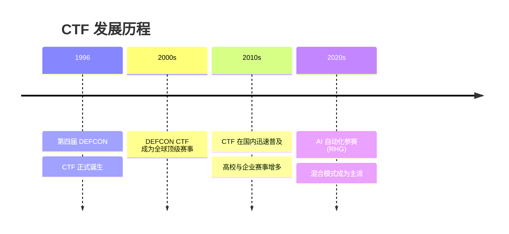

> 本文转载自 CTFHub (https://www.ctfhub.com)，内容有增删改编

CTF（Capture The Flag，夺旗赛）起源于 1996 年第四届 DEFCON，以代替之前黑客们通过互相发起真实攻击进行技术比拼的方式。CTF 是一种流行的信息安全竞赛形式，参赛团队之间通过进行攻防对抗、程序分析等形式，率先从主办方给出的比赛环境中得到一串具有一定格式的字符串或其他内容，并将其提交给主办方，从而夺得分数。为了方便称呼，我们把这样的内容称之为 Flag。

Flag 所表示的为目标服务器上存储的一些敏感机密的信息，这些信息正常情况下不能对外暴露。选手利用目标的一些漏洞，获取到 flag，其表示即为在真实的黑客攻击中窃取到的机密信息。

一般情况下 flag 拥有固定格式如 `flag{xxxxx}`，有些比赛会把 flag 关键词替换，例如 CTFHub 平台的 flag 为 `ctfhub{xxxxx}`。利用固定格式来反推 flag 也是一种常见的解题思路。

通常来说 CTF 是以团队为单位进行参赛，每个团队 3-5 人（具体根据主办方要求决定）。在整个比赛过程中既要每个选手拥有某个方向的漏洞挖掘能力，也要同队选手之间的相互配合。

### 与本知识库的关联

本知识库基于 [[../总目录与快速查询|ArchStrike 安全知识体系]]，涵盖渗透测试、CTF、红队等领域。ArchStrike 作为安全发行版，内置了大量 CTF 常用工具（如 sqlmap、Metasploit、pwntools、hashcat 等），适合 CTF 竞赛的各个方向。

### 相关文章

- [[竞赛模式|CTF 竞赛模式详解]] -- Jeopardy、AwD、AWP 等赛制说明
- [[比赛形式|CTF 比赛形式]] -- 线上赛与线下赛的区别
- [[题目类型|CTF 题目类型]] -- Web、Pwn、Reverse、Crypto、Misc 全解析
- [[使用习惯|做题使用习惯]] -- 做题方式与终端习惯定位
