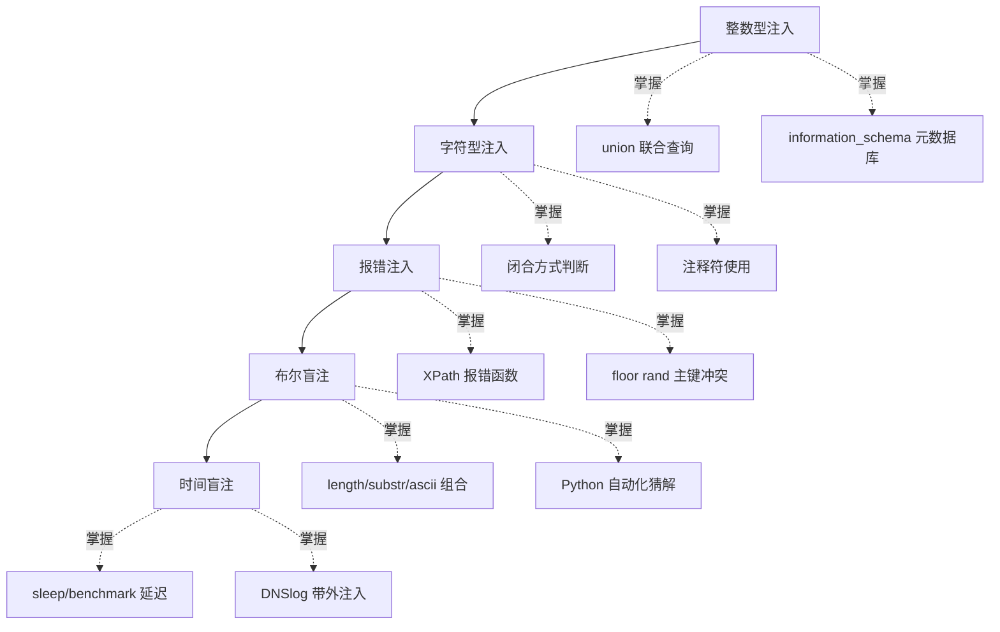

# SQL 注入知识库总目录

> SQL 注入是 CTF Web 方向的**核心考点**，几乎每场比赛都会以不同变式出现。本知识库按注入类型由浅入深分为五章，每章都包含原理、手工 payload、自动化脚本与防御思路。

## 章节目录

| 章节 | 主题 | 一句话说明 |
|------|------|-----------|
| [[01-整数型注入\|01-整数型注入]] | 数字参数拼接 | 参数无引号包裹直接拼进 SQL，`and 1=1` 即可判断，`union select` 全家桶拿数据 |
| [[02-字符型注入\|02-字符型注入]] | 引号内逃逸 | 参数在引号内，先找闭合方式再注释尾巴，闭合对了后面与整数型套路一致 |
| [[03-报错注入\|03-报错注入]] | 错误信息回显数据 | 页面会回显数据库报错时，用 extractvalue/updatexml/floor 三大函数把查询结果塞进报错里 |
| [[04-布尔盲注\|04-布尔盲注]] | 真假页面猜解 | 无数据回显但页面有真假两种状态，逐位构造条件语句猜解库名表名列名 |
| [[05-时间盲注\|05-时间盲注]] | 延迟判断真假 | 连页面差异都没有时，用 sleep() 让响应时长替你"说话"，DNSlog 带外是终极出路 |

## 学习路线

学习建议：先在本地搭好 sqli-labs 靶场（Less-1 到 Less-9 正好对应这五种类型），每学完一章立刻打对应关卡巩固。

## 每章前置依赖

| 章节 | 前置要求 |
|------|---------|
| 整数型注入 | 会基本 SQL 语法即可 |
| 字符型注入 | 理解引号在 SQL 中的作用 |
| 报错注入 | 熟悉前两章的 union 流程（爆库爆表套路通用） |
| 布尔盲注 | 熟练 substr/ascii 函数，会写简单 Python 脚本 |
| 时间盲注 | 理解布尔盲注的猜解逻辑 |

## 关联知识

- [[../Web前置技能/数据库/数据库|数据库前置]] -- MySQL 基础语法、information_schema 结构、常用函数
- [[../../../archstrike-web教学/04-SQL注入攻击|SQL注入实战]] -- sqlmap 自动化、DVWA 实战、tamper 绕过
- [[../Web前置技能/HTTP协议/HTTP协议|HTTP协议]] -- GET/POST 区别、URL 编码（注释符 %23 等）
- [[../信息泄露/Git泄露/Git泄露|Git泄露]] -- 同属 Web 入门必刷考点

## 万能排查口诀

拿到注入点先问自己四个问题：

1. **有回显吗？** 有 → union 或报错；无 → 盲注或带外
2. **什么类型？** 数字型不加引号，字符型先找闭合
3. **过滤了什么？** 空格、引号、关键字、注释符各有绕法
4. **能延迟吗？** sleep 都不行就只能 DNSlog 或二阶注入

---
**返回** [[../../../总目录与快速查询|红队总目录]]
