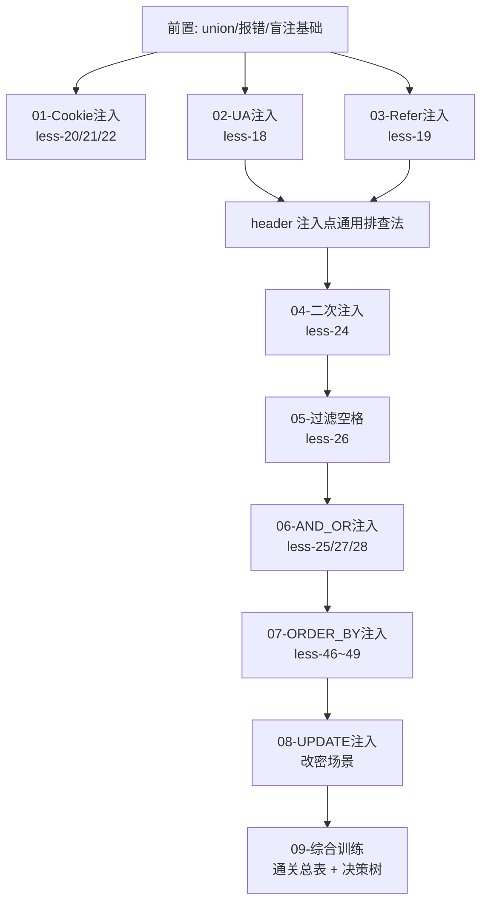

# mysql结构 -- SQL 注入进阶场景集总目录

> 本目录是 CTF Web 方向 MySQL 注入的**进阶场景集**，对应 sqli-labs 进阶关卡。前置基础（union 联合查询、报错注入、布尔/时间盲注）请先读 [[../SQL总目录|SQL 总目录]] 中的基础章节。

## 本章集定位

基础关卡教的是"GET 参数 + union 回显"这一种固定套路；进阶关卡的核心变化在于：

| 变化维度 | 说明 | 对应章节 |
|---------|------|---------|
| **注入点变形** | 注入点不再出现在 GET/POST 参数，而是藏在 HTTP 头（User-Agent、Referer、Cookie）里 | [[01-Cookie注入\|Cookie注入]] · [[02-UA注入\|UA注入]] · [[03-Refer注入\|Refer注入]] |
| **存储型注入** | 恶意 payload 先入库、后触发，写入与执行分离 | [[04-二次注入\|二次注入]] |
| **过滤绕过** | 空格、and/or、information_schema 等关键元素被黑名单拦截后的替代写法 | [[05-过滤空格\|过滤空格]] · [[06-AND_OR注入\|AND/OR注入]] |
| **语句位置变形** | 注入点落在 order by / update 等"不能 union"的语法位置 | [[07-ORDER_BY注入\|ORDER BY注入]] · [[08-UPDATE注入\|UPDATE注入]] |

一句话概括：**注入点会换位置，语法会被限制，但"闭合 + 构造 + 提数据"的三步法不变。**

## sqli-labs 关卡对照表

| 关卡 | 场景 | 注入点 | 对应章节 |
|------|------|--------|---------|
| less-18 | User-Agent Injection | 登录成功后的 UA 头（insert 日志表） | [[02-UA注入\|02-UA注入]] |
| less-19 | Referer Injection | 登录成功后的 Referer 头（insert 日志表） | [[03-Refer注入\|03-Refer注入]] |
| less-20 | Cookie Injection | Cookie 中的 uname（回显型） | [[01-Cookie注入\|01-Cookie注入]] |
| less-21 | Cookie base64 | Cookie 值 base64 编码后再拼 SQL | [[01-Cookie注入\|01-Cookie注入]] |
| less-22 | Cookie base64 双引号 | 同上，闭合符为双引号 | [[01-Cookie注入\|01-Cookie注入]] |
| less-24 | 二次注入 | 注册时转义入库、修改密码处触发 | [[04-二次注入\|04-二次注入]] |
| less-25 | AND/OR 过滤 | 黑名单替换 and/or | [[06-AND_OR注入\|06-AND_OR注入]] |
| less-25a | AND/OR 过滤（数字型） | 同上且无双引号闭合 | [[06-AND_OR注入\|06-AND_OR注入]] |
| less-26/26a | 空格 + or/and 过滤 | 双重黑名单 | [[05-过滤空格\|05-过滤空格]] |
| less-27/27a | union/select 过滤 | 关键字双写绕过 | [[06-AND_OR注入\|06-AND_OR注入]] |
| less-28/28a | union+select 组合过滤 | `union select` 整体双写 | [[06-AND_OR注入\|06-AND_OR注入]] |
| less-46/47/48/49 | ORDER BY 注入 | sort 参数落入 order by 位置 | [[07-ORDER_BY注入\|07-ORDER_BY注入]] |
| less-5/6/8/9/10 | 布尔/时间盲注基础 | GET 参数无回显 | [[../03-报错注入\|03-报错注入]] 系列 |
| less-32/33/34/36/37 | 宽字节注入 | addslashes + GBK 编码 | [[09-综合训练\|09-综合训练]] |
| less-38~45 | 堆叠注入 | mysqli_multi_query 多语句 | [[09-综合训练\|09-综合训练]] |

## 学习路线

建议顺序：先过 01~03（同一类 header 注入），再做 04（思维转变：写入与触发分离），然后 05~06（过滤绕过两大件），最后 07~08（语法位置受限场景）收尾到 09 综合训练。

## 各章速查

| 章节 | 一句话考点 |
|------|-----------|
| [[01-Cookie注入\|01-Cookie注入]] | Cookie 直接拼 SQL；base64 解码再编码打 less-21/22 |
| [[02-UA注入\|02-UA注入]] | insert 日志表闭合技巧；insert 场景用报错注入而非 union |
| [[03-Refer注入\|03-Refer注入]] | 与 UA 同构；XFF/Accept/自定义头通用排查表 |
| [[04-二次注入\|04-二次注入]] | 写入时转义存原文，读取引用时未防护触发；addslashes 防不住 |
| [[05-过滤空格\|05-过滤空格]] | /\*\*/ 、括号、%09~%0d 等空格替代方案大表 |
| [[06-AND_OR注入\|06-AND_OR注入]] | &&/\|\|、双写、运算符变形；information_schema 替代品 |
| [[07-ORDER_BY注入\|07-ORDER_BY注入]] | order by 后不能 union；报错/时间/if 排序差异盲注 |
| [[08-UPDATE注入\|08-UPDATE注入]] | SET/WHERE 两处注入点打法；OR 1=1 全表更新逻辑漏洞 |
| [[09-综合训练\|09-综合训练]] | less 1-75 通关总表、注入点决策树、宽字节/堆叠组合技 |

---
**返回** [[../SQL总目录|SQL 总目录]]
