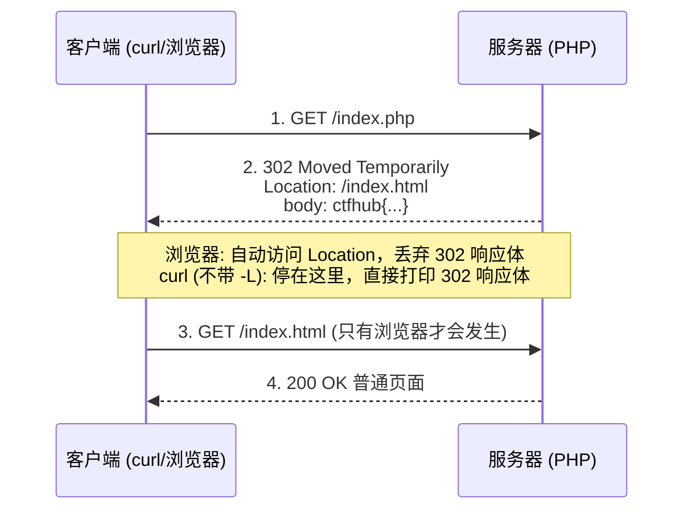

i## 302 跳转 -- 题目解法

> 前置知识：[[HTTP协议|HTTP 协议基础]] -- 先了解 HTTP 协议基础再来看本题

### 题目描述

首页 `index.html` 只有 "No Flag here!" 和一个指向 `index.php` 的链接。访问 `index.php` 后页面又跳回了 `index.html`，看起来什么都没有。flag 就藏在这次跳转里。

### 解法 1：curl 终端

**步骤：**

1. 先看首页内容，发现线索（链接指向 `index.php`）：

```bash
curl -s http://目标/index.html
```

2. 直接请求 `index.php`，**不要**跟随跳转：

```bash
curl -s http://目标/index.php
```

3. 完整查看 302 响应（响应头 + 响应体）：

```bash
curl -s -D - http://目标/index.php
```

输出结尾的响应体就是 flag。

> 关键点：curl 默认**不**跟随跳转，所以 `curl -s` 直接打印的就是 302 响应自身的内容。而浏览器会自动跟随 `Location` 跳到 `index.html`，把中间的 302 响应体丢弃，所以永远看不到 flag。
>
> 陷阱：**`curl -L` 会跟随跳转**，加了它 flag 就消失了。做题时默认不要带 `-L`。

### 解法 2：Burp Suite 图形化

**步骤：**

1. 浏览器配置代理到 Burp（127.0.0.1:8080）
2. 访问题目 URL，在 Burp 的 HTTP history 中找 `index.php` 那条请求
3. 查看它的响应：状态行是 `302 Moved Temporarily`，响应体里就是 flag

> 不用 Burp 也可以：浏览器按 F12 打开开发者工具 → Network → 点击 `index.php` 那条请求 → 查看其 Response（注意别点成了跳转后的 `index.html` 那条）。

### 原理精讲 -- 为什么 flag 会藏在 302 里？

#### HTTP 重定向机制

服务器返回 3xx 状态码 + `Location` 响应头，客户端收到后自动去访问 `Location` 指向的新地址。完整流程：



#### 3xx 重定向家族

| 状态码 | 名称 | 含义 | 是否保留请求方法 |
|-------|------|------|-----------------|
| 301 | Moved Permanently | 永久重定向 | 浏览器可能改为 GET |
| 302 | Found（Temporary） | 临时重定向，CTF 最常见 | 浏览器可能改为 GET |
| 303 | See Other | 强制用 GET 访问新地址 | 强制改为 GET |
| 307 | Temporary Redirect | 临时重定向，**保留原方法** | 保留 POST |
| 308 | Permanent Redirect | 永久重定向，**保留原方法** | 保留 POST |

#### 服务器端逻辑

题目服务器的伪代码大概是这样的：

```php
<?php
header("Location: /index.html");           // 发送 302 状态 + Location 头
echo "ctfhub{...}";                        // 后续代码照常执行，flag 写入响应体
?>
```

关键在 PHP 的 `header()` 函数：它**只是往响应头里加了一个字段，并不会终止程序执行**。所以后面的 `echo` 照常把 flag 写进了响应体。最终服务器返回的报文是：

```
HTTP/1.1 302 Moved Temporarily
Location: /index.html

ctfhub{7781da38c2272a1b50c54498}
```

浏览器拿到 302 后直接跟随 `Location` 跳走，永远不会展示这条响应体——这就是"跳转藏 flag"题的本质。

### 核心知识点总结

| 概念 | 说明 |
|------|------|
| 302 Found | 临时重定向状态码，CTF 中最常见 |
| Location 头 | 重定向目标地址，跳转动作的核心 |
| 浏览器行为 | 自动跟随 Location，丢弃中间响应体 |
| curl 行为 | 默认不跟随，直接打印 302 响应自身 |
| curl -L | 跟随跳转，会丢 flag，做题时不要带 |
| PHP header() | 只添加响应头，不终止脚本执行 |
| flag 位置 | 在 302 响应自身（响应体/响应头），不在跳转后的页面 |
| 其他考点 | 301/303/307/308 的区别，Location 头本身也可能藏 flag |

### 关联教程

本知识库中更深入的 HTTP 协议与 Web 基础：

- [[HTTP协议|HTTP 协议基础]] -- CTF 中 HTTP 相关题目总览
- [[请求方式|请求方式]] -- 自定义 HTTP 方法解题（同系列的姊妹篇）
- [[../../../../网安基础知识/01-计算机网络基础|01-计算机网络基础]] -- OSI 模型与 TCP/IP 协议栈
- [[../../../../网安基础知识/02-Web技术基础|02-Web技术基础]] -- HTTP 协议完整解析（请求/响应/缓存/认证）
- [[../../../../archstrike-web教学/01-Web基础与HTTP协议|01-Web基础与HTTP协议]] -- Web 安全实战场景
- [[../../Web|Web 方向总览]] -- Web 方向 CTF 题型与思路总览
- [[../../../../总目录与快速查询|总目录与快速查询]] -- 红队完整知识体系
