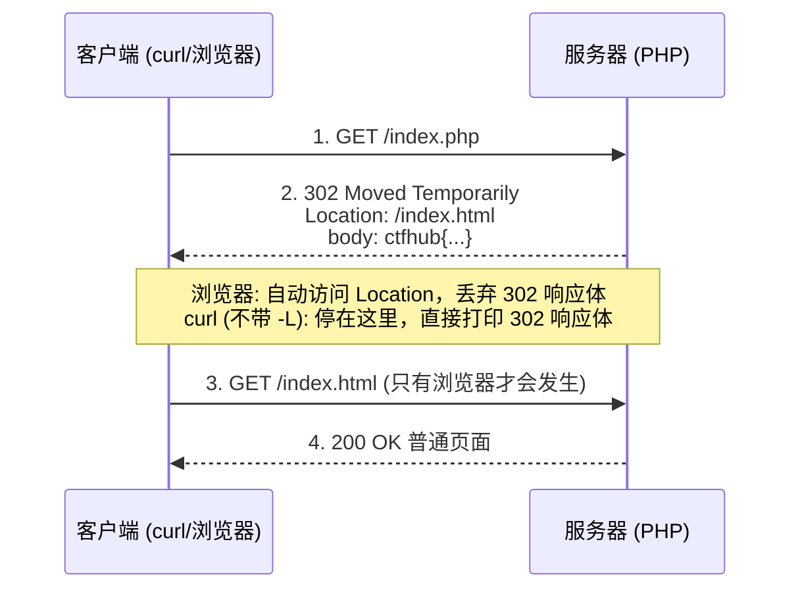

## 302跳转 -- 考点精讲

> 前置知识：[[HTTP协议|HTTP 协议基础]] -- 先了解 HTTP 协议基础再来看本考点

### 原理精讲 -- 重定向机制与"跳转藏 flag"

#### HTTP 重定向是怎么工作的

服务器返回 3xx 状态码 + `Location` 响应头，客户端收到后自动去访问 `Location` 指向的新地址。完整流程：



#### 3xx 重定向家族

| 状态码 | 名称 | 含义 | 是否保留请求方法 |
|-------|------|------|-----------------|
| 301 | Moved Permanently | 永久重定向 | 浏览器可能改为 GET |
| 302 | Found（Temporary） | 临时重定向，CTF 最常见 | 浏览器可能改为 GET |
| 303 | See Other | 强制用 GET 访问新地址 | 强制改为 GET |
| 307 | Temporary Redirect | 临时重定向，**保留原方法** | 保留 POST |
| 308 | Permanent Redirect | 永久重定向，**保留原方法** | 保留 POST |

#### 为什么 flag 会留在 302 响应里

服务器端逻辑（PHP）：

```php
<?php
header("Location: /index.html");           // 发送 302 状态 + Location 头
echo "ctfhub{...}";                        // 后续代码照常执行，flag 写入响应体
?>
```

关键在 PHP 的 `header()` 函数：**它只是往响应头里加了一个字段，并不会终止程序执行**。后面的 `echo` 照常把 flag 写进响应体。最终服务器返回：

```
HTTP/1.1 302 Moved Temporarily
Location: /index.html

ctfhub{7781da38c2272a1b50c54498}
```

浏览器拿到 302 后自动跟随 `Location` 跳走，**永远不会展示这条响应体**——这就是"跳转藏 flag"题的本质。

### 注意事项

| 易错点 | 说明 |
|-------|------|
| curl 默认不跟随跳转 | `curl -s` 直接打印 302 响应自身（flag 就在这里） |
| **`curl -L` 会跟随跳转** | 加了 `-L`，响应体被丢弃，flag 就消失了。做题默认不要带 |
| 浏览器会自动跟随 | 在浏览器里永远看不到 302 响应体，要用 F12/Burp 看原始响应 |
| flag 位置 | 在 302 响应自身（响应体/响应头），不在跳转后的页面 |
| Location 头本身 | 有些题 flag 直接写在 `Location:` 里，`-D -` 看全部响应头 |

### 题目解法

> CTFHub 技能树位置：CTFHub → Web → Web 前置技能 → HTTP 协议 → 302跳转

解法（curl 终端）：

```bash
# 1. 看首页，找到线索（页面只有 "No Flag here!" 和指向 index.php 的链接）
curl -s http://目标/index.html

# 2. 直接请求 index.php，不要跟随跳转，完整查看 302 响应
curl -s -D - http://目标/index.php
# 响应体结尾就是 flag（也可以在响应头里找）
```

解法（浏览器 F12 / Burp）：

1. 打开页面 → 点击 "Give me Flag" → F12 Network
2. 找到 `index.php` 那条请求（状态 302），查看它的 Response
3. 响应体里就是 flag（注意别点成跳转后的 index.html 那条）

### 核心知识点总结

| 概念 | 说明 |
|------|------|
| 302 Found | 临时重定向状态码，CTF 中最常见 |
| Location 头 | 重定向目标地址，跳转动作的核心 |
| 浏览器行为 | 自动跟随 Location，丢弃中间响应体 |
| curl 行为 | 默认不跟随，直接打印 302 响应自身 |
| curl -L | 跟随跳转，会丢 flag，做题时不要带 |
| PHP header() | 只添加响应头，不终止脚本执行 |
| 其他考点 | 301/303/307/308 的区别，Location 头本身也可能藏 flag |

### 关联教程

- [[HTTP协议|HTTP 协议基础]] -- CTF 中 HTTP 相关考点总览
- [[请求方式|请求方式]] -- 自定义 HTTP 方法解题
- [[Cookie|Cookie]] -- 篡改 Cookie 获取 flag
- [[基本认证|基本认证]] -- HTTP Basic 认证绕过与爆破
- [[源代码|源代码]] -- 响应包源码中查找 flag
- [[../../../../网安基础知识/01-计算机网络基础|01-计算机网络基础]] -- OSI 模型与 TCP/IP 协议栈
- [[../../../../网安基础知识/02-Web技术基础|02-Web技术基础]] -- HTTP 协议完整解析（请求/响应/缓存/认证）
- [[../../../../archstrike-web教学/01-Web基础与HTTP协议|01-Web基础与HTTP协议]] -- Web 安全实战场景
- [[../../Web|Web 方向总览]] -- Web 方向 CTF 题型与思路总览
- [[../../../../总目录与快速查询|总目录与快速查询]] -- 红队完整知识体系
