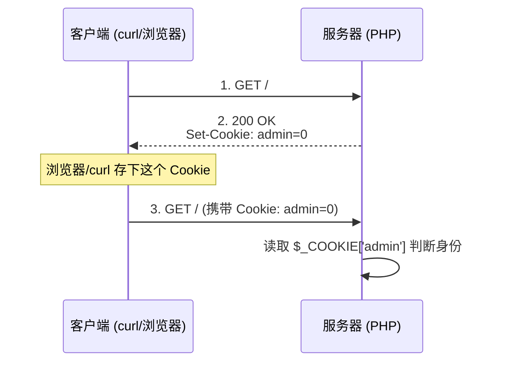

## Cookie -- 考点精讲

> 前置知识：[[HTTP协议|HTTP 协议基础]] -- 先了解 HTTP 协议基础再来看本考点

### 原理精讲 -- Cookie 是什么？为什么能篡改？

#### Cookie 的传输机制

HTTP 是无状态协议，服务器无法在两次请求之间记住"你是谁"。Cookie 就是补这个缺口的：服务器通过 `Set-Cookie` 下发一段小数据，客户端存下来，后续每个请求自动带上。



#### 漏洞本质：服务器无条件信任客户端提交的值

服务器端逻辑：

```php
<?php
setcookie("admin", 0);                    // 下发 admin=0
$admin = $_COOKIE['admin'] ?? 0;          // 读取 Cookie
if ($admin == 1) {
    echo $flag;                           // admin=1 -> 返回 flag
} else {
    echo "hello guest. only admin can get flag.";
}
?>
```

Cookie 存储在**客户端**，服务器却拿它当身份凭据，而且**不校验值是不是自己当初下发的**——把 `0` 改成 `1`，服务器就认为你是 admin。这就是"Cookie 欺骗"。

#### 正确的做法是什么

真实系统不会把身份放明文 Cookie：要么只放一个随机 Session ID（身份存服务器），要么对 Cookie 值做签名/加密防止篡改。CTF 题里出现明文身份 Cookie，就是故意留的漏洞。

### 注意事项

| 易错点 | 说明 |
|-------|------|
| curl -b | 手动携带 Cookie：`curl -b "admin=1"`（等价于请求头 `Cookie: admin=1`） |
| curl -c | 把服务器下发的 Cookie 存成 jar 文件：`curl -c jar.txt`，之后 `-b jar.txt` 带上 |
| 覆盖问题 | 请求过程中服务器再次 Set-Cookie 可能覆盖手动值；要精确控制用 `-H "Cookie: admin=1"` |
| 值类型 | 试试 `1` / `true` / `guest`→`admin`，有些服务器用弱比较 `==`（`1` 和 `"1"` 都行） |
| 编码 | 有些 Cookie 值做了 base64/MD5，先解码看明文再改 |
| 删除 Cookie | 试试整个去掉 Cookie 头（`-H "Cookie:"`），看服务器默认身份是什么 |

### 题目解法

> CTFHub 技能树位置：CTFHub → Web → Web 前置技能 → HTTP 协议 → Cookie

解法（curl 终端）：

```bash
# 1. 先请求一次，看响应头和页面提示
curl -s -D - http://目标/
# 看到 Set-Cookie: admin=0，页面提示只有 admin 能拿 flag

# 2. 把 admin 改成 1 重新请求
curl -s -b "admin=1" http://目标/
# 输出直接就是 flag
```

解法（浏览器 F12 / Burp）：

1. F12 → Application → Cookies，把 `admin` 的值改成 `1`，刷新页面
2. 或 Burp 抓包 → Repeater 里改 `Cookie: admin=0` → `Cookie: admin=1`，Send

### 同类变式（做题时按序试）

| 考点 | 尝试 |
|------|------|
| 值篡改 | 0→1、1→true、guest→admin |
| Cookie 里直接藏 flag | 在 Set-Cookie / 响应体中找 `flag{` 字样 |
| Cookie 编码/加密 | base64 解码看明文，改值后重新编码；MD5 值先查明文库 |
| 带 Cookie 访问隐藏页 | 先用 `-c jar.txt` 存下会话，再 `-b jar.txt` 访问其他页面 |
| 绕过 Cookie 校验 | 删除整个 Cookie 头（`curl -H "Cookie:"`），看服务器默认身份 |

### 核心知识点总结

| 概念 | 说明 |
|------|------|
| Set-Cookie | 响应头，服务器下发 Cookie：`Set-Cookie: 键=值` |
| Cookie 请求头 | 客户端携带：`Cookie: 键=值`，多个用 `;` 分隔 |
| 存储位置 | 客户端（浏览器/curl），服务器不做完整性校验 |
| 信任模型 | 服务器读值即信，不验证是否自己下发 → 可篡改 |
| curl -b | 手动携带 Cookie 请求 |
| curl -c | 把响应 Set-Cookie 存入 jar 文件 |
| curl -H | 手动指定任意请求头（含 Cookie） |
| 正确做法 | 用 Session ID + 服务器端存储，或对 Cookie 签名 |

### 关联教程

- [[HTTP协议|HTTP 协议基础]] -- CTF 中 HTTP 相关考点总览
- [[请求方式|请求方式]] -- 自定义 HTTP 方法解题
- [[302跳转|302 跳转]] -- 重定向响应中隐藏 flag
- [[基本认证|基本认证]] -- HTTP Basic 认证绕过与爆破
- [[源代码|源代码]] -- 响应包源码中查找 flag
- [[../../../../网安基础知识/01-计算机网络基础|01-计算机网络基础]] -- OSI 模型与 TCP/IP 协议栈
- [[../../../../网安基础知识/02-Web技术基础|02-Web技术基础]] -- HTTP 协议完整解析（请求/响应/缓存/认证/Cookie/Session）
- [[../../../../网安基础知识/09-认证与授权基础|09-认证与授权基础]] -- 会话管理、OAuth 等认证体系
- [[../../../../archstrike-web教学/01-Web基础与HTTP协议|01-Web基础与HTTP协议]] -- Web 安全实战场景
- [[../../Web|Web 方向总览]] -- Web 方向 CTF 题型与思路总览
- [[../../../../总目录与快速查询|总目录与快速查询]] -- 红队完整知识体系
