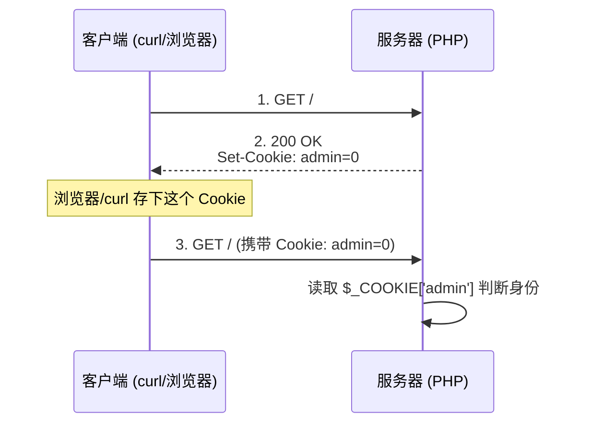

## Cookie -- 题目解法

> 前置知识：[[HTTP协议|HTTP 协议基础]] -- 先了解 HTTP 协议基础再来看本题

### 题目描述

访问首页返回 `hello guest. only admin can get flag.`，响应头里下发 `Set-Cookie: admin=0`。flag 要求 admin 身份，但 Cookie 里的 admin 值就是服务器自己下发的明文——改掉它即可。

### 解法 1：curl 终端

**步骤：**

1. 先请求一次，观察响应头和响应体：

```bash
curl -s -D - http://目标/
```

输出中看到 `Set-Cookie: admin=0`，页面提示只有 admin 能拿 flag。

2. 把 Cookie 改成 admin，重新请求：

```bash
curl -s -b "admin=1" http://目标/
```

输出直接就是 flag。

> 关键点：`-b` 是**手动携带 Cookie** 请求（等价于浏览器在请求头里带上 `Cookie: admin=1`）；`-c` 是把服务器下发的 Cookie 存成 jar 文件，后续请求用 `-b jar.txt` 带上。
>
> 陷阱：如果服务器会在请求中重新下发 Cookie（Set-Cookie），注意新值可能覆盖你的手动值，必要时把要带的值写在 `Cookie:` 请求头里用 `-H "Cookie: admin=1"` 指定。

### 解法 2：Burp Suite 图形化

**步骤：**

1. 浏览器配置代理到 Burp（127.0.0.1:8080）
2. 访问首页，Burp 拦截到请求和响应，响应中看到 `Set-Cookie: admin=0`
3. 在 Repeater 中把请求头的 `Cookie: admin=0` 改为 `Cookie: admin=1`，Send 即可拿到 flag

> 不用 Burp 也可以：浏览器 F12 → Application → Cookies，把 `admin` 的值改成 `1`，刷新页面。

### 原理精讲 -- 为什么改个 Cookie 就能拿 flag？

#### Cookie 的传输机制

Cookie 是 HTTP 无状态协议维持会话的手段，完整流程：



- **下发**：服务器通过响应头 `Set-Cookie: 键=值` 下发 Cookie
- **携带**：客户端后续请求自动带上 `Cookie: 键=值` 请求头
- **信任**：服务器只读 `$_COOKIE` 里的值来判断身份，**不验证值是不是自己当初下发的**

#### 服务器端逻辑

题目服务器的伪代码大概是这样的：

```php
<?php
setcookie("admin", 0);                    // 下发 admin=0
$admin = $_COOKIE['admin'] ?? 0;          // 读取 Cookie
if ($admin == 1) {
    echo $flag;                           // admin=1 -> 返回 flag
} else {
    echo "hello guest. only admin can get flag.";
}
?>
```

关键在最后一步：服务器**无条件信任客户端提交的 Cookie 值**。`admin` 是 0 还是 1，完全由客户端说了算——把 `0` 改成 `1` 就拿到了 admin 身份。

#### 为什么这是漏洞？

Cookie 存储在客户端，服务器却拿它当身份凭据，且不校验真实性和完整性。真实场景下正确的做法是：Cookie 里只放**会话标识（Session ID）**，身份信息存在服务器端；或者对 Cookie 值做签名/加密，防止客户端篡改。

### 同类变式（做题时按序试）

| 考点 | 尝试 |
|------|------|
| 值篡改 | 0→1、1→true、guest→admin |
| Cookie 里直接藏 flag | 在 Set-Cookie / 响应体中找 `flag{` 字样 |
| Cookie 编码/加密 | base64 解码看明文，改值后重新编码；MD5 值先查明文库 |
| 带 Cookie 访问隐藏页 | 先用 `-c jar.txt` 存下会话，再 `-b jar.txt` 访问其他页面 |
| 绕过 Cookie 校验 | 删除整个 Cookie 头（`curl -H "Cookie:"`），看服务器默认身份 |

### 核心知识点总结

| 概念 | 说明 |
|------|------|
| Set-Cookie | 响应头，服务器下发 Cookie：`Set-Cookie: 键=值` |
| Cookie 请求头 | 客户端携带：`Cookie: 键=值`，多个用 `;` 分隔 |
| 存储位置 | 客户端（浏览器/curl），服务器不做完整性校验 |
| 信任模型 | 服务器读值即信，不验证是否自己下发 → 可篡改 |
| curl -b | 手动携带 Cookie 请求 |
| curl -c | 把响应 Set-Cookie 存入 jar 文件 |
| curl -H | 手动指定任意请求头（含 Cookie） |
| 正确做法 | 用 Session ID + 服务器端存储，或对 Cookie 签名 |

### 关联教程

本知识库中更深入的 HTTP 协议与 Web 基础：

- [[HTTP协议|HTTP 协议基础]] -- CTF 中 HTTP 相关题目总览
- [[请求方式|请求方式]] -- 自定义 HTTP 方法解题（同系列的姊妹篇）
- [[302跳转|302 跳转]] -- 重定向响应中隐藏 flag 的题目解法
- [[../../../../网安基础知识/01-计算机网络基础|01-计算机网络基础]] -- OSI 模型与 TCP/IP 协议栈
- [[../../../../网安基础知识/02-Web技术基础|02-Web技术基础]] -- HTTP 协议完整解析（请求/响应/缓存/认证/Cookie/Session）
- [[../../../../网安基础知识/09-认证与授权基础|09-认证与授权基础]] -- 会话管理、OAuth 等认证体系
- [[../../../../archstrike-web教学/01-Web基础与HTTP协议|01-Web基础与HTTP协议]] -- Web 安全实战场景
- [[../../Web|Web 方向总览]] -- Web 方向 CTF 题型与思路总览
- [[../../../../总目录与快速查询|总目录与快速查询]] -- 红队完整知识体系
