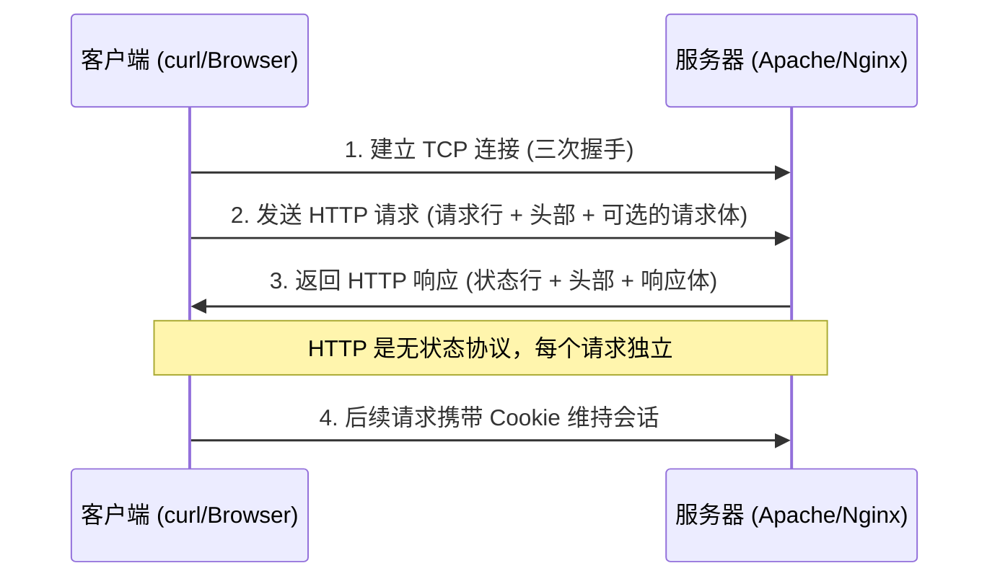

## HTTP 协议 -- CTF 考点总览

### 本知识库中的 HTTP 协议正式讲解

在深入 CTF 题目之前，建议先阅读本知识库中 HTTP 协议的完整知识点：

- [[../../../../网安基础知识/02-Web技术基础|Web 技术基础]] -- HTTP 协议完整解析（请求/响应/缓存/认证/Cookie/Session）
- [[../../../../网安基础知识/01-计算机网络基础|计算机网络基础]] -- OSI 模型与 TCP/IP 协议栈中的 HTTP 定位
- [[../../../../archstrike-web教学/01-Web基础与HTTP协议|Web 基础与 HTTP 协议]] -- ArchStrike 环境下的 HTTP 安全实战场景

### HTTP 协议概述

HTTP（HyperText Transfer Protocol）是 Web 通信的基石。CTF 中大量题目直接或间接涉及 HTTP 协议的理解与利用。

### 核心概念速查

| 概念 | 说明 |
|------|------|
| 请求方法 | GET/POST/PUT/DELETE/OPTIONS/HEAD/PATCH/CONNECT/TRACE |
| 状态码 | 1xx 信息 / 2xx 成功 / 3xx 重定向 / 4xx 客户端错误 / 5xx 服务端错误 |
| 请求头 | Host、User-Agent、Content-Type、Cookie、Referer、X-Forwarded-For 等 |
| 响应头 | Set-Cookie、Location、Content-Type、Server 等 |
| Cookie | 服务端通过 Set-Cookie 下发，客户端在后续请求中携带 |
| Session | 服务端会话标识，通常以 Cookie 中的 SessionID 形式传递 |
| URL 编码 | %XX 形式编码特殊字符 |

### CTF 中常见的 HTTP 协议相关题目

| 题目类型 | 描述 | 常见突破点 |
|---------|------|-----------|
| 自定义请求方法 | 要求用非标准方法（如 CTFHUB）访问 | `curl -X 方法`、requests 自定义方法 |
| Host 头攻击 | 服务端根据 Host 头做不同响应 | 修改 Host 为内部地址或特定值 |
| X-Forwarded-For 伪造 | 服务端根据来源 IP 做权限判断 | 添加 `X-Forwarded-For: 127.0.0.1` |
| Referer 检查绕过 | 服务端校验请求来源 | 添加 `Referer: 期望值` |
| User-Agent 伪造 | 针对特定浏览器或客户端 | 修改 UA 为移动端/搜索引擎爬虫 |
| HTTP 请求走私 | 利用前端后端对 Content-Length 和 Transfer-Encoding 解析差异 | 构造畸形请求体 |
| 缓存投毒 | 利用缓存服务器存储恶意响应 | 操纵请求头使缓存返回恶意内容 |
| Cookie 篡改 | 修改 Cookie 中的敏感字段 | 解码/伪造 Cookie 值 |
| HTTP 重定向 | 利用 Location 头跳转到恶意地址 | 关注 302 响应中的 Location 值 |
| 状态码绕过 | 限制特定状态码的访问 | 关注 403/404 后的隐藏信息 |

### 解题常用工具

- **Burp Suite** -- 拦截、修改、重放 HTTP 请求（本知识库推荐）
- **curl** -- 命令行发送自定义 HTTP 请求
- **Python requests** -- 自动化脚本发送 HTTP 请求
- **netcat** -- 手动构造原始 HTTP 请求
- **Postman** -- 图形化 API 调试工具

参考本知识库的 [[../../../../archstrike-web教学/01-Web基础与HTTP协议|archstrike-web教学]] 模块获取上述工具的深入教程。

### 相关文章

- [[请求方式|请求方式]] -- 自定义 HTTP 方法考点的原理与解法
- [[302跳转|302 跳转]] -- 重定向响应中隐藏 flag 的原理与解法
- [[Cookie|Cookie]] -- 篡改 Cookie 获取 flag 的原理与解法
- [[基本认证|基本认证]] -- HTTP Basic 认证绕过与爆破（trav 工具首次登场）
- [[源代码|源代码]] -- 响应包源码中查找 flag 的原理与解法
- [[../../Web|Web 方向总览]] -- Web 方向 CTF 题型与思路总览
- [[../../../题目类型#Web|题目类型 - Web]] -- CTF 题型总览中的 Web 分类
