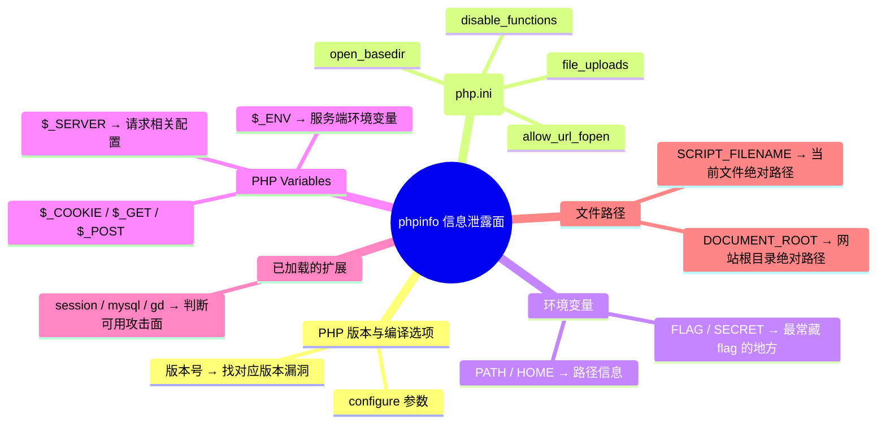

## phpinfo -- 题目解法

> 前置知识：[[../Web前置技能/HTTP协议/HTTP协议|HTTP 协议基础]] -- 先了解 HTTP 协议基础再来看本题

### 题目描述

页面只有一个 `phpinfo.php` 链接，点击后打开 PHP 信息页面——一长串密密麻麻的技术细节。flag 就藏在这些信息里：翻到环境变量（Environment Variables）区，`FLAG` 一行就是答案。

### 解法 1：curl 终端

**步骤：**

1. 先看首页，找到 phpinfo 入口：

```bash
curl -s http://目标/ | grep href
```

2. 访问 phpinfo 页面，直接搜 flag：

```bash
curl -s http://目标/phpinfo.php | grep -oE 'ctfhub\{[^}]*\}'
```

输出直接就是 flag。

3. 也可以完整看一眼 phpinfo，定位 flag 的具体位置：

```bash
curl -s http://目标/phpinfo.php | grep -iE 'flag|FLAG|ctfhub'
```

> 关键点：phpinfo 页面通常非常长（几万行），肉眼翻着找 flag 效率极低。终端用 `grep` 一键提取是最快的方式。
>
> 陷阱：phpinfo 页可能被 JS/CSS 包裹，curl 拉下来的是原始 HTML，不影响 grep 搜字符串。

### 解法 2：浏览器 F12 / Burp

**步骤：**

1. 打开 `phpinfo.php` 页面
2. `Ctrl+F` 搜索 `flag` → 直接定位到环境变量区的 `FLAG` 行
3. 或者用 Burp 拦截 phpinfo.php 请求，在 Response 中搜索

### 原理精讲 -- phpinfo 为什么是信息泄露？

#### phpinfo() 是什么

PHP 的 `phpinfo()` 函数会打印当前 PHP 运行环境的完整信息，包括：

```php
<?php
phpinfo();   // 一行代码导出全部服务器配置
?>
```

它输出的内容包括：



#### 为什么 flag 会在环境变量里？

很多 CTF 靶场用**环境变量**动态注入 flag（而不是写死在 PHP 代码里）：

```dockerfile
# Dockerfile 里注入 flag
ENV FLAG=ctfhub{xxxxxx}
```

```bash
# K8s / docker-compose 里注入
environment:
  - FLAG=ctfhub{xxxxxx}
```

PHP 通过 `getenv('FLAG')` 或 `$_ENV['FLAG']` 即可读取，然后 `phpinfo()` 会原样打印所有 `$_ENV` 变量。所以只要靶场用环境变量传 flag，就必然在 phpinfo 里可见。

#### 这是信息泄露漏洞

phpinfo 页面把所有服务器内部配置**不加过滤地对外公开**，虽然 flag 放在环境变量是专项，但实际上 phpinfo 泄露的信息远不止 flag：

| 泄露项 | 对下一步攻击的价值 |
|--------|------------------|
| 文件绝对路径 | 构造文件包含/读取 payload 时确定路径 |
| disable_functions | 知道哪些命令函数被禁用，选择绕过方式 |
| open_basedir | 知道可访问的文件范围 |
| 扩展列表 | 判断是否有可利用的扩展（如 Imagick 漏洞） |
| 版本号 | 查 CVE 找对应版本漏洞 |
| DOCUMENT_ROOT | 确定 Web 根目录位置 |

### 同类变式（信息泄露大类）

| 考点 | 说明 | 终端提取 |
|------|------|---------|
| phpinfo 环境变量 | FLAG 在 `$_ENV` 里 | `grep -oE 'ctfhub\{[^}]*\}'` |
| phpinfo 配置信息 | 利用 disable_functions 等配置信息打下一题 | `grep -iE 'disable_functions\|open_basedir'` |
| 环境变量不出现在 phpinfo | 可能直接在 `getenv()` 调用返回 | SSH 进容器 `env \| grep FLAG` |
| phpinfo 以外 | 其他日志/探针页（如 `/status`、`/metrics`）也暴露信息 | `curl -s` 逐个排查 |
| 页面直接 echo 环境变量 | 不需要 phpinfo，URL 参数直接触发 | 找 `/env`、`/debug` 路径 |
| 服务器头泄露 | `Server: Apache/2.4.38` 头暴露出精确版本 | `curl -sI` 看响应头 |

### 核心知识点总结

| 概念 | 说明 |
|------|------|
| phpinfo() | PHP 内置函数，打印 PHP 运行环境的完整配置信息 |
| 环境变量注入 flag | 靶场通过 `ENV FLAG=xxx` 注入，而非写死到代码 |
| $_ENV | PHP 超全局变量，`phpinfo()` 会全部打印出来 |
| 信息泄露 | 不该对外暴露的配置/路径/变量被公开访问 |
| `grep -oE` | 用正则精确提取 flag，一行命令搞定 |
| 防御角度 | 生产环境删除 phpinfo 文件或限制 IP 访问 |

### 关联教程

本知识库中更深入的 Web 安全与信息泄露内容：

- [[../Web前置技能/HTTP协议/HTTP协议|HTTP 协议总览]] -- HTTP 协议基础与 CTF 考点
- [[../Web前置技能/程序语言/程序语言|程序语言基础]] -- PHP 基础与环境变量读取
- [[目录遍历|目录遍历]] -- 目录索引泄露与逐层追踪（信息泄露大类姊妹篇）
- [[../Web前置技能/HTTP协议/源代码|源代码解题]] -- 响应包源码查找 flag（同为信息搜集题）
- [[../Web|Web 方向总览]] -- Web 方向 CTF 题型与思路总览
- [[../../ctf解法与理论总目录|CTF 总目录]] -- CTF 理论学习与练习平台
