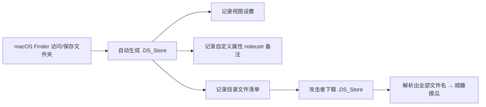

## DS_Store -- 考点精讲

> 前置知识：[[../../Web前置技能/HTTP协议/HTTP协议|HTTP 协议基础]] -- 先了解 HTTP 协议基础再来看本考点

### 原理精讲 -- .DS_Store 为什么能泄露文件清单？

#### 什么是 .DS_Store

macOS 的 Finder（访达）每打开/保存过一个文件夹，就会在**该目录**自动生成一个隐藏文件 `.DS_Store`（Desktop Services Store），用来记住这个文件夹的显示方式：视图模式（图标/列表）、图标位置、窗口大小、以及**自定义属性**（备注、标签等）。



两个关键点：

1. **文件名为隐藏文件**：以 `.` 开头（`.` + `DS_Store`），`ls` 默认看不到，Web 目录里也常被忽略
2. **文件名是 UTF-16BE 编码**：`strings` 只能看到零碎的 `Bud1`（魔数）和 `noteustr`（记录类型），看不到文件名——必须按格式解析

#### 自定义属性（noteustr）是什么？

`.DS_Store` 里的每条记录格式：

| 字段 | 含义 |
|------|------|
| `len`（4 字节大端） | 文件名字符数 |
| 文件名（UTF-16BE） | 该目录下的真实文件名 |
| `structure_id`（4 字节） | 记录种类，如 `note`（备注） |
| `structure_type`（4 字节） | 值类型，如 `ustr`（字符串） |
| 数据 | 如备注内容 `flag here!` |

`note` + `ustr` 拼起来就是 `noteustr`——**自定义属性（备注）**。备注常写着 "flag here!" 之类的提示，等于告诉攻击者哪个文件是关键。

#### 泄露危害

拿到 `.DS_Store` = 拿到**该目录的完整文件清单**：备份文件、隐藏 flag 文件、源码文件名全部暴露。攻击者解析出文件名后，直接按名字访问，无需爆破。

#### 为什么 .DS_Store 会留在服务器上？

- 网站文件是用 macOS 打包/编辑后上传的，Finder 生成过 `.DS_Store`
- 上传工具（FTP/同步盘）把隐藏文件一起传了上去
- 与 [[vim缓存|vim 交换文件]]、[[bak文件|bak 文件]] 同理：都是"开发者在服务器上留下的痕迹"

### 注意事项

| 易错点 | 说明 |
|-------|------|
| 文件带点 | 是 `.DS_Store` 不是 `DS_Store`，直接访问 `URL/.DS_Store` |
| **UTF-16BE 编码** | `strings` 解不出文件名，必须用解析工具（文件名每字符 2 字节） |
| **namelen 误读** | 记录头的 `len` 字段（如 0x24=36）本身也像可读字符，手工抠容易错位，交给工具 |
| 备注提示 | `noteustr` 记录的备注（如 "flag here!"）指明关键文件 |
| 名字要 URL 编码 | 文件名含特殊字符时 curl 前先 `--path-as-is` / 百分号编码 |
| 块大小 2 的幂 | B-tree 块大小是 2 的幂（如 64/512），解析时按位运算提取 |

### 题目解法

> CTFHub 技能树位置：CTFHub → Web → Web 信息泄露 → 备份文件下载 → DS_Store

> 提示：解析 `.DS_Store` 用专用工具一行搞定（`dsstore --notes URL/.DS_Store`，自动下载+解析+显示备注）。该工具由我们自研，类似 [[../../Web工具配置/目录爆破/遍历脚本|trav]] 的定位：零依赖、终端原生。

解法（dsstore 工具）：

```bash
# 1. 一条命令：下载 .DS_Store → 解析 → 输出文件清单（--notes 带备注）
dsstore --notes "http://目标/.DS_Store"
# 968fbc9c0cca038046a8b427db1d0864.txt	(备注: flag here!)

# 2. 按解析出的文件名直接访问
curl -s "http://目标/968fbc9c0cca038046a8b427db1d0864.txt"
# ctfhub{e991105b03af9b9083fece17}
```

解法（纯 Python，无工具时）：

```bash
# 下载 + 解析（文件名是 UTF-16BE，strings 解不出）
curl -s "http://目标/.DS_Store" -o .DS_Store
dsstore --notes .DS_Store # 用上面同一工具解析本地文件
```

> `dsstore` 支持本地文件与 URL 两种输入：`dsstore .DS_Store`（本地）/ `dsstore http://目标/.DS_Store`（在线）。解析原理：B-tree 头部定位 → 读记录 `len+UTF-16BE名字+类型+备注`，块大小按 `1 << (addr & 0x1f)` 提取，结构异常时回退 UTF-16BE 扫描。

解法（浏览器）：直接访问 `http://目标/.DS_Store` 下载文件，用 dsstore/在线解析工具解析。

### 同类变式（备份文件下载大类）

| 考点 | 说明 | 终端提取 |
|------|------|---------|
| **DS_Store**（本题） | macOS 目录元数据，泄露完整文件清单 | `dsstore --notes URL/.DS_Store` |
| 整站压缩包 | `www.zip` 打包整个站点 | 见 [[网站源码\|网站源码]] |
| 单文件备份 | `index.php.bak` 直接泄露源码 | 见 [[bak文件\|bak文件]] |
| vim 交换文件 | `.index.php.swp` 二进制，需 strings/vim 恢复 | 见 [[vim缓存\|vim缓存]] |
| `.git` / `.svn` 泄露 | 版本库可下载，还原完整历史 | 工具还原后看提交记录 |
| 目录索引泄露 | 服务器开了目录列表，文件名直接可见 | 见 [[../目录遍历\|目录遍历]] |
| 备份文件下载-命令执行 | 备份里含可执行代码变种 | CTFHub 同类进阶题 |

### 核心知识点总结

| 概念 | 说明 |
|------|------|
| .DS_Store | macOS Finder 自动生成的目录元数据隐藏文件 |
| 触发时机 | 打开/保存文件夹时生成，随网站文件上传到服务器 |
| 文件清单 | 记录目录下所有文件名 → 泄露即拿到完整清单 |
| 自定义属性 | `noteustr` 记录类型 = 备注（如 "flag here!" 提示关键文件） |
| UTF-16BE | 文件名编码，`strings` 解不出，需按格式解析 |
| 记录结构 | `len(4B) + UTF-16BE文件名 + type(4B) + type_type(4B) + 数据` |
| dsstore 工具 | 自研零依赖工具：`dsstore [--notes] <文件\|URL>` |
| 防御角度 | 部署前删除 .DS_Store；macOS 上传时排除隐藏文件 |

### 关联教程

- [[网站源码|网站源码]] -- 整站压缩包备份
- [[bak文件|bak文件]] -- 单文件备份直接泄露源码
- [[vim缓存|vim缓存]] -- vim 交换文件残留
- [[../目录遍历|目录遍历]] -- 目录索引泄露与逐层追踪
- [[../phpinfo|phpinfo]] -- PHP 信息页环境变量泄露
- [[../../Web工具配置/目录爆破/遍历脚本|遍历脚本]] -- trav 工具文档（dsstore 的姊妹工具）
- [[../../Web前置技能/HTTP协议/HTTP协议|HTTP 协议总览]] -- HTTP 基础
- [[../../Web|Web 方向总览]] -- Web CTF 方向入口
- [[../../../ctf解法与理论总目录|CTF 总目录]] -- CTF 理论学习与练习平台
