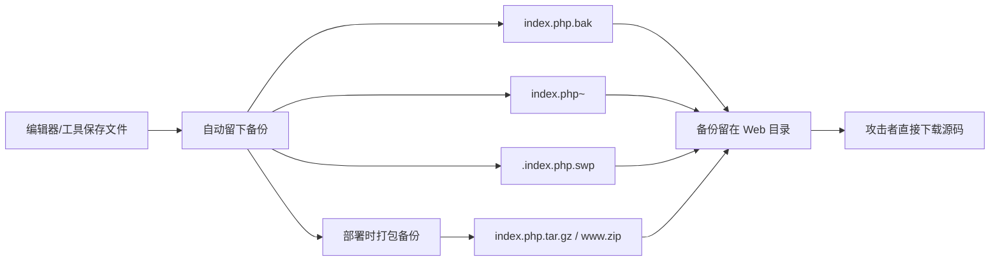

## bak文件 -- 考点精讲

> 前置知识：[[../../Web前置技能/HTTP协议/HTTP协议|HTTP 协议基础]] -- 先了解 HTTP 协议基础再来看本考点

### 原理精讲 -- 备份文件是怎么来的？

#### 编辑器/工具自动生成

备份文件是开发者在编辑/部署过程中留下的"痕迹"：



| 备份来源 | 典型文件名 | 说明 |
|---------|-----------|------|
| 文本编辑器另存备份 | `index.php.bak` / `index.php.old` | 编辑器手动另存留档 |
| Vim 交换文件 | `.index.php.swp` | Vim 编辑中断残留，见 [[vim缓存\|vim缓存]] |
| Vim 备份 | `index.php~` | 开启备份选项后自动生成 |
| 压缩工具打包 | `index.php.zip` / `www.zip` | 手动打包整个站点，见 [[网站源码\|网站源码]] |
| 版本管理残留 | `.git/` / `.svn/` | 完整历史源码 |

#### 为什么 .bak 直接能看到源码？

`.bak`（backup）是**纯文本备份**，没有 `.php` 扩展名，Web 服务器不会交给 PHP 解析器，直接当静态文本返回。这跟 `.php` 文件"服务器执行后再输出"完全不同：

| 文件 | 服务器行为 | 攻击者看到 |
|------|-----------|-----------|
| `index.php` | 交给 PHP 执行 | 只有渲染后的 HTML |
| `index.php.bak` | 当静态文本返回 | **原始 PHP 源码（含注释、密码、逻辑）** |

#### 源码泄露的危害

拿到源码等于拿到网站的设计图：数据库连接密码、SQL 语句、过滤逻辑、后门路径、以及写在注释里的 flag。

#### 命名规律

单文件备份的后缀有规律：`bak` / `old` / `~` / `swp` / `txt`，对应不同的编辑器或工具。提示点名的文件名（如 `index.php`）直接配后缀试，命中率极高。

### 注意事项

| 易错点 | 说明 |
|-------|------|
| 先看提示 | 首页点名 `index.php` → 值空间就是文件名，只剩后缀维度 |
| 后缀带全 | `bak old ~ swp txt` 都试；编辑器不同后缀不同 |
| .bak 是纯文本 | 直接 `curl` 就能看，不需要 strings/vim 恢复（那是 .swp 才要） |
| flag 在注释里 | 源码里的 `// FLAG: ...` 注释，`grep flag` 搜出来 |
| 没提示时 | 文件名也要枚举（index/website/www/backup），trav 两维组合 |

### 题目解法

> CTFHub 技能树位置：CTFHub → Web → Web 信息泄露 → 备份文件下载 → bak文件

> 提示：后缀枚举也可以用 trav 一行搞定（`trav "目标/" "index.php" "!=404" --ext ".bak&.old&~&.swp&.txt"`）。trav 的源码与完整用法见首次引入处 [[../../Web前置技能/HTTP协议/基本认证|基本认证]] 和 [[../../Web工具配置/目录爆破/遍历脚本|遍历脚本]]。

解法（curl 终端）：

```bash
# 1. 后缀枚举（提示已点名 index.php）
for ext in bak old ~ swp txt; do
 code=$(curl -s -o /dev/null -w "%{http_code}" "http://目标/index.php.$ext")
 [ "$code" != "404" ] && echo "HIT: /index.php.$ext -> $code"
done
# 命中 index.php.bak

# 2. 直接下载看源码（.bak 是文本文件，原样返回）
curl -s "http://目标/index.php.bak"
# 源码注释里就是 flag:
# <?php
# // FLAG: ctfhub{5cbfbfc0439df8b55abda7fc}
# echo "Flag in index.php source code.";
# ?>
```

解法（浏览器）：直接访问 `http://目标/index.php.bak`，浏览器显示纯文本源码，`Ctrl+F` 搜 flag。

### 同类变式（备份文件下载大类）

| 考点 | 说明 | 终端提取 |
|------|------|---------|
| **bak 文件**（本题） | `index.php.bak` 直接泄露源码，flag 在注释里 | `curl 目标/index.php.bak` |
| 编辑器备份 | `index.php~` 同理泄露源码 | `curl` 后 grep |
| **整站压缩包** | `www.zip` 打包整个站点 | 见 [[网站源码\|网站源码]] |
| **vim 交换文件** | `.index.php.swp` 二进制，需 strings/vim 恢复 | 见 [[vim缓存\|vim缓存]] |
| **DS_Store 泄露** | macOS 目录元数据，泄露完整文件清单 | `dsstore --notes URL/.DS_Store`，见 [[DS_Store\|DS_Store]] |
| `.old` / `.txt` | 改名备份，内容相同但更隐蔽 | 后缀枚举时多带几个 |
| `.git` / `.svn` 泄露 | 版本库可下载，还原完整历史 | `gitdump URL`，见 [[../Git泄露/Git泄露\|Git泄露]] |
| 备份文件下载-命令执行 | 备份里含可执行代码变种 | CTFHub 同类进阶题 |

### 核心知识点总结

| 概念 | 说明 |
|------|------|
| 备份文件 | 编辑器/工具/部署留下的 `.bak`、`~`、`.swp`、`zip` 等文件 |
| 非 PHP 扩展名 | `.bak` 不会被 PHP 解析，源码原样返回 |
| 源码泄露 | 注释、密码、逻辑全部暴露，flag 常见藏身处 |
| 页面提示 | 首页提示指向文件，先猜名字再枚举后缀 |
| trav 组合 | 文件名 × 后缀用 `--ext` 一把扫完 |
| 与 .swp 区别 | .bak 纯文本直接看；.swp 二进制要 strings/vim 恢复 |
| 防御角度 | 部署后删除备份文件；备份放 Web 目录外 |

### 关联教程

- [[网站源码|网站源码]] -- 整站压缩包备份
- [[vim缓存|vim缓存]] -- vim 交换文件残留
- [[../../Web工具配置/目录爆破/遍历脚本|遍历脚本]] -- trav 组合枚举
- [[../../Web前置技能/HTTP协议/源代码|源代码]] -- 页面源码里直接找 flag
- [[../phpinfo|phpinfo]] -- PHP 信息页环境变量泄露
- [[../../Web前置技能/HTTP协议/HTTP协议|HTTP 协议总览]] -- HTTP 基础
- [[../../Web|Web 方向总览]] -- Web CTF 方向入口
- [[../../../ctf解法与理论总目录|CTF 总目录]] -- CTF 理论学习与练习平台
