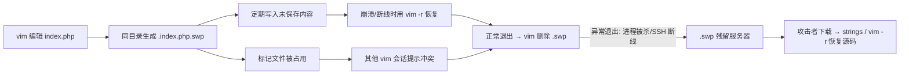

## vim缓存 -- 考点精讲

> 前置知识：[[../../Web前置技能/HTTP协议/HTTP协议|HTTP 协议基础]] -- 先了解 HTTP 协议基础再来看本考点

### 原理精讲 -- swp 是什么？为什么能泄露源码？

#### vim 交换文件机制

vim 编辑文件时，会在**同目录**生成一个临时交换文件（swap file），两个用途：



| 机制 | 说明 |
|------|------|
| 防崩溃恢复 | vim 定期把未保存内容写进 .swp，崩溃/断电后 `vim -r` 找回 |
| 防多会话冲突 | .swp 存在时其他 vim 提示 "Swap file already exists"，避免同时编辑 |

#### 为什么叫 `.index.php.swp`？——命名规则

vim 交换文件的命名规律：**`.` + 原文件名 + `.swp`**，生成在原文件**同目录**：

| 被编辑的文件 | 交换文件名 |
|------------|-----------|
| `index.php` | `.index.php.swp` |
| `config.php` | `.config.php.swp` |
| `index.html` | `.index.html.swp` |

加 `.` 前缀是为了让它成为**隐藏文件**，`ls` 默认看不到。如果 `.swp` 已存在（被占用），vim 依次尝试 `.swo`（older）、`.swn`（newer）……所以扫描时要带全后缀。

#### 为什么会残留？

vim **正常退出**时会自动删除 .swp。残留 = 异常退出：

- SSH 连接断开（编辑到一半掉线）
- 进程被 kill / 服务器重启
- 编辑后直接关终端

#### 为什么是二进制？

.swp 不是纯文本备份，而是 vim 的**内部格式**：文件头是 `Vim swap file` 标记，里面是原文件的**文本块缓存** + 元信息（pid、用户名、原文件路径）。所以：

- `cat` 会看到乱码 → 用 `strings` 提取可读文本
- 文本块缓存里就有源码片段 → flag 藏在注释里也能提出来

#### 和 .bak 的区别

| 对比 | `.bak` 文件 | `.swp` 交换文件 |
|------|------------|----------------|
| 来源 | 编辑器手动另存/备份 | vim 编辑过程自动生成 |
| 内容 | 纯文本（直接 curl 看） | 二进制（strings / vim -r 恢复） |
| 文件名 | `index.php.bak` | `.index.php.swp`（隐藏） |
| 泄露隐蔽性 | 一般 | 更高（默认 ls 不可见） |

### 注意事项

| 易错点 | 说明 |
|-------|------|
| **.swp 是二进制** | 不能 `cat` 直接看，用 `strings` 提取可读文本 |
| strings 用法 | `strings x.swp \| grep -E "flag\|ctfhub"` 拿 flag 最快 |
| vim -r 完整恢复 | 要整份源码时用 `vim -r x.swp`，恢复后 `:w index.php` 保存 |
| 后缀递推 | `.swp` → `.swo` → `.swn`，枚举要带全 |
| 隐藏文件 | `.` 开头，访问时记得 URL 里有 `.index.php` |
| 命名规律 | `.` + 原文件名 + `.swp`，提示点名的文件名直接套 |
| grep 输出 | 用 `grep -oE 'ctfhub\{[^}]*\}'` 精确提取 |

### 题目解法

> CTFHub 技能树位置：CTFHub → Web → Web 信息泄露 → 备份文件下载 → vim缓存

> 提示：交换文件递推后缀（.swp → .swo → .swn）也可以用 trav 一行枚举（`trav "目标/" ".index.php" "!=404" --ext ".swp&.swo&.swn&.swm"`，swap 是二进制，trav 抓响应时会有 "null 字节" 警告，属正常现象，不影响命中判定）。trav 的源码与完整用法见首次引入处 [[../../Web前置技能/HTTP协议/基本认证|基本认证]] 和 [[../../Web工具配置/目录爆破/遍历脚本|遍历脚本]]。

解法（curl 终端）：

```bash
# 1. 按命名规律直接试交换文件（提示点名的文件名 + . 前缀 + .swp）
curl -s -o /dev/null -w "%{http_code}" "http://目标/.index.php.swp"
# 200，文件存在

# 2. 下载 + strings 提取可读文本（.swp 是二进制，不能 cat）
curl -s "http://目标/.index.php.swp" -o index.php.swp
strings index.php.swp | grep -E "flag|ctfhub"
# // ctfhub{e06721dd647d709dfeed1038}
```

解法（vim 完整恢复，需要整份源码时）：

```bash
# 用 vim 打开交换文件恢复，然后另存为正式文件
vim -r index.php.swp
# 恢复后在 vim 里执行 :w index.php 保存
```

对比：`strings` 是"提取碎片文本"（快，拿 flag 够用）；`vim -r` 是"完整恢复原文件"（需要整份源码时用）。

### 同类变式（备份文件下载大类）

| 考点 | 说明 | 终端提取 |
|------|------|---------|
| **vim 交换文件**（本题） | `.index.php.swp` 二进制残留，含源码文本块 | `strings` 或 `vim -r` 恢复 |
| 交换文件递推 | `.swo` / `.swn` 多级命名 | `trav ... --ext ".swp&.swo&.swn"` |
| vim 备份文件 | `index.php~`（vim 的备份选项生成，纯文本） | 直接 `curl` |
| 编辑器手动备份 | `index.php.bak` / `.old`，纯文本源码 | 见 [[bak文件\|bak文件]] |
| DS_Store 泄露 | macOS 目录元数据，泄露完整文件清单 | `dsstore --notes URL/.DS_Store`，见 [[DS_Store\|DS_Store]] |
| 整站压缩包 | `www.zip` 打包整个站点 | 见 [[网站源码\|网站源码]] |
| .git/.svn 泄露 | 版本库完整历史 | `gitdump URL`，见 [[../Git泄露/Git泄露\|Git泄露]] |

### 核心知识点总结

| 概念 | 说明 |
|------|------|
| 交换文件 | vim 编辑时同目录生成的 `.文件名.swp`，防崩溃/防冲突 |
| 命名规律 | `.` + 原文件名 + `.swp`，`.` 前缀使其成为隐藏文件 |
| 残留原因 | 异常退出（SSH 断线/进程被杀），vim 来不及删除 |
| 二进制格式 | 文件头 `Vim swap file`，内含原文件文本块缓存 |
| strings | 从二进制提取可读文本，快速拿 flag |
| vim -r | 完整恢复原文件，需要整份源码时用 |
| 递推后缀 | .swp → .swo → .swn，扫描时带全 |
| 防御角度 | 服务器上用 vim 要正常退出；禁止 .swp 可访问 |

### 关联教程

- [[bak文件|bak文件]] -- 单文件备份直接泄露源码
- [[网站源码|网站源码]] -- 整站压缩包备份
- [[../../Web工具配置/目录爆破/遍历脚本|遍历脚本]] -- trav 后缀枚举
- [[../../Web前置技能/HTTP协议/源代码|源代码]] -- 页面源码里直接找 flag
- [[../../Web前置技能/HTTP协议/HTTP协议|HTTP 协议总览]] -- HTTP 基础
- [[../../Web|Web 方向总览]] -- Web CTF 方向入口
- [[../../../ctf解法与理论总目录|CTF 总目录]] -- CTF 理论学习与练习平台
