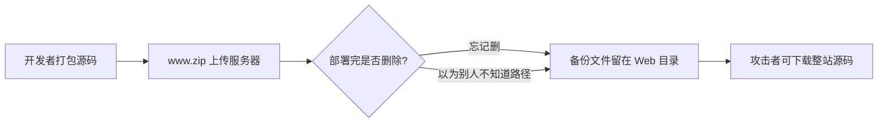

## 网站源码 -- 考点精讲

> 前置知识：[[../../Web前置技能/HTTP协议/HTTP协议|HTTP 协议基础]] -- 先了解 HTTP 协议基础再来看本考点

### 原理精讲 -- 备份文件为什么存在？

#### 开发者为什么留下整站压缩包



常见场景：

1. **上线部署后未清理**：用 `zip -r www.zip /var/www/` 打包后 FTP 上传，解压完没删压缩包
2. **以为文件名没人知道**：`backup.zip` 放在网站根目录，以为不会被发现
3. **自动化 CI/CD 残留**：打包脚本输出 `www.zip` 到 Web 目录后未清理
4. **编辑器 / 版本工具自动备份**：`index.php~`、`index.php.swp`、`index.php.bak`（见 [[bak文件|bak文件]]、[[vim缓存|vim缓存]]）

#### 备份文件泄露的危害面

| 泄露层 | 具体危害 |
|--------|---------|
| **源码** | 直接获取后端代码，找到 SQL 注入点、文件上传漏洞、认证缺陷 |
| **配置** | 数据库 IP:端口:用户名:密码 全部暴露在 `config.php` 里 |
| **路径结构** | 看到完整的目录树和文件清单（如 `flag_1155626646.txt` 暴露真实路径） |
| **凭据** | SSH 密钥、.env 文件、API token 跟着一起打包 |
| **flag 本身** | 如果 flag 被写进源码而非环境变量，压缩包直接包含明文 flag |
| **代码逻辑** | 反推后端路由、权限校验、加密方法 → 针对性构造 payload |

#### 通用心法

> 服务器行为如果**可被观察**（200 vs 404 有明确区分），就用**脚本枚举**。覆盖面决定成功率，不依赖"猜"。

备份文件场景里，"可被观察"的条件完全满足：文件存在则 200，不存在则 404，curl 一行就判断。

#### 命名习惯

备份文件名的约定俗成：**网站根目录**在 Linux 上是 `/var/www`，所以 `www.zip`、`web.zip`、`backup.zip`、`website.zip`、`wwwroot.zip`、`temp.zip` 是最高概率的几项；后缀常见 `tar` / `tar.gz` / `zip` / `rar`。

### 注意事项

| 易错点 | 说明 |
|-------|------|
| **干扰项（decoy）** | 压缩包里的 flag 文件内容可能是假的（如 "where is flag ??"），真实 flag 在**文件名暴露的服务器路径**上 |
| 文件名本身就是线索 | `flag_1155626646.txt` 这个随机名 → 直接访问服务器根目录的同名文件 |
| 别只解压 | 解压后先 `unzip -l` 看清单，文件名/结构往往比内容更值钱 |
| 命中判定 | `200` 才算文件存在，`404` 是空；网络错误 `000` 要排除 |
| 高概率优先 | 先试 `www.zip`（/var/www 约定）再跑全组合 |

### 题目解法

> CTFHub 技能树位置：CTFHub → Web → Web 信息泄露 → 备份文件下载 → 网站源码

> 提示：组合枚举（文件名 × 后缀两两组合）用 trav 一行搞定（`trav "目标/" "web&website&backup&www" "!=404" --ext ".zip&.tar&.tar.gz&.rar"`）。trav 的源码与完整用法见首次引入处 [[../../Web前置技能/HTTP协议/基本认证|基本认证]] 和 [[../../Web工具配置/目录爆破/遍历脚本|遍历脚本]]。

解法（trav / 脚本枚举）：

```bash
# 1. 按提示的组合枚举，找到真实存在的备份文件
trav "http://目标/" "web&website&backup&back&www&wwwroot&temp" "!=404" --ext ".zip&.tar&.tar.gz&.rar"
# HIT: /www.zip -> 200

# 2. 下载并查看压缩包内容（-l 只列清单不解压）
curl -s "http://目标/www.zip" -o www.zip
unzip -l www.zip
# 看到 50x.html / flag_1155626646.txt / index.html

# 3. 看 flag 文件内容（是干扰项，别上当）
unzip -p www.zip flag_1155626646.txt
# 输出: where is flag ??

# 4. 关键一步：文件名暴露了真实路径，直接访问服务器同名文件
curl -s "http://目标/flag_1155626646.txt"
# ctfhub{5933d6146203d891f3a406fa}
```

解法（gobuster 目录爆破，量大时用）：

```bash
gobuster dir -u http://目标/ -w dict/backup.txt --no-error -s 200
# 爆出 www.zip 后手动下载解压
```

### 同类变式（备份文件下载大类）

| 考点 | 说明 | 终端提取 |
|------|------|---------|
| **网站源码压缩包**（本题） | `www.zip` 整站源码备份泄露 | 组合枚举 → unzip -l → 按文件名访问 |
| **编辑器备份文件** | `index.php~`、`index.php.bak`、`.index.php.swp` 编辑后残留 | `curl URL/index.php.bak` |
| **版本控制泄露** | `.git/` 或 `.svn/` 目录可公开访问 | `gitdump URL`，见 [[../Git泄露/Git泄露\|Git泄露]] |
| **文本备份文件** | 直接把 flag 写到备份里，内容含 flag | 直接 `curl` 或用 `grep -oE` 提取 |
| **DS_Store 泄露** | macOS 目录元数据，泄露完整文件清单 | `dsstore --notes URL/.DS_Store`，见 [[DS_Store\|DS_Store]] |
| **目录索引泄露** | 备份文件名出现在目录列表中 | 目录遍历题 — 见 [[../目录遍历\|目录遍历]] |
| **备份文件下载-命令执行** | 下载 `.bak` 文件含有 PHP 代码可执行 | CTFHub 同一分类的进阶题 |

### 核心知识点总结

| 概念 | 说明 |
|------|------|
| 备份文件 | 开发者在服务器上留下的 `.zip` / `.tar.gz` / `.bak` / `~` / `.swp` 等备份 |
| 整站压缩包 | `zip -r www.zip /var/www/` 打包后留在 Web 目录 |
| 组合枚举 | 文件名 × 后缀，trav `--ext` 一键笛卡尔积 |
| 干扰项（decoy） | zip 内文件内容误导，真实 flag 在 zip 文件的**文件名**暴露的路径上 |
| /var/www | Linux 默认网站根目录，`www.zip` 是备份文件最高概率项 |
| unzip -l / -p | `-l` 列出内容不解压，`-p` 把内容输出到 stdout（方便 grep） |
| 防御角度 | 部署后删除备份压缩包，保留打包脚本但排除 Web 目录输出路径 |

### 关联教程

- [[bak文件|bak文件]] -- 单文件备份直接泄露源码（同目录姊妹篇）
- [[vim缓存|vim缓存]] -- vim 交换文件残留
- [[../../Web前置技能/HTTP协议/HTTP协议|HTTP 协议总览]] -- HTTP 协议基础与 CTF 考点
- [[../../Web前置技能/程序语言/程序语言|程序语言基础]] -- PHP 基础与源码分析
- [[../目录遍历|目录遍历]] -- 目录索引泄露与逐层追踪
- [[../phpinfo|phpinfo]] -- PHP 信息页环境变量泄露
- [[../../Web工具配置/目录爆破/遍历脚本|遍历脚本]] -- trav 组合遍历工具
- [[../../Web工具配置/目录爆破/目录爆破|目录爆破]] -- gobuster / dirsearch 目录枚举工具
- [[../../Web|Web 方向总览]] -- Web 方向 CTF 题型与思路总览
- [[../../../ctf解法与理论总目录|CTF 总目录]] -- CTF 理论学习与练习平台
