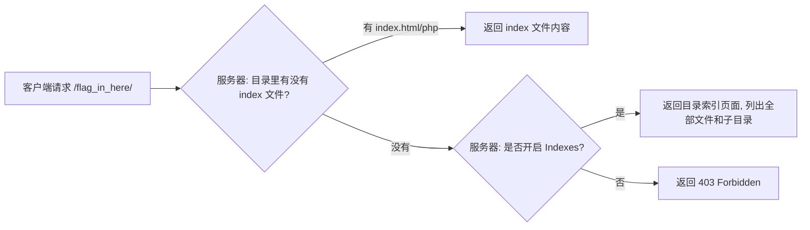

## 目录遍历 -- 题目解法

> 前置知识：[[../Web前置技能/HTTP协议/HTTP协议|HTTP 协议基础]] -- 先了解 HTTP 协议基础再来看本题

### 题目描述

页面提示点击进入 `flag_in_here/` 找 flag。访问后发现服务器返回了**目录索引页面**（Directory Listing），列出了 `1/` `2/` `3/` `4/` 四个子目录。但只有一条路径能真正走到终点（`1/4/flag.txt`），其他都是空壳——需要逐层追踪。

### 解法 1：curl 终端（手动逐层）

**步骤：**

1. 打开目录索引，看有什么：

```bash
curl -s http://目标/flag_in_here/
```

输出中看到四个子目录：`1/` `2/` `3/` `4/`

2. 检查每个子目录，找"还有内容"的那一个：

```bash
curl -s http://目标/flag_in_here/1/
curl -s http://目标/flag_in_here/2/
curl -s http://目标/flag_in_here/3/
curl -s http://目标/flag_in_here/4/
```

3. 发现 `1/` 内部还有子目录 → 继续深入：

```bash
curl -s http://目标/flag_in_here/1/4/
```

4. 看到 `flag.txt` 在索引列表中，直接读取：

```bash
curl -s http://目标/flag_in_here/1/4/flag.txt
```

输出就是 flag。

> 关键点：服务器开了 **Apache 目录索引**（`Options Indexes`），访问目录时自动返回文件列表。正常情况下应该返回 403 或跳转到首页，开了索引就相当于把所有文件名暴露了。
>
> 每层都只有**一条路径**能通往下一层（其他的 2/3/4 是空壳），判断依据：curl 到该子目录看到内部**还有 `href=...` 链接**就说明有下级。

### 解法 2：curl 终端（自动追层脚本）

```bash
BASE="http://目标"; path="/flag_in_here"

while true; do
  found=""
  for d in 1 2 3 4; do
    body=$(curl -s "$BASE$path/$d/")
    # 先看有没有 flag.txt
    if echo "$body" | grep -q 'flag.txt'; then
      echo "命中: $path/$d/flag.txt"
      curl -s "$BASE$path/$d/flag.txt"
      exit 0
    fi
    # 再看有没有下级子目录
    if echo "$body" | grep -qE 'href="[0-9]+/"'; then
      found="$d" && break
    fi
  done
  [ -z "$found" ] && echo "走到死胡同了" && exit 1
  path="$path/$found"
done
```

### 解法 3：浏览器图形化

**步骤：**

1. 打开页面，点击 `flag_in_here/` 进入
2. 看到目录索引 → 依次点击 `1/` `2/` `3/` `4/`
3. 只有 `1/` 进得去（里面有子目录），点击 `1/4/` → 看到 `flag.txt`
4. 点击 `flag.txt` 读取 flag

### 原理精讲 -- 为什么目录会被列出来？

#### 目录索引是怎么产生的

当 Web 服务器（Apache/Nginx）被配置为允许列出目录内容时，浏览器直接访问一个目录路径，服务器会返回一个 HTML 页展示该目录下的所有文件和子文件夹：



#### Apache 配置（httpd.conf / .htaccess）

```apache
# 允许目录索引（不安全）
Options +Indexes

# 禁止目录索引（安全）
Options -Indexes

# 题目服务器的实际配置
<Directory /var/www/html/flag_in_here>
    Options Indexes FollowSymLinks
    AllowOverride None
</Directory>
```

#### Nginx 配置

```nginx
# Nginx 默认不开目录索引，手动开启的话：
location /flag_in_here/ {
    autoindex on;    # 打开目录索引
}
```

#### 这是信息泄露漏洞

目录索引属于 **信息泄露类漏洞**：服务器因为配置不当，把不该对外暴露的内部文件结构、文件名甚至文件内容通过目录索引展示出来。它通常不直接产生 flag，但会被用来：

- 枚举隐藏路径和文件
- 发现备份文件（`.bak`、`.swp`）
- 发现敏感文件名（`password.txt`、`config.php~`）
- 为下一步攻击提供信息（比如发现了一个 `admin/` 目录）

### 同类变式（信息泄露大类）

| 考点 | 说明 | 常见路径 |
|------|------|---------|
| 目录遍历 | 层级目录逐层探索找 flag 文件 | `flag_in_here/1/4/` |
| 目录穿越 (`../`) | 用 `../` 跳出当前目录访问上级文件 | `?file=../../../flag` |
| robots.txt 泄露 | 机器人协议暴露敏感路径 | `/robots.txt` |
| 备份文件泄露 | 编辑器/版本管理产生的备份 | `index.php.bak`, `.index.php.swp` |
| Git 泄露 | `.git/` 目录可访问，恢复源码 | `.git/HEAD` → 提取整个仓库 |
| SVN 泄露 | `.svn/` 目录可访问 | `.svn/entries` |
| phpinfo | php 信息页暴露路径和配置 | `/phpinfo.php` |
| 注释信息泄露 | HTML/JS/CSS 注释中的信息 | 参见 [[../Web前置技能/HTTP协议/源代码|源代码解题]] |

### 核心知识点总结

| 概念 | 说明 |
|------|------|
| Directory Listing | Apache (Indexes) / Nginx (autoindex) 开启后的目录索引 |
| 信息泄露 | 因配置不当导致文件结构、路径暴露的安全问题 |
| 目录遍历 (Traverse) | 逐层深入目录枚举直到找到目标文件 |
| 目录穿越 (Traversal) | 用 `../` 逃逸到目标目录之外（如 `/etc/passwd`） |
| curl 自动追层 | `while` + `grep` 判断子目录，逐层跟踪 |
| 防御角度 | 关闭 `Indexes`/`autoindex`，或放一个空 `index.html` |

### 关联教程

本知识库中更深入的 Web 安全内容：

- [[../Web前置技能/HTTP协议/HTTP协议|HTTP 协议总览]] -- HTTP 协议基础与 CTF 考点
- [[../Web前置技能/HTTP协议/源代码|源代码解题]] -- 响应包源码中找 flag（同为信息泄露相关）
- [[../Web工具配置/目录爆破/目录爆破|目录爆破]] -- dirsearch / gobuster 目录枚举工具
- [[../Web前置技能/操作系统/操作系统|操作系统基础]] -- Linux 文件路径与权限
- [[../Web|Web 方向总览]] -- Web 方向 CTF 题型与思路总览
- [[../../ctf解法与理论总目录|CTF 总目录]] -- CTF 理论学习与练习平台
