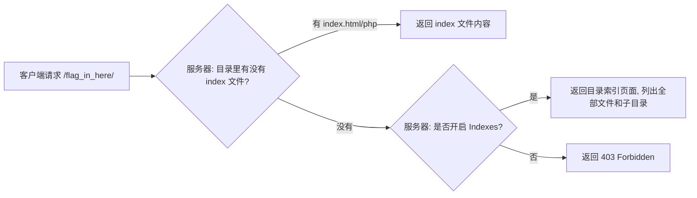

## 目录遍历 -- 考点精讲

> 前置知识：[[../Web前置技能/HTTP协议/HTTP协议|HTTP 协议基础]] -- 先了解 HTTP 协议基础再来看本考点

### 原理精讲 -- 为什么目录会被列出来？

#### 目录索引（Directory Listing）是怎么产生的

当 Web 服务器（Apache/Nginx）被配置为允许列出目录内容时，直接访问一个目录路径，服务器会返回一个 HTML 页展示该目录下的所有文件和子文件夹：



#### 服务器配置

Apache（httpd.conf / .htaccess）：

```apache
# 允许目录索引（不安全）
Options +Indexes

# 禁止目录索引（安全）
Options -Indexes
```

Nginx（默认不开，手动开启）：

```nginx
location /flag_in_here/ {
 autoindex on; # 打开目录索引
}
```

#### 这是信息泄露漏洞

目录索引属于**信息泄露类漏洞**：服务器因为配置不当，把不该对外暴露的内部文件结构、文件名甚至文件内容通过目录索引展示出来。它通常不直接产生 flag，但会被用来：

- 枚举隐藏路径和文件
- 发现备份文件（`.bak`、`.swp`）
- 发现敏感文件名（`password.txt`、`config.php~`）
- 为下一步攻击提供信息（比如发现了一个 `admin/` 目录）

#### 区分两个概念

| 概念 | 英文 | 含义 |
|------|------|------|
| **目录遍历**（本题） | Directory Traversal (枚举) | 逐层深入目录枚举，找到目标文件 |
| **目录穿越** | Path Traversal (`../`) | 用 `../` 逃逸到目录之外（如读 `/etc/passwd`），是另一类漏洞 |

### 注意事项

| 易错点 | 说明 |
|-------|------|
| 目录会 301 跳转 | 访问目录不带尾斜杠会 301 到带斜杠的地址，curl 要加 `-L` 或直接带 `/` |
| 判断"还有下级" | curl 到子目录，响应里有 `href=` 链接说明还有内容；404/空页面是死路 |
| 空壳目录 | 并列的几个目录里只有一条路是真的（如 1/2/3/4 只有 1 通），逐一试 |
| 找到文件直接读 | 目录索引里出现 `flag.txt` 就 `curl` 读，不要只停在列表页 |
| 工具 vs 手工 | 层级浅（3-5 层）手工够用；层数多或路径随机用 trav --recurse |

### 题目解法

> CTFHub 技能树位置：CTFHub → Web → Web 信息泄露 → 目录遍历

> 提示：这种"挨个试 + 命中后继续深入"的活，trav 一行搞定（`trav 目标/flag_in_here/ "1&2&3&4" "==200" --recurse`）。trav 的源码与完整用法见首次引入处 [[../Web前置技能/HTTP协议/基本认证|基本认证]] 和 [[../Web工具配置/目录爆破/遍历脚本|遍历脚本]]。

解法（curl 终端，手动逐层）：

```bash
# 1. 打开目录索引，看有什么
curl -s http://目标/flag_in_here/
# 看到四个子目录: 1/ 2/ 3/ 4/

# 2. 逐一检查，找"还有内容"的那一个
curl -s http://目标/flag_in_here/1/
# 1/ 内部还有子目录 → 继续深入

# 3. 深入后看到 flag.txt，直接读取
curl -s http://目标/flag_in_here/1/4/flag.txt
# 输出就是 flag
```

解法（curl 自动追层脚本）：

```bash
BASE="http://目标"; path="/flag_in_here"

while true; do
 found=""
 for d in 1 2 3 4; do
 body=$(curl -s "$BASE$path/$d/")
 # 先看有没有 flag.txt
 if echo "$body" | grep -q 'flag.txt'; then
 echo "命中: $path/$d/flag.txt"
 curl -s "$BASE$path/$d/flag.txt"
 exit 0
 fi
 # 再看有没有下级子目录
 if echo "$body" | grep -qE 'href="[0-9]+/"'; then
 found="$d" && break
 fi
 done
 [ -z "$found" ] && echo "走到死胡同了" && exit 1
 path="$path/$found"
done
```

解法（浏览器）：

1. 打开页面，点击 `flag_in_here/` 进入
2. 看到目录索引 → 依次点击子目录，只有一条路能继续深入
3. 最后点开 `flag.txt` 读取 flag

### 同类变式（信息泄露大类）

| 考点 | 说明 | 常见路径 |
|------|------|---------|
| 目录遍历 | 层级目录逐层探索找 flag 文件（本题） | `flag_in_here/1/4/` |
| 目录穿越 (`../`) | 用 `../` 跳出当前目录访问上级文件 | `?file=../../../flag` |
| robots.txt 泄露 | 机器人协议暴露敏感路径 | `/robots.txt` |
| 备份文件泄露 | 编辑器/版本管理产生的备份 | `index.php.bak`, `.index.php.swp` |
| Git 泄露 | `.git/` 目录可访问，恢复源码 | `.git/HEAD` → 提取整个仓库 |
| SVN 泄露 | `.svn/` 目录可访问 | `.svn/entries` |
| phpinfo | php 信息页暴露路径和配置 | `/phpinfo.php` |
| 注释信息泄露 | HTML/JS/CSS 注释中的信息 | 参见 [[../Web前置技能/HTTP协议/源代码|源代码]] |

### 核心知识点总结

| 概念 | 说明 |
|------|------|
| Directory Listing | Apache (Indexes) / Nginx (autoindex) 开启后的目录索引 |
| 信息泄露 | 因配置不当导致文件结构、路径暴露的安全问题 |
| 目录遍历 (枚举) | 逐层深入目录枚举直到找到目标文件 |
| 目录穿越 (../) | 用 `../` 逃逸到目标目录之外（如 `/etc/passwd`） |
| curl 自动追层 | `while` + `grep` 判断子目录，逐层跟踪 |
| trav --recurse | 命中后自动回填继续深入，一条命令追到底 |
| 防御角度 | 关闭 `Indexes`/`autoindex`，或放一个空 `index.html` |

### 关联教程

- [[../Web前置技能/HTTP协议/HTTP协议|HTTP 协议总览]] -- HTTP 协议基础与 CTF 考点
- [[../Web前置技能/HTTP协议/源代码|源代码]] -- 响应包源码中找 flag（同为信息泄露相关）
- [[../Web工具配置/目录爆破/遍历脚本|遍历脚本]] -- trav 递归遍历工具
- [[../Web工具配置/目录爆破/目录爆破|目录爆破]] -- dirsearch / gobuster 目录枚举工具
- [[phpinfo|phpinfo]] -- PHP 信息页环境变量泄露
- [[../Web前置技能/操作系统/操作系统|操作系统基础]] -- Linux 文件路径与权限
- [[../Web|Web 方向总览]] -- Web 方向 CTF 题型与思路总览
- [[../../ctf解法与理论总目录|CTF 总目录]] -- CTF 理论学习与练习平台
