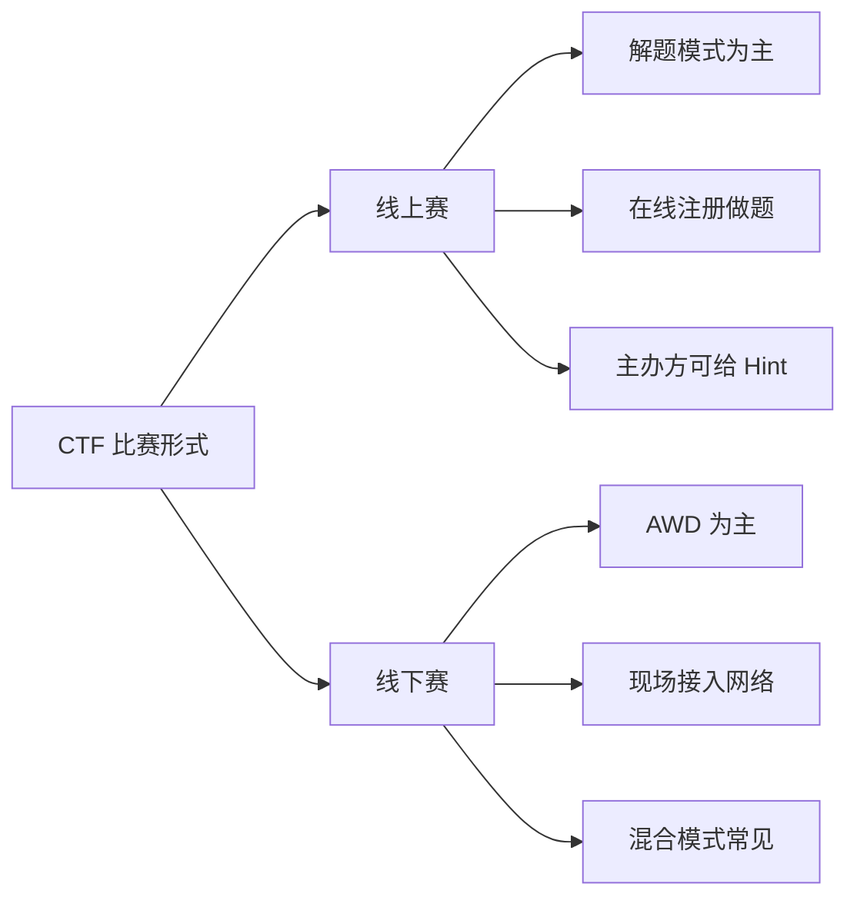

> 本文转载自 CTFHub (https://www.ctfhub.com)，内容有增删改编

CTF 比赛一般分为线上赛和线下赛。通常来说线上赛多为初赛，线下赛多为决赛，但也不排除直接进行线下决赛的情况。

### 线上赛

选手通过主办方搭建的比赛平台在线注册，在线做题并提交 flag。线上比赛多为解题模式（[[竞赛模式#Jeopardy-解题|Jeopardy]]），攻防模式较为少见。通常来说对于长时间未解出的题目，主办方会酌情给出提示（Hint）来帮助选手做题。

### 线下赛

选手前往比赛所在地，现场接入比赛网络进行比赛。线下多为 [[竞赛模式#AwD-攻防模式|AWD]] 模式，近年来随着比赛赛制的不断革新，线下赛也会出现多种模式混合进行，例如解题 + AWD、解题 + RW 等。

### 参赛环境建议

无论线上还是线下，一套完整的安全工具环境是必要的。本知识库基于 [[../总目录与快速查询|ArchStrike]] 构建，涵盖从信息收集到漏洞利用的全链路工具。建议选手赛前熟悉 ArchStrike 环境，尤其是 [[../archstrike-base教学/01-基础命令与Linux安全操作|基础命令与工具使用]]。

### 相关文章

- [[CTF简介|CTF 简介]] -- 了解 CTF 的起源与基本概念
- [[竞赛模式|CTF 竞赛模式详解]] -- Jeopardy、AwD、AWP 等赛制说明
- [[题目类型|CTF 题目类型]] -- Web、Pwn、Reverse、Crypto、Misc 全解析
