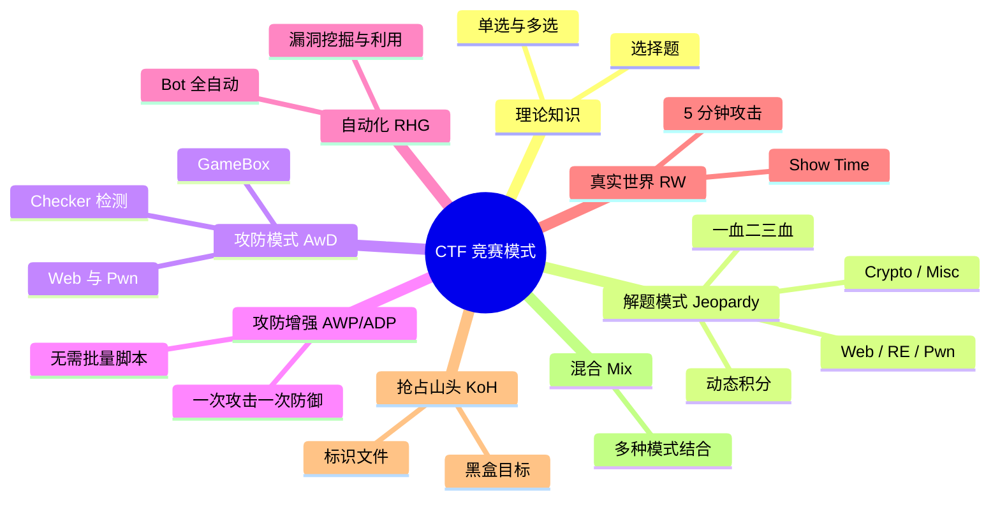

> 本文转载自 CTFHub (https://www.ctfhub.com)，内容有增删改编

CTF 竞赛模式具体分为以下几类：

### 理论知识

理论题多见于国内比赛，通常为选择题，包含单选及多选。选手需要根据自己所学的相关理论知识进行作答，最终得出分数。理论部分通常多见于初赛或是初赛之前的海选。

### Jeopardy-解题

参赛队伍可以通过互联网或现场网络参与，通过与在线环境交互或文件离线分析，解决网络安全技术挑战获取相应分值，类似于 ACM 编程竞赛、信息学奥林匹克赛，根据总分和时间来进行排名。

这个解题模式一般会设置一血（First Blood）、二血（Second Blood）、三血（Third Blood），也即最先完成的前三支队伍会获得额外分值。另一种流行的计分规则是设置每道题目的初始分数后，根据该题的成功解答队伍数来逐渐降低该题的分值，即解答人数越多，分值越低，下降至保底分值后不再下降，一般称之为动态积分。

题目类型主要包含 [[题目类型#Web|Web 网络攻防]]、[[题目类型#Reverse|RE 逆向工程]]、[[题目类型#Pwn|Pwn 二进制漏洞利用]]、[[题目类型#Crypto|Crypto 密码攻击]]以及 [[题目类型#Misc|Misc 安全杂项]] 五个类别，个别比赛会根据题目类型进行扩展。

### AwD-攻防模式

Attack with Defense（AwD）全称攻防模式。主办方会预先为每个参赛队分配要防守的主机（GameBox），每个队伍之间的 GameBox 配置及漏洞完全一致。选手需要防护自己的 GameBox 不被攻击的同时挖掘漏洞并攻击对手服务来得分。主办方会运行 Checker 程序定时检测选手的 GameBox 运行状态，若检测到异常则判定宕机，扣除一定分数。

AwD 通常仅包含 Web 及 Pwn 两种类型的题目。每个队伍可能会分到多个 GameBox，随着比赛进行，最早的 GameBox 可能会下线，新的 GameBox 会陆续上线。

### AWP-攻防增强

Attack Defense Plus（ADP）全称攻防增强模式。攻击模式下，选手按照解题模式做题提交 flag 即可完成攻击；防御模式下，选手需要自行挖掘题目漏洞并制作补丁包上传至平台验证。对于每个题目，仅需攻击成功一次、防御成功一次即可完成，后续无需关注。ADP 通常仅包含 Web 及 Pwn 两种类型。

### RHG-自动化

Robo Hacking Game（RHG）利用人工智能或自动化攻击程序来全自动挖掘并利用漏洞。比赛开始前主办方会给出测试环境及相关接口文档，选手需要编写 bot 程序全自动访问并挖掘漏洞。比赛开始后不允许对 bot 进行任何操作。

### RW-真实世界

Real World（RW）着重考察选手面对真实环境的漏洞挖掘与利用能力。常见题型为 VM/Docker 逃逸、浏览器攻击、IoT/Car 设备攻击、Web 类攻击等。选手在平台上提交展示申请后上台攻击，一般时限 5 分钟。RW 模式不存在 Flag，以展示效果作为评判标准。

### KoH-抢占山头

King of Hill（KoH）中，选手面对黑盒目标，需要先挖掘漏洞并控制目标，将自己的队伍标识写入指定文件，随后进行加固操作防止其他队伍攻击。主办方定期检查标识文件，根据标识判定本回合分数归属。

### Mix-混合

混合模式结合以上多种模式。例如参赛队伍通过解题（Jeopardy）获取初始分数，再通过攻防对抗（AwD）进行得分增减，最终以得分高低分出胜负。

### ArchStrike 工具推荐

| 模式 | 推荐工具（本知识库） |
|------|---------------------|
| Jeopardy-Web | [[../archstrike-web教学/01-Web基础与HTTP协议|archstrike-web教学]]、Burp Suite、sqlmap |
| Jeopardy-Pwn | pwntools、[[../archstrike-fuzz教学/01-模糊测试入门与AFL实战|archstrike-fuzz教学]] |
| Jeopardy-RE | IDA、Ghidra、[[../archstrike-malware教学/01-恶意软件分析入门|archstrike-malware教学]] |
| Jeopardy-Crypto | hashcat、John，参见 [[../archstrike-cracking教学/01-在线密码攻击大师课|archstrike-cracking教学]] |
| Jeopardy-Misc | [[../archstrike-forensics教学/01-磁盘取证与反取证|archstrike-forensics教学]]、Wireshark |
| AwD/AWP | Metasploit、pwntools、自动化脚本 |
| RHG | Python、pwntools 自动化框架 |

### 相关文章

- [[CTF简介|CTF 简介]] -- 了解 CTF 的起源与基本概念
- [[比赛形式|CTF 比赛形式]] -- 线上赛与线下赛的区别
- [[题目类型|CTF 题目类型]] -- Web、Pwn、Reverse、Crypto、Misc 全解析
