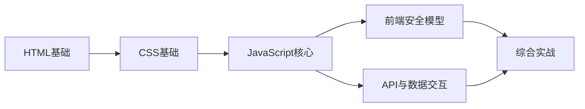

## 目录

### 第一部分：HTML基础
- [[html/HTML基础总目录|HTML 总目录与学习路线]]
- [[html/01-HTML结构与语义化|01-HTML结构与语义化]]
- [[html/02-表单与用户输入|02-表单与用户输入]]
- [[html/03-iframe与跨域嵌入|03-iframe与跨域嵌入]]
- [[html/04-HTML注入与绕过技术|04-HTML注入与绕过技术]]

### 第二部分：CSS基础
- [[css/CSS基础总目录|CSS 总目录与学习路线]]
- [[css/01-CSS选择器与样式基础|01-CSS选择器与样式基础]]
- [[css/02-CSS注入攻击|02-CSS注入攻击]]
- [[css/03-CSS数据泄露技术|03-CSS数据泄露技术]]
- [[css/04-CSS侧信道攻击|04-CSS侧信道攻击]]

### 第三部分：JavaScript核心
- [[js/JS基础总目录|JavaScript 总目录与学习路线]]
- [[js/01-JavaScript核心语法|01-JavaScript核心语法]]
- [[js/02-DOM操作与事件处理|02-DOM操作与事件处理]]
- [[js/03-AJAX与异步请求|03-AJAX与异步请求]]
- [[js/04-Web存储与Cookie操作|04-Web存储与Cookie操作]]
- [[js/05-JS安全漏洞与利用|05-JS安全漏洞与利用]]
- [[js/06-原型链污染攻击|06-原型链污染攻击]]
- [[js/07-客户端模板注入|07-客户端模板注入]]
- [[js/08-JS混淆与反混淆|08-JS混淆与反混淆]]
- [[js/09-WebSocket与实时通信|09-WebSocket与实时通信]]

### 第四部分：前端安全模型
- [[安全模型/01-浏览器安全模型|01-浏览器安全模型]]
- [[安全模型/02-同源策略与CORS深度解析|02-同源策略与CORS深度解析]]
- [[安全模型/03-CSP内容安全策略|03-CSP内容安全策略]]
- [[安全模型/04-认证与授权在前端|04-认证与授权在前端]]
- [[安全模型/05-现代前端框架安全|05-现代前端框架安全]]

### 第五部分：API与数据交互
- [[API与数据交互/01-RESTful API安全|01-RESTful API安全]]
- [[API与数据交互/02-GraphQL安全|02-GraphQL安全]]
- [[API与数据交互/03-API攻击与防护|03-API攻击与防护]]

### 附录
- [[工具链与前端基础总结|工具链与前端基础总结]]

---

## 前端基础学习路径

### 学习路线图（红队方向）

### 推荐学习顺序

**阶段一：前端骨架（第1-2周）**
1. HTML结构与语义化 → 理解DOM树的构建
2. HTML表单与用户输入 → 理解数据从前端到后端的流动
3. HTML注入与绕过 → 这是XSS的基础

**阶段二：样式层（第3周）**
4. CSS选择器与样式基础 → 理解选择器优先级
5. CSS注入 → 理解为什么CSS也能成为攻击向量
6. CSS数据泄露 → 无JS场景下的信息窃取

**阶段三：逻辑层（第4-5周）**
7. JavaScript核心语法 → 必须掌握，这是所有Web攻击的语言基础
8. DOM操作与事件 → XSS的本质就是操纵DOM
9. AJAX与异步请求 → 理解CORS/CSRF的前提
10. Web存储与Cookie → Session劫持、Token窃取的基础

**阶段四：攻击进阶（第6周）**
11. JS安全漏洞与利用 → 从语法到payload
12. 原型链污染 → Node.js后端的致命漏洞
13. 客户端模板注入 → AngularJS/Vue的CSTI
14. JS混淆与反混淆 → 前端对抗必备

**阶段五：安全纵深（第7-8周）**
15. 浏览器安全模型 → 从根本上理解Web安全的边界
16. 同源策略与CORS → Web安全的基石
17. CSP内容安全策略 → 如何绕过现代防御
18. 认证与授权在前端 → Token存储、OAuth流程中的安全问题
19. 现代框架安全 → React/Vue/Next.js特有攻击面

**阶段六：API与总结（第9周）**
20. RESTful API安全 → 参数污染、IDOR、批量赋值
21. GraphQL安全 → 内省查询、深度递归DoS
22. 工具链总结 → Chrome DevTools、Burp、前端调试武器库

### 与网安基础知识的衔接

前端基础是 [[../网安基础知识/02-Web技术基础|02-Web技术基础]] 的深化和扩展。建议先完成 [[../网安基础知识/02-Web技术基础|Web技术基础]] 中关于HTTP、Cookie、Session、同源策略、CORS的部分后，再进入前端基础的系统学习。

前端基础中"安全模型"章节会以攻击者视角重新审视 [[../网安基础知识/02-Web技术基础|Web技术基础]] 中的同源策略和CORS概念。

### 红队实战能力映射

| 前端知识点 | 红队攻击向量 | 对应漏洞类型 |
|-----------|-------------|-------------|
| HTML结构 | DOM构建规则 | DOM Clobbering, mXSS |
| HTML表单 | 数据提交流程 | CSRF, 参数污染 |
| HTML iframe | 跨域嵌入 | Clickjacking, Frame注入 |
| CSS选择器 | 样式注入 | CSS注入, 数据泄露 |
| CSS伪类 | 用户行为探测 | CSS侧信道, History探测 |
| JavaScript DOM API | DOM操作 | 反射型/DOM型XSS |
| JavaScript AJAX | 跨域请求 | CORS绕过, CSRF |
| JavaScript Cookie API | Cookie读取 | Session窃取, XSS |
| JavaScript WebSocket | 全双工通信 | WebSocket劫持, CSWSH |
| 原型链 | JS对象继承 | 原型链污染 → RCE |
| 模板引擎 | 客户端渲染 | CSTI → XSS/RCE |
| 浏览器安全模型 | 安全边界 | SOP/CSP/CORS绕过 |
| REST API | 资源操作 | IDOR, 批量赋值 |
| GraphQL | 灵活查询 | 内省泄露, 深度查询DoS |
