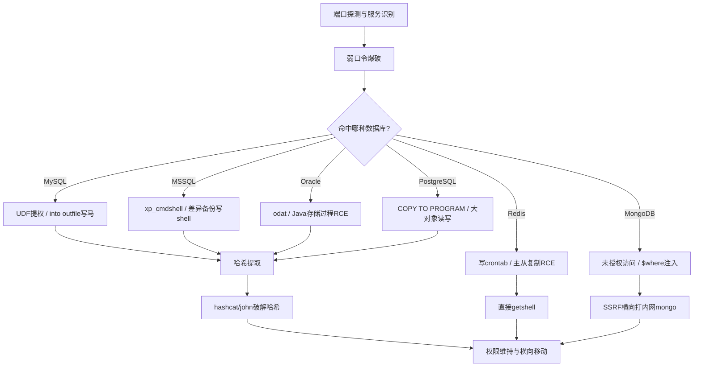

# 数据库安全总目录

> 红队视角的数据库安全知识库，定位：**指令运用与破解利用**（不是数据库开发）。读者应已学过 [[../网安基础知识/08-数据库基础|数据库基础]] 与 SQL 注入基础。

---

## 目录

| 章节 | 内容 | 核心技术点 |
|------|------|-----------|
| [[01-数据库渗透流程与探测\|01 渗透流程与探测]] | 标准流程、端口、指纹 | nmap、shodan/fofa |
| [[02-MySQL渗透\|02 MySQL渗透]] | 弱口令、UDF、写shell | outfile、general_log |
| [[03-MSSQL渗透\|03 MSSQL渗透]] | sa、xp_cmdshell、差异备份 | OLE自动化、openrowset |
| [[04-Oracle渗透\|04 Oracle渗透]] | TNS、odat、Java提权 | SID枚举、UTL系列 |
| [[05-PostgreSQL渗透\|05 PostgreSQL渗透]] | COPY TO PROGRAM、大对象 | pg_read_file、dblink |
| [[06-Redis渗透\|06 Redis渗透]] | 未授权、写crontab/SSH | 主从复制RCE、Lua逃逸 |
| [[07-MongoDB渗透\|07 MongoDB渗透]] | 未授权、$where注入 | SSRF打内网、NoSQL注入 |
| [[08-口令破解与哈希提取\|08 口令破解与哈希]] | 各库哈希格式、hashcat | hydra/medusa爆破 |
| [[09-工具链速查\|09 工具链速查]] | 工具大表、MSF模块 | 自动化组合 |

---

## 学习路线

---

## 红队数据库攻击面总览

| 数据库 | 默认端口 | 常见默认凭据 | 高危点 | 提权/RCE 路径 |
|--------|---------|-------------|--------|--------------|
| MySQL | 3306 | root/root、root/123456、root空密码 | secure_file_priv 配置宽松 | UDF、into outfile、general_log |
| MSSQL | 1433 | sa/sa、sa/123456、sa空密码 | xp_cmdshell 未禁用 | xp_cmdshell、OLE、CLR、差异备份 |
| Oracle | 1521 | system/manager、scott/tiger、dbsnmp/dbsnmp | TNS 暴露公网 | Java 存储过程、UTL_FILE |
| PostgreSQL | 5432 | postgres/postgres | trust 认证配置 | COPY TO PROGRAM、lo_import |
| MongoDB | 27017 | 无认证（历史习惯） | bindIp 0.0.0.0 未授权 | $where JS 注入、配合 SSRF |
| Redis | 6379 | 无认证（默认） | 未授权访问 | 写crontab/SSH key、主从复制 RCE |
| Memcached | 11211 | 无认证（默认） | 未授权 + UDP 反射 | 数据窃取、DDoS 反射源 |
| Elasticsearch | 9200 | 无认证（历史版本） | 9200 HTTP 直出数据 | CVE 老版本 RCE、数据泄露 |

> 端口是入口的第一线索：外网扫描见 3306/6379/27017 直接按对应章节打；1433/1521 多出现在内网域环境。

---

## 关联知识

- [[../网安基础知识/08-数据库基础|数据库基础]] — 先修：SQL 语法、各库体系结构
- [[../archstrike-web教学/04-SQL注入攻击|SQL注入实战]] — 从 Web 注入面进入数据库
- [[../ctf_trea/Web/SQL/SQL总目录|CTF SQL注入专题]] — 注入手法专项训练
- [[../前端基础/php/03-危险函数与命令执行|PHP危险函数与命令执行]] — 拿到 shell 后的进一步利用

---
**返回** [[../总目录与快速查询|红队总目录]]
