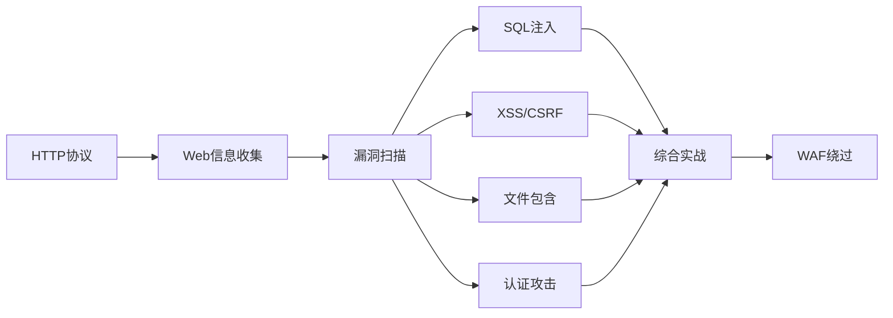

如果你刚接触网络安全，不知道从哪里开始，本文件提供一组**推荐学习方向**而非严格路线。你可以根据兴趣和目标选择起点。

## 方向一：网络安全通用基础（无论选哪个方向都先看这里）

| 优先级 | 模块 | 内容 |
|--------|------|------|
| 1 | [[网安基础知识/01-计算机网络基础]] | OSI模型、TCP/IP三次握手、DNS解析、HTTP请求/响应 |
| 2 | [[网安基础知识/02-Web技术基础]] | HTML/DOM、Cookie/Session、同源策略、CORS |
| 3 | [[archstrike-base教学/01-基础命令与Linux安全操作]] | Linux文件权限、SSH、进程管理、网络配置 |
| 4 | [[补充-Python黑客脚本基础]] | 写脚本自动化任务，这是渗透测试者的必备技能 |
| 5 | [[前端基础/前端基础总目录|前端基础（推荐）]] | HTML/CSS/JS + 前端安全模型，Web渗透的进阶前置知识 |

## 方向三：Web 应用安全

适合有 Web 开发基础、想做 Web 漏洞挖掘（Bug Bounty）的学习者。

| 优先级 | 模块 |
|--------|------|
| 1 | [[前端基础/前端基础总目录|前端基础（前置）]] |
| 2 | [[archstrike-web教学/01-Web基础与HTTP协议]] |
| 3 | [[archstrike-web教学/02-Web信息收集与侦察]] |
| 3 | [[archstrike-web教学/03-Web漏洞扫描与检测]] |
| 4 | [[archstrike-web教学/04-SQL注入攻击]] |
| 5 | [[archstrike-web教学/05-XSS与CSRF攻击]] |
| 6 | [[archstrike-web教学/06-文件包含与命令注入]] |
| 7 | [[archstrike-web教学/07-认证与会话攻击]] |
| 8 | [[archstrike-web教学/08-Web渗透综合实战]] |
| 9 | [[archstrike-web教学/09-WAF绕过与高级技巧]] |

## 方向五：CTF 竞赛

适合想通过 CTF 快速提升实战能力的参与者。

参考 [[ctf_trea/ctf解法与理论总目录]] 和 [[ctf-git|CTF 思维框架]]。

CTF 常见方向：
- Reverse（逆向工程）
- Pwn（二进制漏洞利用）
- Web（Web 漏洞）
- Crypto（密码学）
- Misc（杂项，流量分析、取证等）
- Mobile（移动安全）

## 方向七：红队综合（经验者进阶）

适合已有渗透基础、想系统化提升为红队成员的学习者。

在完成基础渗透（方向二）后，深入学习：

| 模块 | 用途 |
|------|------|
| archstrike-recon教学/ (侦察模块) | 专业的资产发现和情报收集 |
| archstrike-exploit教学/ (漏洞利用模块) | 高级漏洞利用框架和社会工程学 |
| archstrike-cracking教学/ (密码破解模块) | 专业级密码破解（GPU加速） |
| archstrike-wireless教学/ (无线安全模块) | 物理接近和无线攻击 |
| archstrike-forensics教学/ (取证模块) | 反取证和痕迹清除 |
| [[Rust红队脚本编程]] | 编写自定义攻击工具 |
| [[服务器部署与运维/服务器部署与运维总目录]] | 了解常见业务的部署与防御 |
| [[AI_come]] | AI 辅助渗透测试 |

## 相关知识点

- [[总目录与快速查询]] -- 全手册目录与速查
- [[补充-Python黑客脚本基础]] -- 编程基础
- [[补充-进阶学习与缺失领域分析]] -- 进阶方向分析
- [[AI_come]] -- AI 辅助学习
- [[服务器部署与运维/服务器部署与运维总目录]] -- 业务部署与运维
