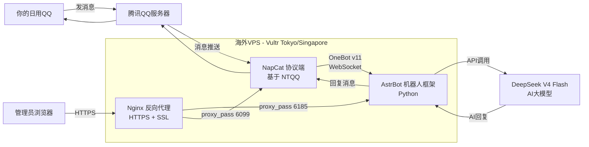
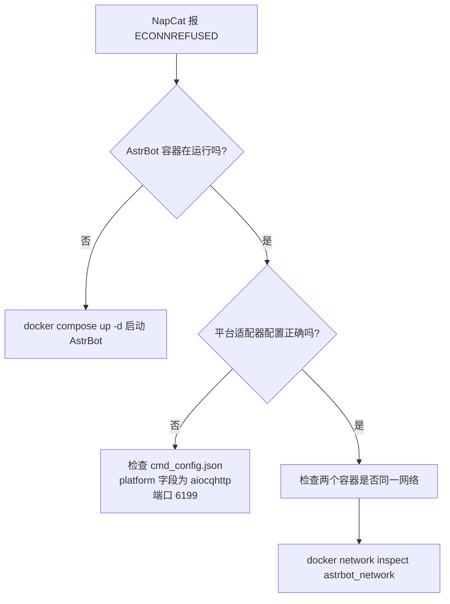
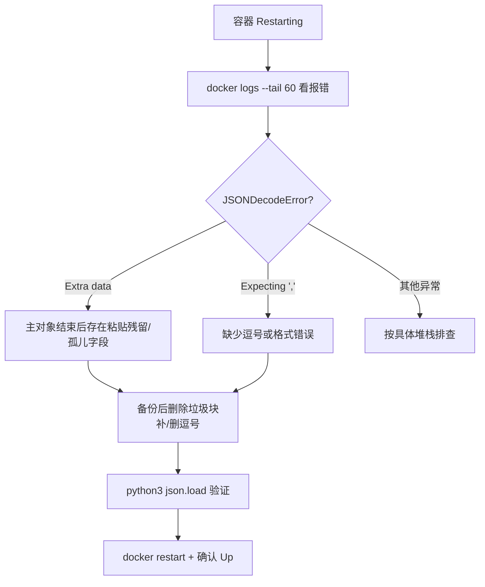
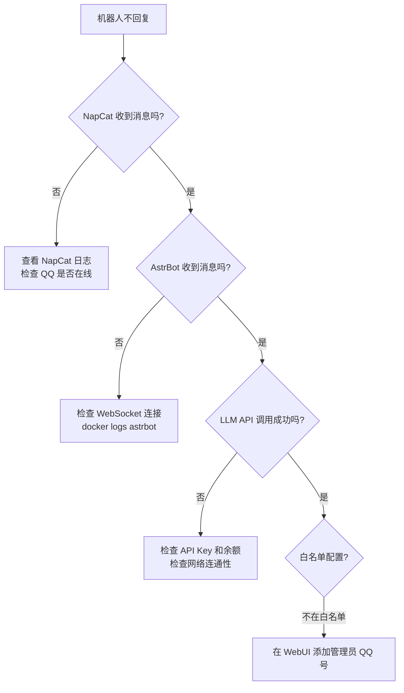
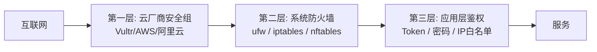

## 整体架构



**组件说明：**

| 组件 | 作用 | 端口 |
|------|------|------|
| NapCat | QQ 协议端，基于无头 NTQQ，实现 OneBot v11 标准接口 | 6099(WebUI)，3000/3001(API) |
| AstrBot | AI 机器人中枢，处理消息、调用大模型、插件系统 | 6185(WebUI)，6199(WebSocket) |
| DeepSeek | AI 大模型 API，提供对话能力 | 外部 API(api.deepseek.com) |
| Nginx | 反向代理，提供 HTTPS 加密访问 | 443(HTTPS)，80(HTTP redirect) |


## 第二章：域名与 DNS

### 购买域名

| 注册商 | 特点 |
|--------|------|
| 阿里云 | 国内方便，实名认证，¥20-50/年 |
| Namesilo | 便宜，含隐私保护，~$9/年 |
| Cloudflare | 成本价，但需已有域名转入 |

### DNS 解析设置

在阿里云 DNS 解析中添加 A 记录：

| 记录类型 | 主机记录 | 记录值 | 说明 |
|---------|---------|-------|------|
| A | `bot` | `你的VPS_IP` | 主服务域名: bot.yourdomain.com |
| A | `napcat` | `你的VPS_IP` | NapCat 管理面板子域名 |

### 验证解析

```bash
nslookup bot.yourdomain.com
dig bot.yourdomain.com +short
```

输出应为你的 VPS IP 地址。如果返回 `NXDOMAIN`，说明：
- 域名拼写错误
- DNS 记录未添加或未生效（等待 1-10 分钟）


## 第四章：Docker Compose 部署 NapCat + AstrBot

### 创建项目目录与配置文件

```bash
mkdir -p ~/astrbot && cd ~/astrbot
```

创建 `docker-compose.yml`：

```yaml
version: "3"
services:
 napcat:
 image: mlikiowa/napcat-docker:latest
 container_name: napcat
 restart: always
 environment:
 - MODE=astrbot
 ports:
 - "6099:6099"
 volumes:
 - ./data:/AstrBot/data
 - ./napcat/config:/app/napcat/config
 - ./ntqq:/app/.config/QQ
 networks:
 - astrbot_network
 astrbot:
 image: soulter/astrbot:latest
 container_name: astrbot
 restart: always
 environment:
 - TZ=Asia/Shanghai
 ports:
 - "6185:6185"
 volumes:
 - ./data:/AstrBot/data
 networks:
 - astrbot_network
networks:
 astrbot_network:
 driver: bridge
```

> 重要：NapCat 的环境变量 `MODE=astrbot` 告诉它连接 AstrBot。NapCat 和 AstrBot 必须在**同一个 Docker 网络** 内才能通信。

### 启动

```bash
docker compose up -d
```

### 检查运行状态

```bash
docker ps
```

输出应显示两个容器都在 `Up` 状态：

```
CONTAINER ID IMAGE STATUS PORTS
xxxxxxxxxxxx mlikiowa/napcat-docker:latest Up 5 minutes 0.0.0.0:6099->6099
xxxxxxxxxxxx soulter/astrbot:latest Up 5 minutes 0.0.0.0:6185->6185
```


## 第六章：配置 AstrBot

### 访问 AstrBot WebUI

浏览器打开 `http://你的VPS_IP:6185`，默认账号密码为 `astrbot` / `astrbot`，首次登录会要求修改。

### 配置 AI 模型

在 AstrBot 左侧菜单 -> 模型配置：

1. 清空已有配置重新添加，或编辑现有 `deepseek` 提供商
2. 提供商类型：OpenAI API Compatible
3. API 地址：`https://api.deepseek.com/v1`
4. API Key：在 [platform.deepseek.com](https://platform.deepseek.com) 注册获取
5. 模型名：`deepseek-chat` (映射到 DeepSeek V4 Flash)

```json
{
 "type": "openai_chat_completion",
 "api_base": "https://api.deepseek.com/v1",
 "key": ["你的API_KEY"],
 "model": "deepseek-chat"
}
```

### 配置 NapCat 连接适配器

AstrBot 默认可能配置了 `qq_official` 适配器(QQ 官方机器人)。需要改为 `aiocqhttp` 适配器以对接 NapCat。

编辑 `~/astrbot/data/cmd_config.json`，找到 `"platform"` 字段，替换为：

```json
"platform": [
 {
 "type": "aiocqhttp",
 "id": "napcat",
 "enable": true,
 "ws_reverse_host": "0.0.0.0",
 "ws_reverse_port": 6199,
 "token": ""
 }
],
```

然后重启 AstrBot：

```bash
docker restart astrbot
```

### 验证连接

```bash
docker logs astrbot | grep -i "aiocqhttp\|OneBot\|适配器已连接"
```

成功输出：

```
aiocqhttp(OneBot v11) 适配器已连接。
```

### 添加管理员白名单

在 AstrBot WebUI -> 配置 -> 其他配置 -> 管理员 ID，填入你的日用 QQ 号（发给机器人消息的那个号）。


## 第八章：常见排错大全

### 容器相关

#### 1. NapCat 报 ECONNREFUSED

```
[error] 反向WebSocket (ws://astrbot:6199/ws) 连接错误 Error: connect ECONNREFUSED
```

**原因**：AstrBot 没有在监听 6199 端口。可能 astrbot 容器未运行，或配置不正确。

**排查**：
```bash
docker ps | grep astrbot # AstrBot 是否在运行
docker exec astrbot ss -tlnp 2>/dev/null | grep 6199 # 是否监听 6199
docker logs astrbot | grep -i "aiocqhttp\|OneBot" # 适配器是否启动
```

**解决**：检查 `cmd_config.json` 中 `platform` 配置的字段名是否正确。注意 `ws_reverse_host` 和 `ws_reverse_port`，不是 `ws_host` 和 `ws_port`。



#### 2. JSONDecodeError

```
json.decoder.JSONDecodeError: Expecting ',' delimiter: line 268 column 3
```

**原因**：`cmd_config.json` 中缺少逗号或格式错误。常见于手动编辑 JSON 时在数组或对象之间漏了逗号。

**排查**：
```bash
python3 -c "import json; json.load(open('/root/astrbot/data/cmd_config.json')); print('OK')"
```

如果报错，说明 JSON 格式有问题。

**解决**：用 Python 脚本修复（安全，不会破坏格式）：

```bash
python3 -c "
import json
cfg = json.load(open('/root/astrbot/data/cmd_config.json'))
# 修改你的配置
cfg['platform'] = [{'type': 'aiocqhttp', 'id': 'napcat', 'enable': True, 'ws_reverse_host': '0.0.0.0', 'ws_reverse_port': 6199, 'token': ''}]
json.dump(cfg, open('/root/astrbot/data/cmd_config.json','w'), indent=2)
print('Done')
"
```

> 通用原则：**修改 JSON 文件前先备份** `cp file.json file.json.bak`。始终用程序化方式修改而非 sed/手动编辑。

#### 2.5 容器崩溃循环 (Restarting)

**症状**：
- `docker ps` 显示容器状态为 `Restarting`（几十秒内反复重启）
- WebUI 无法访问，`ss -tlnp | grep 6185` 无输出（端口无监听）
- 容器日志中出现 Python 异常堆栈

**典型报错**：
```
json.decoder.JSONDecodeError: Extra data: line 71 column 6 (char 1733)
```

**根因**：`Extra data` 表示 JSON 解析器已读完一个完整文档，但后面还有多余内容——通常是手动粘贴配置时把新块粘到了主对象 `}` 之外，形成两个 JSON 文档；或粘贴残留了孤儿字段（如 `"provider_settings": {...}` 的残片）。这是 `Expecting ','`（缺逗号）之外的另一种常见 JSON 错误。

**诊断链路**：
```bash
docker ps | grep astrbot # 1. 状态是否为 Restarting
docker logs astrbot --tail 60 2>&1 # 2. 看崩溃原因（JSONDecodeError）
ss -tlnp | grep -E "6185|6199" # 3. 端口是否监听（崩溃时无监听）
nl -ba cmd_config.json | sed -n '55,95p' # 4. 定位报错行附近的文件内容
```

**修复流程**：
```bash
cp cmd_config.json cmd_config.json.bak # 1. 备份（铁律）
# 2. 打开文件，找到主 JSON 对象结束的 } 之后，删除所有垃圾块/残留字段
# 3. 检查垃圾块删除处是否缺逗号、数组内是否多了尾逗号
python3 -c "import json; json.load(open('cmd_config.json')); print('OK')" # 4. 验证
docker restart astrbot # 5. 重启
docker ps | grep astrbot # 6. 确认 Up
```



**教训**：
- 修改 JSON 前**先备份**；
- 粘贴配置时确认粘在正确的 `{` `}` 层级内，不要粘到文件末尾主对象之外；
- 改完先用 `python3` 验证再重启，避免"改一次崩一次"的循环。

#### 2.6 AstrBot v4 provider 两层配置结构

新版 AstrBot 的模型配置拆成两层：`provider_sources`（API 源）和 `provider`（模型实例），加上 `provider_settings` 选默认模型。手动改配置前必须先理解这个结构，否则极易写错。

**结构关系**：

| 字段 | 作用 | 示例 |
|------|------|------|
| `provider_sources[]` | 定义 API 提供商（密钥、地址、类型） | `{"id": "deepseek", "type": "openai_chat_completion", "key": ["sk-..."], "api_base": "https://api.deepseek.com/v1", "enable": true}` |
| `provider[]` | 定义可用模型实例，挂在某个源下 | `{"id": "deepseek/deepseek-v4-flash", "provider_source_id": "deepseek", "model": "deepseek-v4-flash", "enable": true}` |
| `provider_settings.default_provider_id` | 默认使用的模型 | `"deepseek/deepseek-v4-flash"` |

**关键规则**：`provider[].id` 必须是 `源id/模型名` 格式，且**三处 id 必须一致**——`provider_sources[].id`、`provider[].provider_source_id`、`provider[].id` 前缀。

**常见错误对照表**：

| 错误 | 报错/现象 | 修正 |
|------|-----------|------|
| `provider_sources[].type` 误填模型名（如 `"deepseek-v4-flash"`） | 源无法初始化 | type 应为 `openai_chat_completion` |
| `provider_source_id` 与源 id 拼写不一致（`deepseek_v1` vs `deepseek_1`） | provider 找不到源 | 保证三处 id 完全一致 |
| `provider[].id` 只有模型名没有 `源id/` 前缀 | default_provider_id 找不到 | 写成 `deepseek/deepseek-v4-flash` |
| 粘贴后缺逗号 / 尾部多逗号 | `Expecting ',' delimiter` 或 `Expecting property name` | 检查数组/对象分隔符 |
| 键名拼写错误（`provider_sourceid`、`api_base` 漏下划线） | 静默失败或初始化报错 | 对照 WebUI 生成的配置逐字段核对 |

> 最稳妥的方式：在 WebUI 里完成模型配置，再用 `cat cmd_config.json` 查看 WebUI 生成的结构作为参照。手动改配置永远遵循：备份 → 修改 → `python3` 验证 → 重启。

#### 3. NapCat 需要重新扫码

删除容器重建后需要重新扫码登录 QQ。

```bash
docker logs napcat 2>&1 | grep -i "qr\|二维码\|url"
```

打开二维码 URL 或用手机 QQ 扫码。

### SSL 证书相关

#### 4. 证书验证超时

```
Verification error details: ... Timeout during connect (likely firewall problem)
```

**原因**：Let's Encrypt 无法访问 VPS 的 80 端口。防火墙(云厂商安全组或 ufw)阻挡了入站 80 端口。

**排查**：
```bash
ufw status # 检查系统防火墙
ss -tlnp | grep 80 # 检查 Nginx 是否监听 80
```

**解决**：开放 `ufw allow 80/tcp`，同时检查 Vultr/DigitalOcean 控制台的防火墙策略。

#### 5. NXDOMAIN 域名不存在

```
server can't find bot.yourdomain.com: NXDOMAIN
```

**排查**：
- 确认域名拼写正确（`.com` vs `.top` vs `.top.com`）
- 确认 DNS A 记录已添加
- 等待 DNS 缓存刷新（1-10 分钟）

#### 6. nginx 指令错误

```
unknown directive "sl_certificate"
```

**原因**：`ssl_certificate` 写成了 `sl_certificate`（漏了字母 s）。

**解决**：检查 Nginx 配置文件中的指令拼写。

### 机器人不回复

#### 7. 消息发送了但无回复

排查链路：


- 查看 NapCat 是否在线：`docker logs napcat | grep "接收"`
- 查看 AstrBot 日志：`docker logs astrbot --tail 20`
- 检查 WebUI 白名单配置

**链路 vs 模型二分判定**：先确定消息到底卡在哪一环，再对症下药。

```bash
docker logs astrbot --since 1m 2>&1 | wc -l # 消息到达后日志行数会明显增长
docker logs astrbot --since 2m 2>&1 | grep -i "napcat\|aiocqhttp" # 适配器是否收到消息
docker logs astrbot --since 2m 2>&1 | grep -iE "llm|provider|request|error|exception" # 模型侧调用
ss -tlnp | grep 6199 # ws_reverse 端口监听
```

| 现象 | 结论 | 下一步 |
|------|------|--------|
| 日志中出现 `napcat(aiocqhttp)` 消息记录 | 消息已到达 AstrBot，问题在模型/回复侧 | 查 provider 报错、API Key、余额、白名单 |
| 日志行数几乎为 0（`wc -l` ≈ 0） | 消息根本没到 AstrBot | 查 WebSocket 连接、NapCat 是否在线 |
| 有 `Applying streaming output` 字样 | 模型已开始产出回复 | 问题在回复发送链路 |

> 关键经验：日志中出现 `Applying streaming output (napcat)` 却无最终回复时，说明消息链路（QQ → NapCat → AstrBot → 模型）整体连通，问题大概率出在"仅 @ 回复"配置、限流或白名单等过滤逻辑上。

### 其他常见问题

#### 8. WebUI 无法访问

**症状**：浏览器访问 `http://IP:6185` 超时/连接失败。

**三层排查**（从内到外逐层确认，避免冤枉防火墙）：

```bash
docker ps | grep astrbot # ① 容器是否运行？Restarting 会瞬间断开
ss -tlnp | grep 6185 # ② 端口是否监听？
curl -sI http://127.0.0.1:6185 | head -1 # ③ 本机自测（绕开防火墙直接测应用）
ufw status / firewalld-cmd --list-all # ④ 系统防火墙
# ⑤ 云厂商安全组 / 防火墙策略放行 6185
```

**关键判断**：
- 端口无监听 ≠ 防火墙问题。**先查容器状态和日志**——崩溃循环（Restarting）时端口必然无监听，此时修防火墙毫无意义。
- `curl 127.0.0.1:6185` 返回 HTTP 200 但外网打不开 → 才是防火墙/安全组问题。

#### 9. API Key 泄露处理

**泄露途径**：Key 出现在聊天记录、截图、日志、或 git 提交历史中。

**处理流程**：
1. 登录平台控制台，**立即删除/禁用泄露的 Key**（如 DeepSeek 平台可删除后重新生成）
2. 生成新 Key，更新 `cmd_config.json` 中 `provider_sources[].key`
3. 重启生效：`docker restart astrbot`
4. 若 Key 曾提交到 git 仓库：用 `git log --all` 检查历史，必要时重写历史；**直接轮换 Key 更省事且彻底**

**预防**：
- 密钥永不写入聊天/截图/提交记录
- 密钥尽量通过环境变量注入，或用 AstrBot WebUI 配置（密钥只存在于服务端配置）
- 定期轮换 API Key

#### 10. AI 大模型省钱配置

**问题**：机器人自动回复群内所有消息 + 流式输出 + 无限上下文，导致 API 费用超预期。

**免费/低价模型对比**：

| 模型 | 价格 | 并发限制 | 适用性 |
|------|------|---------|--------|
| 智谱 GLM-4.7-Flash | 免费 | 并发 1，单轮响应慢（可达分钟级） | 不适合群聊场景 |
| 硅基流动免费模型 | 免费 | 各模型不同，部分模型质量一般 | 可做备用 |
| DeepSeek deepseek-v4-flash | 约 1-2 元/百万 tokens | 无显著限制，响应快 | 群聊场景推荐 |

**AstrBot 省钱配置项**：

| 配置项 | 值 | 效果 |
|--------|-----|------|
| `wake_prefix` 仅 @ 回复 | 配置 @ 唤醒而非所有消息 | 只有被 @ 时才调用模型 |
| `rate_limit` 限流 | `60` 秒 / `30` 条 | 防止刷屏导致的连续调用 |
| `streaming_response` | `false` | 关闭流式输出，减少接口往返 |
| `max_context_length` | 按需限制（如最近 10 轮） | 控制上下文 tokens 消耗 |
| 管理员/白名单过滤 | 仅特定群或用户 | 减少无效调用 |

> 结论：**免费模型不一定省钱**——GLM-4.7-Flash 虽免费但并发 1 意味着群聊排队体验极差。对实际可用的场景，选择低价快速模型（DeepSeek V4-Flash）+ 严格触发条件（仅 @ 回复 + 限流）才是综合成本最优。


## 第九章：通用服务器部署技巧

这些技巧不仅适用于 QQ 机器人，适用于**任何服务器端业务**的部署和运维。

### 日志优先原则

任何问题，第一步永远是看日志：

| 场景 | 命令 |
|------|------|
| Docker 容器问题 | `docker logs 容器名 --tail 50` |
| Nginx 问题 | `tail -f /var/log/nginx/error.log` |
| 系统问题 | `journalctl -xe` |
| SSH 登录问题 | `tail -f /var/log/auth.log` |

### 防火墙三层模型



排查连通性问题时，从外到内逐层检查：
1. 先试从外网能 ping 通 IP 吗？
2. 端口能从外网访问吗？(`nc -zv 你的IP 端口`)
3. 云厂商防火墙放行了吗？
4. 系统防火墙放行了吗？
5. 应用本身在监听吗？(`ss -tlnp`)

### Docker 核心原则

- **容器隔离**：每个服务一个容器，不混装
- **网络互通**：需要通信的容器必须在同一 Docker 网络
- **数据持久化**：用 `volumes` 挂载配置文件和数据目录，容器删除后数据不丢
- **重启策略**：`restart: always` 保证崩溃后自动恢复
- **资源限制**：生产环境应限制 CPU 和内存 (`deploy.resources.limits`)

### Nginx 反向代理模板

Nginx 配置可复用于**任何需要 HTTPS 的 Web 服务**，只需改动 `server_name` 和 `proxy_pass`：

```nginx
server {
 listen 443 ssl;
 server_name 你的域名;

 ssl_certificate /path/to/fullchain.cer;
 ssl_certificate_key /path/to/private.key;

 location / {
 proxy_pass http://127.0.0.1:你的本地端口;
 proxy_set_header Host $host;
 proxy_set_header X-Real-IP $remote_addr;
 proxy_set_header X-Forwarded-For $proxy_add_x_forwarded_for;
 }
}

server {
 listen 80;
 server_name 你的域名;
 return 301 https://$server_name$request_uri;
}
```

### JSON 配置安全操作

以 `cmd_config.json` 为例，操作 JSON 配置时应：

1. **备份**：`cp file.json file.json.bak`
2. **验证**：`python3 -c "import json; json.load(open('file.json')); print('valid')"`
3. **修改**：用 Python 脚本或 WebUI 修改，而非 sed
4. **重启应用**使配置生效

### 安全底线清单

| 项目 | 操作 |
|------|------|
| 修改默认密码 | 所有管理面板的第一个操作 |
| 最小端口暴露 | 只开 22/80/443，关闭其他 |
| SSH 密钥认证 | 禁用密码登录，改用密钥 |
| 容器非 root | 避免容器以 root 运行 |
| 定期更新 | `apt update && apt upgrade -y` |
| 监控告警 | 简单可用性监控 |
| SSL 自动化 | acme.sh 自动续期证书 |

---

## 相关知识点

- [[服务器部署与运维总目录]] -- 本目录索引
- [[qqbot-02-红队视角]] -- 面向攻击者的分析
- [[qqbot-03-安全加固]] -- 面向防御者的加固方案
- [[../archstrike-recon教学/01-高级子域名与资产发现]] -- 子域名及服务发现技术
- [[../archstrike-web教学/01-Web基础与HTTP协议]] -- HTTP/HTTPS 协议详解
- [[../archstrike-proxy教学/01-代理与隐蔽通信]] -- 代理隧道技术
- [[../网安基础知识/01-计算机网络基础]] -- 网络基础
