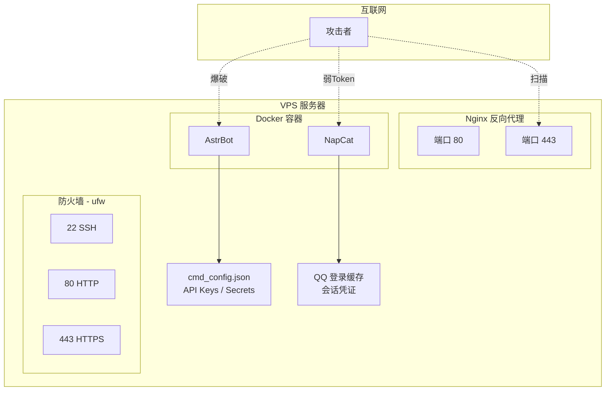

## 攻击面总览




## 第二章：AstrBot 安全加固

### 修改默认密码

AstrBot 首次安装的默认密码为 `astrbot` / `astrbot`，必须立即修改。

在 WebUI 右上角头像 -> 修改密码，或直接编辑配置文件：

```json
{
 "dashboard": {
 "username": "your-admin-user",
 "password": "md5_hashed_password",
 "password_change_required": true
 }
}
```

### 开启 TOTP 两步验证

AstrBot 支持 TOTP（基于时间的一次性密码），在 WebUI -> 设置中启用。配合 Authenticator App 使用。

### 最小权限原则

```json
{
 "admins_id": ["仅你的QQ号"],
 "enable_id_white_list": true,
 "id_whitelist": ["仅允许的QQ号群组"]
}
```

### 配置安全选项

```json
{
 "platform_settings": {
 "enable_id_white_list": true,
 "wl_ignore_admin_on_group": true,
 "wl_ignore_admin_on_friend": true
 },
 "provider_settings": {
 "llm_safety_mode": true,
 "safety_mode_strategy": "system_prompt"
 },
 "content_safety": {
 "also_use_in_response": true,
 "internal_keywords": {
 "enable": true,
 "extra_keywords": ["敏感词列表"]
 }
 }
}
```

### API Key 保护

- DeepSeek/OpenAI API Key 明文存储在 `cmd_config.json` 中，**必须限制该文件的访问权限**
- 不要在日志中输出 API Key
- 在 DeepSeek 控制台设置**用量上限**和**告警阈值**，防止被滥用产生高额费用

```bash
# 限制配置文件权限
chmod 600 /root/astrbot/data/cmd_config.json
chown root:root /root/astrbot/data/cmd_config.json
```


## 第四章：Nginx 安全加固

### 安全头配置

```nginx
server {
 listen 443 ssl;
 server_name bot.yourdomain.com;

 # SSL 配置
 ssl_certificate /path/to/fullchain.cer;
 ssl_certificate_key /path/to/private.key;
 ssl_protocols TLSv1.2 TLSv1.3;
 ssl_ciphers HIGH:!aNULL:!MD5;

 # 安全头
 add_header X-Content-Type-Options "nosniff" always;
 add_header X-Frame-Options "DENY" always;
 add_header X-XSS-Protection "1; mode=block" always;
 add_header Strict-Transport-Security "max-age=31536000; includeSubDomains" always;

 # 隐藏 Nginx 版本
 server_tokens off;

 # 请求大小限制（防止大 payload 攻击）
 client_max_body_size 10M;

 location / {
 proxy_pass http://127.0.0.1:6185;
 # ... 其他配置
 }
}
```

### 屏蔽非目标域名的访问

```nginx
server {
 listen 443 ssl;
 server_name _; # 未匹配的域名
 return 444; # 直接断开连接，不响应
}
```

### 限流配置

```nginx
# 在 http 块中定义限流区域
limit_req_zone $binary_remote_addr zone=login:10m rate=5r/m;

# 在 location 中应用
location /login {
 limit_req zone=login burst=2 nodelay;
 proxy_pass http://127.0.0.1:6185;
}
```

### 日志监控

```nginx
# 自定义日志格式
log_format security '$remote_addr - $remote_user [$time_local] '
 '"$request" $status $body_bytes_sent '
 '"$http_referer" "$http_user_agent"';

# 启用访问日志
access_log /var/log/nginx/bot_access.log security;
```

配置日志轮转：

```bash
cat > /etc/logrotate.d/nginx-bot << 'EOF'
/var/log/nginx/bot_*.log {
 daily
 rotate 30
 compress
 delaycompress
 missingok
 notifempty
 sharedscripts
 postrotate
 systemctl reload nginx
 endscript
}
EOF
```


## 第六章：操作系统安全

### 自动安全更新

```bash
apt install -y unattended-upgrades
dpkg-reconfigure --priority=low unattended-upgrades
```

### 监控与告警

简单的日志监控脚本：

```bash
#!/bin/bash
# /usr/local/bin/security_check.sh

# 检查失败的 SSH 登录
FAILED_SSH=$(grep "Failed password" /var/log/auth.log | wc -l)
if [ $FAILED_SSH -gt 10 ]; then
 echo "警告: 检测到 $FAILED_SSH 次失败的 SSH 登录" | mail -s "安全告警" your@email.com
fi

# 检查 Docker 容器状态
for container in napcat astrbot; do
 if ! docker ps --format '{{.Names}}' | grep -q $container; then
 echo "警告: 容器 $container 未运行" | mail -s "服务告警" your@email.com
 fi
done
```

添加到 cron：

```bash
*/30 * * * * /usr/local/bin/security_check.sh
```


## 相关知识点

- [[qqbot-01-部署与运维]] -- 部署流程了解攻击面
- [[qqbot-02-红队视角]] -- 知己知彼，从攻击者视角看防御
- [[../archstrike-base教学/01-基础命令与Linux安全操作]] -- SSH 安全、系统加固
- [[../archstrike-web教学/09-WAF绕过与高级技巧]] -- WAF 配置
- [[../archstrike-proxy教学/01-代理与隐蔽通信]] -- 访问控制
- [[../archstrike-base教学/08-痕迹清除与渗透报告]] -- 了解攻击者在清理什么
- [[../网安基础知识/01-计算机网络基础]] -- 网络原理
