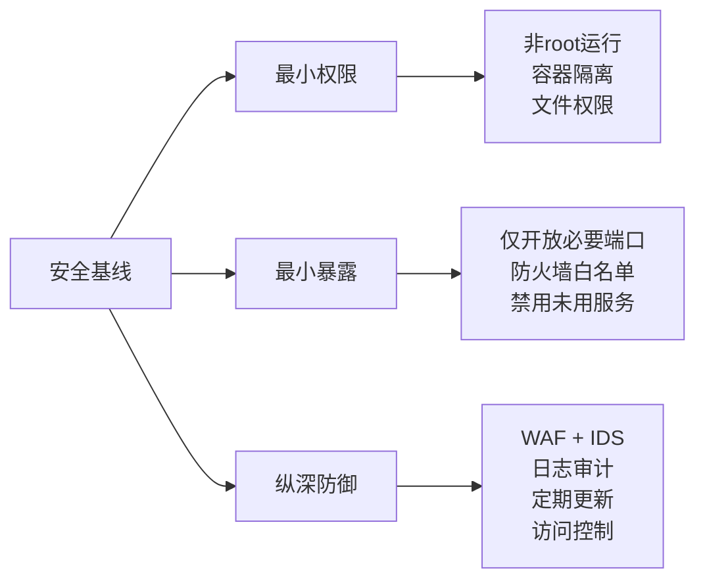

本目录收录了**多种业务场景的服务器部署、运维、红队攻击视角及安全加固方案**。每个业务类型为一组三个文件，分别覆盖部署运维、红队利用思路、蓝队防护方案。

```mermaid
mindmap
  root((服务器部署与运维))
    QQ机器人
      [[qqbot-01-部署与运维|部署与运维]]
      [[qqbot-02-红队视角|红队攻击视角]]
      [[qqbot-03-安全加固|安全加固方案]]
    更多业务类型待添加
      网站部署
      API服务
      数据库
      容器编排
      代理隧道
```


## 通用服务器部署原则

贯穿所有业务类型的核心原则：



1. **日志优先** -- 任何问题先看日志 (`docker logs`, `journalctl`, `tail -f /var/log/`)
2. **防火墙三层** -- 云厂商安全组 -> 系统防火墙(ufw/iptables) -> 应用自身鉴权
3. **改默认密码** -- 所有管理面板的第一个操作
4. **备份先行** -- 改配置文件前先备份
5. **自动化续期** -- SSL 证书、系统更新、日志轮转都要自动
6. **最小暴露原则** -- 只开放必要的端口，只授权必要的人员
