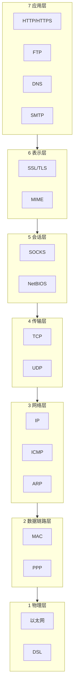
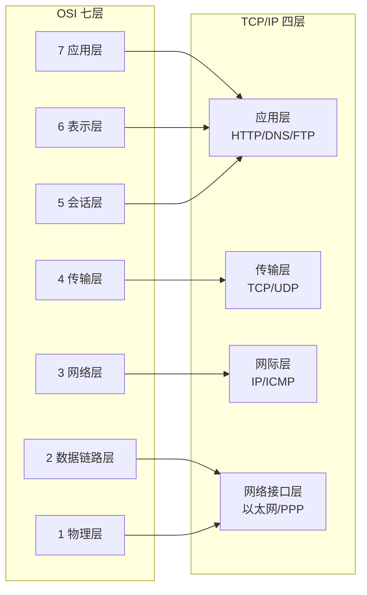
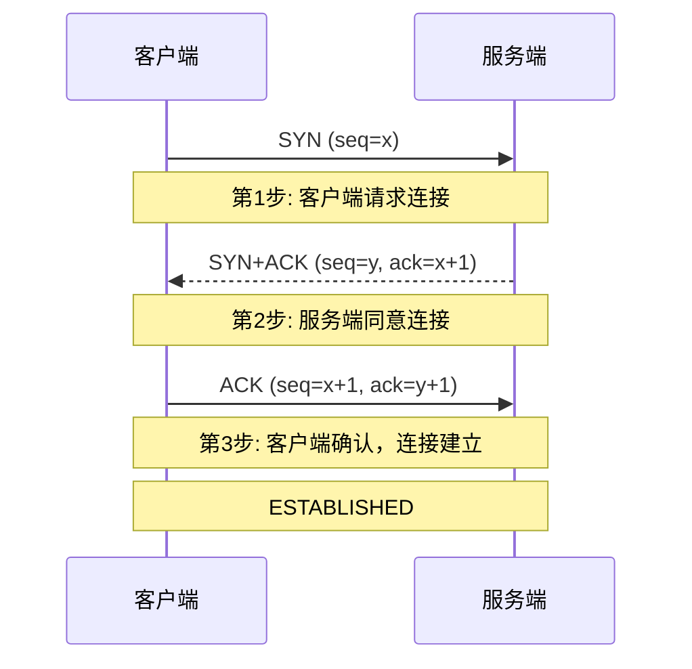
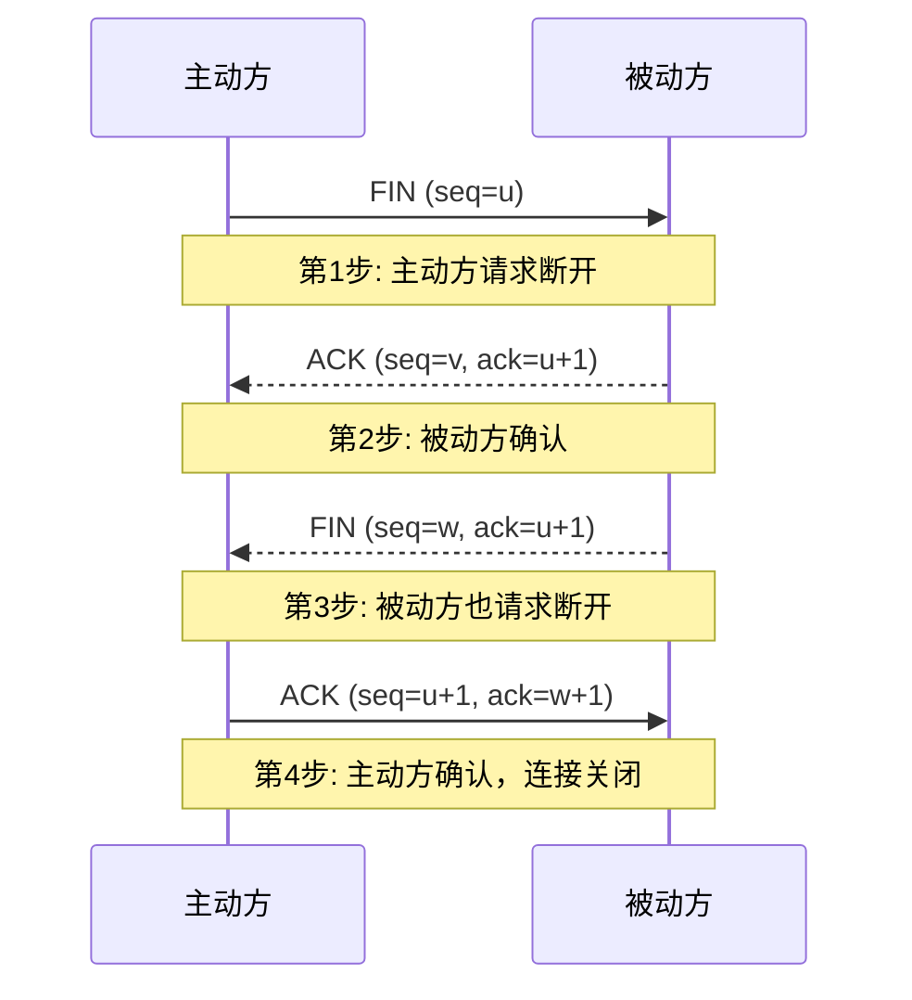
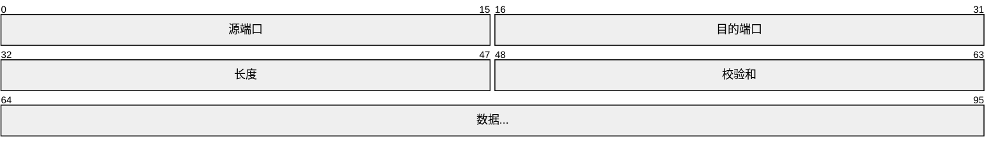
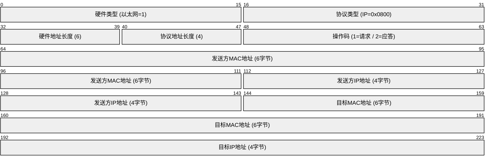
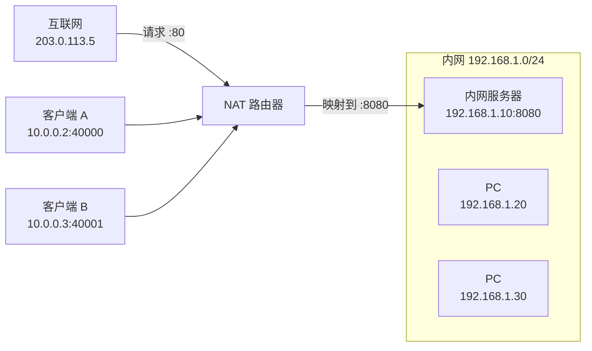

## 目录

- [[#一、网络模型概述|一、网络模型概述]]
- [[#二、OSI 七层模型详解|二、OSI 七层模型详解]]
- [[#三、TCP/IP 四层模型详解|三、TCP/IP 四层模型详解]]
- [[#四、TCP 三次握手与四次挥手|四、TCP 三次握手与四次挥手]]
- [[#五、UDP 协议详解|五、UDP 协议详解]]
- [[#六、IP 地址详解|六、IP 地址详解]]
- [[#七、子网掩码与 CIDR|七、子网掩码与 CIDR]]
- [[#八、常见端口号全表|八、常见端口号全表]]
- [[#九、ARP 协议原理|九、ARP 协议原理]]
- [[#十、ICMP 协议|十、ICMP 协议]]
- [[#十一、NAT 与端口转发|十一、NAT 与端口转发]]
- [[#十二、DHCP 工作流程|十二、DHCP 工作流程]]

> **延伸阅读**: 本文是红队向速览。如需408考研级深度覆盖（物理层、数据链路层、路由算法、TCP拥塞控制等），请参阅 [[../../计算机网络/计算机网络_索引|计算机网络教程]]。408考研四科交叉索引见 [[../../路径-考研408方向|路径-考研408方向]]。

## 一、网络模型概述

计算机网络模型是理解和分析网络通信的基础框架。最核心的两套模型是：
  - OSI 七层模型（理论模型，用于教学和协议分析）
  - TCP/IP 四层模型（实际互联网使用的模型）

理解网络分层是红队工作的基础。无论是分析流量、编写exploit、还是绕过防火墙，
都需要从不同网络层思考问题。

分层的好处：
  1. 各层独立：每层可以独立开发和修改，不影响其他层
  2. 标准化：统一的接口规范，不同厂商设备可以互操作
  3. 故障隔离：可以逐层排查问题

## 二、OSI 七层模型详解

OSI（Open Systems Interconnection）由ISO制定，是网络通信的理想化参考模型。

 
### 第7层 - 应用层 (Application Layer) 
 
  功能：直接为用户应用程序提供网络服务接口
  协议：HTTP, HTTPS, FTP, SMTP, DNS, SSH, Telnet, POP3, IMAP
  红队关注点：
    - Web应用漏洞（XSS, SQL注入, CSRF等）都发生在应用层
    - 协议理解是协议攻击（如DNS隧道）的基础
  典型场景：你在浏览器输入URL时，浏览器通过HTTP协议与应用层交互

###  第6层 - 表示层 (Presentation Layer)
  功能：数据表示、编码转换、加密解密、压缩
  协议/标准：ASCII, JPEG, MPEG, SSL/TLS（部分功能）, LPP
  红队关注点：
    - SSL/TLS剥离攻击
    - 字符编码绕过（如UTF-8 overlong encoding绕过WAF）
  典型场景：HTTPS中的加密由表示层（以及会话层/传输层协同）完成

 
### 第5层 - 会话层 (Session Layer)
  功能：建立、管理和终止会话连接
  协议：NetBIOS, RPC, PPTP, SOCKS
  红队关注点：
    - 会话劫持（Session Hijacking）
    - 中间人攻击（MITM）中维持会话
  典型场景：VPN隧道建立后，会话层管理连接的持续状态

### 第4层 - 传输层 (Transport Layer)
  功能：端到端的可靠（或不可靠）数据传输、流量控制、差错恢复
  协议：TCP, UDP, SCTP
  数据单位：段（Segment）——TCP；数据报（Datagram）——UDP
  红队关注点：
    - 端口扫描（识别开放服务）
    - SYN Flood攻击（利用TCP三次握手）
    - TCP会话劫持
  典型场景：发送数据时，传输层决定使用TCP（可靠）还是UDP（快速）

### 第3层 - 网络层 (Network Layer)
  功能：逻辑寻址（IP地址）和路由选择，实现跨网络的数据传输
  协议：IP (IPv4/IPv6), ICMP, ARP, IGMP, OSPF, BGP
  设备：路由器（Router）
  数据单位：包（Packet）或数据报（Datagram）
  红队关注点：
    - IP欺骗（IP Spoofing）
    - ARP欺骗（ARP Spoofing/Poisoning）
    - ICMP隧道（隐蔽通信）
    - 路由攻击
  典型场景：数据从你的电脑到服务器，经过多个路由器，网络层负责选择路径

### 第2层 - 数据链路层 (Data Link Layer)
  功能：物理寻址（MAC地址），将比特组织成帧，差错检测
  子层：LLC（逻辑链路控制）和 MAC（介质访问控制）
  协议：Ethernet, Wi-Fi (802.11), PPP, VLAN (802.1Q)
  设备：交换机（Switch）、网桥（Bridge）
  数据单位：帧（Frame）
  红队关注点：
    - MAC地址欺骗
    - ARP缓存投毒（ARP在2.5层，连接L2和L3）
    - VLAN跳跃攻击（VLAN Hopping）
    - 无线网络攻击（WPA破解, 钓鱼AP）
  典型场景：交换机根据MAC地址表转发数据帧到正确的端口

### 第1层 - 物理层 (Physical Layer)
  功能：在物理介质上传输原始比特流（0和1）
  介质：双绞线、光纤、同轴电缆、无线电波
  设备：集线器（Hub）、中继器（Repeater）、调制解调器（Modem）
  红队关注点：
    - 物理安全（进入机房/配线间）
    - 网络嗅探（TAP设备、SPAN端口镜像）
    - 电磁泄露（TEMPEST攻击）
  典型场景：网线中的电信号、光纤中的光信号

## 三、TCP/IP 四层模型详解

TCP/IP模型是互联网实际使用的协议栈模型，比OSI更简洁实用。

 
#### 网络接口层（Network Access / Link Layer）
  对应OSI的L1+L2，负责物理传输。
  在Linux中对应网卡驱动和内核网络栈的最底层。

#### 网际层（Internet Layer）
  对应OSI的L3，负责寻址和路由。
  核心协议：
    - IP (Internet Protocol): 主要负责寻址和分包，提供无连接、尽力而为的传输
    - ICMP (Internet Control Message Protocol): 错误报告和诊断（ping/traceroute）
    - ARP (Address Resolution Protocol): IP地址到MAC地址的映射
    - IGMP (Internet Group Management Protocol): 组播管理

#### 传输层（Transport Layer）
  对应OSI的L4，负责端到端通信。
  核心协议：
    - TCP (Transmission Control Protocol): 面向连接、可靠、有序、流量控制
    - UDP (User Datagram Protocol): 无连接、不可靠、低开销、实时性强

#### 应用层（Application Layer）
  对应OSI的L5+L6+L7，所有高层协议。
  常用协议几十种，见后文端口表。

## 四、TCP 三次握手与四次挥手

TCP是面向连接的协议，通信前必须建立连接（三次握手），
通信结束后必须断开连接（四次挥手）。

*【三次握手 (Three-Way Handshake)】

详细步骤：
  
#### 第1步（SYN）:
    客户端发送SYN报文给服务端，请求建立连接。
    报文包含：SYN=1, seq=x（x为客户端随机生成的初始序列号ISN）
    客户端状态变为：SYN_SENT

####  第2步（SYN+ACK）:
    服务端收到SYN后，如果同意连接，回复SYN+ACK报文。
    报文包含：SYN=1, ACK=1, seq=y（服务端ISN）, ack=x+1（确认客户端序列号）
    服务端状态变为：SYN_RCVD

 
#### 第3步（ACK）:
    客户端收到SYN+ACK后，发送ACK确认报文。
    报文包含：ACK=1, seq=x+1, ack=y+1（确认服务端序列号）
    双方状态变为：ESTABLISHED

>>为什么是三次而不是两次？
  三次握手是为了防止已失效的连接请求突然传到服务端，造成资源浪费。
  ——如果只有两次握手，服务端收到已失效的SYN后就直接建立连接，
    而客户端已经不需要了这个连接，导致服务端资源被浪费。

>红队关注点：
  1. SYN Flood攻击: 发送大量SYN报文但不完成第三次握手，
     导致服务端半连接队列（SYN Queue）被占满，拒绝正常服务
  2. 操作系统指纹识别: 不同OS的初始TTL、Window Size、TCP选项不同，
     通过分析SYN+ACK可识别目标OS（如nmap -O）

*【四次挥手 (Four-Way Handshake)】

详细步骤：
  

#### 第1步（FIN）:
    主动关闭方（如客户端）发送FIN报文，表示数据发送完毕。
    主动方状态变为：FIN_WAIT_1

  
#### 第2步（ACK）:
    被动方收到FIN，发送ACK确认。
    被动方状态变为：CLOSE_WAIT
    主动方收到ACK后状态变为：FIN_WAIT_2
    （此时半关闭状态：主动方→被动方方向已关闭，被动方→主动方方向还可传数据）

#### 第3步（FIN）:
    被动方数据处理完毕后，发送FIN报文。
    被动方状态变为：LAST_ACK

 
####  第4步（ACK）:
    主动方收到FIN，发送ACK确认。
    主动方状态变为：TIME_WAIT（等待2MSL时间，约60秒，确保被动方收到ACK）
    被动方收到ACK后状态变为：CLOSED
    2MSL后主动方也变为：CLOSED

>为什么挥手要四次？
  因为TCP是全双工的，每个方向都需要独立关闭。
  被动方收到FIN后可能还有数据要发送，所以先回ACK，数据发完后再发FIN。

>TIME_WAIT状态的意义：
  1. 确保最后一个ACK能被对方收到（如果丢失，对方会重传FIN）
  2. 让旧连接的所有报文在网络中消失，防止影响新连接

>红队关注点：
  1. RST攻击: 发送伪造的RST报文强行中断TCP连接
  2. TCP会话劫持: 预测序列号，向连接中注入恶意数据

## 五、UDP 协议详解

UDP（User Datagram Protocol）是无连接的传输层协议。

UDP头部结构（共8字节）：(见上方 packet-beta 图)

为什么UDP也有校验和？
  虽然UDP不保证可靠传输，但校验和可以检测数据在传输中是否损坏。
  如果发现错误，UDP直接丢弃（不发通知）。

UDP适用场景：
  1. 实时音视频（容忍少量丢包，不允许延迟重传）
  2. DNS查询（单次请求-响应，建立TCP连接开销太大）
  3. DHCP（客户端还没有IP时用广播通信）
  4. SNMP网络管理
  5. 在线游戏（低延迟优先）

红队关注点：
  1. UDP端口扫描：比TCP扫描慢且不可靠（无响应=开放或被过滤无法区分）
  2. DNS隧道：利用DNS协议的UDP通信绕过防火墙，用于数据外传(C2)
  3. UDP Flood：向随机端口发送大量UDP包消耗目标资源
  4. SNMP信息泄露：未正确配置的SNMP可泄露网络拓扑信息

## 六、IP 地址详解

 
### IPv4地址
  格式：32位二进制，分为4个8位组，用点分十进制表示
  例如：192.168.1.1  →  11000000.10101000.00000001.00000001

 IP地址分类（传统分类，现已被CIDR取代但仍需了解）：

| 类别  | 起始地址      | 结束地址            | 特征             |
| --- | --------- | --------------- | -------------- |
| A 类 | 0.0.0.0   | 127.255.255.255 | 首位为0，前8位网络号    |
| B 类 | 128.0.0.0 | 191.255.255.255 | 前2位10，前16位网络号  |
| C 类 | 192.0.0.0 | 223.255.255.255 | 前3位110，前24位网络号 |
| D 类 | 224.0.0.0 | 239.255.255.255 | 前4位1110，组播地址   |
| E 类 | 240.0.0.0 | 255.255.255.255 | 前4位1111，保留研究   |

 特殊IP地址：
  0.0.0.0         - 表示所有网络（默认路由）或本机所有IP
  127.0.0.1       - 本地回环地址 (localhost)
  255.255.255.255 - 受限广播地址（仅本网段广播）
  169.254.x.x     - APIPA自动专用IP（DHCP失败时自动分配）
  224.0.0.0/4     - D类组播地址

 私有IP地址范围（RFC 1918）：
  10.0.0.0/8          (10.0.0.0 ~ 10.255.255.255)       A类私有
  172.16.0.0/12       (172.16.0.0 ~ 172.31.255.255)     B类私有
  192.168.0.0/16      (192.168.0.0 ~ 192.168.255.255)   C类私有

  **私有地址不能直接在公网路由，需要通过NAT转换后才能访问公网。

 公网IP 与 私网IP：
  公网IP：全球唯一的，由IANA/地区注册机构分配，可在Internet上路由
  私网IP：仅在局域网内部使用，不同局域网可重复，不能直接访问Internet

  >红队关注点：
    - 目标内网通常使用私有IP，需要先攻破边界设备
    - 从公网IP范围可以判断目标的基础设施规模
    - 端口转发和内网穿透是内网渗透的关键技术

 
### IPv6地址
  格式：128位，8组16位十六进制，冒号分隔
  例如：2001:0db8:85a3:0000:0000:8a2e:0370:7334
  简写：2001:db8:85a3::8a2e:370:7334  （::表示连续的0块，只能出现一次）

  IPv6特点：
    - 地址空间巨大（2^128 ≈ 3.4×10^38）
    - 无广播，改用组播
    - 原生支持IPSec
    - 无NAT（虽然现实中仍存在NAT66）
    - 简化头部（固定40字节）

  红队关注点：
    - 很多安全设备/策略只考虑了IPv4，IPv6可能成为绕过途径
    - 需要了解IPv6地址格式以处理IPv6扫描和攻击

## 七、子网掩码与 CIDR

 **子网掩码 (Subnet Mask)
  作用：区分IP地址中的网络部分和主机部分
  格式：与IP地址等长（32位），网络位为1，主机位为0

  示例：
    IP:      192.168.1.100
    掩码:    255.255.255.0
    二进制:  11000000.10101000.00000001.01100100  (IP)
             11111111.11111111.11111111.00000000  (掩码)
    网络号:  11000000.10101000.00000001.00000000 = 192.168.1.0
    主机号:  00000000.00000000.00000000.01100100 = 0.0.0.100

 CIDR (Classless Inter-Domain Routing) 无类域间路由
  表示法：IP地址/前缀长度
  例如：192.168.1.0/24 表示前24位是网络位

  常用CIDR对照：
    /8   = 掩码 255.0.0.0      = 16777214 个可用主机
    /12  = 掩码 255.240.0.0    = 1048574 个可用主机
    /16  = 掩码 255.255.0.0    = 65534 个可用主机
    /20  = 掩码 255.255.240.0  = 4094 个可用主机
    /24  = 掩码 255.255.255.0  = 254 个可用主机
    /28  = 掩码 255.255.255.240 = 14 个可用主机
    /30  = 掩码 255.255.255.252 = 2 个可用主机（点对点链路）
    /32  = 掩码 255.255.255.255 = 1 个主机（精确单IP）

  主机数量计算公式：
    **可用主机数 = 2^(32-前缀长度) - 2
    （减去全0的网络地址和全1的广播地址）

 子网划分示例

  问题：将192.168.1.0/24划分为4个子网
  解答：4个子网需要借2位主机位 → 子网掩码变为 /26

  子网1：192.168.1.0/26   (范围: 192.168.1.0  ~ 192.168.1.63)
  子网2：192.168.1.64/26  (范围: 192.168.1.64 ~ 192.168.1.127)
  子网3：192.168.1.128/26 (范围: 192.168.1.128 ~ 192.168.1.191)
  子网4：192.168.1.192/26 (范围: 192.168.1.192 ~ 192.168.1.255)

  每个子网可用IP：62个（2^6 - 2 = 64 - 2 = 62）

 **网络地址与广播地址
  网络地址：主机位全为0（标识网络本身，不可分配给主机）
  广播地址：主机位全为1（发送到该网络所有主机）

  例如 192.168.1.0/24：
    网络地址：192.168.1.0
    广播地址：192.168.1.255
    可用地址：192.168.1.1 ~ 192.168.1.254

 红队应用：
  1. 扫描时正确指定CIDR范围：nmap 10.0.0.0/16
  2. 内网信息收集时理解子网划分了解网络拓扑
  3. 判断两个IP是否在同一子网需要计算（掩码 AND IP）

## 八、常见端口号全表

端口号范围：0-65535
  - 0-1023: 知名端口（Well-known Ports），需要root/管理员权限绑定
  - 1024-49151: 注册端口（Registered Ports）
  - 49152-65535: 动态/私有端口（Dynamic/Private Ports）

【常见端口详细表】

| 端口 | 协议 | 服务说明 | 红队意义 |
|------|------|---------|---------|
| 20 | TCP | FTP 数据通道 | 文件传输 |
| 21 | TCP | FTP 控制通道 | 匿名登录 |
| 22 | TCP | SSH 安全外壳协议 | 凭证爆破 |
| 23 | TCP | Telnet 远程登录(明文,不安全) | 嗅探密码 |
| 25 | TCP | SMTP 邮件发送 | 邮件伪造 |
| 53 | TCP/UDP | DNS 域名解析 | DNS隧道 |
| 67/68 | UDP | DHCP 动态主机配置 | DHCP欺骗 |
| 69 | UDP | TFTP 简单文件传送 | 信息泄露 |
| 80 | TCP | HTTP 超文本传输 | Web攻击 |
| 88 | TCP | Kerberos 认证 | 票据攻击 |
| 110 | TCP | POP3 邮件接收 | 邮件读取 |
| 111 | TCP | RPC 远程过程调用 | NFS相关 |
| 135 | TCP | MSRPC (Windows RPC端点映射器) | 后渗透 |
| 137 | UDP | NetBIOS 名称服务 | 内网探测 |
| 138 | UDP | NetBIOS 数据报服务 | 内网探测 |
| 139 | TCP | NetBIOS 会话服务(SMB over NBT) | 内网横向 |
| 143 | TCP | IMAP 邮件存取 | 邮件读取 |
| 161 | UDP | SNMP 简单网络管理协议 | 信息泄露 |
| 389 | TCP | LDAP 目录服务 | 域信息 |
| 443 | TCP | HTTPS 安全HTTP | Web攻击 |
| 445 | TCP | SMB (Windows文件共享) | 永恒之蓝 |
| 636 | TCP | LDAPS (安全LDAP) | 域信息 |
| 1433 | TCP | MSSQL 数据库 | 弱口令 |
| 1521 | TCP | Oracle 数据库 | 弱口令 |
| 2049 | TCP | NFS 网络文件系统 | 文件存取 |
| 3306 | TCP | MySQL 数据库 | 弱口令 |
| 3389 | TCP | RDP 远程桌面 | 凭证爆破 |
| 5432 | TCP | PostgreSQL 数据库 | 弱口令 |
| 5900 | TCP | VNC 远程控制 | 弱口令 |
| 5985 | TCP | WinRM HTTP | 远程执行 |
| 5986 | TCP | WinRM HTTPS | 远程执行 |
| 6379 | TCP | Redis | 未授权 |
| 8080 | TCP | HTTP代理/应用服务器 | Web攻击 |
| 8443 | TCP | HTTPS备选 | Web攻击 |
| 27017 | TCP | MongoDB | 未授权 |
| 9200 | TCP | Elasticsearch | 未授权 |
| 11211 | TCP | Memcached | 未授权 |

红队常用端口扫描思路：
  1. 快速判断目标类型：
     - 80/443 开放 → Web服务器
     - 22 开放 → Linux类服务器，尝试SSH爆破
     - 445 开放 → Windows，检查SMB漏洞(MS17-010等)
     - 3389 开放 → Windows远程桌面
     - 3306/1433/5432 → 数据库服务器
  2. 版本探测：nmap -sV 确认具体服务版本
  3. 默认凭证尝试：对识别出的服务尝试常见默认密码

## 九、ARP 协议原理

ARP (Address Resolution Protocol) 是将IP地址解析为MAC地址的协议。
工作在网络层(L3)和数据链路层(L2)之间，因此有时被称为"2.5层"协议。

 为什么需要ARP？
  在以太网中，数据帧的传输最终依赖MAC地址。
  当你知道了目标IP地址(192.168.1.5)却不知道其MAC地址时，
  就无法构造正确的以太网帧，必须通过ARP来查询。

 ARP工作流程：
  场景：主机A (192.168.1.2) 想与主机B (192.168.1.5) 通信

  
### 步骤1：A检查ARP缓存表
    arp -a 查看缓存
    如果缓存中有192.168.1.5的MAC地址，直接使用（跳过后续步骤）

  
### 步骤2：A广播ARP请求
    目的MAC：ff:ff:ff:ff:ff:ff（广播地址）
    报文内容："谁有192.168.1.5？请告诉192.168.1.2你的MAC地址"
    同一广播域内所有主机都收到此请求

###  步骤3：B单播ARP应答
    B识别出请求中的IP是自己，单播回复A：
    "192.168.1.5的MAC地址是 BB:BB:BB:BB:BB:BB"
    其他主机丢弃此请求

 
### 步骤4：A更新ARP缓存
    A将B的IP→MAC映射存入ARP缓存表
    缓存有过期时间（通常几分钟），过期后需重新查询

 ARP报文结构：

 **免费ARP (Gratuitous ARP)**
  主机主动广播自己的IP→MAC映射，目的：
  1. 检测IP地址冲突（是否有其他主机也使用该IP）
  2. 更新其他主机的ARP缓存（如网卡切换、虚拟IP接管）
  3. 集群/高可用场景中宣告VIP的MAC变更

 **ARP欺骗 (ARP Spoofing / ARP Poisoning) — 红队核心攻击技术
  原理：攻击者发送伪造的ARP应答，将自己的MAC地址与目标IP绑定，
       使通信流量经过攻击者的机器，实现中间人攻击。

  攻击过程：
  1. 攻击者向网关发送："192.168.1.100(受害者)的MAC是攻击者的MAC"
  2. 攻击者向受害者发送："192.168.1.1(网关)的MAC是攻击者的MAC"
  3. 网关→受害者的流量经过攻击者，受害者→网关的流量也经过攻击者
  4. 攻击者开启IP转发，使通信正常进行，同时嗅探/修改数据

  攻击工具：
    - arpspoof (dsniff套件)
    - Ettercap
    - BetterCAP (强大，支持HTTP/HTTPS中间人)
    - Cain & Abel (Windows平台)

  防御：
    静态ARP绑定、DAI(动态ARP检测)、交换机端口安全

## 十、ICMP 协议

ICMP (Internet Control Message Protocol) 是IP层的辅助协议，
用于传递错误信息、诊断和网络控制信息。

 常见ICMP类型和代码：
  类型0  代码0  Echo Reply        (ping应答)
  类型3  代码0-15  Destination Unreachable   (目标不可达)
  **类型5  代码0-3   Redirect                 (重定向)**
  类型8  代码0  Echo Request       (ping请求)
  类型11 代码0-1   Time Exceeded            (超时，traceroute依赖此)
  类型13 代码0  Timestamp Request   (时间戳请求)
  类型14 代码0  Timestamp Reply     (时间戳应答)

 Ping (ICMP Echo) 原理：
  1. 源主机发送 ICMP Echo Request (类型8) 到目标
  2. 目标主机收到后回复 ICMP Echo Reply (类型0)
  3. 源主机计算往返时间 (RTT) = 收到时间 - 发送时间
  4. 通过序列号匹配请求和应答

  Ping的作用：
    - 检测主机是否在线
    - 测量网络延迟 (RTT)
    - 检测丢包率
    - 粗略判断网络路径质量

  Ping示例输出解读：
    $ ping -c 4 8.8.8.8
    PING 8.8.8.8 (8.8.8.8) 56(84) bytes of data.
    64 bytes from 8.8.8.8: icmp_seq=1 ttl=118 time=15.2 ms
    64 bytes from 8.8.8.8: icmp_seq=2 ttl=118 time=14.8 ms
    --- 8.8.8.8 ping statistics ---
    4 packets transmitted, 4 received, 0% packet loss
    rtt min/avg/max/mdev = 14.8/15.0/15.2/0.15 ms

 Traceroute 原理：
  利用IP头部的TTL(Time To Live)字段实现路径追踪。
  TTL每经过一个路由器减1，减到0时路由器丢弃包并返回ICMP Time Exceeded。

  工作流程（以traceroute到google.com为例）：
  1. 发送 TTL=1 的UDP包（或ICMP），第一个路由器收到后TTL=0，
     返回 ICMP Time Exceeded，记录此路由器IP
  2. 发送 TTL=2 的UDP包，第二个路由器返回Time Exceeded
  3. 重复增加TTL，直到到达目标主机
  4. 目标主机返回 ICMP Port Unreachable（UDP端口不可达），
     因为使用的是超高端口（33434+）通常没有服务监听

  Windows使用tracert命令，默认发送ICMP Echo Request
  *Linux使用traceroute命令，默认发送UDP到高端口

 MTU发现：
  **ICMP也用于Path MTU Discovery（路径MTU发现）。**
  设置DF(Don't Fragment)标志，当包大于链路MTU时，
  路由器返回ICMP (类型3, 代码4) Fragmentation Needed，
  发送方据此调整包大小。

 红队关注点：
  1. ICMP隧道：将数据封装在ICMP报文中，绕过防火墙
     （很多防火墙允许ICMP Echo放行，可用于隐蔽C2通信）
     - 工具：icmpsh, ptunnel, PingTunnel
  2. 主机发现：nmap -sn -PE (ICMP Echo扫描)，快速找到存活主机
  3. **信息收集：traceroute可了解网络拓扑和防火墙位置
  4. 操作系统指纹：不同OS的ICMP响应特征不同
     - Windows: TTL=128
     - Linux: TTL=64
     - Solaris/BSD: TTL=255
  5. Smurf攻击（已过时）：向广播地址发送ICMP Echo，伪造源IP为目标IP

## 十一、NAT 与端口转发

 NAT (Network Address Translation) 网络地址转换
  目的：解决IPv4地址耗尽问题，允许多个内网设备共享一个公网IP。

 NAT 类型：

  1. 静态NAT (Static NAT / 一对一NAT)
     一个内网IP永久映射到一个公网IP
     内网 192.168.1.10  公网 203.0.113.10
     应用：需要对外提供服务的服务器

  2. 动态NAT (Dynamic NAT)
     多个内网IP共享一个公网IP地址池，动态分配
     内网 192.168.1.0/24  公网池 203.0.113.0/28
     应用：一般企业上网

  3. PAT (Port Address Translation) / NAPT
     最常用的NAT类型，多个内网IP共享一个公网IP，通过端口区分
     也称为：NAT Overload / IP伪装 (Masquerading)

     工作原理：

 端口转发 (Port Forwarding)
  将到达NAT设备某端口的流量转发到内网特定主机和端口。
  本质是静态NAT的一种应用。

  配置示例：
    公网IP: 203.0.113.5, 端口80 → 内网 192.168.1.10:80 (Web服务器)
    公网IP: 203.0.113.5, 端口22 → 内网 192.168.1.20:22 (SSH服务器)

 红队关注点：
  1. UPnP滥用：如果目标路由器启用了UPnP，内网设备可以自动请求端口转发
     恶意软件可利用UPnP在路由器上开放端口，暴露内网服务
  2. NAT Slipstreaming：利用SIP/TCP分片绕过NAT的端口限制
  3. 内网穿透技术：
     - SSH反向隧道：ssh -R 0.0.0.0:8080:localhost:80 user@vps
     - frp / nps / Chisel等工具
     - DNS/ICMP隧道

## 十二、DHCP 工作流程

DHCP (Dynamic Host Configuration Protocol) 动态主机配置协议，
基于UDP，服务器端口67，客户端端口68。

DHCP解决的问题：手工配置IP繁琐且易出错（IP冲突、子网/网关/ DNS写错），
DHCP让客户端开机即自动获取IP、子网掩码、网关、DNS等参数。

 DHCP报文结构（基于UDP）：
   客户端→服务器：源端口68，目的端口67（客户端还没有IP，用 0.0.0.0 作为源IP）
   服务器→客户端：源端口67，目的端口68（若客户端尚未有IP，目的IP为 255.255.255.255 广播）
   DHCP报文封装在UDP中，使用广播（255.255.255.255）或单播传输，
   应用层协议为BOOTP格式（OP、HWYPE、XID、CIADDR、YIADDR、SIADDR、GIADDR、CHADDR、OPTIONS...）

 DORA四步流程：
### 第1步：Discover（客户端广播发现）
    客户端没有IP，向 255.255.255.255 广播 DHCP Discover 报文
    源IP: 0.0.0.0，源MAC: 自己网卡MAC
    包含：请求IP的偏好（如果有缓存）、Client Identifier（MAC地址）

### 第2步：Offer（服务器提供）
    所有收到Discover的DHCP服务器，从自己的地址池中挑选一个可用IP
    通过 DHCP Offer 报文回应（通常是广播，因为客户端此时可能仍没有IP）
    包含：提供的IP、子网掩码、租期(Lease Time)、网关、DNS等选项
    客户端可能收到多个Offer（多个DHCP服务器），选择第一个到达的

### 第3步：Request（客户端确认请求）
    客户端广播 DHCP Request 报文：
    1. 宣告自己选择哪台服务器的Offer（通过 Server Identifier 选项）
    2. 请求该IP的续租也可以复用此报文（处于 RENEW/REBIND 状态时）
    未被选中的服务器收回自己Offer的IP，重新放回地址池

### 第4步：ACK（服务器确认）
    服务器收到Request后，回复 DHCP ACK，正式分配IP给客户端
    客户端收到ACK后配置网卡：IP、掩码、网关、DNS，同时启动租期倒计时
    若IP在Request期间被占用，服务器回复 DHCP NAK，客户端重新走Discover

 租期（Lease）与续租：
   租期到期前 50%（T1）：客户端单播 Request 给原服务器请求续租
   租期到期前 87.5%（T2）：若T1续租失败，广播 Request 给任意服务器续租
   租期到期：重新走完整 DORA 流程
   释放：客户端发送 DHCP Release 主动释放IP（如关机/退出网络）

 DHCP报文常见选项（Options）：
   53  DHCP Message Type        (Discover=1 / Offer=2 / Request=3 / ACK=5 / NAK=6 / Release=7)
   54  Server Identifier        (指定DHCP服务器IP)
   51  IP Address Lease Time    (租期时长)
   1   子网掩码、3 网关、6 DNS服务器、15 域名
   55  Parameter Request List   (客户端请求的选项列表)

 >红队关注点：
   1. DHCP欺骗 (Rogue DHCP)：在局域网中伪造DHCP服务器抢先应答，
      下发攻击者自己的网关/DNS，将客户端流量劫持到攻击者机器
      （工具：dnsmasq、Yersinia、mitm6——后者专门做IPv6 DHCPv6欺骗）
   2. 中间人：被劫持的DNS可把所有域名解析到钓鱼服务器
   3. DHCP饥饿攻击 (DHCP Starvation)：不断伪造MAC地址耗尽地址池，
      迫使正常客户端无法获取IP（DoS），进而诱导其连接攻击者的Rogue DHCP
   4. 信息泄露：客户端发送的Hostname、MAC等信息可被收集，用于设备指纹
   5. 防护：交换机端口安全 + DHCP Snooping（仅信任连接到合法服务器的端口）
