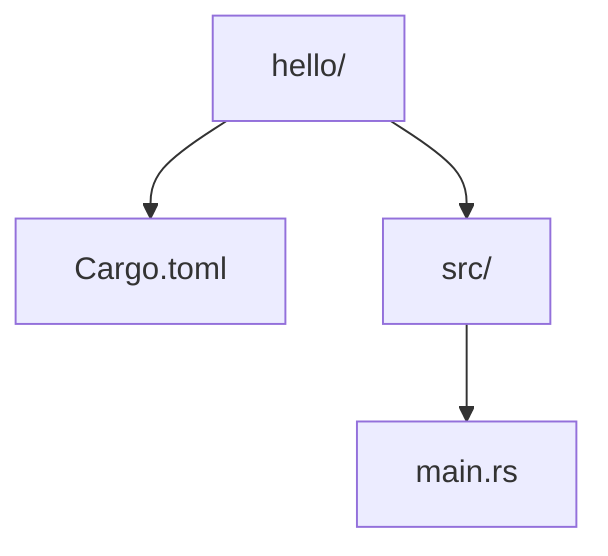
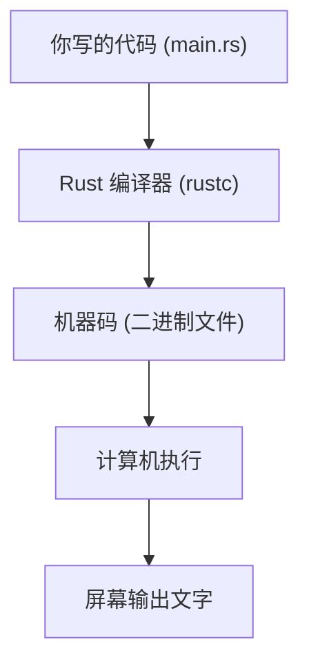

# 认识Rust：你好世界

## 学习目标

学完本章后，你将能够：
- 知道 Rust 是什么，它有什么特点
- 在电脑上安装 Rust 开发环境
- 创建并运行你的第一个 Rust 项目
- 理解 Cargo 生成的文件结构
- 成功在屏幕上打印出文字

---

## 一、Rust 是什么？

想象一下：你有一套乐高积木。你可以搭出任何东西 — 房子、车、飞机。但是，如果你把不该连在一起的两块强行拼上，它们会掉下来。这就是 Rust 的设计理念 — 让你自由地编写程序，但在你犯错时立刻告诉你"这里可能有问题"。

简单来说，Rust 是一门**系统编程语言**。但别被这个词吓到！你可以把它理解为"一门快速、安全、又不容易出错的编程语言"。

Rust 有三个最重要的特点：

| 特点 | 简单解释 |
|------|----------|
| **速度快** | 跑起来和 C、C++ 一样快 |
| **内存安全** | 编译器帮你检查，不会出现奇怪的内存错误 |
| **并发安全** | 多线程编程时不容易出错 |

用一句话记住：**Rust 就是一个在写代码时就帮你找出大部分错误的编程语言。**

---

## 二、安装 Rust

在终端里输入这一行命令就能安装 Rust：

```bash
curl --proto '=https' --tlsv1.2 -sSf https://sh.rustup.rs | sh
```

安装过程中会让你选择，直接按 `1`（默认选项）然后按回车就行。

安装完成后，关闭当前终端窗口，重新打开一个（或者运行 `source ~/.cargo/env`），然后验证安装是否成功：

```bash
rustc --version
```

如果看到类似 `rustc 1.75.0 (82e1608df 2023-12-21)` 的输出，恭喜你，安装成功了！

> 如果你用的是 Windows、macOS 或其他 Linux 发行版，安装方法大同小异。详细的各平台安装指南请参考附录：[[../附录/多平台安装指南]]。本教程使用 Linux 环境进行演示。

**安装后你拥有了什么？**
- `rustc`：Rust 编译器，把你写的代码变成可运行的程序
- `cargo`：Rust 的管家，帮你管理项目、下载依赖、运行程序
- `rustup`：Rust 的版本管理工具，帮你更新 Rust

---

## 三、创建第一个项目

打开终端，输入：

```bash
cargo new hello
```

这条命令做了什么事？它在当前目录下创建了一个叫 `hello` 的文件夹。让我们来看看里面有什么：



只有两个文件（和一个文件夹）！让我们一个一个看。

### 3.1 Cargo.toml — 项目的"身份证"

```toml
[package]
name = "hello"
version = "0.1.0"
edition = "2021"

[dependencies]
```

这个文件告诉 Cargo：
- **name**：这个项目叫 `hello`
- **version**：当前版本是 `0.1.0`
- **edition**：使用 Rust 2021 版语法
- **[dependencies]**：将来你要用的外部库写在这里（目前是空的）

### 3.2 src/main.rs — 程序的"大脑"

```rust
fn main() {
    println!("Hello, world!");
}
```

这就是一个完整的 Rust 程序！虽然只有 3 行，但是让我们拆开来看：

- `fn main() {` — 这定义了一个叫 `main` 的函数。**每个 Rust 程序都从 `main` 函数开始执行**，就像每个故事都从第一页开始。
- `println!("Hello, world!");` — 这行代码在屏幕上打印文字。`println!` 是一个**宏**（后面会讲到，现在先当它是一个特殊的打印命令）。
- `}` — 函数结束。

---

## 四、运行程序

进入项目目录并运行：

```bash
cd hello
cargo run
```

你会看到：

```
   Compiling hello v0.1.0 (/home/you/hello)
    Finished dev [unoptimized + debuginfo] target(s) in 0.45s
     Running `target/debug/hello`
Hello, world!
```

发生了什么？一步一步看：

1. **Compiling**（编译）：Cargo 把源代码翻译成计算机能理解的指令
2. **Finished**（完成）：编译成功
3. **Running**（运行）：程序开始执行，打印出 `Hello, world!`

你也可以只编译不运行：

```bash
cargo build
```

这会生成可执行文件但不运行。运行完 `cargo build` 后，你会发现多了一个 `target/` 文件夹，编译结果就放在里面。

你也可以只检查代码是否正确，不生成可执行文件：

```bash
cargo check
```

这个命令**非常快**，适合在写代码过程中频繁使用，确认代码没有语法错误。

**三个命令的对比：**

| 命令 | 作用 | 速度 |
|------|------|------|
| `cargo check` | 检查代码是否正确 | 最快 |
| `cargo build` | 编译生成可执行文件 | 中等 |
| `cargo run` | 编译并运行程序 | 完整流程 |

---

## 五、动手修改程序

把 `src/main.rs` 改成：

```rust
fn main() {
    println!("你好，世界！");
    println!("这是我的第一个 Rust 程序！");
}
```

再运行 `cargo run`，你会看到两行文字都打印出来了。

**小实验**：把分号 `;` 去掉会怎样？

```rust
fn main() {
    println!("你好，世界！")
}
```

试试运行 `cargo run`，看看编译器怎么告诉你错误。Rust 的**错误信息非常友好**，会告诉你少了什么、在哪里、怎么改。这是 Rust 最棒的特性之一！

---

## 六、理解编译过程

当你运行 `cargo run` 时，背后发生了这些事：



这就是为什么 Rust 程序运行得很快 — 它直接翻译成了计算机能理解的指令，不需要"中间翻译官"。

---

## 七、常见问题

**Q: `println!` 为什么要加 `!` 号？**

A: 带 `!` 号的是**宏**，不是普通的函数。宏是能在编译时生成代码的特殊工具。现在你只需要知道，打印东西用 `println!`。

**Q: 为什么要写分号？**

A: 分号 `;` 表示"这句话说完了"。就像中文里的句号。如果不写，编译器不知道你这句话结束在哪里。

**Q: 为什么叫 `main`？**

A: 这是约定。Rust（以及大多数编程语言）会从 `main` 函数开始执行程序。就像演出的开场。

---

## 工具速查手册

> 本章后续章节会大量用到这些工具命令。把这个当做你的速查表，随时回来查阅。

### rustc：Rust编译器

`rustc` 是 Rust 的编译器，把 `.rs` 源文件编译成可执行文件或库。通常你不需要直接使用 `rustc`（用 `cargo` 更便捷），但了解它的常用选项很有用。

| 命令 | 作用 |
|------|------|
| `rustc main.rs` | 编译单个文件，输出 `main` |
| `rustc main.rs -o myapp` | 指定输出文件名 |
| `rustc --edition 2021 main.rs` | 指定 Rust edition |
| `rustc -O main.rs` | 优化编译（等效 release） |
| `rustc -g main.rs` | 包含调试信息 |
| `rustc --crate-type lib lib.rs` | 编译为库（.rlib） |
| `rustc --crate-type cdylib lib.rs` | 编译为动态库（.so/.dylib/.dll） |
| `rustc --explain E0382` | 查看错误码的详细解释 |
| `rustc --emit mir main.rs` | 输出 MIR 中间表示 |
| `rustc --emit asm main.rs` | 输出汇编代码 |
| `rustc --emit llvm-ir main.rs` | 输出 LLVM IR |
| `rustc -C target-cpu=native main.rs` | 针对本机 CPU 优化 |
| `rustc -C panic=abort main.rs` | panic 时直接终止（不栈展开） |
| `rustc -C lto=fat main.rs` | 启用链接时优化 |
| `rustc --version` | 查看编译器版本 |
| `rustc --version -v` | 查看详细版本信息 |

**实战示例：从单文件到可执行文件**
```bash
# 创建 hello.rs
echo 'fn main() { println!("你好世界！"); }' > hello.rs

# 编译
rustc hello.rs

# 运行
./hello
# 输出: 你好世界！
```

**实战示例：理解错误码**
```bash
# 写一个有所有权错误的代码
cat > test.rs << 'EOF'
fn main() { let s = String::from("hi"); let t = s; println!("{}", s); }
EOF

# 编译会失败，看到 E0382
rustc test.rs
# 输出：error[E0382]: borrow of moved value: `s`

# 查看 E0382 的详细解释
rustc --explain E0382
```

**实战示例：查看编译器生成的汇编**
```bash
rustc --emit asm -C opt-level=3 hello.rs
cat hello.s  # 查看x86_64汇编
```

---

### cargo：Rust项目管理器

`cargo` 是 Rust 的核心工作流工具。每个 Rust 开发者 90% 的时间都在用 cargo。

#### 创建与管理项目

| 命令 | 作用 |
|------|------|
| `cargo new myproject` | 创建新的二进制项目（有 main.rs） |
| `cargo new mylib --lib` | 创建新的库项目（有 lib.rs） |
| `cargo init` | 在当前目录初始化 Rust 项目 |
| `cargo init --lib` | 在当前目录初始化为库项目 |

#### 编译与运行

| 命令 | 作用 |
|------|------|
| `cargo build` | 编译项目（debug 模式，有调试信息） |
| `cargo build --release` | 编译项目（release 模式，优化） |
| `cargo run` | 编译并运行项目 |
| `cargo run --release` | 编译优化版本并运行 |
| `cargo run -- --flag value` | 运行并传递参数给程序 |
| `cargo check` | 快速检查代码能否通过编译（不生成文件，最快） |
| `cargo clean` | 删除 target/ 目录（清理编译产物） |

#### 查看与文档

| 命令 | 作用 |
|------|------|
| `cargo doc` | 生成文档（依赖的文档也会生成） |
| `cargo doc --open` | 生成文档并在浏览器中打开 |
| `cargo doc --no-deps` | 只为自己的项目生成文档（不包含依赖） |
| `cargo tree` | 查看依赖树 |
| `cargo tree -d` | 查看重复依赖（帮助优化依赖） |
| `cargo tree -i regex` | 查看哪些 crate 依赖了 regex |
| `cargo metadata` | 输出项目的 JSON 格式元数据 |
| `cargo pkgid` | 显示当前包的完整标识符 |
| `cargo locate-project` | 显示 Cargo.toml 路径 |

#### 依赖管理

| 命令 | 作用 |
|------|------|
| `cargo add rand` | 添加依赖（自动编辑 Cargo.toml） |
| `cargo add serde --features derive` | 添加依赖并启用 features |
| `cargo add tokio@1.40` | 添加特定版本的依赖 |
| `cargo add --dev proptest` | 添加开发依赖 |
| `cargo add --build cc` | 添加构建依赖 |
| `cargo rm rand` | 移除依赖 |
| `cargo update` | 更新 Cargo.lock 中的依赖版本 |
| `cargo update -p rand` | 只更新特定依赖 |
| `cargo fetch` | 下载所有依赖（不编译） |
| `cargo vendor` | 下载所有依赖到本地 vendor 目录（离线构建） |

**实战：添加依赖**
```bash
cargo add rand
# Cargo.toml 自动添加: rand = "0.8.5"
# Cargo.lock 自动更新
cargo build  # 下载并编译 rand
```

**实战：从 crates.io 查找库**
```bash
# 在终端搜索（需要安装 cargo-search）
cargo install cargo-search
cargo search http-client --limit 10
# 也可以直接访问 https://crates.io 在网页上搜索
```

#### 测试与代码质量

| 命令 | 作用 |
|------|------|
| `cargo test` | 运行所有测试 |
| `cargo test test_name` | 运行名称匹配的测试 |
| `cargo test -- --nocapture` | 运行测试并显示 print 输出 |
| `cargo test -- --test-threads=1` | 单线程运行测试 |
| `cargo test -- --ignored` | 运行被忽略的测试 |
| `cargo bench` | 运行基准测试（需 nightly） |
| `cargo fmt` | 格式化代码 |
| `cargo fmt -- --check` | 检查代码格式是否正确（不修改） |
| `cargo clippy` | 运行代码质量检查（lint） |
| `cargo clippy -- -D warnings` | 将 lint 警告视为错误 |

#### 构建配置

| 命令 | 作用 |
|------|------|
| `cargo build --features "serde tls"` | 启用特定 features 编译 |
| `cargo build --no-default-features` | 禁用默认 features |
| `cargo build --all-features` | 启用所有 features |
| `cargo build --target x86_64-unknown-linux-gnu` | 为目标平台交叉编译 |
| `cargo build --timings` | 显示各 crate 编译时间 |

#### 发布与安装

| 命令 | 作用 |
|------|------|
| `cargo publish` | 发布 crate 到 crates.io |
| `cargo publish --dry-run` | 验证能否发布（不实际发布） |
| `cargo package` | 创建可分发包 |
| `cargo install ripgrep` | 从 crates.io 安装工具 |
| `cargo install --list` | 列出所有通过 cargo install 安装的工具 |
| `cargo install --path .` | 从本地项目安装 |
| `cargo uninstall ripgrep` | 卸载已安装的工具 |

#### 高级功能

| 命令 | 作用 |
|------|------|
| `cargo login <token>` | 登录 crates.io（发布前需要） |
| `cargo owner --add username` | 添加 crate 协作者 |
| `cargo yank --vers 1.0.0` | 撤回某个版本（不删除，标记为不可用） |
| `cargo audit` | 检查依赖的安全漏洞（需先安装 cargo-audit） |
| `cargo deny check` | 检查许可证和依赖来源（需 cargo-deny） |
| `cargo bloat` | 分析二进制文件体积（需 cargo-bloat） |
| `cargo flamegraph` | 生成火焰图（需 cargo-flamegraph） |
| `cargo benchcmp before.json after.json` | 对比基准测试结果 |

**实战：常用工作流**
```bash
# 日常开发循环
cargo check             # 快速验证（1秒内）
# ... 写代码 ...
cargo run               # 运行看看效果
# ... 调试 ...
cargo test              # 运行测试
# ... 完成功能 ...
cargo fmt               # 格式化代码
cargo clippy            # 代码质量检查
cargo build --release   # 编译最终版本
```

**实战：安装常用 Rust 工具**
```bash
cargo install cargo-edit       # 提供 cargo add/rm 命令
cargo install cargo-watch      # 提供 cargo watch 命令
cargo install cargo-audit      # 安全漏洞检查
cargo install cargo-deny       # 依赖审计
cargo install cargo-bloat      # 分析二进制大小
cargo install cargo-expand     # 展开宏
cargo install cargo-outdated   # 检查依赖是否过时
cargo install bacon            # 后台持续检查（类似 cargo watch）
```

---

### rustup：Rust工具链管理器

`rustup` 管理你电脑上安装的 Rust 版本。

#### 基础管理

| 命令 | 作用 |
|------|------|
| `rustup update` | 更新所有已安装的工具链 |
| `rustup update stable` | 只更新 stable 工具链 |
| `rustup update nightly` | 只更新 nightly 工具链 |
| `rustup self update` | 更新 rustup 自身 |
| `rustup show` | 显示当前活动工具链和已安装的工具链 |
| `rustup show active-toolchain` | 只显示当前活动工具链 |
| `rustup show home` | 显示 Rust 安装目录 |
| `rustup toolchain list` | 列出所有已安装的工具链 |
| `rustup toolchain install stable` | 安装 stable 工具链 |
| `rustup toolchain install nightly` | 安装 nightly 工具链 |
| `rustup toolchain install 1.75.0` | 安装特定版本 |
| `rustup toolchain uninstall nightly` | 卸载指定工具链 |
| `rustup default stable` | 设置默认工具链为 stable |
| `rustup default nightly` | 设置默认工具链为 nightly |

#### 组件管理

| 命令 | 作用 |
|------|------|
| `rustup component add rustfmt` | 安装格式化工具 |
| `rustup component add clippy` | 安装 lint 工具 |
| `rustup component add rust-analyzer` | 安装 IDE 语言服务器 |
| `rustup component add rust-src` | 安装标准库源码 |
| `rustup component add llvm-tools-preview` | 安装 LLVM 工具 |
| `rustup component list` | 列出已安装和可用的组件 |
| `rustup component remove rustfmt` | 移除组件 |

#### 目标平台（交叉编译）

| 命令 | 作用 |
|------|------|
| `rustup target list` | 列出所有支持的编译目标 |
| `rustup target list --installed` | 列出已安装的目标 |
| `rustup target add wasm32-unknown-unknown` | 添加 WebAssembly 目标 |
| `rustup target add x86_64-unknown-linux-musl` | 添加静态链接 Linux 目标 |
| `rustup target add aarch64-linux-android` | 添加 Android ARM64 目标 |
| `rustup target remove wasm32-unknown-unknown` | 移除编译目标 |

#### 目录级别覆盖

| 命令 | 作用 |
|------|------|
| `rustup override set nightly` | 当前目录使用 nightly |
| `rustup override set 1.70.0` | 当前目录使用特定版本 |
| `rustup override unset` | 移除目录覆盖 |
| `rustup override list` | 列出所有覆盖设置 |

**实战：不同项目使用不同 Rust 版本**
```bash
cd ~/projects/legacy-app
rustup override set 1.68.0    # 这个项目用旧版本

cd ~/projects/new-app
rustup override set stable    # 这个项目用最新稳定版

# 每个目录独立管理，互不影响
```

**实战：试用 nightly 的新特性**
```bash
# 创建测试项目
cargo new try-nightly
cd try-nightly

# 只在这个目录用 nightly
rustup override set nightly

# 编写使用 nightly 特性的代码
# 不需要全局切换到 nightly
```

**实战：安装 WebAssembly 编译支持**
```bash
rustup target add wasm32-unknown-unknown
# 现在可以编译 Rust 到 WebAssembly：
cargo build --target wasm32-unknown-unknown
```

---

### 查错与帮助

#### 遇到编译错误怎么办？

1. **先读错误信息** — Rust 的错误信息是最好的教材
2. **`rustc --explain EXXXX`** — 查看错误的详细解释和修复示例
3. **`cargo check`** — 快速验证修改是否有效
4. **`cargo clean && cargo build`** — 清空缓存重新编译（如果出现奇怪错误）

#### 获取帮助

| 命令 | 作用 |
|------|------|
| `rustc --help` | rustc 帮助 |
| `cargo --help` | cargo 帮助 |
| `cargo <子命令> --help` | 子命令帮助（如 `cargo build --help`） |
| `rustup --help` | rustup 帮助 |
| `rustup help <子命令>` | rustup 子命令帮助 |
| `rustc -W help` | 查看所有可用的编译器警告选项 |
| `rustc -C help` | 查看所有代码生成选项 |

---

### 配置文件速查

#### Cargo.toml 完整示例

```toml
[package]
name = "my-app"              # 包名
version = "0.1.0"            # 版本号（语义版本）
edition = "2021"             # Rust 版次
description = "一个示例项目"
license = "MIT OR Apache-2.0"
repository = "https://github.com/user/my-app"
readme = "README.md"
keywords = ["cli", "tool"]   # crates.io 搜索关键词
categories = ["command-line-utilities"]

[dependencies]
serde = { version = "1.0", features = ["derive"] }
tokio = { version = "1", optional = true }

[dev-dependencies]           # 只在开发/测试时需要的依赖
proptest = "1.0"
tempfile = "3.0"

[build-dependencies]         # 构建脚本的依赖
cc = "1.0"

[features]                   # 可选功能
default = ["cli"]
cli = ["clap"]
server = ["tokio", "hyper"]
full = ["cli", "server"]

[profile.release]            # release 编译配置
opt-level = 3
lto = "fat"
codegen-units = 1
panic = "abort"

[profile.dev]                # dev 编译配置
opt-level = 0
debug = true

[[bin]]                      # 二进制目标
name = "my-app"
path = "src/main.rs"

[[example]]                  # 示例程序
name = "demo"
path = "examples/demo.rs"
```

#### .cargo/config.toml（全局或项目级配置）

```toml
# ~/.cargo/config.toml 或 项目根目录 .cargo/config.toml
[build]
target-dir = "/path/to/custom/target"  # 自定义编译输出目录
jobs = 8                                # 并行编译任务数

[target.x86_64-unknown-linux-gnu]
linker = "clang"
rustflags = ["-C", "link-arg=-fuse-ld=lld"]

[alias]                    # 自定义命令别名
ci = "build --release"
lint = "clippy -- -D warnings"

[registries]
my-registry = { index = "https://my-company.com/git/index" }
```

---

### 日常工作流总结

```bash
# === 开始新项目 ===
cargo new my-project
cd my-project

# === 开发循环 ===
# 1. 写代码（在 src/main.rs 中）
# 2. 快速检查有无错误
cargo check
# 3. 运行看看效果
cargo run
# 4. 添加新依赖
cargo add some-crate
# 5. 写测试，运行测试
cargo test
# 6. 代码格式化
cargo fmt
# 7. 代码质量检查
cargo clippy

# === 发布前 ===
cargo fmt -- --check        # 格式检查
cargo clippy -- -D warnings # 严格 lint
cargo test                  # 全部测试通过
cargo build --release       # 编译最终版本

# === 更新工具链 ===
rustup update

# === 检查安全问题 ===
cargo audit                 # 依赖漏洞扫描
```

> **提示**：把这一节收藏（Obsidian 中 Cmd/Ctrl + 双击标题折叠即可快速定位）。学完整个教程后，你还会反复回来看这些命令。

---

## 本章小结

恭喜你完成了 Rust 之旅的第一步！在这一章你学到了：

- Rust 是快速、安全、容易发现错误的编程语言
- 用一行命令就能安装 Rust
- `cargo new` 创建新项目
- `cargo run` 编译并运行程序
- Cargo.toml 是项目的配置文件，main.rs 是程序入口
- 编译器是你最好的朋友，它会清晰地告诉你哪里错了
- **工具速查手册**（本章最后的速查表）包含了 rustc、cargo、rustup 所有常用命令

准备好继续了吗？下一章我们要写一个更"像样"的程序。

[[02-第一个程序：从零开始]]

---

## 章节考查

> **总分100分**：概念考查40分 + 判断正误20分 + 代码分析15分 + 编程大题15分 + 填空题5分 + 代码补全5分

### 一、概念考查（每题4分，共40分）

**1. Rust 的最大优势是什么？**
- A. 语法最简单
- B. 在编译时就帮你发现错误
- C. 不需要安装任何工具
- D. 只能做网页开发

<details><summary>点击查看答案</summary>

**B**。Rust 的编译器会在你运行程序之前就检查出内存错误、类型错误等，这是它最大的特点。它不比 Python 简单（A 错），需要安装（C 错），能做的远不止网页（D 错）。

</details>

**2. 创建 Rust 项目的命令是？**
- A. `rustc new hello`
- B. `cargo new hello`
- C. `cargo create hello`
- D. `rustup new hello`

<details><summary>点击查看答案</summary>

**B**。`cargo new` 是创建新 Rust 项目的标准命令。`rustc` 是编译器，`cargo create` 不存在，`rustup` 管理 Rust 版本。

</details>

**3. 程序的入口函数名字必须是？**
- A. `start`
- B. `begin`
- C. `main`
- D. 随便起

<details><summary>点击查看答案</summary>

**C**。Rust 程序从 `main` 函数开始执行，这是硬性规定，就像 C/C++/Java 等语言一样。

</details>

**4. `Cargo.toml` 文件的作用是什么？**
- A. 存放源代码
- B. 存放编译后的可执行文件
- C. 记录项目的配置信息
- D. 存放错误日志

<details><summary>点击查看答案</summary>

**C**。Cargo.toml 是项目的配置文件，包含项目名称、版本、依赖等信息。源代码在 src/ 下，编译产物在 target/ 下。

</details>

**5. `println!` 后面的 `!` 表示什么？**
- A. 这是一个重要的函数
- B. 这是一个宏
- C. 这是错误提示
- D. 没有特殊含义

<details><summary>点击查看答案</summary>

**B**。`!` 表示 `println` 是一个宏而非普通函数。宏可以在编译时展开成更复杂的代码。

</details>

**6. 只检查代码能不能通过编译，但不生成可执行文件，用什么命令？**
- A. `cargo run`
- B. `cargo build`
- C. `cargo check`
- D. `cargo test`

<details><summary>点击查看答案</summary>

**C**。`cargo check` 只做语法和类型检查，不生成可执行文件，速度最快。`cargo test` 是运行测试。

</details>

**7. Rust 安装后，你拥有哪三个工具？**
- A. gcc, g++, make
- B. rustc, cargo, rustup
- C. python, pip, venv
- D. node, npm, npx

<details><summary>点击查看答案</summary>

**B**。rustc 是编译器，cargo 是项目管理工具，rustup 是版本管理工具。

</details>

**8. `edition = "2021"` 在 Cargo.toml 中表示什么？**
- A. 项目创建于 2021 年
- B. 使用 Rust 2021 版语法规则
- C. 程序只能运行在 2021 年后的系统
- D. 这是一个过期的配置

<details><summary>点击查看答案</summary>

**B**。Rust 每三年发布一个新"edition"，新 edition 可能引入新的语法特性或调整规则，但所有 edition 的代码都能在最新编译器上编译。

</details>

**9. 分号 `;` 在 Rust 中的作用是？**
- A. 表示换行
- B. 表示这句话说完了
- C. 装饰符号
- D. 表示变量声明

<details><summary>点击查看答案</summary>

**B**。分号表示一条语句的结束，相当于中文的句号。在 Rust 中分号还有控制返回值的特殊作用（后面会学到）。

</details>

**10. 如果编译时出现错误，你会看到什么？**
- A. 程序直接崩溃
- B. 详细的错误信息和修改建议
- C. 什么提示都没有
- D. 只有一行错误代码

<details><summary>点击查看答案</summary>

**B**。Rust 编译器以友好详尽的错误信息著称，会告诉你错误在哪一行、为什么错、甚至建议怎么改。

</details>

### 二、判断正误（每题2分，共20分）

**1. Rust 在运行时才会检查内存错误。**
<details><summary>点击查看答案</summary>

**错误**。Rust 在编译时就检查内存错误，这是它的核心特色。

</details>

**2. `cargo run` 会先编译再运行程序。**
<details><summary>点击查看答案</summary>

**正确**。`cargo run` = 编译 + 运行。

</details>

**3. `rustup` 是代码编辑器。**
<details><summary>点击查看答案</summary>

**错误**。`rustup` 是 Rust 版本管理工具，不是编辑器。

</details>

**4. 每个 Rust 程序必须有一个 `main` 函数。**
<details><summary>点击查看答案</summary>

**正确**。可执行程序必须有一个 `main` 函数作为入口。

</details>

**5. `cargo new` 创建的项目自带 `target/` 文件夹。**
<details><summary>点击查看答案</summary>

**错误**。`target/` 文件夹是第一次编译后才产生的，创建项目时只有 `Cargo.toml` 和 `src/main.rs`。

</details>

**6. `cargo check` 比 `cargo build` 慢。**
<details><summary>点击查看答案</summary>

**错误**。`cargo check` 更快，因为它不生成可执行文件。

</details>

**7. `println!` 可以没有分号。**
<details><summary>点击查看答案</summary>

**错误**。`println!` 是一条语句，需要分号结尾。

</details>

**8. Rust 只能用于系统编程。**
<details><summary>点击查看答案</summary>

**错误**。Rust 可以用于 Web、命令行工具、嵌入式、游戏等各种领域。

</details>

**9. 源代码文件放在 `src/` 文件夹中。**
<details><summary>点击查看答案</summary>

**正确**。这是 Cargo 的约定，源代码统一放在 `src/` 目录下。

</details>

**10. `Cargo.toml` 中的 `[dependencies]` 用于声明项目依赖的外部库。**
<details><summary>点击查看答案</summary>

**正确**。当需要使用外部库时，在 `[dependencies]` 下列出库名和版本号。

</details>

### 三、代码分析（每题3分，共15分）

**1. 下面代码的运行结果是什么？**

```rust
fn main() {
    println!("Rust");
    println!("真好学");
}
```

- A. Rust
- B. 真好学
- C. Rust 真好学（同一行）
- D. 第一行输出 Rust，第二行输出 真好学

<details><summary>点击查看答案</summary>

**D**。`println!` 每次调用都会换行。`println!` 末尾有换行，所以两次调用输出两行。

</details>

**2. 下面代码有什么错误？**

```rust
fn main() {
    println!("你好")
    println!("世界");
}
```

- A. 没有错误
- B. 第一行 `println!` 缺少分号
- C. 不能有两条 `println!`
- D. 汉字不能出现在代码里

<details><summary>点击查看答案</summary>

**B**。第一行的 `println!("你好")` 缺少分号，编译器会报错。

</details>

**3. 下面哪一个是正确创建的 Rust 项目结构？**
- A. 只有 main.rs
- B. Cargo.toml + Cargo.lock + src/main.rs
- C. Cargo.toml + src/main.rs
- D. package.json + index.js

<details><summary>点击查看答案</summary>

**C**。`cargo new` 刚创建时只有 Cargo.toml 和 src/main.rs，Cargo.lock 是第一次编译后生成的。

</details>

**4. 运行 `cargo build` 后，可执行文件在哪个文件夹？**
- A. src/
- B. Cargo.toml 旁边
- C. target/debug/
- D. 根目录

<details><summary>点击查看答案</summary>

**C**。编译产物放在 `target/debug/`（debug 模式）或 `target/release/`（release 模式）。

</details>

**5. 如果你想快速检查代码有没有语法错误，应该用？**
- A. cargo build
- B. cargo run
- C. cargo check
- D. cargo new

<details><summary>点击查看答案</summary>

**C**。`cargo check` 只检查不编译，速度最快，适合开发时频繁使用。

</details>

### 四、编程大题（15分）

**题目：** 请写一个完整的 Rust 程序，它在屏幕上按顺序打印出以下三行文字：

```
你好，我叫[你的名字]！
我正在学习 Rust。
这是我写的第一段代码！
```

要求：
1. 使用 `cargo new` 创建项目
2. 修改 main.rs 实现功能
3. 写出完整的 main.rs 内容

<details><summary>点击查看答案</summary>

```rust
fn main() {
    println!("你好，我叫小明！");
    println!("我正在学习 Rust。");
    println!("这是我写的第一段代码！");
}
```

**评分标准**：
- 有 `fn main() {}` 结构（5分）
- 每行 `println!` 正确（共 3 行，一行 3 分，共 9 分）
- 分号正确（1分）

</details>

### 五、填空题（每题1分，共5分）

**1. 创建 Rust 项目的命令是 `cargo ______`。**

<details><summary>点击查看答案</summary>

**new**。`cargo new 项目名` 创建新项目。

</details>

**2. 程序的入口函数必须命名为 `______`。**

<details><summary>点击查看答案</summary>

**main**。每个可执行 Rust 程序都从 main 函数开始。

</details>

**3. `______.toml` 是项目的配置文件。**

<details><summary>点击查看答案</summary>

**Cargo**。Cargo.toml 是项目的清单文件。

</details>

**4. `println!` 是 ______ 而不是普通函数。**

<details><summary>点击查看答案</summary>

**宏**。`!` 表示这是一个宏调用。

</details>

**5. 编译并运行程序的命令是 `cargo ______`。**

<details><summary>点击查看答案</summary>

**run**。`cargo run` = 编译 + 运行。

</details>

### 六、代码补全（共5分）

**1. 请补全缺失的代码，使程序能打印出"开始学习"（2分）**

```rust
fn main() {
    _____("开始学习");
}
```

<details><summary>点击查看答案</summary>

```rust
println!("开始学习");
```

</details>

**2. 请补全创建变量的语句（1分）**

```rust
fn main() {
    let _____ = "小明";
    println!("我叫{}", name);
}
```

<details><summary>点击查看答案</summary>

```rust
let name = "小明";
```

</details>

**3. 请补全 Cargo.toml 的依赖字段（2分）**

```toml
[package]
name = "my_app"
version = "0.1.0"
edition = "2021"

[_____]
rand = "0.8"
```

<details><summary>点击查看答案</summary>

```toml
[dependencies]
```

</details>

---

> **计分：概念40 + 判断20 + 代码分析15 + 编程15 + 填空5 + 补全5 = 总分100分**
